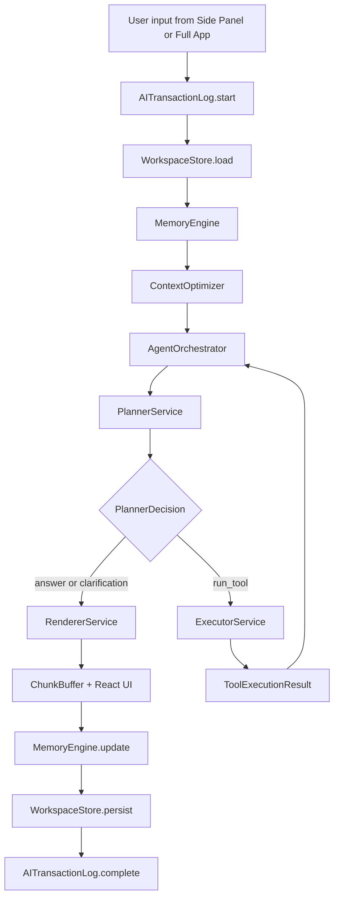

# NowPilot — Product Specification v0.1 (Standalone)

**Document ID:** `PRODUCT_SPEC_v0_1.md`
**Status:** Canonical, standalone implementation reference
**Date:** 2026-07-10 (Rev. A — AntD v6 / Ant Design X adoption)
**Version:** v0.1
**Scope:** NowPilot v0.1 — Chrome MV3 AI Assistant using Side Panel + Full App Tab. Add-on architecture preserved. Page injection deferred to v0.2+.

**Revision note (Rev. A):** v0.1 now targets **Ant Design v6** and **Ant Design X 2.x** (component library + `x-markdown`) instead of AntD v5 with a hand-assembled markdown stack. `@ant-design/x-sdk`'s chat-data-flow layer (`useXChat`, `ChatProvider`) and `@ant-design/x-card` (A2UI) are explicitly **not** adopted in v0.1 — see §0.2 and §25.6 for rationale.

**Purpose:** This document is the single, self-contained product specification for NowPilot v0.1. It does not reference any prior document. Any AI coding agent implementing this spec must treat this file as authoritative and complete.

**Target implementation agents:** Anthropic Claude Haiku, Google Gemini Flash, DeepSeek Flash, or equivalent cost-effective coding models.
**Target runtime providers:** Claude Haiku, Gemini Flash, DeepSeek Flash, Ollama, LM Studio, OpenAI-compatible endpoints, OpenAI, Anthropic, Gemini.
**Primary application:** Chrome MV3 extension using WXT + React + TypeScript + Ant Design v6 + Ant Design X 2.x.

---

## How to Read This Specification

Read in this exact order:

1. §0 — Hard Rules
2. §1 — Cost-Effective Runtime AI Architecture
3. §2 — Context-Adaptive Execution
4. §3 — Persistent Memory Architecture
5. §4 — AI/MCP Transaction Logging
6. §5 — WXT / MV3 / Ant Design / Isolation
7. §6 — Executive Summary & Scope
8. §7 — Technology Stack
9. §8 — Architecture Design
10. §9 — Feature Specification
11. §10 — AI & MCP Integration
12. §11 — Critical User Flows
13. §12 — Component State Matrix
14. §13 — Concurrency Rules
15. §14 — Skills & Tooling Framework
16. §15 — Storage Architecture
17. §16 — Security
18. §17 — UI/UX Requirements
19. §18 — Master Implementation Phases
20. §19 — Runtime Edge Cases
21. §20 — Runtime State Models & Cross-Context Coordination
22. §21 — Data Models
23. §22 — Performance Targets & Algorithms
24. §23 — Key Technology Decisions (ADRs)
25. §24 — Verification Commands
26. §25 — Future Page Injection Architecture & Deferred UI Features
27. Appendices A–M — canonical constants, type registry, and reference implementations

Appendices C, E, F, G, I, J, K, L, and M are **mandatory** reading for any AI coding agent.

---
# §0 — Hard Rules (Non-Negotiable)

These rules apply to every phase, every module, and every AI coding agent.

## §0.1 Read Order and Scope

- Read §§0–5 fully before writing any code.
- Read §§6–17 as background for the feature being implemented.
- Read §§18–25 and the relevant appendix for the current phase.
- Do not implement more than one phase per response unless explicitly requested.

## §0.2 DO NOT Rules

**Codegen safety:**
- **DO NOT** invent file paths. Use only paths in §8 and §18.
- **DO NOT** invent type names. Use Appendix C for every shape.
- **DO NOT** invent tool names. Planner may only select tools from the enum passed by ExecutorService.
- **DO NOT** invent provider IDs. The five valid IDs are `'openai' | 'anthropic' | 'gemini' | 'ollama' | 'openai-compatible'`.
- **DO NOT** invent runtime model names. Resolve `tier: 'haiku' | 'flash'` through Appendix D.

**MV3 / Chrome:**
- **DO NOT** call AI providers, MCP servers, or `EventSource` from the background service worker.
- **DO NOT** open IndexedDB from the background service worker.
- **DO NOT** use `setInterval` in the background service worker. Use `chrome.alarms`.
- **DO NOT** set a custom `User-Agent` header in any `fetch()`.
- **DO NOT** use remote code execution or `eval()`.

**Storage / secrets:**
- **DO NOT** store ServiceNow session tokens or API keys in `chrome.storage.local`. Use `chrome.storage.session` for tokens and AES-GCM-encrypted `chrome.storage.local` for API keys.
- **DO NOT** store conversation message bodies in `chrome.storage.local`. Bodies live in IndexedDB `MemoryDB`.
- **DO NOT** log raw prompt bodies, raw tool inputs/outputs, cookies, clipboard text, ServiceNow raw case body, or API keys by default. All logging goes through `TraceRedactor`.

**UI / DOM (NEW in v0.1):**
- **DO NOT** render UI from content scripts in v0.1. Content scripts are extraction-only.
- **DO NOT** use Shadow DOM UI in v0.1. Shadow DOM UI is deferred to v0.2+ (see §25).
- **DO NOT** manipulate host page DOM for UI purposes. Content scripts may only read.
- **DO NOT** import `antd` components into content scripts or the background service worker.
- **DO NOT** put heavy admin/configuration screens in the Side Panel. Those belong in the Full App Tab under `Options`.
- **DO NOT** use `innerHTML`, `dangerouslySetInnerHTML`, or `document.write`.
- **DO NOT** use `setTimeout`/`setInterval` for DOM polling in content scripts. Use `MutationObserver`.
- **DO NOT** install `tailwindcss`, `@tailwindcss/vite`, `shadcn/ui`, `@radix-ui/react-*`, `class-variance-authority`, `clsx`, or `tailwind-merge`. Removed in v0.1.

**Cross-surface layering (NEW in v0.1):**
- **DO NOT** import from `src/entrypoints/app/**` inside `src/entrypoints/sidepanel/**` or vice versa. Each surface is independently mountable.
- **DO NOT** call `chrome.tabs.create` for the Full App from a content script. Only the side panel, popup, background SW (in response to user gesture), and command palette may open the Full App.

**AI orchestration:**
- **DO NOT** let the LLM execute tools directly. `PlannerService` may request tools; `ExecutorService` validates and runs them.
- **DO NOT** use large-model agent loops (`maxSteps=15`) for Haiku/Gemini Flash/DeepSeek Flash. Use the tier caps in §1.4.
- **DO NOT** use raw full history in prompts. All prompts pass through `ContextOptimizer`.

**Package hygiene:**
- **DO NOT** install `@anthropic-ai/sdk`, `openai`, or `@google/generative-ai` directly. Use `@ai-sdk/*` adapters only.
- **DO NOT** install `framer-motion`. The correct package is `motion` (Framer Motion v12); import from `motion/react`.
- **DO NOT** use `ulid` or `uuid`. Use native `crypto.randomUUID()`.
- **DO NOT** install `@ant-design/x-sdk`, or use its `useXChat`, `useXConversations`, `ChatProvider`, `OpenAIChatProvider`, or `DeepSeekChatProvider` exports. These duplicate `ProviderRouter`/`AgentOrchestrator`/`ContextOptimizer` and would let UI code call providers directly, violating the rule above and §2.3. `@ant-design/x` **presentation** components (`Bubble`, `Sender`, `Conversations`, `ThoughtChain`, etc.) and `@ant-design/x-markdown` are approved — see §7.2 and §23.
- **DO NOT** install or use `@ant-design/x-card`. A2UI dynamic-surface generation is deferred to v0.2+ (§25.6).

**Layering:**
- **DO NOT** import from `src/addons/**` inside `src/core/**`.
- **DO NOT** put ServiceNow-specific token names (`JSESSIONID`, `sysparmCK`, `g_ck`) or DOM selectors in core. They live only in `src/addons/servicenow/**`.

**Cross-context messaging:**
- **DO NOT** send a cross-context message without a `RuntimeEnvelope<T>` (Appendix C, Appendix E).
- **DO NOT** paraphrase canonical strings or prompts. Use `STR` (Appendix B) and `PROMPTS` (Appendix A) verbatim.

## §0.3 Implementation Constraints for Low-Cost Coding Agents

- Every public module boundary must have a Zod schema and at least one fixture test.
- Every phase must define a real npm script under `verify:phase-N`.
- Every module marked `@implementation-tier: sonnet-class` must be stubbed by Haiku/Flash implementers, not written.
- Every catch block must call `debugLog(code, message, context)`. Empty catches are forbidden.

## §0.4 Canonical Runtime Concepts

| Concept | File | Purpose |
|---|---|---|
| `PlannerService` | `src/core/ai/PlannerService.ts` | Cheap JSON-only action planner |
| `ExecutorService` | `src/core/ai/ExecutorService.ts` | Deterministic MCP/skill/built-in tool executor |
| `RendererService` | `src/core/ai/RendererService.ts` | Final concise response renderer |
| `AgentOrchestrator` | `src/core/ai/AgentOrchestrator.ts` | Planner → Executor loop with tier caps (Appendix I) |
| `ProviderRouter` | `src/core/ai/ProviderRouter.ts` | Provider selection, retry, fallback, circuit breaker |
| `TierResolver` | `src/core/ai/TierResolver.ts` | Maps `haiku`/`flash` tier → concrete `(providerId, model)` (Appendix D) |
| `PromptCacheManager` | `src/core/ai/PromptCacheManager.ts` | Prompt cache segmentation and provider hints |
| `PromptCacheAdapter` | `src/core/ai/PromptCacheAdapter.ts` | Per-provider cache-hint transformation (Appendix K) |
| `StructuredOutput` | `src/core/ai/StructuredOutput.ts` | JSON mode + schema validation + one-shot repair (Appendix L) |
| `ChunkBuffer` | `src/core/ai/ChunkBuffer.ts` | rAF-batched streaming UI buffer (Appendix J) |
| `ModelContextTier` | `src/core/context/ModelContextTier.ts` | tiny/small/medium/large classification |
| `ContextOptimizer` | `src/core/context/ContextOptimizer.ts` | Dynamic token budget, compression, degradation |
| `ContextCompressor` | `src/core/context/ContextCompressor.ts` | Structured text/page/case/history compression |
| `MemoryEngine` | `src/core/memory/MemoryEngine.ts` | System-owned memory orchestration |
| `ConversationMemoryStore` | `src/core/memory/ConversationMemoryStore.ts` | Per-conversation summary + recent turns |
| `UserMemoryStore` | `src/core/memory/UserMemoryStore.ts` | Cross-session fact/preference/pattern memory |
| `PreferenceMemoryStore` | `src/core/memory/PreferenceMemoryStore.ts` | User behavioural preferences |
| `AITransactionLog` | `src/core/telemetry/AITransactionLog.ts` | AI/MCP/tool/provider operation trace |
| `AITransactionLogDB` | `src/core/telemetry/AITransactionLogDB.ts` | IndexedDB trace persistence |
| `TraceRedactor` | `src/core/telemetry/TraceRedactor.ts` | Redaction before logs/UI/export |
| `WriteJournal` | `src/core/storage/WriteJournal.ts` | Multi-store consistency (metadata + IndexedDB body) |
| `IndexedDBMigrator` | `src/core/storage/IndexedDBMigrator.ts` | Versioned migrations |
| `WorkspaceStore` (NEW) | `src/core/workspace/WorkspaceStore.ts` | Shared workspace across Side Panel and Full App Tab (Appendix M) |
| `WorkspaceRouter` (NEW) | `src/core/workspace/WorkspaceRouter.ts` | Handoff URL parse/build + cross-surface sync |
| `SidePanelPageRegistry` | `src/core/registry/SidePanelPageRegistry.ts` | Add-on registration of Side Panel pages |
| `FullAppPageRegistry` (NEW) | `src/core/registry/FullAppPageRegistry.ts` | Add-on registration of Full App pages |
| `DiagnosticsPanel` | `src/components/options/DiagnosticsSection.tsx` | Full App → Options → Diagnostics UI |

---
# §1 — Cost-Effective Runtime AI Architecture

## §1.1 Runtime Design Principle

NowPilot must assume the active runtime model may be cheap, fast, weaker at reasoning, small-context, local, or configured as the user's only provider. The system must not rely on the model to remember, decide tool safety, or preserve state.

Runtime AI uses:

```text
PlannerService → ExecutorService → RendererService
```

with a bounded loop between Planner and Executor as defined in §1.4 and Appendix I.

## §1.2 Planner → Executor → Renderer Flow



### PlannerService

Planner returns exactly one of the following, validated by Zod:

```ts
export const PlannerDecisionSchema = z.discriminatedUnion('action', [
  z.object({ action: z.literal('answer'), reasonCode: z.string().max(64) }),
  z.object({
    action: z.literal('run_tool'),
    toolName: z.string().max(64),   // ExecutorService supplies a closed z.enum at request time
    input: z.unknown(),
  }),
  z.object({ action: z.literal('ask_clarification'), question: z.string().max(200) }),
]);
```

Rules:
- Use `haiku` tier where available (Appendix D).
- Return JSON only. Do not explain reasoning.
- Timeout: 3 seconds.
- One malformed-JSON repair retry only (Appendix L).
- If planner fails twice: fallback to `{ action: 'answer', reasonCode: 'planner_failed' }`.
- ExecutorService **must** narrow `toolName` to a closed `z.enum` derived from the currently registered tools before passing the schema to the model.

### ExecutorService

Deterministic. It must:
- reject unknown tool names,
- validate input against the tool's Zod schema,
- check permission policy,
- check model/context-tier capability,
- run the tool with timeout,
- validate output against the tool's Zod output schema,
- return `ToolExecutionResult<T>`.

The LLM never executes tools directly.

### RendererService

Renderer converts validated context and tool output into a concise answer.

Rules:
- Use `flash` tier where available (Appendix D).
- Do not invent missing tool results.
- Use structured output for cards/tables/checklists.
- Timeout: 5 seconds for normal answers.
- Max normal output: 512 tokens unless the feature overrides.

## §1.3 Prompt Shape and Prompt Caching

Every AI call uses this canonical section order:

```text
[SYSTEM: cached, canonical]
[TOOL SCHEMAS: cached, canonical]
[USER PREFERENCES: compact]
[MEMORY: compact top-k]
[CONTEXT: optimized]
[TASK: small]
[USER INPUT: current turn]
```

Rules:
- Stable sections must be byte-identical across repeated calls where possible.
- Tool schemas must be sorted by stable tool name.
- Whitespace in cached sections must be stable.
- Current user input and in-flight assistant output are never cached.
- Prompt cache hits/misses are logged in `AITransactionLog`.

Provider-specific cache behaviour is implemented in `PromptCacheAdapter` — see Appendix K.

## §1.4 Agent Step Limits

| Context tier | Max planner calls | Max tool calls | MCP chaining | Agent mode |
|---|---:|---:|---|---|
| `tiny` ≤4K | 1 | 1 | Disabled | Minimal mode only |
| `small` 8K–16K | 2 | 1 | Disabled by default | Single-tool task |
| `medium` 32K–128K | 3 | 2 | Enabled | Limited agent |
| `large` ≥200K | 5 | 3 | Enabled | Full agent |

The `AgentOrchestrator` (Appendix I) is the only module allowed to enforce these caps.

## §1.5 Provider Routing and Fallback

`ProviderRouter` selects providers using cost, latency, reliability, privacy mode, configured priority, and provider availability.

Fallback rules:
- If only one provider exists, retry once only for retryable pre-first-token failures.
- Do not silently switch from local to cloud when `allowCloudFallbackFromLocal=false`.
- Never switch provider after `hasStreamedFirstToken === true`.
- Record every attempt in `AITransactionLog`.

State that `ProviderRouter` must track per operation:

```ts
interface RouterAttemptState {
  operationId: string;
  attempts: ProviderAttempt[];
  hasStreamedFirstToken: boolean;
  circuitBreakerOpen: Record<ProviderId, number>; // reopen after cool-down ms
}
```

Retry / circuit breaker policy:
- Retryable pre-first-token errors: `TIMEOUT`, `PROVIDER_5XX`, `NETWORK`, `RATE_LIMITED`.
- Non-retryable: `AUTH`, `MODEL_UNKNOWN`, `SCHEMA_INVALID`, `HOST_NOT_PERMITTED`.
- Circuit breaker: after 3 consecutive failures for a provider within 60 s, mark provider open for 5 minutes.

---
# §2 — Context-Adaptive Execution

## §2.1 Model Context Tiers

```ts
export type ModelContextTier = 'tiny' | 'small' | 'medium' | 'large';

export function classifyModelContext(contextWindow: number): ModelContextTier {
  if (contextWindow <= 4096)   return 'tiny';
  if (contextWindow <= 16384)  return 'small';
  if (contextWindow <= 131072) return 'medium';
  return 'large';
}
```

| Tier | Context window | Typical provider | Runtime strategy |
|---|---:|---|---|
| `tiny` | ≤4K | default local model | Minimal mode, one tool max |
| `small` | 8K–16K | tuned local model | Summary + last few turns |
| `medium` | 32K–128K | strong local/cloud model | Balanced context |
| `large` | ≥200K | large cloud Flash/Haiku class | Full context with caching |

## §2.2 Token Budget Formula

```ts
inputBudget  = floor(modelContextWindow * 0.70)
outputBudget = floor(modelContextWindow * 0.20)
safetyMargin = floor(modelContextWindow * 0.10)
```

Dynamic distribution:

| Tier | System | Tools | Memory | Context | History | User |
|---|---:|---:|---:|---:|---:|---:|
| `tiny`   | 15% | 20% | 10% | 20% | 15% | 20% |
| `small`  | 10% | 15% | 10% | 25% | 20% | 20% |
| `medium` |  8% | 12% | 10% | 30% | 25% | 15% |
| `large`  |  5% | 10% | 10% | 35% | 25% | 15% |

Token counting rule: use the provider-native counter when the SDK exposes it; else fall back to `Math.ceil(text.length / 4)` for English and `Math.ceil(text.length / 3)` for CJK.

## §2.3 ContextOptimizer Contract

```ts
export interface ContextOptimizerInput {
  operationId: string;
  model: string;
  modelContextWindow: number;
  userInput: string;
  conversationId: string;
  workspaceId: string;                     // NEW in v0.1
  activeSurface: 'sidepanel' | 'full-app'; // NEW in v0.1
  pageContext?: PageContext;
  selectedToolSchemas: ToolSchemaRef[];
  memoryHints: RetrievedMemory[];
  preferences: UserPreferences;
}

export interface OptimizedContext {
  tier: ModelContextTier;
  inputBudget: number;
  outputBudget: number;
  sections: PromptSection[];
  provenance: ContextProvenanceManifest;
  minimalMode: boolean;
}
```

Direct prompt assembly in React components is forbidden. All AI calls must consume an `OptimizedContext`.

## §2.4 Degradation Pipeline

When estimated tokens exceed budget:
1. Drop debug-only context.
2. Drop secondary notes and optional metadata.
3. Summarise older history.
4. Compress page/case context into structured fields.
5. Trim tool schemas to the tools currently in scope.
6. Reduce memory injection top-k.
7. Enter minimal mode.
8. If still too large, return a typed `CONTEXT_TOO_LARGE` error with a user-facing explanation.

## §2.5 Minimal Mode

Mandatory for `tiny` models.

Allowed:
- compact system prompt,
- compact preference profile,
- top 3 user memories,
- conversation summary ≤ 200 tokens,
- last 1–2 turns,
- at most one safe tool schema.

Blocked:
- multi-step agent,
- MCP chaining,
- CodeSearchSkill,
- full note-graph injection,
- large research synthesis.

## §2.6 Context Provenance Manifest

Every `OptimizedContext` carries a manifest recording where each section came from so `PromptInspector` can display provenance without the raw body.

```ts
export interface ContextProvenanceManifest {
  sections: Array<{
    kind: 'system' | 'tool_schemas' | 'preferences' | 'memory' | 'context' | 'task' | 'user_input';
    sourceId: string;
    tokens: number;
    truncated: boolean;
    compressionApplied?: 'summarise' | 'structural' | 'topk';
  }>;
  totalTokens: number;
  minimalMode: boolean;
  workspaceId: string;         // NEW in v0.1
  activeSurface: 'sidepanel' | 'full-app'; // NEW in v0.1
}
```

---
# §3 — Persistent Memory Architecture

## §3.1 Memory Principle

Memory is system-owned. The LLM does not own persistent memory. Three layers:

```text
Conversation memory  → continuity inside one conversation
User memory          → durable cross-session facts / preferences / patterns
Preference memory    → behavioural settings and response style
```

Memory is shared across surfaces — the Side Panel and Full App Tab read the same memory stores through `MemoryEngine`.

## §3.2 Recommended Framework Choice

```text
Zustand       → runtime/UI state (including WorkspaceStore)
IndexedDB/idb → persistent large memory bodies
MiniSearch    → local full-text retrieval
MemoryEngine  → orchestration, scoring, summarisation, injection
```

Do **not** use LangChain, LlamaIndex, MemGPT, remote vector DBs, or embedding downloads in v0.1.

## §3.3 Conversation Memory

```ts
export interface ConversationMemory {
  conversationId: string;
  summary: string;
  summaryTokens: number;
  lastMessages: Array<{
    role: 'user' | 'assistant' | 'tool';
    content: string;
    tokens: number;
    timestamp: number;
  }>;
  updatedAt: number;
}
```

Rules:
- Keep last 2 turns for `tiny`.
- Keep last 4 turns for `small`.
- Keep last 6 turns for `medium`/`large`.
- Summarise older messages after every 12 messages.
- Store message bodies in IndexedDB only.

## §3.4 User Memory

```ts
export interface UserMemoryFact {
  id: string;
  content: string;
  type: 'fact' | 'preference' | 'pattern';
  tags: string[];
  confidence: number;         // 0..1
  source: 'explicit' | 'inferred' | 'system';
  createdAt: number;
  updatedAt: number;
  lastUsedAt?: number;
  useCount: number;
}
```

Retrieval scoring — every sub-score must be normalised to `[0, 1]`:

```text
keywordScore   = matchedQueryTerms / totalQueryTerms
tagScore       = matchedTags / max(1, memoryTags.length)
recencyScore   = clamp(1 - (now - updatedAt) / (30 * DAY), 0, 1)
useCountScore  = min(1, useCount / 20)
confidenceScore = confidence

score = keywordScore   * 0.45
      + tagScore       * 0.25
      + recencyScore   * 0.15
      + useCountScore  * 0.10
      + confidenceScore* 0.05
```

Injection rules:
- top 5 memories maximum,
- top 3 memories maximum in tiny mode,
- total memory injection ≤ 1000 tokens,
- never inject secrets or raw customer data.

## §3.5 Preference Memory

```ts
export interface UserPreferences {
  responseStyle: 'concise' | 'balanced' | 'detailed';
  preferredLanguage: string;
  preferStructuredOutput: boolean;
  allowCloudFallbackFromLocal: boolean;
  defaultProviderId?: ProviderId;
  toolAutonomy: 'ask_every_time' | 'allow_safe_tools' | 'manual_only';
  defaultSurface: 'sidepanel' | 'full-app';  // NEW in v0.1
  themeMode: 'light' | 'dark' | 'auto';      // NEW in v0.1 (moved from chrome.storage.sync)
}
```

Preferences are injected as compact JSON, not verbose prose.

---
# §4 — AI/MCP Transaction Logging and Diagnostics

## §4.1 Purpose

Every AI, MCP, skill, tool, context, cache, fallback, and provider operation must be traceable for troubleshooting.

`AITransactionLog` tracks:
- operation ID,
- provider/model,
- prompt token breakdown,
- context tier,
- truncation/compression decisions,
- prompt-cache hit/miss/write,
- MCP/tool calls,
- permission decisions,
- retries/fallbacks,
- errors,
- first-token timing,
- total duration,
- **workspaceId** (NEW in v0.1),
- **activeSurface** — sidepanel | full-app (NEW in v0.1).

## §4.2 Storage and Retention

| Mode | Enabled | Raw prompt/body | Retention |
|---|---|---|---|
| Lightweight metadata | Always | No | Last 200 transactions or 14 days |
| Debug deep trace | User opt-in | Redacted previews only | Last 50 traces or 72 hours |

## §4.3 Core Trace Types

```ts
export interface AITransaction {
  id: string;
  sessionId?: string;
  conversationId?: string;
  workspaceId?: string;                    // NEW in v0.1
  activeSurface?: 'sidepanel' | 'full-app'; // NEW in v0.1
  userTurnId?: string;
  type: 'chat' | 'planner' | 'renderer' | 'structured_output'
      | 'mcp_tool' | 'builtin_tool' | 'skill' | 'proxy_fetch';
  status: 'started' | 'streaming' | 'waiting_for_permission'
        | 'completed' | 'failed' | 'aborted' | 'retried' | 'fallback_used';
  providerId?: ProviderId;
  model?: string;
  startedAt: number;
  endedAt?: number;
  durationMs?: number;
  errorCode?: string;
}

export interface PromptTrace {
  operationId: string;
  promptTemplateId: string;
  promptHash: string;
  systemTokens: number;
  toolSchemaTokens: number;
  contextTokens: number;
  memoryTokens: number;
  historyTokens: number;
  userInputTokens: number;
  totalInputTokens: number;
  maxContextWindow: number;
  contextTier: ModelContextTier;
  truncated: boolean;
  truncatedSources: string[];
  minimalMode: boolean;
  promptCache: {
    enabled: boolean;
    cacheKey?: string;
    hit: boolean;
    write: boolean;
    providerCacheId?: string;
    estimatedSavedTokens?: number;
  };
}

export interface ToolTrace {
  operationId: string;
  parentOperationId?: string;
  toolName: string;
  source: 'mcp' | 'builtin' | 'skill' | 'servicenow' | 'write' | 'teamgqm';
  dangerous: boolean;
  permission: {
    required: boolean;
    decision: 'allowed_once' | 'allowed_always' | 'denied' | 'not_required';
    decidedAt?: number;
  };
  inputSchemaHash: string;
  inputSizeBytes: number;
  outputSchemaHash?: string;
  outputSizeBytes?: number;
  outputTokens?: number;
  status: 'started' | 'completed' | 'failed' | 'timeout' | 'aborted';
  startedAt: number;
  endedAt?: number;
  durationMs?: number;
  error?: { code: string; message: string; retryable: boolean };
}

export interface ProviderTrace {
  operationId: string;
  attempts: Array<{
    providerId: ProviderId;
    model: string;
    startedAt: number;
    endedAt?: number;
    firstTokenAt?: number;
    outcome: 'success' | 'retry' | 'fallback' | 'failed';
    errorCode?: string;
  }>;
  circuitBreakerTriggered: boolean;
}
```

## §4.4 Redaction Rules

`TraceRedactor` must redact before persistence, UI display, console logging, or export:

```text
API keys
Bearer tokens
JSESSIONID
sysparm_ck
g_ck
ServiceNow raw case body
clipboard text unless explicitly user-provided
MCP auth headers
raw prompt body by default
raw tool input/output by default
```

Required patterns:

```ts
const REDACTION_PATTERNS = [
  /sk-[A-Za-z0-9_-]+/g,
  /key-[A-Za-z0-9_-]+/g,
  /Bearer\s+[A-Za-z0-9._-]+/gi,
  /JSESSIONID=[^;\s]+/gi,
  /sysparm_ck[=:]\s*[^&\s]+/gi,
  /g_ck[=:]\s*[^&\s]+/gi,
];
```

## §4.5 Diagnostics UI

Diagnostics live in **Full App → Options → Diagnostics** (`src/components/options/DiagnosticsSection.tsx`).

The Side Panel does NOT contain the Diagnostics UI. It may show error toasts with a "Open Diagnostics" button that opens the Full App Tab to the Diagnostics section, preserving `operationId` in the query string.

Diagnostics surfaces:
- Recent AI Transactions (AntD `Table`)
- Provider Attempts (AntD `Timeline`)
- MCP Tool Calls (AntD `Descriptions`)
- Prompt Cache Stats (AntD `Statistic`)
- Context Budget Viewer (AntD `Progress`)
- Memory Retrieval Viewer (AntD `List`)
- Failed Operations (AntD `Table` with error tags)
- Export Debug Bundle (AntD `Button` → download)
- Copy Operation ID (AntD `Typography.Text copyable`)
- Copy Redacted Trace (AntD `Button`)

---
# §5 — WXT, MV3, Ant Design, and Isolation

## §5.1 Canonical WXT Entry Points

```text
src/entrypoints/background.ts
src/entrypoints/sidepanel/index.html
src/entrypoints/sidepanel/main.tsx
src/entrypoints/app/index.html            # NEW in v0.1 — Full App Tab
src/entrypoints/app/main.tsx              # NEW in v0.1
src/entrypoints/content/core.content.ts   # extraction-only in v0.1
src/entrypoints/popup/App.tsx
```

Background owns: `chrome.sidePanel.setPanelBehavior`, context menus, `PROXY_FETCH`, cookies, alarms, router startup.

Side Panel owns: AI streaming, MCP runtime, ProviderRouter, PromptCacheManager, ContextOptimizer, MemoryEngine, AITransactionLog, IndexedDB, WorkspaceStore (side-panel instance).

Full App Tab owns: All Options screens, full-page Chat/Agent/Notes workspaces, TeamGQM full workspace, WorkspaceStore (full-app instance).

Content Scripts own: Page context extraction, SPA navigation detection, ServiceNow token/case extraction. **No UI rendering** in v0.1.

Canonical WXT background entrypoint (mandatory shape):

```ts
// src/entrypoints/background.ts
export default defineBackground({
  type: 'module',
  persistent: false,
  main() {
    BackgroundRouter.register();
    LifecycleManager.register();
    KeepAliveManager.register();
    ContextMenuHost.recreateAll();
  },
});
```

Canonical content-script entrypoint (extraction-only):

```ts
// src/entrypoints/content/core.content.ts
export default defineContentScript({
  matches: ['<all_urls>'],
  runAt: 'document_idle',
  world: 'ISOLATED',
  async main(ctx) {
    ctx.addEventListener(window, 'wxt:locationchange', onSpaNav);
    // v0.1: extraction only. No UI rendering, no Shadow DOM.
    await ContentScriptHost.mountExtractionOnly(ctx);
  },
});
```

Canonical Full App entry point:

```tsx
// src/entrypoints/app/main.tsx
import { createRoot } from 'react-dom/client';
import { ConfigProvider, App as AntdApp, theme } from 'antd';
import { AppShell } from '@/components/app/AppShell';
import { getThemeStore } from '@/core/theme/ThemeStore';

const root = createRoot(document.getElementById('root')!);
root.render(<AppShell />);
```

Complete `wxt.config.ts` — see **Appendix G**.

## §5.2 Background Service Worker Rules

- Register listeners synchronously at module load.
- Recreate alarms and context menus on every startup.
- Never run LLM or MCP streams in the SW.
- Use `Promise.race` plus `AbortController` for every async fetch.
- `PROXY_FETCH` timeout is 25 seconds unless a feature-specific timeout is lower.
- Side-panel/Full-App LLM streams continue independent of SW restart.

## §5.3 Side Panel Opening

- Use `chrome.sidePanel.setPanelBehavior({ openPanelOnActionClick: true })` in `LifecycleManager.onInstalled` and `onStartup`.
- Use `chrome.sidePanel.open({ tabId })` **only inside a user gesture** — action click or `contextMenus.onClicked`.
- The Side Panel is global per browser window; URL-specific navigation is filtered by `SidePanelPageRegistry`.

## §5.4 Full App Tab Opening (NEW in v0.1)

The Full App is opened as an extension page:

```text
chrome-extension://<extension-id>/app.html
```

Opening rules:
- The Side Panel opens the Full App via `chrome.tabs.create({ url: chrome.runtime.getURL('app.html?workspaceId=' + wsId + '&conversationId=' + convId) })`.
- The command palette (`Cmd+K`) can open the Full App.
- Add-ons register `fullAppPages` and users navigate to `app.html?page=<pageId>` — no add-on may call `chrome.tabs.create` directly.
- The Full App reads `workspaceId`/`conversationId`/`page` from the URL search params on mount and hands off to `WorkspaceRouter.hydrateFromURL()`.
- Only one Full App tab per browser window at a time — `WorkspaceRouter.openFullApp()` deduplicates by scanning existing tabs matching `chrome.runtime.getURL('app.html')` before creating a new one.

## §5.5 Ant Design Setup

NowPilot uses Ant Design v6 as its primary design system, with Ant Design X 2.x presentation components (`Bubble`, `Sender`, `Conversations`, `ThoughtChain`, etc. — §7.2, §9) for Chat/Agent surfaces. Both surfaces mount an `AntdApp` provider inside a `ConfigProvider`, and any screen using Ant Design X components additionally wraps them in `XProvider` (from `@ant-design/x`) so chat components share the same theme tokens, locale, and density as the rest of the surface.

Side Panel:

```tsx
// src/entrypoints/sidepanel/main.tsx
import { createRoot } from 'react-dom/client';
import { ConfigProvider, App as AntdApp } from 'antd';
import { getAntdConfig } from '@/core/theme/antdConfig';
import { SidePanelShell } from '@/components/sidepanel/SidePanelShell';

function Root() {
  const cfg = useThemeStore();
  return (
    <ConfigProvider {...getAntdConfig({ mode: cfg.mode, compact: true })}>
      <AntdApp>
        <SidePanelShell />
      </AntdApp>
    </ConfigProvider>
  );
}
createRoot(document.getElementById('root')!).render(<Root />);
```

Full App:

```tsx
// src/entrypoints/app/main.tsx
import { createRoot } from 'react-dom/client';
import { ConfigProvider, App as AntdApp } from 'antd';
import { getAntdConfig } from '@/core/theme/antdConfig';
import { AppShell } from '@/components/app/AppShell';

function Root() {
  const cfg = useThemeStore();
  return (
    <ConfigProvider {...getAntdConfig({ mode: cfg.mode, compact: false })}>
      <AntdApp>
        <AppShell />
      </AntdApp>
    </ConfigProvider>
  );
}
createRoot(document.getElementById('root')!).render(<Root />);
```

Rules:
- All imperative UI APIs (`message`, `notification`, `Modal`) MUST be accessed via `App.useApp()` — not the static `message.*` imports. This ensures theme + ConfigProvider context is respected.
- The Side Panel uses `theme.compactAlgorithm` combined with the theme mode algorithm.
- The Full App does NOT use `theme.compactAlgorithm` — full density.
- Dark mode is switched by re-rendering `ConfigProvider` with `theme.darkAlgorithm`. Do not manipulate CSS classes directly for AntD components.
- Full details in Appendix F.

## §5.6 Content Script Rules (extraction-only)

Content scripts in v0.1:
- MAY extract page context, DOM text, selected text, ServiceNow session cookies, and SPA navigation events.
- MAY communicate with the Side Panel, Full App, or Background via `RuntimeEnvelope<T>`.
- MUST NOT render React or any UI.
- MUST NOT create Shadow DOM roots for UI.
- MUST NOT inject CSS or `<style>` tags.
- MUST NOT modify host page DOM except non-visible read operations (e.g., cloning a node into memory for parsing).
- MUST use `MutationObserver` for SPA navigation detection, never polling.

---

# §6 — Executive Summary & Scope

## §6.1 What NowPilot Is

NowPilot is a privacy-first, extensible Chrome extension AI assistant. It provides:

- AI chat with streaming and abort
- Atomic note-taking with wikilinks and a note graph
- Agent workflows with tool-calling
- Prompt templates and slash commands
- A personal knowledge layer
- ServiceNow support engineering integration

Everything runs locally against user-configured AI providers. No data leaves the user's machine unless they explicitly configure a cloud provider.

## §6.2 Two UI Surfaces

NowPilot v0.1 exposes **two extension-owned UI surfaces**. There is no page-injected UI in v0.1.

### Side Panel — Lightweight Daily Workflow

The Chrome Side Panel is narrow (~400 px), always available beside the active tab, and optimized for **quick, context-adjacent workflows** while the user is working in ServiceNow or another page.

The side panel contains only:

- Chat
- Agent
- Write (add-on)
- TeamGQM (add-on)
- Open Full App

Do NOT put heavy admin, diagnostics, provider management, prompt management, or note-graph workflows in the side panel.

### Full App Tab — Deep Work Workspace

The Full App is an extension page opened in a normal browser tab at:

```
chrome-extension://<extension-id>/app.html
```

It is optimized for **deep work, configuration, diagnostics, and large workspace screens**. It uses AntD `Layout` with a Sider navigation.

The Full App contains:

- Chat (full-screen)
- Agent (full-screen, shares workspace with Chat)
- Notes (full workspace: list, editor, backlinks, graph)
- TeamGQM (add-on, full-page)
- Options (all configuration and diagnostics)

## §6.3 Architecture Separation

- **Core layer** — AI providers, storage, messaging, context pipeline, agent orchestration, MCP client, memory, transaction logging, workspace store.
- **Add-on layer** — site-specific context extraction, skills, side-panel pages, full-app pages. ServiceNow ships as first-party add-on. Write and TeamGQM are first-party add-ons.

Core never knows about specific websites. Add-ons never bypass core APIs.

## §6.4 Design Principles

- **Privacy by default:** local providers (Ollama, LM Studio) are first-class.
- **Two surfaces, one workspace:** side panel and full app share a `WorkspaceStore`.
- **Extensible via add-ons:** add-ons register pages on either surface (never inject into host pages in v0.1).
- **Cost-effective by design:** every prompt goes through `ContextOptimizer` and the Planner → Executor → Renderer pipeline.
- **Offline-capable:** the extension works with local models only.

## §6.5 Scope Fences

**In scope for v0.1:**

- Side panel shell (Chat, Agent, Write, TeamGQM, Open Full App)
- Full app shell (Chat, Agent, Notes, TeamGQM, Options)
- Shared `WorkspaceStore` across both surfaces
- 5 provider adapters
- Persistent memory (conversation + user + preference)
- 12 built-in MCP tools + external MCP client
- ServiceNow add-on (data extraction + side-panel/full-app UI only)
- Write add-on (side-panel primary; optional full-app page)
- TeamGQM add-on (both surfaces)
- Data export/import
- Prompt inspector and diagnostics (in Options)
- First-run onboarding

**Out of scope for v0.1 (deferred to v0.2+):**

- Page injection (Shadow DOM UI, floating widgets, `CaseInsightBox`, injected page enhancements)
- PDF chat
- Global internet-search page (replaced by `ResearchSkill` global add-on)
- Embedding-based search (bag-of-words + MiniSearch is sufficient)
- Snippet/template productivity suite

See §25 for the future page-injection reintroduction plan.

---

# §7 — Technology Stack

## §7.1 Extension Framework

| Package | Version | Purpose |
|---|---|---|
| `wxt` | `^0.19` | MV3 scaffold, HMR, manifest generation |
| `@wxt-dev/module-react` | `^0.3` | React integration |

## §7.2 UI

| Package | Version | Purpose |
|---|---|---|
| `react` / `react-dom` | `^19` | UI framework |
| `antd` | `^6` | Ant Design v6 — primary component library |
| `@ant-design/icons` | `^6` | Ant Design icon set (must match `antd` major version) |
| `@ant-design/x` | `^2` | Ant Design X — AI chat presentation components (`Bubble`, `Sender`, `Conversations`, `Prompts`, `Welcome`, `Attachments`, `Suggestion`, `Actions`, `ThoughtChain`, `Think`, `FileCard`, `Sources`, `Folder`) |
| `@ant-design/x-markdown` | `^2` | Streaming-aware Markdown renderer with built-in LaTeX, mermaid, and code-highlight plugins. Replaces `react-markdown`/`remark-gfm`/`rehype-highlight`/`highlight.js`/`katex`. |
| `motion` | `^12` | Framer Motion v12; import from `motion/react`. **Do not install `framer-motion`.** |

**Explicitly removed from v0.1:** `tailwindcss`, `@tailwindcss/vite`, `shadcn/ui`, `@radix-ui/react-*`, `class-variance-authority`, `clsx`, `tailwind-merge`, `react-markdown`, `remark-gfm`, `rehype-highlight`, `highlight.js`, `katex` (superseded by `@ant-design/x-markdown`).

**Explicitly not adopted in v0.1 (see §0.2, §23, §25.6):** `@ant-design/x-sdk`, `@ant-design/x-card`.

## §7.3 State

| Package | Version | Purpose |
|---|---|---|
| `zustand` | `^5` | Global stores (workspace, theme, chat) |
| `immer` | `^10` | Immutable updates |

## §7.4 AI & Workflow

| Package | Version | Purpose |
|---|---|---|
| `ai` | `^4` | Vercel AI SDK: streamText, tool calling, abort |
| `@ai-sdk/openai` | `^1` | OpenAI + Ollama + OpenAI-compatible endpoints |
| `@ai-sdk/anthropic` | `^1` | Anthropic Claude |
| `@ai-sdk/google` | `^1` | Google Gemini |
| `@modelcontextprotocol/sdk` | `^1` | MCP client — StreamableHTTP transport |
| `zod` | `^3` | Boundary validation |
| `zod-to-json-schema` | `^3` | Zod → JSON Schema for tool definitions |

## §7.5 Storage

| Package | Version | Purpose |
|---|---|---|
| `idb` | `^8` | Typed IndexedDB wrapper |

## §7.6 Extraction & Text

| Package | Version | Purpose |
|---|---|---|
| `@mozilla/readability` | `^0.5` | Article extraction |
| `turndown` | `^7` | HTML → Markdown |
| `dompurify` | `^3` | XSS sanitisation for AI/tool output |

## §7.7 Search & Data

| Package | Version | Purpose |
|---|---|---|
| `minisearch` | `^7` | Local full-text search |
| `d3-force` | `^3` | Note graph layout (Full App) |
| `fflate` | `^0.8` | ZIP export |
| `papaparse` | `^5` | CSV parsing |

## §7.8 Security & Testing & DX

| Item | Purpose |
|---|---|
| `crypto.subtle` (native) | AES-GCM encryption |
| `crypto.randomUUID()` (native) | ID generation |
| `vitest`, `@testing-library/react`, `jsdom`, `msw` | Testing |
| `typescript ≥5.5`, `strict: true` | Type safety |
| `eslint`, `prettier` | Linting / formatting |

---

# §8 — Architecture Design

## §8.1 Extension Contexts

```
Chrome Browser
├── Background Service Worker (background.ts)                 [ephemeral]
│   ├── BackgroundRouter          typed chrome.runtime.onMessage dispatcher
│   ├── LifecycleManager          onInstalled, onStartup
│   ├── KeepAliveManager          chrome.alarms + panel ping
│   ├── ContextMenuHost           chrome.contextMenus registration
│   ├── CookieSessionStore        generic chrome.cookies + storage.session
│   ├── CORSProxy                 PROXY_FETCH (§10.7)
│   └── WorkspaceRouter           opens Full App tab, dedupes existing tabs
│
├── Side Panel (sidepanel/main.tsx)                           [persistent while open]
│   ├── AntD ConfigProvider (compact) + AntdApp
│   ├── SidePanelShell / SidePanelRouter
│   ├── ProviderRegistry / ProviderRouter / TierResolver
│   ├── AgentOrchestrator + Planner/Executor/Renderer
│   ├── MCPClient + MCPRegistry + NowPilotMainServer (12 tools)
│   ├── ContextOptimizer + ContextCompressor
│   ├── MemoryEngine + Conversation/User/PreferenceMemoryStore
│   ├── AITransactionLog + AITransactionLogDB + TraceRedactor
│   ├── StorageLayer (ChatHistoryDB, NotesDB, MemoryDB, ErrorStore, WriteJournal)
│   ├── WorkspaceStore (Zustand) + WorkspaceSync (BroadcastBus)
│   ├── MessageBus (cross-context), EventBus (in-panel), BroadcastBus (cross-surface)
│   └── UI: Chat / Agent / Write (add-on) / TeamGQM (add-on) / Open Full App
│
├── Full App Tab (app/main.tsx)                               [persistent tab]
│   ├── AntD ConfigProvider (default density) + AntdApp
│   ├── AppShell + FullAppRouter (AntD Layout w/ Sider)
│   ├── Same core services as Side Panel (single-writer coordination via WorkspaceStore)
│   └── UI: Chat / Agent / Notes / TeamGQM / Options
│
├── Content Scripts (extraction-only)
│   ├── ContentScriptHost         message bridge only, no UI mount
│   ├── SPANavigationWatcher      MutationObserver
│   ├── PageContextBridge         extracted context → side panel / full app
│   ├── ISOLATED world by default
│   └── MAIN world only for domain-specific globals (e.g. window.g_ck)
│
└── Add-ons
    ├── Site-specific  (urlPatterns match)
    └── Global         (all pages)
```

## §8.2 Core vs Add-on Boundary

Core owns:

- AI runtime, MCP, messaging, context, storage, migrations, WriteJournal
- Chrome API hosts (CORSProxy, ContextMenuHost, TabManager)
- Generic session infrastructure (CookieSessionStore)
- Shared UI (ErrorBoundary, PortableMarkdown)
- Prompt/template/slash engines
- Telemetry, redaction
- Registries (AddonRegistry, EndpointRegistry, KeymapRegistry, SidePanelPageRegistry, FullAppPageRegistry)
- **WorkspaceStore** and cross-surface coordination
- Content-script message bridge (extraction-only)

Add-ons own:

- Site-specific context extraction
- Side-panel pages
- Full-app pages
- Site-specific skills, prompts, endpoints, session semantics
- Add-on settings, keymaps

Rules:

- Core MUST NOT import from `src/addons/**`.
- Add-ons MUST NOT bypass Core registries or WorkspaceStore.
- Add-ons MUST NOT render UI into host pages in v0.1.

## §8.3 Two UI Surfaces — Comparison

| Aspect | Side Panel | Full App Tab |
|---|---|---|
| Width | ~400 px (Chrome default) | Full browser viewport |
| Density | AntD **compact** algorithm | AntD default density |
| Purpose | Fast, context-adjacent workflows | Deep work, config, diagnostics |
| Pages | Chat, Agent, Write, TeamGQM, Open Full App | Chat, Agent, Notes, TeamGQM, Options |
| Persistence | Persistent while open | Persistent tab |
| Opened by | Chrome action button, keyboard shortcut, context menu | "Open Full App" action, command palette, options link |
| Notes management | ❌ (view/quick-save only) | ✅ full workspace |
| Options | ❌ | ✅ |
| Diagnostics | Toast + "Open Diagnostics" link only | ✅ full DiagnosticsPanel |
| Prompt management | ❌ (execute only) | ✅ edit/create/delete |
| Provider config | ❌ | ✅ |

## §8.4 Shared Workspace Model

Both surfaces read/write a shared `WorkspaceStore` (Zustand) that tracks:

- `workspaceId`
- `conversationId`
- `activeProvider`
- `selectedModel`
- `pinnedTabs`
- `currentPageContext`
- `selectedNotes`
- `activeAddonContext`
- `activeSkillRun`
- `activeSurface: 'sidepanel' | 'full-app'`
- `openedFullAppTabId?: number`

Persistence:

- Workspace metadata → `chrome.storage.local.np_workspace`
- Cross-surface sync → `BroadcastBus` (see §13, §20)
- Only one surface may be the **primary writer** at a time; election via BroadcastBus

Handoff URL format for Open Full App:

```
chrome-extension://<id>/app.html?workspaceId=<uuid>&conversationId=<uuid>&page=<pageId>
```

Full details in Appendix M.

## §8.5 File Structure

```
nowpilot/
├── wxt.config.ts                            # Appendix G
├── src/
│   ├── entrypoints/
│   │   ├── background.ts
│   │   ├── sidepanel/{index.html, main.tsx}
│   │   ├── app/{index.html, main.tsx}                # Full App Tab
│   │   ├── content/core.content.ts                    # extraction-only
│   │   └── popup/App.tsx
│   │
│   ├── core/
│   │   ├── ai/**  (as v0.1c)
│   │   ├── mcp/{MCPClient, MCPRegistry, mcpToVercelAI, NowPilotMainServer}.ts
│   │   ├── context/**
│   │   ├── memory/**
│   │   ├── telemetry/**
│   │   ├── storage/**
│   │   ├── security/{KeyVault, redactSensitive}.ts
│   │   ├── runtime/{RuntimeEnvelope, OperationId, BroadcastBus, PortReader, workerState}.ts
│   │   ├── messaging/MessageBus.ts
│   │   ├── events/EventBus.ts
│   │   ├── workspace/{WorkspaceStore, WorkspaceRouter, WorkspaceSync}.ts     # NEW
│   │   ├── theme/{ThemeStore, antdConfig}.ts                                  # NEW
│   │   ├── content/{ContentScriptHost, SPANavigationWatcher, PageContextBridge}.ts
│   │   ├── chrome/{CookieSessionStore, CORSProxy, ContextMenuHost, TabManager, NotificationsManager, ClipboardHelper, Scheduler}.ts
│   │   ├── prompts/**
│   │   ├── slash/SlashCommandRegistry.ts
│   │   ├── search/MiniSearchIndex.ts
│   │   ├── notes/**
│   │   ├── extraction/**
│   │   ├── output/**
│   │   ├── webhooks/WebhookManager.ts
│   │   ├── data/DataPortability.ts
│   │   ├── insights/InsightEngine.ts
│   │   ├── http/Requester.ts
│   │   ├── registry/{AddonRegistry, Registry, AddonSettingsStore, SidePanelPageRegistry, FullAppPageRegistry}.ts
│   │   ├── input/KeymapRegistry.ts
│   │   ├── speech/SpeechSynthesisService.ts
│   │   ├── utils/RateLimiter.ts
│   │   ├── config/{endpoints, EndpointRegistry, FeatureFlags, localModelCapabilities}.ts
│   │   ├── log/debugLog.ts
│   │   ├── i18n/strings.ts
│   │   └── components/{ErrorBoundary.tsx, PortableMarkdown.tsx}
│   │
│   ├── addons/
│   │   ├── global/{SelectionContextMenu, ResearchSkill}.ts
│   │   ├── write/                                     # NEW first-party add-on
│   │   ├── teamgqm/                                   # NEW first-party add-on
│   │   └── servicenow/  (no injected UI in v0.1)
│   │
│   ├── components/
│   │   ├── sidepanel/{SidePanelShell, SidePanelRouter}.tsx
│   │   ├── app/{AppShell, FullAppRouter}.tsx
│   │   ├── pages/{ChatPage, AgentPage, NotesPage, OptionsPage}.tsx
│   │   ├── options/{Providers, Models, MCP, Prompts, Slash, Diagnostics, Memory, ImportExport, FeatureFlags, AddonSettings}Section.tsx
│   │   ├── notes/{BacklinksPanel, WikilinkAutocomplete, NoteGraphView}.tsx
│   │   ├── patterns/{ChatMessage, HistoryListItem, ToolCard, SkillMessageRenderer, SourceCard}.tsx  # built on @ant-design/x (Bubble, ThoughtChain, Sources, FileCard) + @ant-design/x-markdown
│   │   └── OnboardingModal.tsx
│   │
│   ├── hooks/{useChat, useStreamingLLM, useProviderRouter, useMemory, useDiagnostics, useConversations, useAddonContext, useWorkspace, useTheme}.ts
│   └── types/{messages, storage, errors, addon, workspace}.ts
│
└── tests/  (see §24)
```

Notable **removed** paths (present in v0.1c, gone in v0.1):

- `src/entrypoints/sidepanel/main.css`
- `src/entrypoints/content/shadow.css`
- `src/components/ui/**` (shadcn primitives)
- `src/components/ui-shadow/**` (portal-aware wrappers)
- `src/core/content/mountShadow.ts`
- `src/core/content/buildTokenSheet.ts`
- `src/core/content/loadSharedSheet.ts`
- `src/addons/servicenow/components/CaseInsightBox.tsx`
- `src/addons/servicenow/content/serviceNowInjection.ts`

See §25 for reintroduction guidance.

---


# §9 — Feature Specification

## §9.1 Side Panel Features

| Feature | Priority | Notes |
|---|---|---|
| Chat | P0 | Streaming, abort, slash commands, quick context |
| Agent | P0 | AgentOrchestrator with tier caps + permission prompts |
| Write add-on page | P0 | Draft/rewrite/summarize/customer-update workflows |
| TeamGQM add-on page | P0 | Quick TeamGQM summary/actions |
| Open Full App action | P0 | Opens `app.html` with workspace handoff (Flow 11) |
| Provider/model selector | P0 | Read-only in side panel — edit lives in Options |
| Quick save to note | P1 | "Save this response as note" quick action |
| Slash commands | P1 | `/write`, `/ask`, `/research`, etc. |
| Tab pinning | P1 | Max 10 pinned |
| Selection → Ask AI | P1 | Right-click context menu → opens side panel with selection prefilled |
| Theme toggle | P1 | light/dark/auto |
| Cmd+K palette | P1 | Includes "Open Full App" |
| Error toast + "Open Diagnostics" link | P1 | Diagnostics lives in Full App → Options |

The side panel intentionally does NOT include: Notes editor, DiagnosticsPanel, PromptManager, ProvidersEditor, MCP servers editor, Feature flag editor, Import/Export.

## §9.2 Full App Features

| Feature | Priority | Notes |
|---|---|---|
| Chat (full-screen) | P0 | Shares WorkspaceStore + conversation with side panel |
| Agent (full-screen) | P0 | Shares WorkspaceStore + conversation with Chat |
| Notes | P0 | List, editor, wikilinks, backlinks, graph, search |
| TeamGQM add-on (full-page) | P0 | Full workspace for TeamGQM add-on |
| Options | P0 | See §9.3 |
| First-run onboarding entry point | P0 | If user opens Full App without provider configured |
| Cmd+K palette | P1 | Same command set as side panel + Full-App-only commands |
| Command "Focus Side Panel" | P1 | Programmatically opens side panel for current tab |

## §9.3 Options Page

Options is a Full App page with the following sections, each accessible via a left-side `Menu` inside a `Layout`:

| Section | Purpose |
|---|---|
| Providers | Add/edit/delete provider configs, test connections, priority order |
| Models | Per-provider model list + context window override |
| MCP Servers | Add/enable/disable external MCP servers, view permissions |
| Prompt Templates | Create/edit/delete prompt templates + `{{variable}}` editor |
| Slash Commands | Manage slash command → template mapping |
| Memory | View/edit user memory facts; enable/disable memory |
| Diagnostics | `DiagnosticsPanel`, transaction traces, export debug bundle |
| Import / Export | Sanitised JSON/ZIP export; import merge |
| Feature Flags | Toggle P2 features (webhooks, insights, TTS) |
| Add-on Settings | Namespaced settings per registered add-on |
| About | Version, license, links |

## §9.4 Add-on Contract

Add-ons register with the `AddonRegistry` at side-panel or full-app startup. They may declare:

```typescript
export interface Addon {
  id: string;
  name: string;
  scope: 'site' | 'global';
  urlPatterns?: string[];              // required when scope === 'site'
  contextExtractor?: IContextExtractor;
  skills?: ISkill[];
  prompts?: PromptTemplate[];
  sidePanelPages?: SidePanelPageRegistration[];
  fullAppPages?: FullAppPageRegistration[];
  addonSettings?: z.ZodSchema<unknown>;
  keymap?: KeymapRegistration[];
}
```

**Key change from v0.1c:** the `contentScript` UI mount interface (`IContentAddon`) is removed. Add-ons no longer render UI into host pages. Content-script logic for **extraction** still exists via `contextExtractor` and generic `PageContextBridge`.

Rules:
- Each add-on MUST declare a Zod `addonSettings` schema (may be `z.object({})`).
- Full-App pages MUST live under `src/addons/<id>/pages/FullApp*.tsx`.
- Side-Panel pages MUST live under `src/addons/<id>/pages/SidePanel*.tsx`.
- Add-ons MUST NOT import from `src/components/pages/**` or from other add-ons.

## §9.5 Write Add-on

**Location:** `src/addons/write/`

**Scope:** `global`

**Side Panel Page:** `SidePanelWritePage` — provides quick actions:

- Rewrite professionally
- Summarize
- Draft customer update
- Draft internal note
- Explain technical issue
- Create action plan
- Generate concise status update

**Skills:** `DraftSkill`, `RewriteSkill`, `SummarizeSkill`, `CustomerUpdateSkill`.

**Full App Page:** Not required in v0.1 (side-panel-only). If added later, it must live in `src/addons/write/pages/FullAppWritePage.tsx`.

**Input source:** current clipboard, selected text (via `SelectionContextMenu`), pinned tab context, or free-form text area.

**Output:** streamed markdown; user actions include "Copy", "Insert into chat", "Save as note".

## §9.6 TeamGQM Add-on

**Location:** `src/addons/teamgqm/`

**Scope:** `global` (v0.1) — future site-scoping possible in v0.2+.

**Side Panel Page:** `SidePanelTeamGQMPage` — compact quick view:

- Latest TeamGQM digest
- Quick action buttons (implementation-specific placeholders)
- Link to full page

**Full App Page:** `FullAppTeamGQMPage` — full workspace including:

- History
- Reports
- Detailed views
- Shared workspace context (same `conversationId` as Chat/Agent)

**Skills:** `TeamGQMSummarySkill` — details are implementation-specific and MUST be defined by the add-on author. This spec defines only the integration shell; do not invent business-specific logic.

**Add-on Settings:** implementation-specific; must validate with a Zod schema.

## §9.7 ServiceNow Add-on

**Location:** `src/addons/servicenow/`

**Scope:** `site` — `urlPatterns: ['*://*.service-now.com/*', '*://support.servicenow.com/*']`

| Feature | Priority | Notes |
|---|---|---|
| JSESSIONID extraction | P0 | Via `CookieSessionStore` + `ServiceNowSessionAdapter` |
| sysparmCK extraction | P0 | MAIN-world content script → adapter → `CookieSessionStore` |
| Case context extraction | P0 | `IContextExtractor` implementation, extraction-only |
| Table API client | P0 | `SNowTableClient` uses `PROXY_FETCH` + `RateLimiter` |
| `CaseAnalyzerSkill` | P0 | AI analysis of case details |
| `CatchUpSkill` | P0 | 24 h activity digest |
| `SentimentSkill` | P1 | Case communication sentiment |
| `CodeSearchSkill` | P1 | Map-reduce over scripts; needs ≥ 16K context (§14.4) |
| Side-panel page | P0 | Quick case-context view + skill launcher |
| Full-app page | P1 | Detailed case workspace (case table, comments, work notes, skill results) |

**Removed from v0.1c → v0.1:**

- `CaseInsightBox` (page-injected UI)
- `serviceNowInjection.ts` (Shadow DOM mount)
- Scoped page UI enhancements

ServiceNow value is delivered inside the side panel and Full App only.

## §9.8 Research Global Tool

- Lives at `src/addons/global/ResearchSkill.ts`.
- `inputSchema`: `{ query: string; maxSources?: number }`.
- Uses in priority order:
  1. user-connected MCP web-search server via `MCPClient`,
  2. a built-in web-search MCP tool if configured,
  3. graceful failure otherwise — never silently fall back to model-only answers.
- `outputSchema`: `{ answer: string; sources: Array<{ title: string; url: string; snippet: string }> }`.
- Subject to `PermissionGate` and `RateLimiter`.
- Surfaced through `/research` slash command in both surfaces.

---

# §10 — AI & MCP Integration

## §10.1 Provider Interface

```typescript
// src/core/ai/ILLMProvider.ts
import type { LanguageModel } from 'ai';

export type ProviderId = 'openai' | 'anthropic' | 'gemini' | 'ollama' | 'openai-compatible';

export interface ILLMProvider {
  id: ProviderId;
  name: string;
  chat(messages: LLMMessage[], options: LLMOptions): AsyncIterable<LLMStreamChunk>;
  getModels(): Promise<ModelInfo[]>;
  validateConfig(config: ProviderConfig): Promise<boolean>;
  getAISDKModel(model: string): LanguageModel;
}
```

Types `LLMMessage`, `LLMOptions`, `LLMStreamChunk`, `ModelInfo`, `ProviderConfig` are defined in Appendix C.

## §10.2 Five Provider Implementations

| Provider ID | Adapter | Default baseURL | Supports tools |
|---|---|---|---|
| `openai` | `@ai-sdk/openai` `createOpenAI` | `https://api.openai.com/v1` | Yes |
| `anthropic` | `@ai-sdk/anthropic` `createAnthropic` | `https://api.anthropic.com` | Yes |
| `gemini` | `@ai-sdk/google` `createGoogleGenerativeAI` | Google Cloud | Yes |
| `ollama` | `@ai-sdk/openai` `createOpenAI` | `http://localhost:11434/v1` | Model-dependent |
| `openai-compatible` | `@ai-sdk/openai` `createOpenAI` | user-supplied | Model-dependent |

Ollama: pass `apiKey: 'ollama'`. Default context is 2048 tokens — warn the user (Flow 5).

`ProviderRegistry` computes `resolvedBaseURL = customBaseURL ?? baseURL` once at construction.

## §10.3 Provider Config Schema

```typescript
export const ProviderConfigSchema = z.object({
  id: z.enum(['openai','anthropic','gemini','ollama','openai-compatible']),
  label: z.string().trim().min(1).max(50),
  apiKey: z.string().optional(),
  baseURL: z.string().url(),
  customBaseURL: z.string().url().optional(),
  models: z.array(z.string().min(1)).min(1).max(10)
           .refine(a => new Set(a).size === a.length, 'models must be unique'),
  contextWindow: z.number().int().min(1024).max(2_000_000),
  supportsTools: z.boolean(),
  enabled: z.boolean(),
  priority: z.number().int().min(0),
  lastValidated: z.number().int().optional(),
});
```

## §10.4 MCP Client

- Lives in the side panel and Full App. Never in the background service worker.
- Uses `@modelcontextprotocol/sdk` `Client` + `StreamableHTTPClientTransport`.
- Never hand-roll SSE parsing.
- First-time tool call triggers a permission dialog (Flow 2). Allow/deny persisted in `np_mcp_permissions`.
- Dangerous tools always prompt regardless of allow list.

## §10.5 NowPilotMainServer — 12 Built-in Tools

| # | Tool name | Input | dangerous | Effect |
|---|---|---|---|---|
| 1 | `get-page-content` | `{ tabId?: number }` | no | Active/pinned tab context |
| 2 | `search-notes` | `{ query: string; limit?: number }` | no | MiniSearch over notes |
| 3 | `create-note` | `{ title: string; content: string; tags?: string[] }` | yes | Writes to NotesDB |
| 4 | `get-chat-history` | `{ sessionId?: string; limit?: number }` | no | Recent messages |
| 5 | `pin-tab` | `{ tabId: number }` | no | Pins as context (max 10) |
| 6 | `read-clipboard` | `{}` | no | Reads clipboard |
| 7 | `write-clipboard` | `{ text: string }` | yes | Writes clipboard |
| 8 | `get-provider-info` | `{}` | no | Active provider + model + limits |
| 9 | `run-skill` | `{ skillId: string; input: unknown }` | yes | Runs a registered skill |
| 10 | `list-skills` | `{}` | no | Lists registered skills |
| 11 | `export-data` | `{ scopes: string[] }` | yes | Export bundle (no API keys) |
| 12 | `execute-webhook` | `{ event: string; payload: unknown }` | yes | Fires a webhook |

## §10.6 endpoints.ts

```typescript
// src/core/config/endpoints.ts
export const ENDPOINTS = {
  openai:    'https://api.openai.com/v1',
  anthropic: 'https://api.anthropic.com',
  gemini:    'https://generativelanguage.googleapis.com',
  ollama:    'http://localhost:11434/v1',
} as const;
```

User overrides live in `chrome.storage.local.np_endpoint_overrides` and are merged at load.

## §10.7 CORSProxy — Generic Cross-Origin Fetch

Runs in the background service worker. Message name is generic: `PROXY_FETCH`.

```typescript
export interface ProxyFetchRequest {
  type: 'PROXY_FETCH';
  addonId: string;
  url: string;
  method: 'GET'|'POST'|'PUT'|'PATCH'|'DELETE';
  headers?: Record<string,string>;
  body?: string;
  credentials?: 'include' | 'omit';
}

export interface ProxyFetchResponse {
  ok: boolean; status: number; body: string; error?: string;
}
```

Rules:
- `BackgroundRouter` validates `sender.id === chrome.runtime.id`.
- The SW checks `url` host against declared `host_permissions`; unknown host → `HOST_NOT_PERMITTED`.
- Wrapped in a 25 s `Promise.race` timeout.
- Per-add-on `RateLimiter` keyed by `addonId`.
- Never logs request or response bodies.

---

# §11 — Critical User Flows

## Flow 1 — Send a Chat Message

Applies to Side Panel Chat and Full App Chat.

1. `useChat` runs slash-check.
2. Assemble context via `ContextOptimizer` (sourced from `WorkspaceStore`).
3. Call `AgentOrchestrator.runTurn(input, ctx)`.
4. Stream through `ChunkBuffer` → render via `PortableMarkdown`.
5. On stream end append to `ChatHistoryDB`. First message → Flow 1a.
6. On provider error: AntD `notification.error` with Retry / Open Settings.

## Flow 1a — Title Generation

`PROMPTS.titleGen`, `temperature: 0`, `maxTokens: 16`, 3 s timeout. Never blocks save on titling.

## Flow 2 — Tool Call Permission

AntD `Modal.confirm` with Allow once / Allow always. Dangerous tools always prompt regardless.

## Flow 3 — Save a Note (Full App Notes only)

`LinkParser.parseLinks` → `resolveLinks` → `NotesDB.put` → `EventBus.emit('note:saved')`.

## Flow 4 — Tab Pinning

`chrome.scripting.executeScript` + 5 s timeout → `WorkspaceStore.pinTab`. Max 10.

## Flow 5 — Local Model Context Warning

In `Options → Providers`, if Ollama reports ≤ 4096 tokens → AntD `Alert` + "Copy Modelfile" button.

## Flow 6 — Data Export

In `Options → Import / Export`. AntD Modal with Checkbox.Group, sanitise, serialise, download.

## Flow 7 — Webhook Fire

`WebhookManager.fire` → POST → retry queue (30 s / 5 min / 30 min) → log in `AITransactionLog`.

## Flow 8 — Keyboard Shortcut

`KeymapRegistry` global keydown listener → handler → `preventDefault`.

## Flow 9 — First-Run Onboarding

`OnboardingModal` over disabled surface. 4 steps: welcome → pick provider → enter key → validate.

## Flow 10 — Command Palette (Cmd+K)

AntD Modal with Input + filtered list. Commands include `Open Full App`, `Focus Side Panel`, `Open Options`, etc.

## Flow 11 — Open Full App (Workspace Handoff)  [NEW]

1. Read current `WorkspaceState`.
2. `WorkspaceRouter.openFullApp`:
   - Persist workspace via BroadcastBus flush.
   - Query existing app tabs; update or create.
3. Full App boots → `WorkspaceStore.hydrateFromURL()`.
4. Full App fires `WORKSPACE_HANDOFF` via `BroadcastBus`.
5. Side panel demotes to read-only mirror until refocused.

---


# §12 — Component State Matrix

Every page must render these states with these exact strings (from `STR` in Appendix B).

| Component | Surface | Loading | Empty | Error | Success |
|---|---|---|---|---|---|
| ChatPage | Side Panel + Full App | "Connecting to provider..." | "Start a conversation" | "Provider error. [Retry] [Switch Provider]" | Message stream visible |
| AgentPage | Side Panel + Full App | "Preparing agent..." | "Describe a task and the agent will plan steps" | "Agent error: [message]. [Retry]" | Step progress visible |
| WritePage | Side Panel | "Preparing..." | "Choose an action or paste text" | "Write skill failed: [message]. [Retry]" | Streamed output visible |
| TeamGQMPage (side panel) | Side Panel | "Loading..." | "No TeamGQM context available" | "Failed to load. [Retry]" | Summary + actions |
| NotesPage | Full App | "Loading notes..." | "No notes yet. Press + to create one." | "Failed to load notes. [Retry]" | Note list |
| NoteEditor | Full App | "Loading note..." | — | "Failed to save note. [Retry]" | Editor visible |
| NoteGraph | Full App | "Building graph..." | "Create at least 3 notes to see the graph" | "Failed to render graph. [Retry]" | Graph visible |
| OptionsPage | Full App | "Loading settings..." | — | "Failed to load settings" | Section content visible |
| DiagnosticsPanel | Full App → Options | "Loading diagnostics..." | "No AI transactions yet." | "Failed to load traces" | Transaction list |
| Research | Both | "Researching..." | "Enter a research question" | "Research failed: no web-search tool connected. [Open Settings]" | Answer + SourceCards |
| ChatHistoryDB load | Both | Skeleton shimmer | "No conversations yet" | "Failed to load history" | Conversation list |
| MCP tool call | Both | "Calling [toolName]..." | — | "Tool failed: [error]. [Retry tool]" | Tool result card |
| Tab pin | Side Panel | "Extracting page content..." | — | "Cannot pin this page. Try a regular web page." | Page title + remove |
| Provider validation | Full App → Options | "Testing connection..." | — | "Connection failed: [error]" | "Connected" |
| Onboarding | Both | "Testing connection..." | — | "Connection failed: [error]" | "Connected" → focus composer |
| Open Full App | Side Panel button | "Opening full app..." | — | "Failed to open Full App tab" | New tab focused |

---

# §13 — Concurrency and Race-Condition Rules

- **One stream per session.** `useStreamingLLM` aborts the active stream before starting a new one.
- **IndexedDB writes are transactions.** Use a single `idb` transaction for stores that must stay consistent.
- **Background SW fetch wrapped in 25 s `Promise.race`**, returning `{ error: 'TIMEOUT' }`.
- **Tab context timeout 5 s.** `executeScript` + round-trip must finish in 5 s or cancel.
- **Abort propagation.** One `AbortController` signal threaded through `AgentOrchestrator`, `PlannerService`, `ExecutorService`, `RendererService`, and every `fetch()`.
- **Settings writes serialized.** Never write two `Setting<T>` keys concurrently; await sequentially.
- **Memory writes single-writer.** `MemoryEngine` writes only from the primary surface. Cross-surface coordination via `BroadcastBus` primary election with version check.
- **EventBus handlers are synchronous.** Handlers may spawn internal Promises but must never let errors escape.
- **RateLimiter is per-instance.** Each add-on owns its limiter; never shared.
- **`hasStreamedFirstToken` per operation.** Once true, `ProviderRouter` must never switch provider.
- **Cross-surface workspace coordination (NEW).** Both side panel and Full App may load simultaneously. `BroadcastBus` elects a primary writer:
  - Election key: `np_workspace_primary` in `chrome.storage.session`.
  - On startup, each surface writes `{ tabId, surface, electedAt }` with a compare-and-set.
  - Only the primary writes memory / notes / chat history bodies. Secondary surfaces read from IndexedDB and mirror `WorkspaceStore` state via BroadcastBus messages.
  - If primary tab closes → next surface auto-promotes on next BroadcastBus heartbeat (max 3 s latency).

---

# §14 — Skills & Tooling Framework

## §14.1 Skill Interface

```typescript
export interface ISkill {
  id: string;
  name: string;
  description: string;
  requiredContext: (keyof SkillContext)[];
  inputSchema: z.ZodSchema<unknown>;
  outputSchema: z.ZodSchema<unknown>;
  execute(context: SkillContext): AsyncIterable<SkillResult>;
  abort(): void;
}

export interface SkillContext {
  provider: ILLMProvider;
  model: string;
  abortSignal: AbortSignal;
  pageData?: TabContext;
  caseData?: SNowCaseData;
  uploadedFiles?: FileContext[];
  chatHistory?: LLMMessage[];
  noteContext?: NoteContext[];
}

export interface SkillResult {
  type: 'text' | 'structured' | 'card-grid' | 'list' | 'error' | 'action';
  content: string;
  data?: unknown;
  cards?: SkillCard[];
  actions?: SkillAction[];
}
```

## §14.2 Slash Command Parsing

```typescript
const m = input.match(/^\/([a-z-]+)\b\s*(.*)$/s);
if (m) {
  const handler = SlashCommandRegistry.get(m[1]);
  if (handler) { handler.execute(m[2]); return; }
}
// No match → LLM verbatim
```

Palette sections: Skills, Templates, Macros, Commands. Triggered by `/` in composer.

## §14.3 Macros

Macros are **data, not code**. No `eval`.

Each step is one of:
- `{ type: 'skill', skillId, input }`
- `{ type: 'mcp', toolName, input }`
- `{ type: 'save-note', titleTemplate }`

`WorkflowRunner` executes sequentially. Step N output is available as `{{step_N_output}}` in step N+1.

## §14.4 CodeSearchSkill Chunking Contract

Marked `@implementation-tier: sonnet-class` — Haiku/Flash implementers must stub with `{ type: 'error', content: 'CODESEARCH_NEEDS_LARGE_MODEL' }`.

Full implementation shape (for Sonnet-class agents):
- **Input schema:** `{ query: string; scriptScope?: string; maxResults?: number }`.
- Fetch candidate scripts via `SNowTableClient`, rate-limited.
- **Map:** split each script into ≤ 8K-token windows by line boundaries. For each window, one LLM call: `"Does this code match <query>? Return JSON {match:boolean, lines:[start,end], reason}."`
- **Reduce:** collect matches, sort by relevance, cap at `maxResults` (default 20).
- **Output schema:** `{ matches: Array<{ scriptName: string; lines: [number,number]; snippet: string; reason: string }> }`.
- Abort: each window call receives `ctx.abortSignal`; reduce halts on abort.
- **Model gate:** if active model context < 16K → `SkillResult{ type: 'error', content: 'CODESEARCH_NEEDS_16K_CONTEXT' }`.

---

# §15 — Storage Architecture

## §15.1 Storage Backends

```
chrome.storage.local  (10 MB limit)
  np_providers          ProviderConfig[]                     (encrypted apiKey fields)
  np_flags              FeatureFlags
  np_mcp_servers        MCPServerConfig[]
  np_mcp_permissions    Record<toolName,{allow,grantedAt}>
  np_conversation_meta  ConversationMeta[]                   (LRU 10 active + 100 archived)
  np_facts              Fact[]                                (max 500, LRU)
  np_templates          PromptTemplate[]
  np_macros             Macro[]
  np_install_secret     string                               (32 random bytes)
  np_debug_mode         boolean
  np_endpoint_overrides Record<string,string>
  np_keymap             KeymapRegistration[]
  np_workspace          WorkspaceState                       [NEW]
  np_addon_<addonId>    unknown                              (AddonSettingsStore)

chrome.storage.session  (cleared on browser close)
  np_jsessionid         string
  np_sysparm_ck         string
  np_token_ttl          number
  np_active_stream      { conversationId, operationId, startedAt }
  np_workspace_primary  { tabId, surface, electedAt }        [NEW]

chrome.storage.sync  (≤ 8 KB per key)
  np_theme              'light'|'dark'|'auto'
  np_language           string

IndexedDB  (side panel + full app)
  ChatHistoryDB
    sessions  { id, title, created, updated, starred, preview }
    messages  { sessionId, role, content, timestamp, metadata }
  NotesDB
    notes     { id, title, content, created, updated, tags[], links[], source, aiMeta, version }
    concepts  { slug, label, summary, noteIds[], aliases[], updatedAt }
  MemoryDB
    messages  { conversationId, seq, role, content, timestamp }   keyPath [conversationId, seq]
    userFacts UserMemoryFact[]
    conversationSummaries { conversationId, summary, updatedAt }
  ErrorStore (debug only, FIFO max 100)
  WriteJournalDB
    entries   WriteJournalEntry[]
  AITransactionLogDB
    transactions AITransaction[]
    promptTraces  PromptTrace[]
    toolTraces    ToolTrace[]
    providerTraces ProviderTrace[]
```

Message bodies never live in `chrome.storage.local`.

## §15.2 API Key Encryption

```typescript
// src/core/storage/EncryptedStorage.ts
// installSecret: 32 random bytes, generated once → np_install_secret
// per-key: random 16-byte salt + 12-byte IV
// derivedKey: PBKDF2(installSecret + extensionId, salt, 100000, SHA-256) → AES-GCM-256
// NEVER use navigator.userAgent or any value that changes on browser update.
```

## §15.3 LRU Eviction (MemoryEngine)

- Max 10 conversations with `status: 'active'`. > 10 → archive oldest.
- Max 100 conversations with `status: 'archived'`. > 100 → evict oldest via `WriteJournal.operation = 'evict-conversation'`.
- Compactor runs when `messageCount % 12 === 0`: keep head (system + first 2) + LLM summary of middle + tail (last 4).
- Archive after 30 minutes idle.

---

# §16 — Security

## §16.1 XSS Prevention

| Attack vector | Mitigation |
|---|---|
| AI response in chat | `PortableMarkdown` (react-markdown) — never `dangerouslySetInnerHTML` |
| Content-script DOM writes | Extraction-only; `DOMPurify.sanitize()` on any HTML consumed |
| MCP tool results | Rendered as data strings through React JSX (AntD `Descriptions`, `List`, etc.) |
| User prompt text | React-managed input state; no `eval` |
| AntD content | Never pass HTML strings to AntD `Typography.Paragraph`; use `<PortableMarkdown>` |

## §16.2 Message Security (enforced by BackgroundRouter)

```typescript
if (sender.id !== chrome.runtime.id) return false;
if (!MessageTypeValues.includes(message.type)) return false;
```

## §16.3 Content Security Policy

```json
"content_security_policy": {
  "extension_pages": "script-src 'self'; object-src 'self'; connect-src *"
}
```

## §16.4 Manifest Permissions

```typescript
permissions: [
  'sidePanel','storage','cookies','alarms','tabs',
  'scripting','contextMenus','notifications','declarativeNetRequest'
],
host_permissions: [
  '*://*.service-now.com/*',
  '*://support.servicenow.com/*'
]
```

## §16.5 Secret Redaction

`TraceRedactor.redact(value)` MUST run before:
- writing to `AITransactionLogDB`,
- writing to `ErrorStore`,
- writing to `debugLog`,
- rendering in `DiagnosticsPanel`,
- exporting a debug bundle.

See §4.4 for the mandatory patterns.

---


# §17 — UI/UX Requirements

## §17.1 Side Panel Layout

Side panel is 400 px wide (Chrome default). All UI must work at this width.

**Structure (using AntD compact algorithm):**

- **Header** — 44 px, contains conversation title, provider chip, "Open Full App" button.
- **Nav rail** — 48 px vertical, icon-only, tooltips (AntD `Menu mode="inline"` collapsed).
  - Chat
  - Agent
  - Write (add-on)
  - TeamGQM (add-on)
- **Main area** — page content.
- **Footer / composer** — chat input, slash suggestion overlay, send button.
- **Global overlays** — provider selector (AntD `Popover`), Cmd+K palette (AntD `Modal`), toasts via `App.useApp().message`, permission dialogs via `App.useApp().modal.confirm`.

Rules:
- Use AntD compact `theme.compactAlgorithm` throughout.
- Do NOT render heavy AntD `Table`, multi-column `Descriptions`, or wide forms in the side panel.
- Container queries below 380 px collapse to a single column.
- Use `overflow-anchor: none` for the streaming tail.
- CLS target <= 0.05.
- The "Open Full App" button lives in the header and is always visible.

## §17.2 Full App Layout

Full App is served from `app.html` in a normal browser tab. Uses AntD `Layout`:

```
+------------------------------------------------------------+
| Header (56 px)                                             |
|  NowPilot logo · workspace title · theme toggle · avatar   |
+----------+-------------------------------------------------+
|          |                                                 |
|  Sider   |            Content Area                         |
|  (240px) |                                                 |
|          |   Chat / Agent / Notes / TeamGQM / Options      |
|  Menu:   |                                                 |
|  - Chat  |                                                 |
|  - Agent |                                                 |
|  - Notes |                                                 |
|  - TeamGQM|                                                |
|  - Options|                                                |
+----------+-------------------------------------------------+
```

Rules:
- Use AntD default density (no compact algorithm).
- Sider is collapsible; state persisted per user in `chrome.storage.sync`.
- Content Area may use AntD `Tabs`, `Table`, `Form`, `Descriptions`, `Card`, `Steps`, `Drawer`, `Modal`.
- The Options page uses AntD `Menu` (secondary vertical) inside the Content Area to switch between sub-sections.
- Minimum supported viewport width: 1024 px. Below -> show AntD `Alert` "This view is optimized for wider screens; open the side panel for narrow layouts."

## §17.3 AntD Theme System

NowPilot uses a single centralized `ThemeStore` (Zustand) that both surfaces consume via `ConfigProvider`.

```typescript
// src/core/theme/ThemeStore.ts
import { create } from 'zustand';
import { persist } from 'zustand/middleware';

export type ThemeMode = 'light' | 'dark' | 'auto';

export interface ThemeState {
  mode: ThemeMode;
  effectiveDark: boolean;      // computed
  setMode(mode: ThemeMode): void;
}

export const useThemeStore = create<ThemeState>()(persist(
  (set) => ({
    mode: 'auto',
    effectiveDark: false,
    setMode: (mode) => set({ mode, effectiveDark: resolveDark(mode) }),
  }),
  { name: 'np_theme' }
));

function resolveDark(mode: ThemeMode): boolean {
  if (mode === 'dark') return true;
  if (mode === 'light') return false;
  return window.matchMedia('(prefers-color-scheme: dark)').matches;
}
```

`getAntdConfig` (Appendix F) returns a full `ConfigProviderProps` including `theme.algorithm`, `theme.token`, and per-component overrides.

Rules:
- Use `theme.darkAlgorithm` for dark mode. Do not manipulate CSS classes for AntD components.
- Side Panel adds `theme.compactAlgorithm`; Full App does not.
- Any surface rendering `@ant-design/x` components wraps them in `XProvider`, fed the same `theme`/`token` object returned by `getAntdConfig` so Ant Design X components stay visually consistent with the rest of the surface.
- All imperative APIs (`message`, `notification`, `Modal.confirm`) MUST be accessed through `App.useApp()`; static imports are forbidden.
- Icons from `@ant-design/icons` only (or `motion` for animated icons).

Full theme details in Appendix F.

## §17.4 Shared Component Requirements

- Every page wrapped in `<ErrorBoundary>` -> renders AntD `Result` with `status="500"` and `[Reload]` button.
- All interactive elements have accessible labels via `aria-label` or AntD's built-in labelling.
- Keyboard navigation for major flows (Tab / Enter / Escape / Cmd+K).
- Loading uses AntD `Skeleton`, not spinners, for content areas.
- Toasts: max 3 visible via `message.config({ maxCount: 3, duration: 5 })`; errors persist until dismissed (`notification.error({ duration: 0 })`).
- All AI text rendered through `<PortableMarkdown>`.
- English only in v0.1; `t('key')` abstraction in `src/core/i18n/strings.ts` for future i18n; AntD locale set via `ConfigProvider locale={enUS}` for now.

## §17.5 Cross-Surface UX Consistency

- Same theme mode (light/dark) applies to both surfaces immediately via `ThemeStore` subscription.
- Same conversation is visible in Side Panel Chat and Full App Chat when `workspaceId` matches.
- User can hand off from Side Panel -> Full App via Flow 11 without losing scroll position or in-flight streaming (streaming completes on the surface that started it; Full App shows completed messages).
- Same `notification.error` messages appear only on the surface that initiated the failing operation; secondary surfaces receive a compact "Error in other surface. Focus to see." indicator.

## §17.6 Accessibility

- Minimum contrast ratio: WCAG AA (4.5:1 for text, 3:1 for large text/UI).
- Focus rings visible on all interactive elements (AntD default is compliant).
- All `Modal`s trap focus and support Escape to close.
- All `Menu` items reachable by arrow keys.
- All streaming content in Chat has `aria-live="polite"` on the message list.

---

# §18 — Master Implementation Phases

This is the single canonical phase plan. Do not implement more than one phase per response unless explicitly requested.

## Phase 1 — MV3/WXT Runtime + AntD Shells + Workspace

**Create:**

```
wxt.config.ts                                       # Appendix G
src/entrypoints/background.ts
src/entrypoints/sidepanel/{index.html, main.tsx}
src/entrypoints/app/{index.html, main.tsx}                          [NEW]
src/entrypoints/content/core.content.ts                             # extraction-only
src/core/theme/{ThemeStore.ts, antdConfig.ts}                       [NEW]
src/core/workspace/{WorkspaceStore.ts, WorkspaceRouter.ts, WorkspaceSync.ts}   [NEW]
src/core/runtime/RuntimeEnvelope.ts                 # Appendix C + E
src/core/runtime/OperationId.ts
src/core/runtime/BroadcastBus.ts
src/core/runtime/PortReader.ts
src/core/runtime/workerState.ts
src/core/messaging/MessageBus.ts
src/core/events/EventBus.ts
src/core/log/debugLog.ts
src/core/i18n/strings.ts                            # Appendix B
src/core/prompts/index.ts                           # Appendix A
src/core/registry/{AddonRegistry, Registry, AddonSettingsStore, SidePanelPageRegistry, FullAppPageRegistry}.ts
src/core/input/KeymapRegistry.ts
src/core/components/{ErrorBoundary, PortableMarkdown}.tsx
src/components/sidepanel/{SidePanelShell, SidePanelRouter}.tsx      [NEW]
src/components/app/{AppShell, FullAppRouter}.tsx                    [NEW]
src/components/OnboardingModal.tsx                  # Flow 9
src/components/pages/{ChatPage, AgentPage, NotesPage, OptionsPage}.tsx   # skeletons only
```

**Required tests:**

```
tests/core/runtime/RuntimeEnvelope.test.ts
tests/core/runtime/OperationId.test.ts
tests/core/events/EventBus.test.ts
tests/core/workspace/WorkspaceStore.test.ts
tests/core/workspace/WorkspaceRouter.test.ts
tests/core/theme/ThemeStore.test.ts
```

**DONE when:**

- Side panel opens; onboarding appears on fresh install.
- Full App tab opens from side panel; workspace state hands off correctly.
- Full App can be re-opened without duplicating tabs (dedupe logic).
- Background router registers listeners synchronously.
- `RuntimeEnvelope` fixtures parse.
- Cmd+K palette opens with the Flow 10 command set on both surfaces.
- Theme toggle affects both surfaces immediately.
- `grep -r 'innerHTML|dangerouslySetInnerHTML' src/` -> zero.
- `grep 'tailwind|shadcn|@radix-ui' package.json` -> zero.
- `grep 'framer-motion' package.json` -> zero.
- `pnpm run verify:phase-1` passes.

## Phase 2 — Storage, Security, WriteJournal, Workspace Persistence

**Create:**

```
src/core/storage/Setting.ts
src/core/storage/EncryptedStorage.ts
src/core/storage/WriteJournal.ts
src/core/storage/IndexedDBMigrator.ts
src/core/security/KeyVault.ts
src/core/security/redactSensitive.ts
src/core/storage/ChatHistoryDB.ts
src/core/storage/MemoryDB.ts
src/core/storage/NotesDB.ts
src/core/storage/ErrorStore.ts
src/core/utils/RateLimiter.ts
src/core/http/Requester.ts
```

**Required tests:**

```
tests/core/storage/WriteJournal.test.ts
tests/core/storage/EncryptedStorage.test.ts
tests/core/storage/IndexedDBMigrator.test.ts
tests/core/utils/RateLimiter.test.ts
tests/core/workspace/WorkspacePersistence.test.ts
```

**DONE when:**

- WriteJournal recovery test passes.
- API key encryption round-trip passes.
- No message body appears in `chrome.storage.local`.
- Migration from v1 -> v2 fixture passes.
- Workspace state persists across page reload and cross-surface handoff.

## Phase 3 — Cost-Effective AI Runtime

**Create:**

```
src/core/ai/types.ts
src/core/ai/ILLMProvider.ts
src/core/ai/ProviderRegistry.ts
src/core/ai/providers/{OpenAI,Anthropic,Gemini,Ollama,OpenAICompat}Provider.ts
src/core/ai/ProviderRouter.ts
src/core/ai/TierResolver.ts                         # Appendix D
src/core/ai/PromptCacheManager.ts
src/core/ai/PromptCacheAdapter.ts                   # Appendix K
src/core/ai/PlannerService.ts
src/core/ai/ExecutorService.ts
src/core/ai/RendererService.ts
src/core/ai/AgentOrchestrator.ts                    # Appendix I
src/core/ai/StructuredOutput.ts                     # Appendix L
src/core/ai/toolSchemas.ts
src/core/ai/StreamAdapter.ts
src/core/ai/ChunkBuffer.ts                          # Appendix J
```

**Required tests:**

```
tests/core/ai/PlannerService.test.ts
tests/core/ai/ExecutorService.test.ts
tests/core/ai/RendererService.test.ts
tests/core/ai/AgentOrchestrator.test.ts
tests/core/ai/ProviderRouter.test.ts
tests/core/ai/StructuredOutput.test.ts
```

**DONE when:**

- Planner returns valid JSON decisions with closed `toolName` enum.
- Executor rejects unknown tools.
- Renderer respects output caps.
- Provider fallback + circuit breaker tests pass.
- Structured output one-shot repair works.

## Phase 4 — Context-Adaptive Execution

**Create:**

```
src/core/context/ModelContextTier.ts
src/core/context/TokenBudget.ts
src/core/context/ContextOptimizer.ts
src/core/context/ContextCompressor.ts
src/core/context/ContextPack.ts
src/core/context/ContextProvenanceManifest.ts
```

**Required tests:**

```
tests/core/context/ContextOptimizer.test.ts
tests/core/context/ContextCompressor.test.ts
tests/core/context/TokenBudget.test.ts
```

**DONE when:**

- Tiny/small/medium/large tier tests pass.
- Context overflow degrades instead of failing.
- Minimal mode blocks MCP chaining.
- `ContextProvenanceManifest` is attached to every `OptimizedContext`.

## Phase 5 — Persistent Memory Architecture

**Create:**

```
src/core/memory/MemoryEngine.ts
src/core/memory/ConversationMemoryStore.ts
src/core/memory/UserMemoryStore.ts
src/core/memory/PreferenceMemoryStore.ts
src/core/memory/MemoryScorer.ts
src/core/memory/MemoryExtractor.ts
src/core/search/MiniSearchIndex.ts
```

**Required tests:**

```
tests/core/memory/MemoryEngine.test.ts
tests/core/memory/MemoryScorer.test.ts
tests/core/memory/UserMemoryStore.test.ts
```

**DONE when:**

- Conversation summary + recent turns retrieved.
- User memory returns top 5 only (top 3 in tiny mode).
- Preference profile injects compact JSON.
- Memory retrieval scores are all in `[0, 1]`.

## Phase 6 — Transaction Logging and Diagnostics

**Create:**

```
src/core/telemetry/AITransactionLog.ts
src/core/telemetry/AITransactionLogDB.ts
src/core/telemetry/TraceRedactor.ts
src/core/telemetry/PromptInspector.ts
src/core/telemetry/TokenLedger.ts
src/components/options/DiagnosticsSection.tsx
src/components/options/TransactionTraceView.tsx
```

**Required tests:**

```
tests/core/telemetry/AITransactionLog.test.ts
tests/core/telemetry/TraceRedactor.test.ts
tests/components/DiagnosticsSection.test.tsx
```

**DONE when:**

- Every provider call creates transaction / prompt / provider traces.
- Every tool call creates a tool trace.
- Redaction test proves secrets are not persisted.
- Diagnostics panel in Options can copy operation ID.

## Phase 7 — Full Chat, Agent, Notes, Options Pages

**Create:**

```
src/components/pages/ChatPage.tsx                   # full — reused by Side Panel + Full App
src/components/pages/AgentPage.tsx
src/components/pages/NotesPage.tsx                  # Full App only
src/components/pages/OptionsPage.tsx                # Full App only
src/components/options/{ProvidersSection, ModelsSection, MCPSection, PromptsSection, SlashSection, MemorySection, ImportExportSection, FeatureFlagsSection, AddonSettingsSection}.tsx
src/components/notes/{BacklinksPanel, WikilinkAutocomplete, NoteGraphView}.tsx
src/components/patterns/{ChatMessage, HistoryListItem, ToolCard, SkillMessageRenderer, SourceCard}.tsx
src/hooks/useChat.ts
src/hooks/useStreamingLLM.ts                        # Appendix J
src/hooks/useProviderRouter.ts
src/hooks/useMemory.ts
src/hooks/useDiagnostics.ts
src/hooks/useWorkspace.ts                                                [NEW]
src/hooks/useTheme.ts                                                    [NEW]
src/core/prompts/{PromptManager, TemplateEngine, builtinTemplates}.ts
src/core/slash/SlashCommandRegistry.ts
src/core/notes/{LinkParser, NoteGraph}.ts
```

**Required tests:**

```
tests/hooks/useStreamingLLM.test.ts
tests/hooks/useWorkspace.test.ts
tests/components/ChatPage.test.tsx
tests/components/OptionsPage.test.tsx
tests/core/notes/LinkParser.test.ts
```

**DONE when:**

- Chat flow uses Planner -> Executor -> Renderer on both surfaces.
- Streaming UI uses `ChunkBuffer`.
- `/write` and `/ask` presets work.
- Note wikilinks resolve with tie-break rule (Full App Notes page).
- Options page shows all sub-sections with functional forms.
- DiagnosticsPanel renders in Full App -> Options -> Diagnostics.

## Phase 8 — Add-ons and Content Script Runtime (Extraction-Only)

**Create/complete:**

```
src/core/content/ContentScriptHost.ts               # extraction-only, no UI mount
src/core/content/SPANavigationWatcher.ts
src/core/content/PageContextBridge.ts
src/core/extraction/{IContentStrategy, ContentExtractor, DefaultWebPageStrategy}.ts
src/core/chrome/{CookieSessionStore, CORSProxy, ContextMenuHost, TabManager, NotificationsManager, ClipboardHelper, Scheduler}.ts
src/core/output/{StructuredOutputRenderer, OutputFormatter}.ts
src/core/data/DataPortability.ts
src/core/webhooks/WebhookManager.ts
src/addons/global/{SelectionContextMenu, ResearchSkill}.ts
src/addons/write/**                                 # full
src/addons/teamgqm/**                               # shell + integration
src/addons/servicenow/**                            # full add-on tree per §8.5
```

**Required tests:**

```
tests/core/content/ContentScriptHost.test.ts
tests/core/content/PageContextBridge.test.ts
tests/addons/write/WriteAddon.test.ts
tests/addons/servicenow/ServiceNowSessionAdapter.test.ts
tests/isolation/no-content-script-ui.test.ts        # verifies no React/AntD in content bundle
```

**DONE when:**

- Content-script bundle contains no React, no AntD, no UI code.
- ServiceNow add-on uses `ServiceNowSessionAdapter`.
- ServiceNow API calls use `PROXY_FETCH` only.
- Right-click selection -> "Ask AI" opens Side Panel with selection prefilled.
- `/research` runs via `ResearchSkill`.
- Write add-on renders in Side Panel with all quick actions.
- TeamGQM add-on renders in Side Panel and Full App.

## Phase 9 — Hardening and Release

**Required test suites:**

```
tests/core/ai/**
tests/core/context/**
tests/core/memory/**
tests/core/telemetry/**
tests/core/storage/**
tests/core/workspace/**
tests/isolation/no-content-script-ui.test.ts
tests/perf/**
```

**DONE when:**

- `pnpm run verify:all` passes.
- `pnpm run test:perf` passes.
- `pnpm run test:isolation` passes.
- Content script bundle < 50 KB (revised — no UI).
- Side panel initial paint < 300 ms.
- Full App initial paint < 500 ms.
- First token < 2 s local / < 3 s cloud.

---


# §19 — Runtime Edge Cases and Mitigations

## §19.1 User Has Only One AI Provider

- `ProviderRouter` must not assume fallback exists.
- Retry once only for retryable failures before first token.
- On persistent failure: show retry / configure-provider UI (opens Full App → Options → Providers).
- Memory, notes, and local search remain available offline.

## §19.2 Local Model Small Context

- Classify as `tiny` or `small` via `ModelContextTier`.
- Enable minimal mode automatically.
- Disable MCP chaining.
- Cap memory injection.
- Compress page/case context.

## §19.3 Context Overflow

- Degrade stepwise via `ContextOptimizer`.
- Never send an oversized prompt.
- Record truncation in `PromptTrace.truncatedSources`.
- Show non-blocking `message.warning` only when quality may be affected.

## §19.4 JSON Truncation

- Detect malformed/incomplete JSON.
- Retry once with smaller output cap and `PROMPTS.repairJson`.
- If still broken, return typed schema error.

## §19.5 Hallucinated Tool Call

- Executor rejects unknown / invalid tools with `TOOL_REJECTED`.
- Renderer explains limitation briefly.

## §19.6 Background SW Termination

- LLM stream continues in side panel or Full App.
- `PROXY_FETCH` calls fail / retry only if marked safe by caller.
- Startup recreates alarms, context menus, router.
- Diagnostics records background restart.
- `useStreamingLLM` persists `np_active_stream` to `chrome.storage.session`; a re-opened surface calls `AITransactionLog.markAborted(operationId)` on recovery.

## §19.7 Side Panel Resizing

- Container queries; single-column fallback below 380 px.
- `overflow-anchor: none` for streaming tail.
- CLS target ≤ 0.05.

## §19.8 Multi-Window Side Panels + Full App Tabs

- `BroadcastBus` primary election across all surfaces (side panel × N windows + Full App tab × N).
- Only the primary surface writes memory stores.
- Secondary surfaces mirror read-only.
- `WriteJournal` maintains idempotency.
- If two Full App tabs are open in different windows, both display but only one holds write primacy.

## §19.9 Provider Deleted While Active

- Fall back to lowest-priority enabled provider.
- If none: show Flow 1 no-provider modal (with "Open Options" button leading to Full App).

## §19.10 IndexedDB Blocked

- Catch open error → `IDB_BLOCKED` toast.
- Degrade to in-memory session (no persistence).

## §19.11 Abort During Permission Prompt

- Dismiss → inject `PERMISSION_DENIED` tool result → end stream cleanly.

## §19.12 Two Side Panels + Two Full App Tabs

- Enforce single-writer rule via `BroadcastBus`.
- Last-write-wins with version check on all memory writes.

## §19.13 Prompt Cache Miss Cascade

- If provider reports zero cache hit for 5 consecutive requests, `PromptCacheManager` disables cache hints for 60 s to avoid overhead.

## §19.14 Full App Tab Closed Mid-Stream

- If Full App tab that holds primary writer status is closed during an active stream:
  - Stream continues in memory until finished, then is discarded (no destination).
  - `AITransactionLog.markAborted(operationId)` fires on close via `beforeunload`.
  - Primary writer election restarts; next surface picks up primacy.

## §19.15 Handoff Race Condition

- If user clicks "Open Full App" twice quickly:
  - `WorkspaceRouter.openFullApp()` is idempotent by `workspaceId`.
  - Second click focuses the existing Full App tab instead of opening a new one.

---

# §20 — Runtime State Models & Cross-Context Coordination

## §20.1 RuntimeEnvelope

All cross-context messages carry a `RuntimeEnvelope<T>` (Appendix C). All responses use `ResponseEnvelope<T>` (Appendix E).

## §20.2 Idempotency Keys

| Operation | Idempotency key |
|---|---|
| Save chat message | `sessionId + seq` |
| Save memory body | `conversationId + seq` |
| Evict conversation | `conversationId + evictionVersion` |
| Save note | `note.id + note.version` |
| Webhook retry | `eventId` |
| Workspace update | `workspaceId + version` |
| Open Full App | `workspaceId` |
| PROXY_FETCH | Never retried unless caller marks request retry-safe. |

## §20.3 WriteJournal Operations

```typescript
type WriteJournalOperation =
  | 'append-memory-message'
  | 'evict-conversation'
  | 'archive-conversation'
  | 'compact-conversation'
  | 'save-note-with-links'
  | 'update-user-memory'
  | 'export-data'
  | 'update-workspace';
```

`update-workspace` order:

```
1. Create WriteJournalEntry(status='pending')
2. Write chrome.storage.local.np_workspace
3. Emit BroadcastBus WORKSPACE_UPDATED
4. Mark WriteJournalEntry(status='completed')
```

## §20.4 IndexedDB Migration Policy

```typescript
export interface IndexedDBMigration {
  fromVersion: number;
  toVersion: number;
  description: string;
  migrate(db: IDBPDatabase, tx: IDBPTransaction): Promise<void>;
}
```

- Every IndexedDB database declares a numeric `DB_VERSION`.
- Every version bump includes a migration function.
- Migrations are deterministic and idempotent where practical.
- Migration failures record `IDB_MIGRATION_FAILED` in `ErrorStore` and enter degraded mode.

## §20.5 Background Worker State

```typescript
export type BackgroundWorkerState =
  | { state: 'cold-starting'; startedAt: number }
  | { state: 'ready'; startedAt: number; alarmsReady: boolean; routerReady: boolean }
  | { state: 'degraded'; reason: 'ALARMS_MISSING' | 'ROUTER_ERROR' | 'SESSION_UNAVAILABLE'; message: string }
  | { state: 'shutting-down'; reason: 'IDLE' | 'RELOAD' | 'UNKNOWN' };
```

## §20.6 Active Stream State

```typescript
export type ActiveStreamState =
  | { state: 'idle' }
  | { state: 'preparing'; sessionId: string; operationId: string; surface: ActiveSurface }
  | { state: 'streaming'; sessionId: string; operationId: string; startedAt: number; surface: ActiveSurface }
  | { state: 'waiting-for-permission'; sessionId: string; operationId: string; toolName: string; surface: ActiveSurface }
  | { state: 'aborting'; sessionId: string; operationId: string; surface: ActiveSurface }
  | { state: 'completed'; sessionId: string; operationId: string; surface: ActiveSurface }
  | { state: 'failed'; sessionId: string; operationId: string; code: string; message: string; surface: ActiveSurface };
```

## §20.7 Tab Extraction State

```typescript
export type TabExtractionState =
  | { state: 'idle'; tabId?: number }
  | { state: 'injecting'; tabId: number; operationId: string }
  | { state: 'extracting'; tabId: number; operationId: string }
  | { state: 'pinned'; tabId: number; title: string; extractedAt: number }
  | { state: 'failed'; tabId?: number; code: 'UNSUPPORTED_URL' | 'TIMEOUT' | 'CONTENT_EXTRACT_FAILED'; message: string };
```

## §20.8 Tool Permission State

```typescript
export type ToolPermissionState =
  | { state: 'not-required'; toolName: string }
  | { state: 'prompting'; toolName: string; dangerous: boolean; operationId: string }
  | { state: 'allowed-once'; toolName: string; operationId: string }
  | { state: 'allowed-always'; toolName: string; grantedAt: number }
  | { state: 'denied'; toolName: string; operationId: string; reason: 'USER_DENIED' | 'PANEL_CLOSED' | 'TIMEOUT' };
```

## §20.9 ServiceNow Session State

```typescript
export type ServiceNowSessionState =
  | { state: 'unknown' }
  | { state: 'missing'; missing: Array<'JSESSIONID' | 'sysparmCK'> }
  | { state: 'partial'; available: Array<'JSESSIONID' | 'sysparmCK'>; missing: Array<'JSESSIONID' | 'sysparmCK'> }
  | { state: 'ready'; instanceHost: string; tokenTtl: number }
  | { state: 'expired'; instanceHost: string; expiredAt: number }
  | { state: 'error'; code: string; message: string };
```

## §20.10 Provider Retry / Circuit Breaker

| Error code | Retryable pre-first-token | Circuit-breaker vote |
|---|---|---|
| TIMEOUT | Yes | 1 |
| PROVIDER_5XX | Yes | 1 |
| NETWORK | Yes | 1 |
| RATE_LIMITED | Yes (with jitter) | 0 |
| AUTH | No | 3 (open immediately) |
| MODEL_UNKNOWN | No | 0 |
| SCHEMA_INVALID | No | 0 |
| HOST_NOT_PERMITTED | No | 0 |

After 3 votes within 60 s, provider marked open for 5 minutes.

## §20.11 Workspace Coordination State  [NEW]

```typescript
export type WorkspaceCoordinationState =
  | { state: 'solo'; primarySurface: ActiveSurface }
  | { state: 'primary'; surface: ActiveSurface; secondaries: ActiveSurface[] }
  | { state: 'secondary'; primarySurface: ActiveSurface; isMirroring: boolean }
  | { state: 'election-in-progress'; startedAt: number }
  | { state: 'error'; code: 'ELECTION_TIMEOUT' | 'STORAGE_UNAVAILABLE'; message: string };
```

Election rules:
- Startup: each surface writes candidate token to `chrome.storage.session.np_workspace_primary` with compare-and-set.
- Heartbeat every 3 s via BroadcastBus. Missed 2 heartbeats → re-election.
- Full App has priority over side panel in tie-break (Full App is the deep-work surface).

## §20.12 Add-on Certification Checklist

Every add-on PR must confirm:

- No import from `src/core/**` breaks the "core does not import from add-ons" rule.
- No UI rendered from content scripts.
- All add-on pages registered via `SidePanelPageRegistry` or `FullAppPageRegistry`.
- All storage keys are prefixed `np_addon_<addonId>`.
- All API calls use `PROXY_FETCH` (never bare `fetch()` to a cross-origin host).
- All secrets pass through `TraceRedactor` before any log.
- Add-on declares a Zod `addonSettings` schema.
- Add-on registers at least one fixture test under `tests/addons/<id>/`.

---

# §21 — Data Models

## §21.1 Chat

```typescript
export interface ChatSession {
  id: string;
  title: string;
  created: number;
  updated: number;
  starred: boolean;
  preview: string;
}

export interface ChatMessage {
  id: string;
  sessionId: string;
  role: 'system'|'user'|'assistant'|'tool';
  content: string;
  timestamp: number;
  metadata?: {
    model?: string;
    promptTokens?: number;
    completionTokens?: number;
    skillId?: string;
    toolName?: string;
    surface?: ActiveSurface;
  };
}
```

## §21.2 Note

```typescript
export interface Note {
  id: string;
  title: string;
  content: string;
  created: number;
  updated: number;
  tags: string[];
  links: string[];
  source: {
    kind: 'manual'|'voice'|'chat-export'|'template';
    conversationId?: string;
    templateId?: string;
  };
  aiMeta: {
    suggestedLinks: Array<{ targetId: string; confidence: number; reason: string }>;
    concepts: string[];
    lastWikiRunAt?: number;
  };
  version: number;
}
```

## §21.3 Conversation Metadata + Memory Bodies

```typescript
export type ConversationStatus = 'active' | 'archived';

export interface ConversationMeta {
  id: string;
  title: string;
  status: ConversationStatus;
  topic?: string;
  created: number;
  lastAccessed: number;
  messageCount: number;
}

export interface MemoryMessage {
  conversationId: string;
  seq: number;
  role: LLMMessage['role'];
  content: string;
  timestamp: number;
}
```

## §21.4 Fact / Insight / Built-in Tool Descriptor

```typescript
export interface Fact {
  id: string;
  content: string;
  confidence: number;
  source: 'extracted'|'explicit';
  created: number;
}

export interface Insight {
  id: string;
  kind: 'tag-trend' | 'activity' | 'skill-usage';
  label: string;
  value: number | string;
  computedAt: number;
}

export interface BuiltinTool {
  name: string;
  description: string;
  inputSchema: z.ZodSchema<unknown>;
  outputSchema: z.ZodSchema<unknown>;
  dangerous: boolean;
}
```

## §21.5 Workspace Model  [NEW]

```typescript
export type ActiveSurface = 'sidepanel' | 'full-app';

export interface WorkspaceState {
  workspaceId: string;
  conversationId: string;
  activeProvider?: ProviderId;
  selectedModel?: string;
  pinnedTabs: TabContext[];
  currentPageContext?: PageContext;
  selectedNotes: string[];
  activeAddonContext?: {
    addonId: string;
    contextKey: string;
    payload: unknown;
  };
  activeSkillRun?: {
    skillId: string;
    operationId: string;
    startedAt: number;
    status: 'running' | 'completed' | 'failed' | 'aborted';
  };
  activeSurface: ActiveSurface;
  openedFullAppTabId?: number;
  version: number;
  updatedAt: number;
}
```

## §21.6 NowPilot Error

```typescript
export interface NowPilotError {
  code: string;
  message: string;
  context?: Record<string, unknown>;
  timestamp: number;
}
```

Canonical error codes (closed set):

```
SESSION_TOKEN_MISSING
PROVIDER_FETCH_FAILED
PROVIDER_AUTH
PROVIDER_5XX
PROVIDER_RATE_LIMITED
PROVIDER_MODEL_UNKNOWN
MCP_TOOL_ERROR
STORAGE_READ_FAILED
CONTENT_EXTRACT_FAILED
CONTEXT_PACK_TRUNCATED
CONTEXT_TOO_LARGE
PERMISSION_DENIED
TIMEOUT
RATE_LIMITED
KEYMAP_CONFLICT
TOOL_UNAVAILABLE
TOOL_REJECTED
IDB_BLOCKED
IDB_MIGRATION_FAILED
RESEARCH_NO_TOOL
HOST_NOT_PERMITTED
STRUCTURED_OUTPUT_FAILED
SCHEMA_INVALID
NETWORK
PLANNER_FAILED
CODESEARCH_NEEDS_16K_CONTEXT
CODESEARCH_NEEDS_LARGE_MODEL
BACKGROUND_START_FAILED
BACKGROUND_ROUTER_REGISTER_FAILED
BACKGROUND_ALARM_RECREATE_FAILED
BACKGROUND_CONTEXT_MENU_RECREATE_FAILED
BACKGROUND_PROXY_TIMEOUT
BACKGROUND_STATE_DEGRADED
WORKSPACE_ELECTION_TIMEOUT
WORKSPACE_STORAGE_UNAVAILABLE
WORKSPACE_HANDOFF_FAILED
FULL_APP_OPEN_FAILED
```

---

# §22 — Performance Targets & Algorithms

## §22.1 Performance Targets

| Metric | Target |
|---|---|
| Side panel initial paint | < 300 ms |
| Full App initial paint | < 500 ms |
| First AI token (local Ollama) | < 2 s |
| First AI token (cloud) | < 3 s |
| MiniSearch over 1,000 notes | < 50 ms |
| Wikilink autocomplete | < 50 ms p95 (≤ 5,000 notes) |
| `resolveLinks()` | < 20 ms |
| IndexedDB write batch | ≤ 5 s or 10 messages, whichever first |
| Content script bundle | < 50 KB (revised — extraction-only) |
| Background SW fetch timeout | 25 s (hard) |
| Tab context extraction | 5 s (hard) |
| EventBus dispatch | < 1 ms (synchronous) |
| BroadcastBus round-trip (cross-surface) | < 100 ms p95 |
| Workspace handoff | < 1 s |
| ChunkBuffer flush rate | max every 16 ms (upgrade to 33 ms if enqueue > 8 kB/s) |

## §22.2 Context Overflow Rules

- Drop longest block.
- Drop last 20 %.
- Keep only first paragraph + first heading.
- Return empty with `truncated: true`; toast: `"Content was too large to include in AI context."`

Per-source budgets (tokens): Webpage 2,000 · Note 500 · Current page (SN) 300 · JSON 1,000.

## §22.3 NoteGraph Cosine Similarity

`topKSimilar(note, k = 5)` — bag-of-words cosine, no library.

- Tokenise: `content.toLowerCase().match(/[a-z0-9]{3,}/g)`.
- Remove fixed 50-word English stop-word list shipped inline in `NoteGraph.ts`.
- Per-note term-frequency map; cosine = `dot(a,b) / (||a|| * ||b||)`.
- Rank descending; ties broken by `updated` desc, then `id` asc.
- Default `k = 5`.

## §22.4 InsightEngine Analyses

Runs nightly via `Scheduler`. v0.1 produces exactly three `Insight` values:

- `tag-trend`
- `activity`
- `skill-usage`

---
# §23 — Key Technology Decisions (ADRs)

| Decision | Choice | Rationale |
|---|---|---|
| Extension framework | WXT | Type-safe, HMR, cross-browser, no cloud dependency |
| UI framework | React 19 | Streaming renders via concurrent mode |
| **UI component library** | **Ant Design v6** | Enterprise-grade data components, mature forms/tables, accessibility, i18n; v6 is a compatible upgrade over v5 (React ≥18, CSS-variable theming by default, official `antd` CLI + machine-readable `DESIGN.md` reduce AI-coding-agent hallucination risk on the newer major) |
| **AI chat components** | **Ant Design X 2.x** (`@ant-design/x`) — presentation components only | `Bubble`, `Sender`, `Conversations`, `ThoughtChain`, `Think`, `Attachments`, `Suggestion`, `Sources`, `FileCard` map directly onto Chat/Agent UI needs; requires antd v6 (x@1.x on antd v5 is maintenance-only, no new features) |
| **Markdown/streaming rendering** | **`@ant-design/x-markdown`** | Purpose-built for incremental/streaming content (pairs naturally with `ChunkBuffer`); built-in LaTeX/mermaid/code-highlight plugins replace 5 separate packages |
| **AI chat data flow** | **NOT** `@ant-design/x-sdk` — kept `AgentOrchestrator`/`ProviderRouter`/`ContextOptimizer` | `x-sdk`'s `useXChat`/`ChatProvider` calls providers directly from the UI layer, duplicating and bypassing the Planner→Executor→Renderer pipeline, `ContextOptimizer`, `MemoryEngine`, and `AITransactionLog` |
| **Dynamic agent-generated UI (A2UI)** | **Deferred to v0.2+** — not `@ant-design/x-card` in v0.1 | A2UI's `createSurface`/`updateComponents`/`updateDataModel` command stream is a materially harder JSON target than the 3-action `PlannerDecisionSchema`; unsafe for Haiku/Flash-class planners today (§25.6) |
| **Theming** | AntD `ConfigProvider` + `XProvider` + Zustand `ThemeStore` | Centralized token system, dark mode via `theme.darkAlgorithm`, per-surface compact toggle; `XProvider` propagates the same tokens to Ant Design X components |
| **Two UI surfaces** | Side Panel + Full App Tab | Side Panel = daily workflow, Full App = deep work / config / diagnostics |
| **Shared workspace** | `WorkspaceStore` (Zustand) + `BroadcastBus` | Single source of truth across surfaces; cross-surface handoff |
| **Content scripts** | Extraction-only in v0.1 | No UI in host pages; simpler bundle; page injection deferred to v0.2+ |
| **Page injection** | **Deferred to v0.2+** | Reduces v0.1 complexity; add-on architecture preserved for future reintroduction |
| State | Zustand | 1 KB, no boilerplate, works outside React |
| AI SDK | Vercel AI SDK + custom orchestrator | Streaming/abort/tools; lighter than LangChain |
| AI providers | `@ai-sdk/*` only | Single codepath for 5 providers |
| Runtime orchestration | Planner → Executor → Renderer | Cheap models cannot drive `maxSteps=15` loops safely |
| Tier resolution | `TierResolver` (Appendix D) | Prevents hallucinated model names |
| Animation | `motion` | Do not install `framer-motion` — v12 is published under `motion` |
| MCP transport | StreamableHTTP from side panel and Full App | EventSource unavailable in SW |
| Built-in tools | `NowPilotMainServer` (12) in each surface | Available without external server |
| AI calls location | Side panel or Full App only | SW ~30 s timeout kills streaming |
| Chat storage | IndexedDB via `idb` | 10 MB `chrome.storage.local` insufficient |
| Memory storage | Metadata in `chrome.storage.local`; bodies in `MemoryDB` | Split prevents 10 MB overflow |
| API key storage | `chrome.storage.local` + AES-GCM | Encrypted at rest |
| Session tokens | `chrome.storage.session` | Cleared on browser close |
| Token estimation | Provider-native counters; fallback 4 chars ≈ 1 token | Accurate; zero dependency |
| Note search | MiniSearch + bag-of-words cosine | No server, no model download |
| Embedding search | Deferred | 40 MB model download not justified |
| XSS protection | `PortableMarkdown` + DOMPurify | Eliminates `innerHTML` |
| Generic proxy | `PROXY_FETCH` in SW | Reusable across add-ons |
| Scheduler | `chrome.alarms` | Persists across SW restarts |
| In-panel messaging | `EventBus` | Avoids `chrome.runtime` overhead |
| Cross-context messaging | `MessageBus` + `BroadcastBus` + `RuntimeEnvelope` | Typed and sender-validated |
| Add-on settings isolation | `AddonSettingsStore` namespaced | Prevents key collisions |
| Keyboard shortcuts | `KeymapRegistry` | Conflict detection |
| Icons | `@ant-design/icons` v6 + `motion` for animation | Consistent AntD ecosystem; v6 icon set includes built-in Anthropic/Claude/Gemini/DeepSeek/Ollama marks useful for the provider selector |
| Options placement | Full App only | Side panel stays lightweight |
| Diagnostics placement | Full App → Options | Deep work surface |
| Notes placement | Full App only | Rich workspace needs full viewport |
| Cross-surface consistency | Same `ThemeStore` and `WorkspaceStore` | Users experience one product across two surfaces |

**Removed ADRs from v0.1c (obsolete):**
- Tailwind v4 + `np-*` tokens via `@theme`
- shadcn/ui copy-paste primitives
- `@radix-ui/react-*` primitives
- Tweakcn HSL variable mapping
- Shadow DOM injection via `ContentScriptHost` UI mount
- Split preflight CSS (side panel main.css + shadow.css)
- Portal isolation via `PortalHostContext` + `ui-shadow/` wrappers
- Dark mode via `.dark` class on Shadow DOM host

See §25 for future reintroduction guidance.

---

# §24 — Verification Commands

Each phase must define a real script. Minimum expected commands in `package.json`:

```json
{
  "scripts": {
    "verify:phase-1": "tsc --noEmit && vitest run tests/core/runtime tests/core/events tests/core/workspace tests/core/theme",
    "verify:phase-2": "tsc --noEmit && vitest run tests/core/storage tests/core/security tests/core/utils tests/core/workspace/WorkspacePersistence.test.ts",
    "verify:phase-3": "tsc --noEmit && vitest run tests/core/ai",
    "verify:phase-4": "tsc --noEmit && vitest run tests/core/context",
    "verify:phase-5": "tsc --noEmit && vitest run tests/core/memory",
    "verify:phase-6": "tsc --noEmit && vitest run tests/core/telemetry tests/components/DiagnosticsSection.test.tsx",
    "verify:phase-7": "tsc --noEmit && vitest run tests/hooks tests/components tests/core/notes",
    "verify:phase-8": "tsc --noEmit && vitest run tests/core/content tests/addons tests/isolation",
    "verify:phase-9": "tsc --noEmit && vitest run && pnpm run lint",
    "verify:all":     "tsc --noEmit && vitest run && pnpm run lint",
    "test:perf":      "vitest run tests/perf",
    "test:isolation": "vitest run tests/isolation"
  }
}
```

The `tests/isolation/no-content-script-ui.test.ts` verifies the content-script bundle contains **no** React or AntD code — build output is grepped for `antd`, `React`, `react-dom`, and rejected if found.

---

# §25 — Future Page Injection Architecture & Deferred UI Features

## §25.1 Why Deferred

Page injection was intentionally removed from v0.1 to reduce implementation complexity, keep the content-script bundle small, and let cost-effective coding agents (Haiku, Gemini Flash, DeepSeek Flash) focus on the core AI runtime and two clean UI surfaces.

Page injection remains a valid future feature that will be reintroduced in v0.2+ once the v0.1 baseline is stable in production.

## §25.2 What Was Intentionally Preserved

To keep the future reintroduction path smooth, v0.1 preserves the following:

- **Add-on architecture** — `Addon`, `AddonRegistry`, `AddonSettingsStore` (§8.2, §9.4).
- **Add-on lifecycle** — `IContextExtractor`, `ISkill`, `PromptTemplate`, `KeymapRegistration`.
- **Content-script infrastructure** — `ContentScriptHost` (currently extraction-only), `SPANavigationWatcher`, `PageContextBridge`, `IContentStrategy`, `DefaultWebPageStrategy`.
- **ServiceNow add-on** — token extraction, session adapter, case extraction, `SNowTableClient`, all skills.
- **Global add-ons** — `SelectionContextMenu`, `ResearchSkill`.
- **Cross-context messaging** — `RuntimeEnvelope`, `MessageBus`, `BroadcastBus`.
- **CSP and permissions** — `host_permissions` for ServiceNow domains already declared.
- **Test isolation harness** — `tests/isolation/` folder exists and can be extended.

## §25.3 What Would Be Required in v0.2+

To reintroduce page injection in v0.2+, add:

- **Shadow DOM UI runtime** — `src/core/content/mountShadow.ts` (open or closed shadow root, `adoptedStyleSheets` for isolation).
- **Shared stylesheet loader** — `src/core/content/loadSharedSheet.ts` (fetch and cache a single `CSSStyleSheet`).
- **Theme sheet builder** — `src/core/content/buildTokenSheet.ts` (HSL variables on `:host` and `:host(.dark)`).
- **Injected UI component library** — a small `src/components/ui-shadow/` folder using **Radix UI + Tailwind**, NOT AntD:
  - AntD is unsuitable for Shadow DOM in v0.2+ (bundle size, `<style>` tag injection, portal container quirks).
  - Radix primitives support per-component `container` prop for portal isolation.
  - Tailwind is required because its purged CSS works cleanly with `adoptedStyleSheets`.
- **`IContentAddon` interface** — restore the render-mode contract:

  ```typescript
  export interface IContentAddon {
    id: string;
    matches: string[];
    mountMode: 'shadow-dom';
    shadowMode?: 'open' | 'closed';
    zIndex?: number;
    shouldInject(ctx: PageContext): boolean;
    render(ctx: PageContext): React.ReactNode;
    onNavigate?(ctx: PageContext): void;
    cleanup?(): void;
  }
  ```

- **Content-script UI bundle** — a separate WXT entrypoint with its own Vite config that ships React + Tailwind purged CSS + Radix + add-on injected components. Must stay < 100 KB gzipped.
- **Portal isolation** — `PortalHostContext` wrapping Radix primitives with `container={portalHost}`.
- **Style-bleed test suite** — `tests/isolation/no-style-bleed.test.ts` verifying no CSS leaks between Shadow DOM and host page in both directions.
- **First reintroduced add-on** — `CaseInsightBox` for ServiceNow case pages.
- **Hard rule addition** — reintroduce the layering rule: "DO NOT import AntD components into `src/addons/**` or the content-script UI bundle."

## §25.4 Recommended Reintroduction Plan

1. **v0.2.0 planning** — write a Shadow DOM addendum spec (short document, references v0.1 as base).
2. **Phase 10 (new)** — WXT dual-bundle config, Tailwind for content script, `mountShadow` kit.
3. **Phase 11 (new)** — Radix primitives + `PortalHostContext`.
4. **Phase 12 (new)** — First injected add-on (`CaseInsightBox`).
5. **Phase 13 (new)** — Style-bleed isolation tests + performance validation.
6. **Ship v0.2.0.**

## §25.5 Hybrid Rule for Future

When page injection is reintroduced:

- **Side Panel + Full App** continue to use AntD.
- **Injected UI (`src/addons/*/content/`, `src/components/ui-shadow/`)** uses **Tailwind + Radix**, never AntD.
- ESLint rule enforces: `no-restricted-imports: { patterns: ['antd', '@ant-design/*'], paths: ['src/addons/**', 'src/components/ui-shadow/**'] }`.

This preserves the **hybrid architecture** as a design invariant.

## §25.6 `@ant-design/x-card` / A2UI — Deferred to v0.2+

### Why Deferred

`@ant-design/x-card` implements Google's [A2UI protocol](https://a2ui.org/) — a declarative, streaming command format (`createSurface`, `updateComponents`, `updateDataModel`, `deleteSurface`) that lets an LLM describe an interactive UI (forms, charts, multi-step flows) as JSON, rendered by pre-registered native components from a `Catalog`. It is deliberately **not** adopted in v0.1 for one core reason:

- **JSON-generation difficulty mismatch.** NowPilot's entire cost-effective-runtime design (§1.1–§1.4) is built around keeping the JSON a Haiku/Flash/DeepSeek-class model must emit as small and constrained as possible — `PlannerDecisionSchema` is a 3-branch discriminated union, and `StructuredOutput` (Appendix L) budgets for exactly one repair attempt. A2UI's adjacency-list component trees plus JSON-Pointer data bindings across `createSurface`/`updateComponents`/`updateDataModel` messages are a much larger and more error-prone generation target. Shipping it in v0.1 would undermine the "smaller models need explicit guardrails" principle the rest of this spec is built on.
- **New canonical types not yet in Appendix C.** `Catalog`, `Surface`, `ActionPayload`, and the v0.8/v0.9 command unions would need to be added to the mandatory type registry, plus new `WriteJournalOperation`/error codes for surface lifecycle — a design surface big enough to warrant its own addendum spec, not a mid-stream insertion.
- **Overlaps with existing `SkillResult` card/table/checklist rendering.** §1.2 already gives `RendererService` a path to structured cards/tables via Zod schemas rendered through ordinary React/AntD components. A2UI is a superset of this (agent-driven, interactive, two-way data binding) but the simpler mechanism is sufficient for v0.1's feature set (§9).

### What Is Preserved for Future Adoption

- `RendererService`'s "use structured output for cards/tables/checklists" rule (§1.2) and `SkillResult.type: 'card-grid' | 'list'` (§14.1) are compatible stepping stones — a v0.2+ `AgentOrchestrator` extension could route `medium`/`large`-tier models only into an A2UI-generation path while `tiny`/`small` tiers stay on the current `PlannerDecisionSchema`.
- `@ant-design/x-card` is `antd`/`@ant-design/x`-adjacent (same design tokens, same `XProvider`), so no separate UI framework decision is required to add it later — only new Zod schemas, canonical types, and an agent-side capability gate analogous to `CodeSearchSkill`'s `@implementation-tier: sonnet-class` marker (§14.4).

### Reintroduction Trigger

Revisit in v0.2+ once: (a) the v0.1 baseline is stable in production, and (b) a concrete feature need exists (e.g. agent-generated ServiceNow case forms, interactive multi-step Write-add-on wizards) that plain card/table rendering can't satisfy.

---


# Appendix A — Canonical Prompt Constants

```typescript
// src/core/prompts/index.ts
export const PROMPTS = {
  planner: {
    system: 'Select exactly one action: answer, run_tool, or ask_clarification. Return JSON only. Do not explain.',
    cacheable: true,
    tier: 'haiku',
  },
  renderer: {
    system: 'Answer using only the provided context and tool result. Be concise. If data is missing, say what is missing. Do not invent facts.',
    cacheable: true,
    tier: 'flash',
  },
  memoryExtractor: {
    system: 'Extract durable user memory. Store only stable facts, preferences, or repeated patterns. Do not store secrets or raw customer data. Return JSON only.',
    cacheable: true,
    tier: 'haiku',
  },
  conversationSummarizer: {
    system: 'Summarise prior conversation into compact durable context. Preserve decisions, preferences, open tasks, and unresolved questions. Return plain text summary only.',
    cacheable: true,
    tier: 'haiku',
  },
  repairJson: {
    system: 'Repair the previous output into valid JSON matching the provided schema. Return JSON only.',
    cacheable: true,
    tier: 'haiku',
  },
  titleGen: {
    system: 'Summarize this message as a 3-6 word title. Reply with the title only, no quotes.',
    cacheable: false,
    tier: 'haiku',
  },
} as const;
```

---

# Appendix B — Canonical User Strings

```typescript
// src/core/i18n/strings.ts
export const STR = {
  chat: {
    loading: 'Connecting to provider...',
    empty: 'Start a conversation',
    errorRetry: 'Provider error. [Retry] [Switch Provider]',
    offline: 'No network. Retrying when back online.',
    contextReduced: 'Some context was compressed to fit the selected model.',
    minimalMode: 'Minimal mode enabled for this model context size.',
    noProvider: 'Configure an AI provider in Settings first.',
    maxPinnedTabs: 'Maximum 10 pinned tabs. Remove one first.',
    cannotPin: 'Cannot pin this page. Try a regular web page.',
  },
  diagnostics: {
    title: 'Diagnostics',
    copyOperationId: 'Copy operation ID',
    exportDebugBundle: 'Export debug bundle',
    noTransactions: 'No AI transactions yet.',
    loading: 'Loading diagnostics...',
  },
  tools: {
    rejected: 'Tool is not available or input schema is invalid.',
    permissionDenied: 'Tool permission denied.',
    researchNoTool: 'Research failed: no web-search tool connected. [Open Settings]',
  },
  memory: {
    updated: 'Memory updated.',
    disabled: 'Memory is disabled in Settings.',
  },
  onboarding: {
    testing: 'Testing connection...',
    connected: 'Connected',
    failed: 'Connection failed: [error]',
  },
  notes: {
    loading: 'Loading notes...',
    empty: 'No notes yet. Press + to create one.',
    loadFailed: 'Failed to load notes. [Retry]',
  },
  agent: {
    loading: 'Preparing agent...',
    empty: 'Describe a task and the agent will plan steps',
    error: 'Agent error: [message]. [Retry]',
  },
  fullApp: {
    openTitle: 'Open Full App',
    opening: 'Opening full app...',
    openFailed: 'Failed to open Full App tab',
    minWidth: 'This view is optimized for wider screens; open the side panel for narrow layouts.',
  },
  workspace: {
    handoffPending: 'Opening workspace in full app...',
    handoffComplete: 'Workspace opened in full app.',
    mirroringNotice: 'Full App is now the primary surface for this workspace.',
    electionFailed: 'Could not coordinate between surfaces. Reload to retry.',
  },
  options: {
    providers: 'Providers',
    models: 'Models',
    mcp: 'MCP Servers',
    prompts: 'Prompt Templates',
    slash: 'Slash Commands',
    memory: 'Memory',
    diagnostics: 'Diagnostics',
    importExport: 'Import / Export',
    featureFlags: 'Feature Flags',
    addonSettings: 'Add-on Settings',
    about: 'About',
  },
} as const;
```

---

# Appendix C — Canonical Type Registry (MANDATORY)

Every type here is the single source of truth.

```typescript
// src/core/runtime/RuntimeEnvelope.ts
export interface RuntimeEnvelope<T = unknown> {
  id: string;
  type: MessageTypeValue;
  createdAt: number;
  source: 'sidepanel' | 'background' | 'content' | 'addon' | 'full-app';
  target?: 'sidepanel' | 'background' | 'content' | 'addon' | 'full-app';
  payload: T;
}

export type ResponseEnvelope<T = unknown> =
  | { id: string; ok: true;  data: T }
  | { id: string; ok: false; error: { code: string; message: string; retryable: boolean } };
```

```typescript
// src/core/ai/types.ts
export type ProviderId = 'openai' | 'anthropic' | 'gemini' | 'ollama' | 'openai-compatible';

export interface ContentBlock {
  type: 'text' | 'image' | 'tool_use' | 'tool_result';
  text?: string;
  imageUrl?: string;
  toolName?: string;
  toolInput?: unknown;
  toolResult?: unknown;
}

export interface LLMMessage {
  role: 'system' | 'user' | 'assistant' | 'tool';
  content: string | ContentBlock[];
}

export interface LLMOptions {
  model: string;
  maxTokens?: number;
  temperature?: number;
  stream?: boolean;
  tools?: BuiltinTool[];
  abortSignal?: AbortSignal;
}

export interface LLMStreamChunk {
  type: 'text' | 'tool_use' | 'tool_result' | 'done' | 'error';
  content: string;
  toolName?: string;
  toolInput?: unknown;
}

export interface ModelInfo {
  id: string;
  label: string;
  contextWindow: number;
  supportsTools: boolean;
  group: 'local' | 'cloud';
}

export interface ProviderConfig {
  id: ProviderId;
  label: string;
  apiKey?: string;
  baseURL: string;
  customBaseURL?: string;
  models: string[];
  contextWindow: number;
  supportsTools: boolean;
  enabled: boolean;
  priority: number;
  lastValidated?: number;
}
```

```typescript
// src/core/content/PageContext.ts
export interface PageContext {
  url: string;
  origin: string;
  hostname: string;
  title: string;
  html?: string;
  markdown?: string;
  meta: Record<string, string>;
  extractedAt: number;
  addonId?: string;
  addonFields?: Record<string, unknown>;
}

export interface TabContext {
  tabId: number;
  windowId: number;
  page: PageContext;
  pinnedAt?: number;
}

export interface SNowCaseData {
  caseId: string;
  number: string;
  shortDescription: string;
  description: string;
  state: string;
  priority: string;
  assignedTo?: string;
  openedAt: number;
  updatedAt: number;
  latestComments: Array<{ author: string; body: string; at: number }>;
  workNotes: Array<{ author: string; body: string; at: number }>;
}

export interface FileContext {
  id: string;
  name: string;
  mime: string;
  sizeBytes: number;
  textPreview?: string;
}

export interface NoteContext {
  id: string;
  title: string;
  snippet: string;
  tags: string[];
  score: number;
}
```

```typescript
// src/core/prompts/types.ts
export interface PromptTemplate {
  id: string;
  name: string;
  description: string;
  slash?: string;
  variables: Array<{
    name: string;
    kind: 'string' | 'number' | 'enum';
    values?: string[];
    default?: string | number;
    required: boolean;
  }>;
  systemTemplate: string;
  userTemplate: string;
}

export interface Macro {
  id: string;
  name: string;
  description: string;
  steps: Array<
    | { type: 'skill';    skillId: string;    input: Record<string, unknown> }
    | { type: 'mcp';      toolName: string;   input: Record<string, unknown> }
    | { type: 'save-note';titleTemplate: string }
  >;
}
```

```typescript
// src/core/input/KeymapRegistry.ts
export interface KeymapRegistration {
  id: string;
  when?: 'always' | 'in-composer' | 'in-note' | 'in-side-panel' | 'in-full-app';
  combo: string;
  description: string;
  handlerId: string;
}
```

```typescript
// src/core/registry/SidePanelPageRegistry.ts
export interface SidePanelPageRegistration {
  id: string;
  label: string;
  icon: string;
  urlPatterns?: string[];
  component: React.ComponentType;
  order: number;
}
```

```typescript
// src/core/registry/FullAppPageRegistry.ts   [NEW]
export interface FullAppPageRegistration {
  id: string;
  label: string;
  icon: string;
  routePath: string;
  component: React.ComponentType;
  order: number;
  showInSider?: boolean;
  addonId?: string;
}
```

```typescript
// src/core/workspace/WorkspaceStore.ts   [NEW]
export type ActiveSurface = 'sidepanel' | 'full-app';

export interface WorkspaceState {
  workspaceId: string;
  conversationId: string;
  activeProvider?: ProviderId;
  selectedModel?: string;
  pinnedTabs: TabContext[];
  currentPageContext?: PageContext;
  selectedNotes: string[];
  activeAddonContext?: {
    addonId: string;
    contextKey: string;
    payload: unknown;
  };
  activeSkillRun?: {
    skillId: string;
    operationId: string;
    startedAt: number;
    status: 'running' | 'completed' | 'failed' | 'aborted';
  };
  activeSurface: ActiveSurface;
  openedFullAppTabId?: number;
  version: number;
  updatedAt: number;
}
```

```typescript
// src/core/config/FeatureFlags.ts
export interface FeatureFlags {
  research: boolean;
  webhooks: boolean;
  insights: boolean;
  tts: boolean;
  serviceNowAddon: boolean;
  writeAddon: boolean;
  teamGqmAddon: boolean;
}
```

```typescript
// src/core/mcp/MCPRegistry.ts
export interface MCPServerConfig {
  id: string;
  label: string;
  url: string;
  authHeader?: string;
  enabled: boolean;
  autoConnect: boolean;
  lastConnectedAt?: number;
}
```

```typescript
// src/core/memory/types.ts
export interface RetrievedMemory {
  id: string;
  content: string;
  type: 'fact' | 'preference' | 'pattern';
  tags: string[];
  score: number;
}
```

```typescript
// src/core/ai/toolSchemas.ts
export interface ToolSchemaRef {
  name: string;
  description: string;
  jsonSchema: unknown;
  dangerous: boolean;
  source: 'builtin' | 'mcp' | 'skill' | 'servicenow';
}
```

```typescript
// src/core/context/ContextOptimizer.ts
export interface PromptSection {
  kind: 'system' | 'tool_schemas' | 'preferences' | 'memory' | 'context' | 'task' | 'user_input';
  text: string;
  tokens: number;
  stable: boolean;
  sourceId: string;
}
```

```typescript
// src/core/storage/WriteJournal.ts
export interface WriteJournalEntry {
  id: string;
  operation: WriteJournalOperation;
  status: 'pending' | 'applying' | 'completed' | 'failed' | 'rolled-back';
  createdAt: number;
  updatedAt: number;
  attempts: number;
  targetIds: Record<string, string>;
  steps: Array<{
    name: string;
    status: 'pending' | 'completed' | 'failed';
    error?: string;
  }>;
}
```

```typescript
// src/types/messages.ts
export interface ProxyFetchRequest {
  type: 'PROXY_FETCH';
  addonId: string;
  url: string;
  method: 'GET' | 'POST' | 'PUT' | 'PATCH' | 'DELETE';
  headers?: Record<string, string>;
  body?: string;
  credentials?: 'include' | 'omit';
}

export interface ProxyFetchResponse {
  ok: boolean;
  status: number;
  body: string;
  error?: string;
}
```

```typescript
// src/core/extraction/IContentStrategy.ts
export interface IContextExtractor {
  id: string;
  supports(url: string): boolean;
  extract(document: Document): Promise<PageContext>;
}
```

```typescript
// src/types/addon.ts   [UPDATED — replaces v0.1c IContentAddon]
export interface Addon {
  id: string;
  name: string;
  scope: 'site' | 'global';
  urlPatterns?: string[];
  contextExtractor?: IContextExtractor;
  skills?: ISkill[];
  prompts?: PromptTemplate[];
  sidePanelPages?: SidePanelPageRegistration[];   // [UPDATED]
  fullAppPages?: FullAppPageRegistration[];       // [NEW]
  addonSettings?: z.ZodSchema<unknown>;
  keymap?: KeymapRegistration[];
}
```

---

# Appendix D — Tier -> Model Resolver Table

```typescript
// src/core/ai/TierResolver.ts
import type { ProviderId } from './types';

export type ModelTier = 'haiku' | 'flash';

export interface TierCandidate {
  providerId: ProviderId;
  model: string;
}

export const TIER_TO_MODEL_CANDIDATES: Record<ModelTier, TierCandidate[]> = {
  haiku: [
    { providerId: 'anthropic',         model: 'claude-haiku-4-latest' },
    { providerId: 'openai-compatible', model: 'deepseek-chat' },
    { providerId: 'ollama',            model: 'llama3.2:3b' },
  ],
  flash: [
    { providerId: 'gemini',            model: 'gemini-2.5-flash' },
    { providerId: 'anthropic',         model: 'claude-haiku-4-latest' },
    { providerId: 'openai-compatible', model: 'deepseek-chat' },
    { providerId: 'ollama',            model: 'qwen2.5:7b' },
  ],
} as const;

export interface TierResolveInput {
  tier: ModelTier;
  configuredProviders: Array<{ id: ProviderId; models: string[]; enabled: boolean; priority: number }>;
  privacyMode: 'local-only' | 'prefer-local' | 'cloud-ok';
}

export interface TierResolveResult {
  providerId: ProviderId;
  model: string;
  fallbackChain: TierCandidate[];
}

export function resolveTier(input: TierResolveInput): TierResolveResult | null {
  const candidates = TIER_TO_MODEL_CANDIDATES[input.tier].filter(c => {
    if (input.privacyMode === 'local-only') return c.providerId === 'ollama' || c.providerId === 'openai-compatible';
    return true;
  });
  const enabled = input.configuredProviders.filter(p => p.enabled).sort((a, b) => a.priority - b.priority);
  const chosen: TierCandidate[] = [];
  for (const c of candidates) {
    const cfg = enabled.find(p => p.id === c.providerId);
    if (cfg && cfg.models.includes(c.model)) chosen.push(c);
  }
  if (chosen.length === 0) return null;
  return { providerId: chosen[0].providerId, model: chosen[0].model, fallbackChain: chosen.slice(1) };
}
```

Rules:
- The resolver never invents a model name.
- If no candidate matches, callers must handle `null`.
- Planner/Renderer must call `resolveTier` at request time.

---

# Appendix E — MessageType Registry and Port Protocol

```typescript
// src/core/runtime/MessageType.ts
export const MessageType = {
  PROXY_FETCH:          'PROXY_FETCH',
  EXTRACT_PAGE_CONTENT: 'EXTRACT_PAGE_CONTENT',
  OPEN_SIDE_PANEL:      'OPEN_SIDE_PANEL',
  OPEN_FULL_APP:        'OPEN_FULL_APP',           // [NEW]
  SESSION_TOKEN_UPDATE: 'SESSION_TOKEN_UPDATE',
  BACKGROUND_STATE:     'BACKGROUND_STATE',
  KEEPALIVE_PING:       'KEEPALIVE_PING',
  PORT_STREAM_START:    'PORT_STREAM_START',
  PORT_STREAM_CHUNK:    'PORT_STREAM_CHUNK',
  PORT_STREAM_END:      'PORT_STREAM_END',
  PORT_STREAM_ABORT:    'PORT_STREAM_ABORT',
  ADDON_EVENT:          'ADDON_EVENT',
  WORKSPACE_HANDOFF:    'WORKSPACE_HANDOFF',       // [NEW]
  WORKSPACE_UPDATED:    'WORKSPACE_UPDATED',       // [NEW]
  WORKSPACE_HEARTBEAT:  'WORKSPACE_HEARTBEAT',     // [NEW]
} as const;

export type MessageTypeValue = typeof MessageType[keyof typeof MessageType];
export const MessageTypeValues = Object.values(MessageType) as MessageTypeValue[];
```

## Response Envelope

Every request-response call over `chrome.runtime.sendMessage` MUST use `ResponseEnvelope<T>` (Appendix C).

## BackgroundRouter Skeleton

```typescript
export const BackgroundRouter = {
  register() {
    chrome.runtime.onMessage.addListener((msg: RuntimeEnvelope<unknown>, sender, sendResponse) => {
      if (sender.id !== chrome.runtime.id) return false;
      if (!MessageTypeValues.includes(msg.type)) return false;
      dispatch(msg).then(resp => sendResponse(resp));
      return true; // async
    });
  },
};
```

## Long-Lived Port Streaming Protocol

Used when the SW must stream data to a surface. Message flow, all wrapped in `RuntimeEnvelope`:

```
1. PORT_STREAM_START  { operationId, kind: 'session-tokens' | 'workspace-mirror' }
2. PORT_STREAM_CHUNK  { operationId, data: unknown }         // 0..N times
3. PORT_STREAM_END    { operationId, ok: boolean, error? }
```

```typescript
// src/core/runtime/PortReader.ts
export function readPort<T>(port: chrome.runtime.Port): AsyncIterable<T> {
  const queue: T[] = [];
  let done = false;
  let err: unknown = null;
  let notify: (() => void) | null = null;
  port.onMessage.addListener((env: RuntimeEnvelope<any>) => {
    if (env.type === MessageType.PORT_STREAM_CHUNK) queue.push(env.payload.data as T);
    else if (env.type === MessageType.PORT_STREAM_END) { done = true; if (!env.payload.ok) err = env.payload.error; }
    notify?.();
  });
  port.onDisconnect.addListener(() => { done = true; err = err ?? new Error('PORT_DISCONNECTED'); notify?.(); });
  return {
    [Symbol.asyncIterator]() {
      return {
        async next(): Promise<IteratorResult<T>> {
          while (queue.length === 0 && !done) await new Promise<void>(res => { notify = res; });
          if (queue.length > 0) return { value: queue.shift()!, done: false };
          if (err) throw err;
          return { value: undefined as any, done: true };
        },
      };
    },
  };
}
```

---

# Appendix F — Ant Design Theme System

This appendix **replaces** the v0.1c Tweakcn HSL variable mapping. NowPilot v0.1 uses Ant Design v6 tokens exclusively (consumed by both `ConfigProvider` and `XProvider` for Ant Design X components).

## F.1 Central Theme Store

```typescript
// src/core/theme/ThemeStore.ts
import { create } from 'zustand';
import { persist } from 'zustand/middleware';

export type ThemeMode = 'light' | 'dark' | 'auto';

export interface ThemeState {
  mode: ThemeMode;
  effectiveDark: boolean;
  setMode(mode: ThemeMode): void;
  recomputeAuto(): void;
}

function resolveDark(mode: ThemeMode): boolean {
  if (mode === 'dark') return true;
  if (mode === 'light') return false;
  return typeof window !== 'undefined'
    && window.matchMedia('(prefers-color-scheme: dark)').matches;
}

export const useThemeStore = create<ThemeState>()(persist(
  (set, get) => ({
    mode: 'auto',
    effectiveDark: resolveDark('auto'),
    setMode: (mode) => set({ mode, effectiveDark: resolveDark(mode) }),
    recomputeAuto: () => {
      if (get().mode === 'auto') set({ effectiveDark: resolveDark('auto') });
    },
  }),
  { name: 'np_theme' }
));

if (typeof window !== 'undefined' && window.matchMedia) {
  window.matchMedia('(prefers-color-scheme: dark)')
    .addEventListener('change', () => useThemeStore.getState().recomputeAuto());
}
```

## F.2 AntD Config Builder

```typescript
// src/core/theme/antdConfig.ts
import { theme, type ConfigProviderProps } from 'antd';
import enUS from 'antd/locale/en_US';

export interface AntdConfigOptions {
  mode: 'light' | 'dark' | 'auto';
  compact: boolean;
}

export function getAntdConfig(opts: AntdConfigOptions): ConfigProviderProps {
  const isDark = opts.mode === 'dark'
    || (opts.mode === 'auto' && typeof window !== 'undefined'
        && window.matchMedia('(prefers-color-scheme: dark)').matches);

  const algorithm = [
    isDark ? theme.darkAlgorithm : theme.defaultAlgorithm,
    ...(opts.compact ? [theme.compactAlgorithm] : []),
  ];

  return {
    locale: enUS,
    theme: {
      algorithm,
      token: {
        colorPrimary: '#3B82F6',
        colorInfo: '#3B82F6',
        colorSuccess: '#10B981',
        colorWarning: '#F59E0B',
        colorError: '#EF4444',
        borderRadius: 8,
        fontFamily: `-apple-system, BlinkMacSystemFont, 'Segoe UI', Roboto, sans-serif`,
        fontSize: opts.compact ? 13 : 14,
        controlHeight: opts.compact ? 30 : 32,
      },
      components: {
        Layout: {
          headerBg: isDark ? '#141414' : '#FFFFFF',
          siderBg:  isDark ? '#141414' : '#FAFAFA',
          headerHeight: opts.compact ? 44 : 56,
        },
        Menu: {
          itemHeight: opts.compact ? 32 : 40,
          itemMarginInline: opts.compact ? 4 : 8,
          collapsedIconSize: 16,
        },
        Button: {
          controlHeight: opts.compact ? 28 : 32,
          borderRadius: 6,
        },
        Input: {
          controlHeight: opts.compact ? 30 : 32,
        },
        Card: {
          bodyPadding: opts.compact ? 12 : 20,
        },
        Table: {
          cellPaddingBlock: opts.compact ? 8 : 12,
          cellPaddingInline: opts.compact ? 8 : 16,
        },
        Modal: {
          titleFontSize: opts.compact ? 15 : 16,
        },
        Notification: {
          width: opts.compact ? 320 : 384,
        },
      },
    },
  };
}
```

## F.3 Mounting Pattern

```tsx
// src/entrypoints/sidepanel/main.tsx
import { createRoot } from 'react-dom/client';
import { ConfigProvider, App as AntdApp } from 'antd';
import { getAntdConfig } from '@/core/theme/antdConfig';
import { useThemeStore } from '@/core/theme/ThemeStore';
import { SidePanelShell } from '@/components/sidepanel/SidePanelShell';

function Root() {
  const mode = useThemeStore(s => s.mode);
  return (
    <ConfigProvider {...getAntdConfig({ mode, compact: true })}>
      <AntdApp>
        <SidePanelShell />
      </AntdApp>
    </ConfigProvider>
  );
}

createRoot(document.getElementById('root')!).render(<Root />);
```

```tsx
// src/entrypoints/app/main.tsx
import { createRoot } from 'react-dom/client';
import { ConfigProvider, App as AntdApp } from 'antd';
import { getAntdConfig } from '@/core/theme/antdConfig';
import { useThemeStore } from '@/core/theme/ThemeStore';
import { AppShell } from '@/components/app/AppShell';

function Root() {
  const mode = useThemeStore(s => s.mode);
  return (
    <ConfigProvider {...getAntdConfig({ mode, compact: false })}>
      <AntdApp>
        <AppShell />
      </AntdApp>
    </ConfigProvider>
  );
}

createRoot(document.getElementById('root')!).render(<Root />);
```

## F.4 Accessing Imperative APIs

Never import `message`, `notification`, `Modal` statically. Always use `App.useApp()`:

```tsx
import { App } from 'antd';

function MyComponent() {
  const { message, notification, modal } = App.useApp();
  return (
    <button onClick={() => notification.error({
      message: 'Provider error',
      description: 'Failed to reach OpenAI.',
    })}>Fail</button>
  );
}
```

## F.5 Dark Mode

Dark mode is switched by re-rendering `ConfigProvider` with `theme.darkAlgorithm`. Do not toggle a `.dark` class.

## F.6 Icons

Use `@ant-design/icons` for static icons. For animated icons use `motion` (`import { motion } from 'motion/react'`).

---

# Appendix G — Complete `wxt.config.ts`

```typescript
// wxt.config.ts
import { defineConfig } from 'wxt';

export default defineConfig({
  srcDir: 'src',
  modules: ['@wxt-dev/module-react'],
  manifest: {
    name: 'NowPilot',
    description: 'AI-native Chrome Side Panel + Full App assistant',
    permissions: [
      'sidePanel','storage','cookies','alarms','tabs',
      'scripting','contextMenus','notifications','declarativeNetRequest',
    ],
    host_permissions: [
      '*://*.service-now.com/*',
      '*://support.servicenow.com/*',
    ],
    side_panel: { default_path: 'sidepanel.html' },
    action:     { default_title: 'Open NowPilot' },
    content_security_policy: {
      extension_pages: "script-src 'self'; object-src 'self'; connect-src *",
    },
    web_accessible_resources: [
      { resources: ['assets/*'], matches: ['<all_urls>'] },
    ],
  },
  vite: () => ({
    build: {
      target: 'chrome120',
      sourcemap: 'inline',
      rollupOptions: {
        output: {
          manualChunks(id) {
            if (id.includes('node_modules/antd')) return 'antd';
            if (id.includes('node_modules/@ant-design/x-markdown')) return 'antd-x-markdown';
            if (id.includes('node_modules/@ant-design/x')) return 'antd-x';
            if (id.includes('node_modules/@ant-design')) return 'ant-icons';
            if (id.includes('node_modules/react')) return 'react';
          },
        },
      },
    },
  }),
});
```

Rules:
- `target: 'chrome120'` matches the minimum supported Chrome for `chrome.sidePanel.open`. AntD v6 requires React ≥18 (this project uses React 19) and uses CSS-variable theming by default — no additional Chrome version constraint beyond `chrome120`.
- No `@tailwindcss/vite` plugin (removed from v0.1c).
- The content-script bundle MUST NOT include `antd`, `@ant-design/x`, `@ant-design/x-markdown`, `react`, or `react-dom`. Enforced by `tests/isolation/no-content-script-ui.test.ts`.

---

# Appendix H — Reserved

**Shadow DOM Isolation Kit is deferred to v0.2+.**

See §25 for the future page-injection reintroduction plan. When v0.2 reintroduces page injection, this appendix will contain:

- `mountShadow()` — Shadow DOM factory using `adoptedStyleSheets`
- `loadSharedSheet()` — cached shared stylesheet loader
- `buildTokenSheet()` — HSL theme tokens on `:host`
- Portal-aware Radix wrappers under `src/components/ui-shadow/`
- Content-script UI bundle configuration

In v0.1, this appendix is intentionally empty to signal the boundary between v0.1 (no injection) and v0.2+ (injection reintroduced).

---


# Appendix I — AgentOrchestrator Reference Implementation

```typescript
// src/core/ai/AgentOrchestrator.ts
import { PlannerService } from './PlannerService';
import { ExecutorService } from './ExecutorService';
import { RendererService } from './RendererService';
import type { OptimizedContext } from '../context/ContextOptimizer';
import type { ToolExecutionResult } from './types';

export interface AgentTurnInput {
  operationId: string;
  userInput: string;
  context: OptimizedContext;
  abortSignal: AbortSignal;
  tier: {
    plannerCap: number;
    toolCap: number;
    mcpChaining: boolean;
  };
}

export interface AgentTurnOutput {
  operationId: string;
  streamedText: string;
  toolResults: ToolExecutionResult<unknown>[];
  reasonCode: string;
}

export async function runAgentTurn(input: AgentTurnInput): Promise<AgentTurnOutput> {
  const toolResults: ToolExecutionResult<unknown>[] = [];
  let plannerCalls = 0;
  let toolCalls = 0;

  while (true) {
    if (input.abortSignal.aborted) throw new DOMException('aborted', 'AbortError');
    if (plannerCalls >= input.tier.plannerCap) return await finish('planner_cap_reached');
    plannerCalls++;

    const decision = await PlannerService.plan({
      operationId: input.operationId,
      context: input.context,
      userInput: input.userInput,
      toolResults,
      abortSignal: input.abortSignal,
    });

    if (decision.action === 'answer' || decision.action === 'ask_clarification') {
      return await finish(
        decision.action === 'answer'
          ? (decision as any).reasonCode
          : 'ask_clarification'
      );
    }

    if (toolCalls >= input.tier.toolCap) return await finish('tool_cap_reached');
    toolCalls++;

    const result = await ExecutorService.execute({
      operationId: input.operationId,
      toolName: (decision as any).toolName,
      input: (decision as any).input,
      abortSignal: input.abortSignal,
    });
    toolResults.push(result);
  }

  async function finish(reasonCode: string): Promise<AgentTurnOutput> {
    const rendered = await RendererService.render({
      operationId: input.operationId,
      context: input.context,
      userInput: input.userInput,
      toolResults,
      abortSignal: input.abortSignal,
    });
    return {
      operationId: input.operationId,
      streamedText: rendered.text,
      toolResults,
      reasonCode,
    };
  }
}
```

Rules:
- `AgentOrchestrator` is the only module allowed to enforce tier caps in §1.4.
- No component or hook may call `PlannerService` directly.
- The `AbortSignal` is passed through unchanged to every downstream service.

---

# Appendix J — Streaming Kit

## J.1 ChunkBuffer

```typescript
// src/core/ai/ChunkBuffer.ts
export interface ChunkBuffer {
  enqueue(delta: string): void;
  onFlush(cb: (text: string) => void): () => void;
  flushNow(): void;
  reset(): void;
}

export function createChunkBuffer(): ChunkBuffer {
  let pending = '';
  let full = '';
  let rafId: number | null = null;
  const listeners = new Set<(t: string) => void>();
  let byteRate = 0;
  let lastMeasure = performance.now();

  function schedule() {
    if (rafId !== null) return;
    rafId = requestAnimationFrame(() => {
      rafId = null;
      full += pending;
      pending = '';
      for (const cb of listeners) cb(full);
    });
  }

  return {
    enqueue(delta) {
      pending += delta;
      byteRate += delta.length;
      const now = performance.now();
      if (now - lastMeasure > 1000) { byteRate = delta.length; lastMeasure = now; }
      if (byteRate > 8_000 && rafId === null) {
        rafId = setTimeout(() => {
          rafId = null; full += pending; pending = '';
          listeners.forEach(cb => cb(full));
        }, 33) as unknown as number;
      } else {
        schedule();
      }
    },
    onFlush(cb) { listeners.add(cb); return () => listeners.delete(cb); },
    flushNow() {
      if (rafId !== null) { cancelAnimationFrame(rafId as number); rafId = null; }
      full += pending; pending = '';
      listeners.forEach(cb => cb(full));
    },
    reset() {
      pending = ''; full = '';
      if (rafId !== null) { cancelAnimationFrame(rafId as number); rafId = null; }
    },
  };
}
```

## J.2 useStreamingLLM

```typescript
// src/hooks/useStreamingLLM.ts
import { useCallback, useEffect, useRef, useState } from 'react';
import { createChunkBuffer, type ChunkBuffer } from '../core/ai/ChunkBuffer';
import { runAgentTurn } from '../core/ai/AgentOrchestrator';
import type { ActiveStreamState } from '../core/runtime/workerState';
import { useWorkspaceStore } from '../core/workspace/WorkspaceStore';

export function useStreamingLLM(conversationId: string) {
  const bufferRef = useRef<ChunkBuffer>(createChunkBuffer());
  const abortRef  = useRef<AbortController | null>(null);
  const [text, setText] = useState('');
  const [state, setState] = useState<ActiveStreamState>({ state: 'idle' });
  const surface = useWorkspaceStore(s => s.state.activeSurface);

  useEffect(() => bufferRef.current.onFlush(setText), []);

  const send = useCallback(async (userInput: string, ctxBuilder: () => Promise<any>) => {
    abortRef.current?.abort();
    abortRef.current = new AbortController();
    bufferRef.current.reset();

    const operationId = crypto.randomUUID();
    await chrome.storage.session.set({
      np_active_stream: { conversationId, operationId, startedAt: Date.now(), surface },
    });
    setState({ state: 'streaming', sessionId: conversationId, operationId, startedAt: Date.now(), surface });

    try {
      const context = await ctxBuilder();
      const result = await runAgentTurn({
        operationId, userInput, context,
        abortSignal: abortRef.current.signal,
        tier: pickTierCaps(context),
      });
      for (const ch of chunkStringForEffect(result.streamedText)) {
        bufferRef.current.enqueue(ch);
      }
      bufferRef.current.flushNow();
      setState({ state: 'completed', sessionId: conversationId, operationId, surface });
    } catch (e: any) {
      setState({
        state: 'failed', sessionId: conversationId, operationId, surface,
        code: e?.code ?? 'STREAM_FAILED', message: e?.message ?? 'Unknown error',
      });
    } finally {
      await chrome.storage.session.remove('np_active_stream');
    }
  }, [conversationId, surface]);

  const abort = useCallback(() => { abortRef.current?.abort(); }, []);

  useEffect(() => {
    (async () => {
      const v = await chrome.storage.session.get('np_active_stream');
      if (v.np_active_stream && v.np_active_stream.conversationId === conversationId) {
        setState({
          state: 'failed', sessionId: conversationId,
          operationId: v.np_active_stream.operationId, surface,
          code: 'STREAM_INTERRUPTED', message: 'Previous stream was interrupted.',
        });
        await chrome.storage.session.remove('np_active_stream');
      }
    })();
  }, [conversationId, surface]);

  return { text, state, send, abort };
}

function chunkStringForEffect(s: string): Iterable<string> { return s.match(/.{1,32}/g) ?? []; }
function pickTierCaps(_ctx: any) { return { plannerCap: 3, toolCap: 2, mcpChaining: true }; }
```

---

# Appendix K — PromptCacheAdapter per Provider

```typescript
// src/core/ai/PromptCacheAdapter.ts
import type { ProviderId } from './types';
import type { PromptSection } from '../context/ContextOptimizer';

export interface CacheAdaptedPrompt {
  providerRequestSections: unknown;
  cacheKeyHash: string;
  strategy: 'anthropic-ephemeral' | 'gemini-cachedContent' | 'prefix-only';
}

const ANTHROPIC_MAX_BREAKPOINTS = 4;
const GEMINI_MIN_CACHED_TOKENS = 32_768;

export function applyCacheHints(providerId: ProviderId, sections: PromptSection[]): CacheAdaptedPrompt {
  switch (providerId) {
    case 'anthropic': {
      let marked = 0;
      const out = sections.map((s) => {
        if (s.stable && marked < ANTHROPIC_MAX_BREAKPOINTS) {
          marked++;
          return { ...s, cache_control: { type: 'ephemeral' as const } };
        }
        return s;
      });
      return {
        providerRequestSections: out,
        cacheKeyHash: hashStableSections(sections),
        strategy: 'anthropic-ephemeral',
      };
    }
    case 'gemini': {
      const stable = sections.filter(s => s.stable);
      const stableTokens = stable.reduce((n, s) => n + s.tokens, 0);
      if (stableTokens >= GEMINI_MIN_CACHED_TOKENS) {
        return {
          providerRequestSections: {
            cachedContent: stable,
            inline: sections.filter(s => !s.stable),
          },
          cacheKeyHash: hashStableSections(stable),
          strategy: 'gemini-cachedContent',
        };
      }
      return {
        providerRequestSections: { inline: sections },
        cacheKeyHash: hashStableSections(stable),
        strategy: 'prefix-only',
      };
    }
    case 'openai':
    case 'openai-compatible':
    case 'ollama':
    default: {
      const ordered = [...sections].sort(stableFirst);
      return {
        providerRequestSections: ordered,
        cacheKeyHash: hashStableSections(ordered.filter(s => s.stable)),
        strategy: 'prefix-only',
      };
    }
  }
}

function stableFirst(a: PromptSection, b: PromptSection) {
  if (a.stable !== b.stable) return a.stable ? -1 : 1;
  return a.kind.localeCompare(b.kind);
}

function hashStableSections(sections: Array<Pick<PromptSection, 'text' | 'stable'>>): string {
  const stable = sections.filter(s => s.stable).map(s => s.text).join('\u0000');
  let h = 2166136261;
  for (let i = 0; i < stable.length; i++) {
    h ^= stable.charCodeAt(i);
    h = (h * 16777619) >>> 0;
  }
  return h.toString(16).padStart(8, '0');
}
```

Rules:
- Only stable sections are eligible for cache hints.
- `cacheKeyHash` is recorded in `PromptTrace.promptCache.cacheKey` (§4.3).
- Below the Gemini 32,768-token minimum, fall back to `prefix-only`.

---

# Appendix L — Structured Output Repair Loop

```typescript
// src/core/ai/StructuredOutput.ts
import { z } from 'zod';
import { zodToJsonSchema } from 'zod-to-json-schema';
import type { ProviderId } from './types';
import { PROMPTS } from '../prompts';

export interface StructuredOutputContext {
  operationId: string;
  providerId: ProviderId;
  model: string;
  timeoutMs: number;
  callProviderJsonMode: (prompt: string, jsonSchema: unknown, signal: AbortSignal) => Promise<string>;
  abortSignal: AbortSignal;
}

export async function requestJson<T>(
  schema: z.ZodSchema<T>,
  prompt: string,
  ctx: StructuredOutputContext,
): Promise<T> {
  const jsonSchema = zodToJsonSchema(schema);

  const attempt = async (p: string): Promise<string> => {
    const ac = new AbortController();
    const onAbort = () => ac.abort();
    ctx.abortSignal.addEventListener('abort', onAbort);
    const to = setTimeout(() => ac.abort(), ctx.timeoutMs);
    try {
      return await ctx.callProviderJsonMode(p, jsonSchema, ac.signal);
    } finally {
      clearTimeout(to);
      ctx.abortSignal.removeEventListener('abort', onAbort);
    }
  };

  const first = await attempt(prompt);
  const parsedFirst = safeParse(schema, first);
  if (parsedFirst.ok) return parsedFirst.data;

  const repairPrompt = `${PROMPTS.repairJson.system}
Schema: ${JSON.stringify(jsonSchema)}
Broken: ${first}`;

  const second = await attempt(repairPrompt);
  const parsedSecond = safeParse(schema, second);
  if (parsedSecond.ok) return parsedSecond.data;

  const err: any = new Error('STRUCTURED_OUTPUT_FAILED');
  err.code = 'STRUCTURED_OUTPUT_FAILED';
  err.retryable = false;
  err.raw = { first, second };
  throw err;
}

function safeParse<T>(schema: z.ZodSchema<T>, raw: string):
  | { ok: true; data: T }
  | { ok: false; error: unknown }
{
  try {
    const cleaned = raw.trim()
      .replace(/^```(?:json)?/i, '')
      .replace(/```$/, '')
      .trim();
    const parsed = JSON.parse(cleaned);
    const res = schema.safeParse(parsed);
    return res.success ? { ok: true, data: res.data } : { ok: false, error: res.error };
  } catch (e) {
    return { ok: false, error: e };
  }
}
```

Rules:
- Exactly one repair attempt. Further failures throw `STRUCTURED_OUTPUT_FAILED`.
- `PROMPTS.repairJson.system` (Appendix A) is canonical. Do not paraphrase.
- The provider adapter must set the provider's JSON mode flag natively.

---

# Appendix M — WorkspaceStore Reference  [NEW]

## M.1 Zustand Store

```typescript
// src/core/workspace/WorkspaceStore.ts
import { create } from 'zustand';
import { subscribeWithSelector } from 'zustand/middleware';
import type { WorkspaceState, ActiveSurface } from '@/types/workspace';

interface WorkspaceStoreShape {
  state: WorkspaceState;
  setState(patch: Partial<WorkspaceState>): void;
  reset(): void;
  hydrateFromStorage(): Promise<void>;
  hydrateFromURL(): Promise<void>;
  persist(): Promise<void>;
}

function defaultState(): WorkspaceState {
  return {
    workspaceId: crypto.randomUUID(),
    conversationId: crypto.randomUUID(),
    pinnedTabs: [],
    selectedNotes: [],
    activeSurface: 'sidepanel',
    version: 0,
    updatedAt: Date.now(),
  };
}

export const useWorkspaceStore = create<WorkspaceStoreShape>()(
  subscribeWithSelector((set, get) => ({
    state: defaultState(),
    setState: (patch) => {
      const next = { ...get().state, ...patch, version: get().state.version + 1, updatedAt: Date.now() };
      set({ state: next });
      void get().persist();
    },
    reset: () => set({ state: defaultState() }),
    hydrateFromStorage: async () => {
      const v = await chrome.storage.local.get('np_workspace');
      if (v.np_workspace) set({ state: v.np_workspace as WorkspaceState });
    },
    hydrateFromURL: async () => {
      if (typeof window === 'undefined') return;
      const params = new URLSearchParams(window.location.search);
      const workspaceId = params.get('workspaceId');
      const conversationId = params.get('conversationId');
      if (workspaceId) {
        await get().hydrateFromStorage();
        if (get().state.workspaceId !== workspaceId) {
          get().setState({ workspaceId, conversationId: conversationId ?? crypto.randomUUID() });
        }
      }
    },
    persist: async () => {
      await chrome.storage.local.set({ np_workspace: get().state });
    },
  })),
);
```

## M.2 WorkspaceRouter — Open Full App

```typescript
// src/core/workspace/WorkspaceRouter.ts
import { useWorkspaceStore } from './WorkspaceStore';

export const WorkspaceRouter = {
  async openFullApp(opts?: { page?: string }): Promise<void> {
    const store = useWorkspaceStore.getState();
    await store.persist();
    const state = store.state;

    const url = new URL(chrome.runtime.getURL('app.html'));
    url.searchParams.set('workspaceId', state.workspaceId);
    url.searchParams.set('conversationId', state.conversationId);
    if (opts?.page) url.searchParams.set('page', opts.page);

    const existing = await chrome.tabs.query({ url: chrome.runtime.getURL('app.html') + '*' });
    const currentWindow = await chrome.windows.getCurrent();
    const inCurrent = existing.find(t => t.windowId === currentWindow.id);

    if (inCurrent && inCurrent.id !== undefined) {
      await chrome.tabs.update(inCurrent.id, { active: true, url: url.toString() });
      store.setState({ openedFullAppTabId: inCurrent.id });
    } else {
      const created = await chrome.tabs.create({ url: url.toString() });
      if (created.id !== undefined) store.setState({ openedFullAppTabId: created.id });
    }
  },

  async focusSidePanel(): Promise<void> {
    const tabs = await chrome.tabs.query({ active: true, currentWindow: true });
    const tabId = tabs[0]?.id;
    if (tabId !== undefined) {
      await chrome.sidePanel.open({ tabId });
    }
  },
};
```

## M.3 WorkspaceSync — Cross-Surface via BroadcastBus

```typescript
// src/core/workspace/WorkspaceSync.ts
import { useWorkspaceStore } from './WorkspaceStore';
import { BroadcastBus } from '@/core/runtime/BroadcastBus';
import { MessageType } from '@/core/runtime/MessageType';

const HEARTBEAT_MS = 3000;

export function startWorkspaceSync(surface: 'sidepanel' | 'full-app') {
  useWorkspaceStore.setState((s) => ({ state: { ...s.state, activeSurface: surface } }));

  BroadcastBus.on(MessageType.WORKSPACE_UPDATED, (payload) => {
    const remote = payload as { state: any; from: string };
    const local = useWorkspaceStore.getState().state;
    if (remote.state.version > local.version) {
      useWorkspaceStore.setState({ state: remote.state });
    }
  });

  const timer = setInterval(() => {
    BroadcastBus.emit(MessageType.WORKSPACE_HEARTBEAT, {
      surface,
      workspaceId: useWorkspaceStore.getState().state.workspaceId,
      at: Date.now(),
    });
  }, HEARTBEAT_MS);

  const unsub = useWorkspaceStore.subscribe(
    (s) => s.state,
    (state) => {
      BroadcastBus.emit(MessageType.WORKSPACE_UPDATED, { state, from: surface });
    },
  );

  return () => {
    clearInterval(timer);
    unsub();
  };
}
```

## M.4 useWorkspace Hook

```typescript
// src/hooks/useWorkspace.ts
import { useWorkspaceStore } from '@/core/workspace/WorkspaceStore';

export function useWorkspace() {
  const state = useWorkspaceStore(s => s.state);
  const setState = useWorkspaceStore(s => s.setState);
  return { state, setState };
}
```

Rules:
- The `WorkspaceStore` is the single source of truth for cross-surface state.
- All mutations go through `setState` — do not set state directly on the store.
- `persist()` is called automatically on every `setState`.
- `WORKSPACE_UPDATED` messages carry the whole state; consumers apply last-write-wins by `version`.
- `WorkspaceRouter.openFullApp` is idempotent by tab dedupe.
- On Full App mount, always call `hydrateFromURL()` before rendering routes.

---

**End of NowPilot Product Specification v0.1.**
