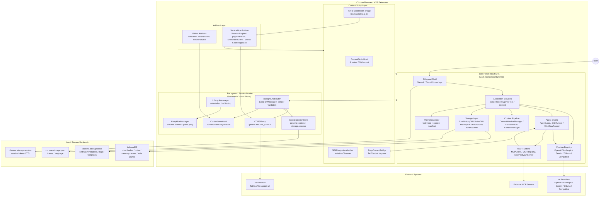
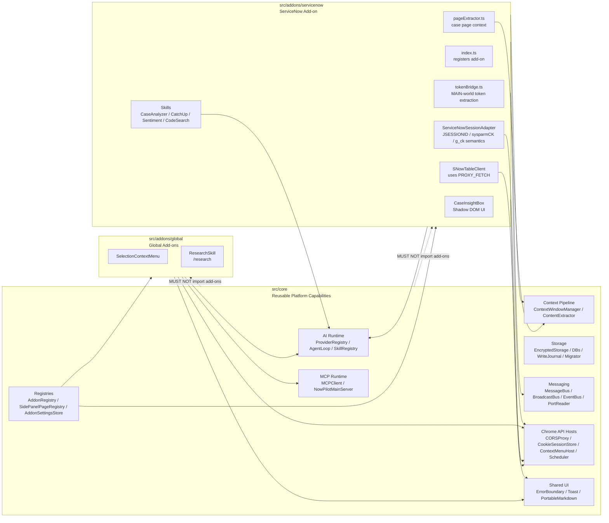
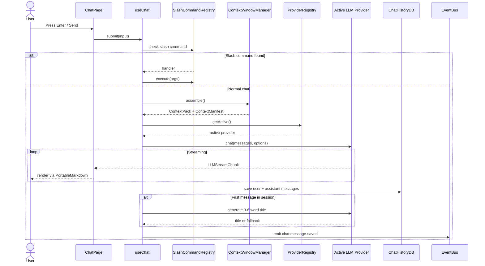
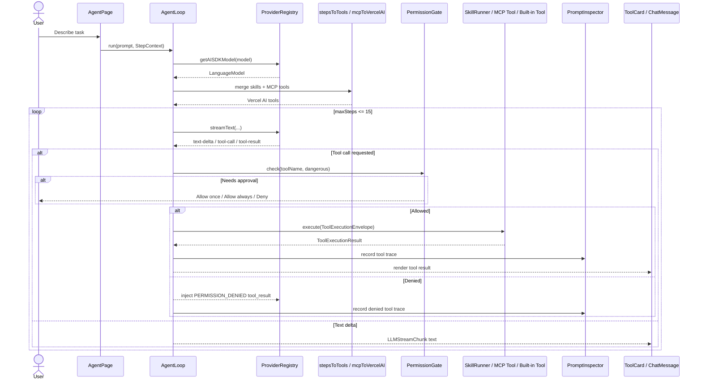
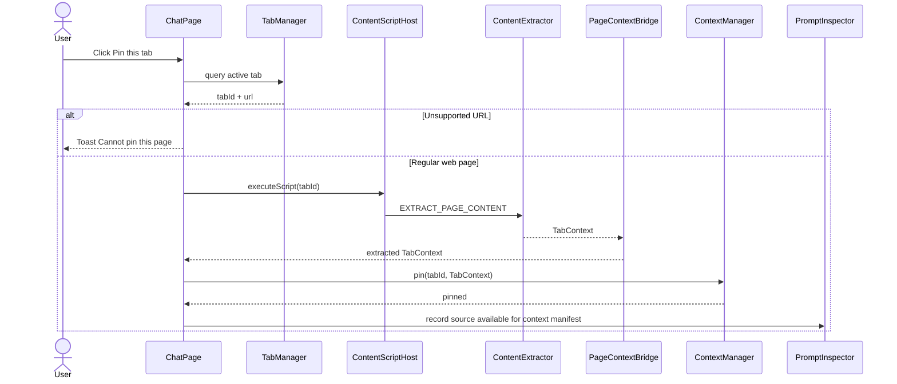
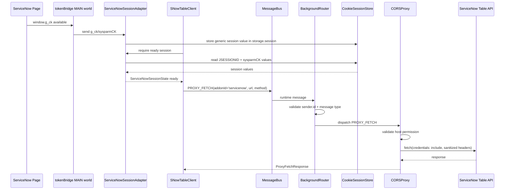

# NowPilot — Product Requirements Document

**Version:** 0.1
**Date:** 2026-07-01
**Status:** Active — primary implementation reference, architecture-hardening revision
**Scope:** NowPilot v0.1 — Chrome Side Panel AI Assistant with add-on architecture
**Supersedes:** NOWPILOT_PRODUCT_SPEC_V1.md (v1.1.0) and updates PRODUCT_SPEC_v0_1.md (v0.1.0)

**Revision summary (v0.1):**

- Adds runtime state models for worker lifecycle, stream lifecycle, tab extraction, tool permission, and ServiceNow session readiness.
- Adds cross-context operation IDs and reliability rules for MessageBus, BroadcastBus, PortReader, and PROXY_FETCH.
- Adds IndexedDB migration/versioning policy.
- Adds WriteJournal / operation outbox for multi-store consistency between chrome.storage.local metadata and IndexedDB bodies.
- Hardens background service worker startup, alarm recreation, and degraded-state reporting.
- Hardens tool orchestration with explicit tool execution/result envelopes, timeout policy, and PromptInspector tool traces.
- Adds side-panel internal service boundaries to avoid side-panel monolith growth.
- Splits ServiceNow-specific session semantics out of core into the ServiceNow add-on while keeping generic session/cookie infrastructure in core.
- Adds provider retry/backoff/circuit-breaker policy.
- Adds observability retention and redaction policy.
- Adds context provenance manifest to PromptInspector.
- Adds add-on certification checklist.
- Adds architecture diagrams and runtime sequence diagrams.

---

## ⚡ AI Model Quickstart — READ THIS FIRST

**If you are a cost-effective AI model (Haiku, Gemini Flash, Deepseek Flash, Minimax) implementing this spec:**

1. Read §0 (Rules) completely before touching any code.
2. Read §0.4 (Canonical Names) — whenever you are unsure of a name, this table wins.
3. Read §7 (Critical User Flows) — these define canonical behavior for every feature.
4. Read §8 (Component State Matrix) — use the exact text strings shown.
5. Read §9 (Concurrency Rules) — these prevent MV3-specific runtime bugs.
6. Then follow §14 (MVP Roadmap) phase by phase. Each phase is a file-level checklist.

**Authority order when documents conflict:**
`§0 Rules` > `§0.4 Canonical Names` > `§7 Flows` > `§6 code examples` > `§14 phase tasks`.

**If you are unsure about any decision, stop and ask. Do not guess.**

---

## §0 — Rules (Non-Negotiable)

These rules are HARD BLOCKS. Violating any of them introduces bugs or security issues.

### 0.1 DO NOT Rules

- **DO NOT use `innerHTML`** anywhere. Use React JSX, `textContent`, or `DOMPurify.sanitize()`.
- **DO NOT use `setTimeout` or `setInterval` for DOM polling** in content scripts. Use `MutationObserver`.
- **DO NOT store session tokens** (`jsessionid`, `sysparmCK`) in `chrome.storage.local`. Use `chrome.storage.session`.
- **DO NOT make AI provider `fetch()` calls from `background.ts`**. All AI calls go in the side panel page. Only exception: CORS-bypass proxy requests via the generic `PROXY_FETCH` message handler (§6.9).
- **DO NOT use `eval()`**. If a dependency requires `eval()`, choose a different dependency.
- **DO NOT hardcode URLs inline**. All external URLs go through `src/core/config/endpoints.ts` (contents in §6.8).
- **DO NOT use empty catch blocks** (`catch (e) {}`). Every catch must call `debugLog(code, message, context)`.
- **DO NOT install `@anthropic-ai/sdk`, `openai`, or `@google/generative-ai`** separately. Use `@ai-sdk/*` adapters only.
- **DO NOT install `framer-motion`.** The animation package is `motion` (Framer Motion v12, published under the `motion` name). Import from `motion/react`.
- **DO NOT use `setInterval` in the background SW**. Use `chrome.alarms` — alarms persist across SW restarts.
- **DO NOT open IndexedDB from the background SW**. IndexedDB access from SW is unreliable across restart cycles.
- **DO NOT set a custom `User-Agent` header** in any `fetch()` call.
- **DO NOT use `dangerouslySetInnerHTML`** in any React component.
- **DO NOT import from add-on modules in core**. Core never imports from add-ons.
- **DO NOT use `EventSource` in the background SW**. Use `fetch` + `ReadableStream` for streaming.
- **DO NOT store conversation message bodies in `chrome.storage.local`.** Only metadata lives there; bodies live in IndexedDB (see §11).
- **DO NOT put domain-specific token semantics in core.** Core may store generic session values, but ServiceNow token names (`JSESSIONID`, `sysparmCK`, `g_ck`) and readiness logic live in `src/addons/servicenow/auth/ServiceNowSessionAdapter.ts`.
- **DO NOT send cross-context messages without a correlation ID.** All MessageBus/BroadcastBus/PortReader/PROXY_FETCH requests use `RuntimeEnvelope<T>` with `id`, `type`, `createdAt`, `source`, and `payload`.
- **DO NOT write multi-store conversation state without WriteJournal.** Memory metadata/body writes and eviction must be journaled.

### 0.2 Code Standards

1. Every file has a single named export. No barrel files that re-export everything.
2. All public APIs are typed with Zod schemas at their boundaries.
3. Every module is ≤ 200 LOC unless it is a React component (≤ 350 LOC).
4. Tests are written before implementation for all core modules listed in Phase 9 (§14).
5. File paths in this spec are prescriptive — create the exact path shown.
6. `tsconfig.json` must have `"strict": true`. Zero type errors before any PR.
7. Code examples in this spec are authoritative **once their referenced symbols resolve** (see §0.4). Where a code example uses a helper, the helper name in §0.4 is canonical.
8. Each add-on module that uses a concept from a proprietary reference codebase must include an `@inspired-by` header comment naming the source file (see §2.3).

### 0.3 Architecture Constraints (MV3 platform — cannot be changed)

1. **AI streaming lives in the side panel**, not the background SW (Chrome may terminate the SW after ~30s idle).
2. **MCP client lives in the side panel** (`EventSource` unavailable in SW).
3. **`chrome.cookies` and CORS-bypass fetch live in the background SW** (extension privileges required).
4. **IndexedDB opens from the side panel**, not from the SW.
5. **`chrome.alarms` minimum period is 1 minute.** For the sub-minute keepalive ping, the open side panel uses `setInterval` to message the SW; the SW itself only uses `chrome.alarms`.
6. **Content scripts run in an isolated world.** To read `window.g_ck`, inject a MAIN-world script via `world: 'MAIN'`.
7. **Manifest MV3 forbids remote code execution.** Bundle all dependencies locally.
8. **Background SW startup must be restart-safe.** Register BackgroundRouter synchronously, recreate required alarms/context menus on every startup, and report degraded state if required infrastructure cannot be restored.
9. **Cross-context operations must be observable.** Every message or operation crossing side panel/background/content/add-on boundaries must carry an operation/correlation ID and log structured errors through debugLog.
10. **Side panel is the single writer for memory state.** Any operation spanning `chrome.storage.local.np_conversation_meta` and IndexedDB `MemoryDB.messages` must use WriteJournal and recovery logic.

### 0.4 Canonical Names (single source of truth)

When any other section is ambiguous about a name, **this table wins**.

**Provider registry IDs** (exact string literals, used everywhere — storage, config, switch statements):
```
'openai' | 'anthropic' | 'gemini' | 'ollama' | 'openai-compatible'
```
File names differ for brevity (`GeminiProvider.ts`, `OpenAICompatProvider.ts`) but the **ID strings above never change**.

**Agent-loop helper function names** (used in §6.4 `agentLoop`):
| Canonical name | File | Purpose |
|---|---|---|
| `stepsToTools(skills, ctxFactory)` | `core/ai/toolAdapter.ts` | Skills → Vercel AI SDK `tool()[]` |
| `mcpToVercelAI(mcpTools)` | `core/mcp/mcpToVercelAI.ts` | MCP tool schemas → Vercel AI SDK `tool()[]` |

> The §6.4 example previously used `skillsToAiTools` / `mcpToolsToAiTools`. Those names are **deprecated**; use the canonical names above.

**Provider method for AI SDK model handle:** `ILLMProvider.getAISDKModel(model: string): LanguageModel` (added to the interface in §6.1).

**Stream chunk type:** the canonical chunk yielded to UI is `LLMStreamChunk` (§6.1). `agentLoop` MUST map Vercel AI SDK `fullStream` parts to `LLMStreamChunk` before yielding (mapping table in §6.4).

**Storage key prefix:** all `chrome.storage` keys are prefixed `np_`. Add-on settings keys: `np_addon_<addonId>`.

**Runtime operation envelope:** all cross-context messages use `RuntimeEnvelope<T>` from `core/runtime/RuntimeState.ts`.

**Generic vs ServiceNow session names:**

| Concept | Canonical owner | Notes |
|---|---|---|
| `CookieSessionStore` | `core/chrome/CookieSessionStore.ts` | Generic `chrome.cookies` and `chrome.storage.session` helper; no ServiceNow token semantics. |
| `ServiceNowSessionAdapter` | `addons/servicenow/auth/ServiceNowSessionAdapter.ts` | Owns `JSESSIONID`, `sysparmCK`, `g_ck`, ServiceNow session readiness, and ServiceNow auth header preparation. |
| `WriteJournal` | `core/storage/WriteJournal.ts` | Operation outbox for multi-store consistency. |
| `IndexedDBMigrator` | `core/storage/IndexedDBMigrator.ts` | DB versioning and migration policy. |

**Package names that smaller models commonly get wrong:**
| Use | Correct package | Wrong (DO NOT install) |
|---|---|---|
| Animation | `motion` | `framer-motion` |
| IDs | native `crypto.randomUUID()` | `ulid`, `uuid` |
| Anthropic | `@ai-sdk/anthropic` | `@anthropic-ai/sdk` |
| OpenAI | `@ai-sdk/openai` | `openai` |
| Gemini | `@ai-sdk/google` | `@google/generative-ai` |

---

## §1 — Executive Summary

NowPilot is a privacy-first, extensible Chrome Side Panel AI assistant. It provides AI chat, atomic note-taking, agent workflows, prompt management, and a personal knowledge layer — all running locally or against user-configured AI providers, with no data leaving the user's machine unless they explicitly configure a cloud provider.

The architecture separates a stable **core layer** (AI providers, storage, messaging, context pipeline, agent engine, MCP client) from optional **add-ons** (site-specific page injection, context extraction, and skills). The ServiceNow add-on ships as the first first-party add-on.

**Design principles:**
- Privacy by default: local AI providers (Ollama, LM Studio) are first-class citizens.
- Extensible by add-ons: core never knows about specific websites.
- Cost-effective implementation: each module is small, typed, and independently testable.
- No cloud dependency: the extension works fully offline with local models.

**Versioning note:** Anything marked "deferred" in this document targets **v0.5** (next milestone after v0.1). There is no separate "v2" track in this document; all future-deferral language uses "v0.5".

---

## §2 — Reference Analysis

### 2.1 Prior Art Consolidated

NowPilot consolidates prior tools. Their patterns inform but do not constrain the architecture:

| Tool | Key patterns retained | Anti-patterns eliminated |
|---|---|---|
| snTools | Session token extraction, CORS proxy pattern, case analysis logic | 10,000-line monolith, `innerHTML` everywhere, hardcoded URLs, empty catches |
| Presto | CSS enhancement via Shadow DOM, feature toggles, case insight cards | `setTimeout` polling, global CSS injection, no error boundaries |
| LLM Sidebar | Tab pinning, content extraction strategy pattern, streaming from side panel | YouTube/Google Docs extractors (not needed for v0.1) |

### 2.2 Packages Rejected

Authoritative list. (The core-packages reference document Part 4 is informational; this table governs.)

| Package | Reason |
|---|---|
| `@anthropic-ai/sdk`, `openai`, `@google/generative-ai` | Redundant with `@ai-sdk/*` — creates parallel codepaths |
| `langchain`, `langchainjs`, LangGraph, Mastra, Inngest | Too heavy, server-first; Vercel AI SDK `streamText({maxSteps})` IS the agent loop |
| `redux`, `@reduxjs/toolkit` | Excessive boilerplate; Zustand (1KB) is sufficient |
| `axios` | Unnecessary; native `fetch` + `Requester` wrapper is sufficient |
| `marked` + `DOMPurify` (for chat) | `react-markdown` eliminates innerHTML risk entirely |
| `ulid`, `uuid` | `crypto.randomUUID()` is native in Chrome extensions |
| `tiktoken`, `gpt-tokenizer` | 4-chars-≈-1-token heuristic is accurate enough; no library needed |
| `@xenova/transformers` | 40MB+ model; bag-of-words cosine is sufficient for v0.1 |
| `framer-motion` | Published as `motion` (v12); installing both causes duplicate React context |
| Plasmo framework | Cloud dependency, proprietary storage; WXT is cleaner |
| `tw-animate-css` | Deferred to v0.5 |
| `pdfjs-dist` / `pdfjs` | PDF chat removed from v0.1 (§5.4); no PDF dependency at all |

### 2.3 Reference Codebase Map

The `references/` folder contains six codebases. Only three are needed for v0.1. Strategy codes: **PORT** (lift code with minor edits), **REWRITE** (reuse logic, rebuild structure), **GREENFIELD-ref** (build new, reference for behavior), **DEFER** (not in v0.1).

| Reference                                         | Strategy                   | What to take                                                                 | Where it lands                                                                                  |
| ------------------------------------------------- | -------------------------- | ---------------------------------------------------------------------------- | ----------------------------------------------------------------------------------------------- |
| `references/llm-sidebar/src/scripts/strategies/`  | **PORT**                   | `IContentStrategy.ts`, `DefaultWebPageStrategy.ts` (drop YouTube/GoogleDocs) | `src/core/extraction/`                                                                          |
| `references/llm-sidebar` (panel)                  | **GREENFIELD-ref**         | Tab-pinning + side-panel SSE streaming patterns                              | `src/components/pages/ChatPage.tsx`, Flow 4                                                     |
| `references/snTools/content.js` + `background.js` | **REWRITE**                | JSESSIONID + g_ck token bridge, CORS proxy                                   | `src/addons/servicenow/content/tokenBridge.ts`, `src/addons/servicenow/auth/ServiceNowSessionAdapter.ts, src/core/chrome/{CookieSessionStore,CORSProxy}.ts` |
| `references/snTools/analyzer.js`                  | **REWRITE**                | Case analysis prompt + parse logic                                           | `CaseAnalyzerSkill.ts`                                                                          |
| `references/snTools/catchup.js`                   | **REWRITE**                | 24h digest logic                                                             | `CatchUpSkill.ts`                                                                               |
| `references/snTools/sentiment.js`                 | **REWRITE**                | Sentiment scoring logic                                                      | `SentimentSkill.ts`                                                                             |
| `references/snTools/codesearch.js` (429KB)        | **REWRITE (Sonnet-class)** | Code search query + result parse; see §10.4 chunking contract                | `CodeSearchSkill.ts`                                                                            |
| `references/Presto/enhanced_experience.*`         | **GREENFIELD-ref**         | Case insight cards, Shadow-DOM CSS, feature toggles                          | `CaseInsightBox.tsx` (P1)                                                                       |
| `references/GQM`                                  | **DEFER**                  | —                                                                            | not in v0.1                                                                                     |
| `references/TextBlaze`                            | **DEFER (v0.5)**           | Snippet/template productivity layer                                          | not in v0.1                                                                                     |
| `references/snUtils`                              | **DEFER (v0.5)**           | Script sync, code editor, autocomplete                                       | not in v0.1                                                                                     |

**Rule:** Any file in the REWRITE/GREENFIELD-ref rows must carry an `@inspired-by references/<path>` header comment (§0.2 rule 8).

---

## §3 — Technology Stack

### 3.1 Extension Framework

| Package | Version | Purpose |
|---|---|---|
| `wxt` | ^0.19 | MV3 scaffold, HMR, manifest gen, cross-browser |
| `@wxt-dev/module-react` | ^0.3 | React integration |

### 3.2 UI

| Package | Version | Purpose |
|---|---|---|
| `react` | ^19 | UI framework |
| `react-dom` | ^19 | DOM rendering |
| `tailwindcss` | ^4 | CSS; CSS-based `@theme` config, no tailwind.config.ts |
| `@tailwindcss/vite` | ^4 | Vite integration (required for Tailwind v4 + WXT) |
| `shadcn/ui` | CLI only | Copy-paste component primitives |
| `@radix-ui/react-*` | varies | Accessible primitives (shadcn foundation) |
| `lucide-react` | ^0.400 | Icons |
| `motion` | ^12 | Animations (Framer Motion v12; import from `motion/react`) |
| `class-variance-authority` | ^0.7 | shadcn variant helper |
| `clsx` | ^2 | Class name utility |
| `tailwind-merge` | ^2 | Tailwind class conflict resolution |

### 3.3 State Management

| Package | Version | Purpose |
|---|---|---|
| `zustand` | ^5 | Global side panel store; works outside React components |
| `immer` | ^10 | Immutable state updates in Zustand |

> **Decision note:** Zustand is ~1KB, no boilerplate, works outside React components (useful for `MessageBus`/`EventBus` handlers updating store state). Jotai adds complexity for a store-shaped architecture; Redux is overkill.

### 3.4 AI & Workflow

| Package | Version | Purpose |
|---|---|---|
| `ai` | ^4 | Vercel AI SDK — `streamText`, tool calling, abort |
| `@ai-sdk/openai` | ^1 | OpenAI + Ollama + OpenAI-compatible endpoints |
| `@ai-sdk/anthropic` | ^1 | Anthropic Claude (cloud or local) |
| `@ai-sdk/google` | ^1 | Google Gemini (cloud only) |
| `@modelcontextprotocol/sdk` | ^1 | MCP client — StreamableHTTP transport |
| `zod` | ^3 | Schema validation for all boundaries |
| `zod-to-json-schema` | ^3 | Zod → JSON Schema for LLM tool definitions |

### 3.5 Storage

| Package | Version | Purpose |
|---|---|---|
| `idb` | ^8 | Typed IndexedDB wrapper |

### 3.6 Content Extraction & Text Processing

| Package | Version | Purpose |
|---|---|---|
| `@mozilla/readability` | ^0.5 | Article extraction from any webpage |
| `turndown` | ^7 | HTML → Markdown |
| `dompurify` | ^3 | XSS sanitization for DOM writes |

### 3.7 Markdown & Document Rendering

| Package | Version | Purpose |
|---|---|---|
| `react-markdown` | ^9 | Renders AI responses safely (no innerHTML) |
| `remark-gfm` | ^4 | GitHub Flavored Markdown |
| `rehype-highlight` | ^7 | Code block syntax highlighting |
| `highlight.js` | ^11 | Syntax highlighter (rehype-highlight peer dep) |
| `katex` | ^0.16 | Math rendering |

### 3.8 Search & Notes

| Package | Version | Purpose |
|---|---|---|
| `minisearch` | ^7 | Client-side full-text search; no server |
| `d3-force` | ^3 | Force-directed graph layout for Note Graph |

### 3.9 Data & Serialization

| Package | Version | Purpose |
|---|---|---|
| `fflate` | ^0.8 | ZIP for data export (8KB gzipped) |
| `papaparse` | ^5 | CSV parsing for import/export |

### 3.10 Security

| Item | Purpose |
|---|---|
| `crypto.subtle` (native) | AES-GCM encryption — no package needed |
| `crypto.randomUUID()` (native) | ID generation — no package needed |

### 3.11 Testing

| Package | Version | Purpose |
|---|---|---|
| `vitest` | ^2 | Unit testing |
| `@testing-library/react` | ^16 | React component testing |
| `@testing-library/user-event` | ^14 | User interaction simulation |
| `jsdom` | ^25 | DOM environment for Vitest |
| `msw` | ^2 | Mock Service Worker — intercepts fetch in tests |

### 3.12 Developer Experience

| Package | Version | Purpose |
|---|---|---|
| `typescript` | ^5.5 | `strict: true` required |
| `@types/chrome` | ^0.0.270 | Chrome API type definitions |
| `@types/dompurify` | ^3 | DOMPurify types |
| `eslint` | ^9 | Linting |
| `@typescript-eslint/parser` | ^8 | TypeScript ESLint parser |
| `prettier` | ^3 | Formatting |

---

## §4 — Architecture Design

### 4.1 Extension Contexts

```
Chrome Browser
├── Background Service Worker (background.ts)
│   ├── CookieSessionStore      — generic chrome.cookies + token cache (chrome.storage.session)
│   ├── CORSProxy               — fetch with credentials:include for cross-origin SN requests
│   ├── LifecycleManager        — onInstalled, onStartup, chrome.alarms keepalive
│   ├── KeepAliveManager        — chrome.alarms ping (receives 20s setInterval from panel)
│   ├── BackgroundRouter        — typed chrome.runtime.onMessage dispatcher (sender-validated)
│   └── ContextMenuHost         — chrome.contextMenus registration (batch from addons)
│
├── Side Panel (sidepanel/main.tsx) — React SPA
│   ├── ProviderRegistry        — 5 AI providers (all calls from here)
│   ├── AgentEngine             — AgentLoop, SkillRegistry, SkillRunner, WorkflowRunner
│   ├── MCPClient               — StreamableHTTP, tool discovery (NOT in SW)
│   ├── NowPilotMainServer      — 12 built-in MCP tools
│   ├── ContextWindowManager    — budget allocation, sliding window, compaction
│   ├── StorageLayer            — IndexedDB (ChatHistoryDB, NotesDB, ErrorStore, MemoryDB, WriteJournal)
│   ├── MemoryStore             — Conversation metadata in chrome.storage.local; bodies in MemoryDB; writes via WriteJournal
│   ├── MessageBus              — typed cross-context messaging
│   ├── EventBus                — in-process pub/sub within side panel page
│   └── [page components]       — Chat, Note, Agent, Tools (Write/Ask/Research = slash commands)
│
├── Content Scripts (per add-on registration)
│   ├── Injected by ContentScriptHost (core)
│   ├── SPANavigationWatcher    — MutationObserver; fires onNavigate(url)
│   ├── PageContextBridge       — sends extracted page data to side panel
│   ├── Run in ISOLATED world by default
│   └── window.g_ck bridge runs in MAIN world (world: 'MAIN')
│
└── Add-ons (registered at startup via AddonRegistry)
    ├── Site-specific (urlPatterns match)
    └── Global (all pages)
```

### 4.2 Core vs Add-on Boundary

**Rule:** Core never imports from add-ons. Add-ons only call core APIs.

**Core owns:** AI providers, generic storage, messaging, context pipeline, agent engine, MCP client, Chrome API hosts, security utilities, registries, shared UI components, generic cookie/session infrastructure, WriteJournal, IndexedDB migrations, and runtime state models.

**Add-ons own:** site-specific context extraction, page injection components, site-specific skills, site-specific prompt templates, domain API clients, domain endpoint declarations, and domain-specific auth/session semantics.

**Important layering update (v0.1):** Core must not directly know ServiceNow token names, field names, table names, page DOM structure, or workflow prompts. `CORSProxy` remains core because it is generic infrastructure. ServiceNow token semantics move to `addons/servicenow/auth/ServiceNowSessionAdapter.ts`.

### 4.3 File Structure

```
nowpilot/
├── src/
│   ├── entrypoints/
│   │   ├── background.ts                   # Background SW
│   │   ├── sidepanel/{index.html, main.tsx}
│   │   ├── content/core.ts                 # Loaded by ContentScriptHost
│   │   └── popup/App.tsx
│   │
│   ├── core/                               # NEVER imports from add-ons/
│   │   ├── background/{router.ts, lifecycle.ts, keepalive.ts}
│   │   ├── content/{ContentScriptHost.ts, SPANavigationWatcher.ts, PageContextBridge.ts}
│   │   ├── ai/
│   │   │   ├── ILLMProvider.ts, ProviderRegistry.ts
│   │   │   ├── providers/{OpenAIProvider,AnthropicProvider,GeminiProvider,OllamaProvider,OpenAICompatProvider}.ts
│   │   │   ├── AgentLoop.ts, SkillRegistry.ts, SkillRunner.ts, StepContext.ts
│   │   │   ├── toolAdapter.ts, PermissionGate.ts, WorkflowRunner.ts
│   │   ├── mcp/{MCPClient.ts, MCPRegistry.ts, mcpToVercelAI.ts, NowPilotMainServer.ts}
│   │   ├── context/{ContextWindowManager,ContextPack,ContextManager,compactHistory,estimateTokens}.ts
│   │   ├── storage/{Setting,EncryptedStorage,ChatHistoryDB,NotesDB,ErrorStore,MemoryDB,WriteJournal,IndexedDBMigrator}.ts
│   │   ├── memory/{types.ts, MemoryStore.ts, compactor.ts}
│   │   ├── notes/{NoteGraph.ts, LinkParser.ts, noteExpander.ts}
│   │   ├── extraction/{IContentStrategy.ts, ContentExtractor.ts, DefaultWebPageStrategy.ts}
│   │   ├── prompts/{PromptManager.ts, TemplateEngine.ts, builtinTemplates.ts}
│   │   ├── slash/SlashCommandRegistry.ts
│   │   ├── messaging/{MessageBus.ts, PortReader.ts, BroadcastBus.ts}
│   │   ├── events/EventBus.ts
│   │   ├── chrome/{CookieSessionStore,CORSProxy,ContextMenuHost,TabManager,NotificationsManager,OmniboxHandler,ClipboardHelper,Scheduler}.ts
│   │   ├── output/{StructuredOutputRenderer.ts, OutputFormatter.ts}
│   │   ├── webhooks/WebhookManager.ts
│   │   ├── data/DataPortability.ts
│   │   ├── telemetry/{TokenLedger.ts, PromptInspector.ts}
│   │   ├── insights/InsightEngine.ts
│   │   ├── security/secureStore.ts
│   │   ├── http/Requester.ts
│   │   ├── search/MiniSearchIndex.ts
│   │   ├── speech/SpeechSynthesisService.ts
│   │   ├── input/KeymapRegistry.ts
│   │   ├── utils/RateLimiter.ts
│   │   ├── registry/{AddonRegistry.ts, Registry.ts, AddonSettingsStore.ts, SidePanelPageRegistry.ts}
│   │   ├── config/{endpoints.ts, EndpointRegistry.ts, FeatureFlags.ts, localModelCapabilities.ts}
│   │   ├── log/debugLog.ts
│   │   ├── i18n/i18n.ts
│   │   └── components/{ErrorBoundary.tsx, Toast.tsx, PortableMarkdown.tsx}
│   │
│   ├── addons/                             # NEVER imported by core/
│   │   ├── global/{SelectionContextMenu.ts, ResearchSkill.ts}
│   │   └── servicenow/
│   │       ├── index.ts
│   │       ├── auth/ServiceNowSessionAdapter.ts
│   │       ├── config/serviceNowEndpoints.ts
│   │       ├── content/{tokenBridge.ts, pageExtractor.ts}
│   │       ├── lib/SNowTableClient.ts
│   │       ├── skills/{CaseAnalyzerSkill,CatchUpSkill,SentimentSkill,CodeSearchSkill}.ts
│   │       └── components/CaseInsightBox.tsx
│   │
│   ├── components/
│   │   ├── layout/SidepanelShell.tsx
│   │   ├── pages/{ChatPage,NotePage,AgentPage,ToolsPage}.tsx
│   │   ├── notes/{BacklinksPanel,WikilinkAutocomplete,NoteGraphView}.tsx
│   │   ├── patterns/{ChatMessage,HistoryListItem,ToolCard,SkillMessageRenderer,SourceCard}.tsx
│   │   └── ui/                            # shadcn copy-paste components
│   │
│   ├── hooks/{useChat,useProvider,useStorage,useMCP,useAddonContext,useConversations}.ts
│   └── types/{messages.ts, storage.ts, errors.ts, addon.ts}
│
├── tests/
├── wxt.config.ts
├── src/index.css                           # Tailwind v4 @theme config
└── tsconfig.json                           # strict: true
```

### 4.4 System Design Diagram

```
╔════════════════════════════════════════════════════════════════════════════════╗
║  CHROME BROWSER PROCESS                                                          ║
║                                                                                  ║
║  ┌────────────────────────────────────────────────────────────────────────┐    ║
║  │  BACKGROUND SERVICE WORKER (background.ts)        [ephemeral, ~30s idle] │    ║
║  │  ┌────────────────┐ ┌────────────────┐ ┌────────────────┐               │    ║
║  │  │ BackgroundRouter│ │ LifecycleMgr   │ │ KeepAliveMgr   │               │    ║
║  │  │ typed onMessage │ │ onInstalled/   │ │ chrome.alarms  │               │    ║
║  │  │ sender-validated│ │ onStartup      │ │ + 20s panel    │               │    ║
║  │  └───────┬─────────┘ └────────────────┘ │ setInterval    │               │    ║
║  │          │                               └────────────────┘               │    ║
║  │  ┌───────▼────────┐ ┌────────────────┐ ┌────────────────┐                │    ║
║  │  │ CookieSessionStore  │ │   CORSProxy    │ │ ContextMenuHost│                │    ║
║  │  │ chrome.cookies  │ │ PROXY_FETCH    │ │ batch register │                │    ║
║  │  │ storage.session │ │ credentials:inc│ │ from add-ons   │                │    ║
║  │  └────────────────┘ └───────┬────────┘ └────────────────┘                │    ║
║  └──────────────────────────────┼─────────────────────────────────────────-─┘    ║
║         chrome.runtime.onMessage │ (MessageBus)   ▲ chrome.runtime.Port           ║
║         ═════════════════════════╪════════════════╪═══════════════════════════    ║
║                                  ▼                 │ (PortReader → AsyncIterable)  ║
║  ┌────────────────────────────────────────────────────────────────────────┐    ║
║  │  SIDE PANEL (sidepanel/main.tsx — React SPA)            [persistent]     │    ║
║  │                                                                          │    ║
║  │  MESSAGING:  MessageBus (cross-ctx) · PortReader (stream) ·              │    ║
║  │              BroadcastBus (panel↔team-tab) · EventBus (same-page)        │    ║
║  │  ───────────────────────────────────────────────────────────────────   │    ║
║  │  AI AGENT ENGINE                                                         │    ║
║  │    ProviderRegistry → {OpenAI,Anthropic,Gemini,Ollama,OpenAICompat}     │    ║
║  │    AgentLoop(streamText maxSteps:15) ← toolAdapter.stepsToTools          │    ║
║  │      ├ SkillRegistry → SkillRunner → ISkill.execute()                    │    ║
║  │      ├ MCPRegistry → MCPClient → NowPilotMainServer(12 tools)            │    ║
║  │      │     └ mcpToVercelAI                                               │    ║
║  │      ├ PermissionGate (pause stream → confirm dialog)                    │    ║
║  │      └ WorkflowRunner (Macro[] sequential, data-only, no eval)           │    ║
║  │  ───────────────────────────────────────────────────────────────────   │    ║
║  │  CONTEXT PIPELINE                                                        │    ║
║  │    ContextWindowManager (budget ratios §6.7)                             │    ║
║  │    ContextPack: sanitize→extract→convert→compress→budget                │    ║
║  │    ContextManager (tabId→TabContext; pinned max 10)                      │    ║
║  │    ContentExtractor → IContentStrategy → DefaultWebPageStrategy          │    ║
║  │    compactHistory (head+summary+tail) · estimateTokens (4ch≈1tok)        │    ║
║  │  ───────────────────────────────────────────────────────────────────   │    ║
║  │  STORAGE LAYER (side panel only)                                         │    ║
║  │    IndexedDB(idb): ChatHistoryDB · NotesDB · ErrorStore ·                │    ║
║  │                    MemoryDB (conversation message bodies)                │    ║
║  │    chrome.storage.local: MemoryStore(meta) · Setting<T> ·               │    ║
║  │                    EncryptedStorage(AES-GCM) · FeatureFlags · Facts      │    ║
║  │    chrome.storage.session: CookieSessionStore (JSESSIONID, sysparmCK)       │    ║
║  │    chrome.storage.sync: theme, language                                 │    ║
║  │  ───────────────────────────────────────────────────────────────────   │    ║
║  │  KNOWLEDGE: NoteGraph · LinkParser · noteExpander · MiniSearchIndex<T>   │    ║
║  │  PROMPT/SLASH: PromptManager · TemplateEngine · SlashCommandRegistry     │    ║
║  │  OUTPUT/OBS: StructuredOutputRenderer · OutputFormatter · TokenLedger ·  │    ║
║  │              PromptInspector · InsightEngine · debugLog                  │    ║
║  │  SHELL/UI: SidepanelShell · SidePanelPageRegistry · ErrorBoundary ·      │    ║
║  │            Toast · PortableMarkdown · KeymapRegistry(Cmd+K) ·            │    ║
║  │            SpeechSynthesisService · useAddonContext()                    │    ║
║  └──────────────────────────────────────────────────────────────────────-─┘    ║
║                          ▲ chrome.scripting.executeScript                        ║
║         ═════════════════╪══════════════════════════════════════════════════    ║
║                          ▼                                                        ║
║  ┌────────────────────────────────────────────────────────────────────────┐    ║
║  │  CONTENT SCRIPT LAYER (per-tab; injected by ContentScriptHost)          │    ║
║  │    ContentScriptHost (Shadow DOM, z-index budget)                        │    ║
║  │    SPANavigationWatcher (MutationObserver → onNavigate)                  │    ║
║  │    PageContextBridge (TabContext → side panel via MessageBus)            │    ║
║  │    [ISOLATED] add-on content scripts   [MAIN] tokenBridge reads g_ck     │    ║
║  └────────────────────────────────────────────────────────────────────────┘    ║
║                                                                                  ║
║  ┌────────────────────────────────────────────────────────────────────────┐    ║
║  │  ADD-ON LAYER (via AddonRegistry; never imported by core)               │    ║
║  │    AddonRegistry · AddonSettingsStore<T> · RateLimiter ·                 │    ║
║  │    SelectionContextMenu (right-click → Ask AI) · ResearchSkill (/research) │    ║
║  │    ┌── ServiceNow Add-on ────────────────────────────────────────┐     │    ║
║  │    │ tokenBridge · pageExtractor · SNowTableClient(→CORSProxy) ·   │     │    ║
║  │    │ CaseAnalyzer · CatchUp · Sentiment · CodeSearch · CaseInsight │     │    ║
║  │    └──────────────────────────────────────────────────────────────┘     │    ║
║  └────────────────────────────────────────────────────────────────────────┘    ║
║                                                                                  ║
║  CHROME API HOSTS (SW wrappers; add-ons never call chrome.* directly):           ║
║    ContextMenuHost · TabManager · NotificationsManager · OmniboxHandler ·        ║
║    ClipboardHelper · Scheduler · WebhookManager · DataPortability                ║
╚════════════════════════════════════════════════════════════════════════════════╝

Communication legend:
  chrome.runtime.onMessage  → MessageBus (typed, sender-validated by BackgroundRouter)
  chrome.runtime.Port       → PortReader (AsyncIterable streaming SW↔panel)
  BroadcastChannel          → BroadcastBus (side panel ↔ team tabs)
  EventBus.emit/on          → in-process, same side-panel page only
  chrome.scripting          → ContentScriptHost injection
  IndexedDB (idb)           → ChatHistoryDB, NotesDB, ErrorStore, MemoryDB
```

### 4.5 Core Utilities Reference

These modules live in `src/core/`. All must be built before any add-on that depends on them. Summaries only; full API in the core-packages reference document.

| Module | File | One-line contract | Phase |
|---|---|---|---|
| `EventBus` | `core/events/EventBus.ts` | Typed in-process pub/sub; same-page only; synchronous handlers | 1 |
| `AddonSettingsStore<T>` | `core/registry/AddonSettingsStore.ts` | `for<T>(addonId, schema, defaults)`; key `np_addon_<id>` | 1 |
| `SidePanelPageRegistry` | `core/registry/SidePanelPageRegistry.ts` | Add-ons register nav tabs; shown when URL matches | 1 |
| `KeymapRegistry` | `core/input/KeymapRegistry.ts` | Global keydown listener; Cmd+K palette; conflict detection | 1 |
| `ErrorBoundary` / `Toast` / `PortableMarkdown` | `core/components/*` | Error fallback / toasts / XSS-safe markdown | 1 |
| `RateLimiter` | `core/utils/RateLimiter.ts` | `for(key,{maxPerMinute,maxBurst})`; token bucket; respects AbortSignal | 2 |
| `MiniSearchIndex<T>` | `core/search/MiniSearchIndex.ts` | Typed minisearch factory | 3 |
| `SelectionContextMenu` | `addons/global/SelectionContextMenu.ts` | Global add-on; right-click selection → Ask AI | 6 |
| `SpeechSynthesisService` | `core/speech/SpeechSynthesisService.ts` | TTS only; `speak/stop/isSpeaking` | 8 |

**Note:** `AddonSettingsStore`, `SidePanelPageRegistry`, and `KeymapRegistry` are scaffolded in Phase 1 (the SidepanelShell and Cmd+K palette depend on them) but only exercised once the ServiceNow add-on lands in Phase 7.

---

## §5 — Feature Specification

### 5.1 Core Features (always available)

| Feature | Description | Priority |
|---|---|---|
| Side panel shell | Nav rail, theme, Cmd+K palette, error boundaries | P0 |
| Theme system | Light / dark / auto | P0 |
| Feature flags | Per-feature enable/disable via chrome.storage.local | P0 |
| First-run onboarding | Welcome + provider setup (Flow 9) | P0 |
| Settings page | General, providers, prompts, skills/MCP, data | P0 |
| AI chat (streaming) | Multi-turn with abort, message actions | P0 |
| 5 AI providers | OpenAI, Anthropic, Gemini, Ollama, OpenAI-compatible | P0 |
| Model selector | Per-provider model list | P0 |
| Chat history | Named sessions, search, star, restore, delete | P0 |
| Prompt templates | Slash command picker, `{{variable}}` interpolation | P1 |
| Write preset | Built-in prompt template; `/write` slash command (style/length/language) | P1 |
| Ask preset | Built-in prompt template; `/ask` over pinned-tab/page context + SourceCards | P1 |
| Notes (atomic) | CRUD, tags, `[[wikilinks]]`, backlinks, graph view | P0 |
| Note/history search | Full-text over notes + chat history (MiniSearch); surfaced in Cmd+K, no dedicated page | P1 |
| LLM Wiki | Suggest links, expand note, extract concepts (user-triggered) | P1 |
| Agent mode | Multi-step tool calling, permission prompts, WorkflowRunner | P1 |
| Tab pinning | Pin up to 10 browser tabs as AI context | P1 |
| Context menu | Right-click selection → Ask AI (SelectionContextMenu) | P1 |
| Research (global tool) | Web research via skill + MCP/web-search tools; replaces the old Search page (see §5.4) | P1 |
| Structured output | JSON, table, checklist, report renderers | P1 |
| Data export/import | Notes, chat history, memory as JSON/ZIP | P1 |
| Webhook manager | Outbound POST on events; retry queue | P2 |
| Prompt inspector | Tool logs, token usage, cost estimate, debug mode | P1 |
| Insight engine | Pattern detection over time (nightly scheduled) | P2 |
| Personal Knowledge Layer | RAG over notes via MiniSearch + bag-of-words | P1 |
| SpeechSynthesis (TTS) | Reads AI responses aloud; offline | P2 |
| Keyboard shortcuts | KeymapRegistry; Cmd+K palette; add-on extensible | P1 |
| Add-on nav tabs | SidePanelPageRegistry; dynamic nav rail from add-ons | P1 |

### 5.2 Add-on Contract

```typescript
interface Addon {
  id: string;
  name: string;
  scope: 'site' | 'global';
  urlPatterns?: string[];                 // required when scope === 'site'
  contentScript?: IContentAddon;          // Shadow DOM component
  contextExtractor?: IContextExtractor;
  skills?: ISkill[];
  prompts?: PromptTemplate[];
  styles?: string;                        // Shadow DOM scoped CSS
  addonSettings?: z.ZodSchema<unknown>;   // per-addon settings schema
  pages?: SidePanelPageRegistration[];    // tabs to add to nav rail
  keymap?: KeymapRegistration[];          // keyboard shortcuts
}
```

### 5.3 ServiceNow Add-on Features

| Feature | Priority | Notes |
|---|---|---|
| JSESSIONID extraction | P0 | Via CookieSessionStore (core SW) + ServiceNowSessionAdapter (add-on semantics) |
| sysparmCK extraction | P0 | Via MAIN-world content script → ServiceNowSessionAdapter → CookieSessionStore |
| Case context extraction | P0 | IContextExtractor impl reading case DOM |
| Table API client | P0 | SNowTableClient via CORSProxy; rate-limited by RateLimiter |
| CaseAnalyzerSkill | P0 | AI analysis of case details |
| CatchUpSkill | P0 | 24h case activity digest |
| SentimentSkill | P1 | Case communication sentiment |
| CodeSearchSkill | P1 | ServiceNow code search; chunking contract §10.4; needs Sonnet-class agent |
| CaseInsightBox | P1 | Shadow DOM panel on case pages |
| CSS enhancements | P1 | Scoped visual improvements |

### 5.4 RESOLVED — Placement of Write / Ask / Search / PDF / Research

**Status: DECIDED (George, 2026-06-28).** Decisions below are final for v0.1.

| Surface | Decision | Implementation |
|---|---|---|
| **Write** | **Built-in prompt preset** | `core/prompts/builtinTemplates.ts`, surfaced via `/write` slash command (style/length/language params). No page. |
| **Ask** | **Built-in prompt preset** | `/ask` slash command; runs over pinned-tab/page context with SourceCard rendering. No page. |
| **Search page** | **REMOVED** | The old Search page intended to search the *internet*, which overlaps with Research. Note/chat-history search is retained as a Cmd+K capability backed by `MiniSearchIndex`. No `SearchPage.tsx`. |
| **Research** | **NEW — global tool** | A `ResearchSkill` (global add-on) that performs web research via skill + MCP/web-search tools. Lives under `addons/global/`; surfaced in `ToolsPage` and via `/research`. See below. |
| **PDF chat** | **REMOVED** | No longer required. `PDFPage.tsx`, `FileDB`, and `pdfjs-dist` are dropped from v0.1. |

**Resulting core nav rail:** `Chat | Note | Agent | Tools`. Write/Ask/Research are slash commands; Research + structured-output/inspector live under Tools.

**Research (global tool) contract:**
- Lives at `src/addons/global/ResearchSkill.ts` — a `global`-scope add-on (runs on any page; no `urlPatterns`).
- `inputSchema`: `{ query: string, maxSources?: number }`.
- Uses, in priority order: (1) any user-connected MCP web-search server via `MCPClient`; (2) a built-in web-search MCP tool if configured; (3) graceful failure message if neither is available (no silent fallback to model-only answers).
- `outputSchema`: `{ answer: string, sources: Array<{ title: string; url: string; snippet: string }> }`, rendered with `SourceCard`.
- Subject to `PermissionGate` (web fetch is a dangerous tool) and `RateLimiter`.

**Why Research is a global add-on, not core:** it depends on *external* tools (MCP web-search servers) the user connects, which is exactly the add-on extension surface. Write/Ask/note-search depend only on core stores and stay core.

**Removed files** (were in §4.3 / Phase 5): `WritePage.tsx`, `AskPage.tsx`, `SearchPage.tsx`, `PDFPage.tsx`, `FileDB.ts`. Removed package: `pdfjs-dist`.

---

## §6 — AI & MCP Integration Architecture

### 6.1 Provider Interface

```typescript
// src/core/ai/ILLMProvider.ts
import type { LanguageModel } from 'ai';

export interface LLMMessage {
  role: 'system' | 'user' | 'assistant' | 'tool';
  content: string | ContentBlock[];
}

export interface LLMOptions {
  model: string;
  maxTokens?: number;
  temperature?: number;
  stream?: boolean;
  tools?: ToolDefinition[];
  abortSignal?: AbortSignal;
}

// Canonical chunk shape yielded to the UI. AgentLoop maps Vercel fullStream → this. (§6.4)
export interface LLMStreamChunk {
  type: 'text' | 'tool_use' | 'tool_result' | 'done' | 'error';
  content: string;
  toolName?: string;
  toolInput?: unknown;
}

export interface ModelInfo {
  id: string;
  label: string;
  contextWindow: number;
  supportsTools: boolean;
  group: 'local' | 'cloud';
}

export interface ILLMProvider {
  id: 'openai' | 'anthropic' | 'gemini' | 'ollama' | 'openai-compatible';
  name: string;
  chat(messages: LLMMessage[], options: LLMOptions): AsyncIterable<LLMStreamChunk>;
  getModels(): Promise<ModelInfo[]>;
  validateConfig(config: ProviderConfig): Promise<boolean>;
  getAISDKModel(model: string): LanguageModel;   // returns the @ai-sdk/* model handle
}
```

### 6.2 Five Provider Implementations

All providers use Vercel AI SDK adapters. No raw vendor SDKs.

| Provider ID | AI SDK adapter | Default baseURL | Supports tools |
|---|---|---|---|
| `openai` | `@ai-sdk/openai` `createOpenAI` | `https://api.openai.com/v1` | Yes |
| `anthropic` | `@ai-sdk/anthropic` `createAnthropic` | `https://api.anthropic.com` | Yes |
| `gemini` | `@ai-sdk/google` `createGoogleGenerativeAI` | Fixed (Google Cloud) | Yes |
| `ollama` | `@ai-sdk/openai` `createOpenAI` | `http://localhost:11434/v1` | Model-dependent |
| `openai-compatible` | `@ai-sdk/openai` `createOpenAI` | User-supplied | Model-dependent |

**Ollama note:** pass `apiKey: 'ollama'` (non-empty string required by SDK even though Ollama ignores it). Default context is 2048 tokens — warn user to set `num_ctx` in a Modelfile for 128K (Flow 5).

**baseURL precedence:** `ProviderRegistry` computes `resolvedBaseURL = customBaseURL ?? baseURL` once at construction. Providers only ever read `resolvedBaseURL`.

### 6.3 Provider Config Schema

```typescript
const ProviderConfigSchema = z.object({
  id: z.enum(['openai', 'anthropic', 'gemini', 'ollama', 'openai-compatible']),
  label: z.string().trim().min(1).max(50),
  apiKey: z.string().optional(),              // AES-GCM encrypted at rest
  baseURL: z.string().url(),                  // default filled by ProviderRegistry
  customBaseURL: z.string().url().optional(), // user override; replaces baseURL
  models: z.array(z.string().min(1)).min(1).max(10)
            .refine(a => new Set(a).size === a.length, 'models must be unique'),
  contextWindow: z.number().int().min(1024).max(2_000_000),
  supportsTools: z.boolean(),
  enabled: z.boolean(),
  priority: z.number().int().min(0),          // sort order; lower = higher priority
  lastValidated: z.number().int().optional(),
});
```

### 6.4 Agent Loop (with canonical mapping)

```typescript
// src/core/ai/AgentLoop.ts
import { streamText } from 'ai';
import { stepsToTools } from './toolAdapter';        // canonical (§0.4)
import { mcpToVercelAI } from '../mcp/mcpToVercelAI';  // canonical (§0.4)
import type { LLMStreamChunk } from './ILLMProvider';

export async function* agentLoop(
  prompt: string,
  ctx: StepContext,
): AsyncIterable<LLMStreamChunk> {
  const result = streamText({
    model: ctx.provider.getAISDKModel(ctx.model),
    prompt,
    tools: { ...mcpToVercelAI(ctx.mcp), ...stepsToTools(ctx.skills, () => ctx) },
    maxSteps: 15,
    abortSignal: ctx.abortSignal,
    onStepFinish: ({ stepType, toolCalls }) =>
      ctx.progress(`${stepType}: ${toolCalls?.length ?? 0} tool calls`),
  });

  for await (const part of result.fullStream) {
    yield mapPartToChunk(part);   // mapping below
  }
}

// Canonical mapping: Vercel AI SDK fullStream part → LLMStreamChunk
function mapPartToChunk(part: any): LLMStreamChunk {
  switch (part.type) {
    case 'text-delta':  return { type: 'text',        content: part.textDelta };
    case 'tool-call':   return { type: 'tool_use',    content: '', toolName: part.toolName, toolInput: part.args };
    case 'tool-result': return { type: 'tool_result', content: '', toolName: part.toolName, toolInput: part.result };
    case 'finish':      return { type: 'done',        content: '' };
    case 'error':       return { type: 'error',       content: String(part.error) };
    default:            return { type: 'text',        content: '' };
  }
}
```

### 6.5 StepContext

```typescript
export interface StepContext {
  provider: ILLMProvider;
  model: string;
  abortSignal: AbortSignal;
  permissions: PermissionChecker;
  progress: (msg: string) => void;
  log: (msg: string) => void;
  mcp: MCPClient;
  memory: MemoryStore;
  skills: ISkill[];
}
```

### 6.6 MCP Client + NowPilotMainServer (12 built-in tools)

- Lives in the side panel page only. Never in the background SW.
- Uses `@modelcontextprotocol/sdk` `Client` + `StreamableHTTPClientTransport`.
- Never hand-roll SSE parsing — the SDK handles `data:`/`event:`/`id:` framing.
- First-time tool call triggers a permission dialog (Flow 2). Allow/deny stored in `np_mcp_permissions`.
- Dangerous tools (write/delete/post) always prompt, regardless of allow list.

`NowPilotMainServer` (`core/mcp/NowPilotMainServer.ts`) exposes 12 built-in tools as Vercel AI SDK `tool()` definitions, available without any external MCP server. Registered by `MCPRegistry` at startup. Each has a Zod `inputSchema` and a `dangerous` flag gating Flow 2.

| # | Tool name | Input (Zod) | dangerous | Effect |
|---|---|---|---|---|
| 1 | `get-page-content` | `{ tabId?: number }` | no | Returns active/pinned tab TabContext text |
| 2 | `search-notes` | `{ query: string, limit?: number }` | no | MiniSearch over notes |
| 3 | `create-note` | `{ title: string, content: string, tags?: string[] }` | **yes** | Writes a note to NotesDB |
| 4 | `get-chat-history` | `{ sessionId?: string, limit?: number }` | no | Returns recent messages |
| 5 | `pin-tab` | `{ tabId: number }` | no | Pins a tab as context (max 10) |
| 6 | `read-clipboard` | `{}` | no | Reads clipboard text |
| 7 | `write-clipboard` | `{ text: string }` | **yes** | Writes clipboard text |
| 8 | `get-provider-info` | `{}` | no | Active provider + model + limits |
| 9 | `run-skill` | `{ skillId: string, input: unknown }` | **yes** | Invokes a registered skill |
| 10 | `list-skills` | `{}` | no | Lists registered skills |
| 11 | `export-data` | `{ scopes: string[] }` | **yes** | Builds an export bundle (no API keys) |
| 12 | `execute-webhook` | `{ event: string, payload: unknown }` | **yes** | Fires a registered webhook |

### 6.7 Context Window Management

```typescript
// src/core/context/ContextWindowManager.ts
// Priority (high→low); drops lowest first:
//  1. System prompt (always kept)
//  2. Pinned tabs (≤10, ~2K each, hard cap 20K total)
//  3. Active note + 1-hop backlinks (hard cap 2K)
//  4. Recent chat history — last 6 turns (always kept)
//  5. Older chat history — summarized by compactHistory()
//  6. Current page auto-extract (≤2K)

const CONTEXT_BUDGET_RATIOS = {
  systemPrompt: 0.05, pinnedTabs: 0.35, notes: 0.10,
  recentHistory: 0.15, olderHistory: 0.25, currentPage: 0.10,
};
export function estimateTokens(text: string): number { return Math.ceil(text.length / 4); }
```

### 6.8 endpoints.ts contents (NEW — resolves "URLs never listed")

```typescript
// src/core/config/endpoints.ts — the ONLY place external URLs may appear.
export const ENDPOINTS = {
  openai:    'https://api.openai.com/v1',
  anthropic: 'https://api.anthropic.com',
  gemini:    'https://generativelanguage.googleapis.com',
  ollama:    'http://localhost:11434/v1',
  serviceNow: {
    hosts: ['*://*.service-now.com/*', '*://support.servicenow.com/*'],
    tableApi: (instance: string, table: string) => `https://${instance}/api/now/table/${table}`,
  },
} as const;
// User overrides are read from chrome.storage.local.np_endpoint_overrides and merged at load.

// v0.1 note: provider defaults stay here. Domain add-ons should declare domain endpoints
// through EndpointRegistry where practical. ServiceNow endpoint semantics should live in
// addons/servicenow/config/serviceNowEndpoints.ts, while core/endpoints.ts remains the
// central resolver and validator.
```

### 6.9 CORSProxy — generic authenticated cross-origin fetch (NEW)

`CORSProxy` (`core/chrome/CORSProxy.ts`) is **generic core infrastructure**, not ServiceNow-specific. It runs in the background SW (where extension privileges allow `credentials: 'include'` cross-origin fetch) and serves **any** add-on that needs authenticated requests to a host the side panel cannot reach directly.

**Message name is generic: `PROXY_FETCH`** (was `SN_REST_REQUEST`). The ServiceNow add-on is just the first caller.

```typescript
// types/messages.ts
interface ProxyFetchRequest {
  type: 'PROXY_FETCH';
  addonId: string;                 // caller add-on; used for logging + RateLimiter scoping
  url: string;                     // MUST match a host the add-on declared in host_permissions
  method: 'GET' | 'POST' | 'PUT' | 'PATCH' | 'DELETE';
  headers?: Record<string, string>;   // User-Agent is stripped (§0.1)
  body?: string;
  credentials?: 'include' | 'omit';    // default 'include'
}
interface ProxyFetchResponse { ok: boolean; status: number; body: string; error?: string }
```

**Rules:**
1. `BackgroundRouter` validates `sender.id === chrome.runtime.id` before dispatch (§12.2).
2. The SW checks `url`'s host against the union of declared `host_permissions`; a host not declared by any installed add-on → `{ ok:false, status:0, error:'HOST_NOT_PERMITTED' }`. **No open proxy.**
3. Wrapped in the 25s `Promise.race` timeout (§9.3).
4. Per-add-on `RateLimiter` keyed by `addonId` (§4.5).
5. The proxy never logs request bodies or response bodies to `ErrorStore` (may contain tokens/PII); only `{ addonId, host, status }`.

**ServiceNow usage:** `SNowTableClient` sends `PROXY_FETCH` with `addonId: 'servicenow'` and a `*.service-now.com` URL; `CookieSessionStore` injects the `JSESSIONID` cookie + `sysparmCK` header before the SW fetch. Future add-ons (e.g. a Jira or GitHub add-on) reuse the same `PROXY_FETCH` path with their own declared hosts — no new message type needed.

---

## §7 — Critical User Flows

Authoritative behaviors. When phase tasks conflict with these flows, these flows win.

### Flow 1 — Send a Chat Message

WHEN: User presses Enter / clicks Send.
IF no provider configured → modal: "Configure an AI provider in Settings first."
ELSE:
1. `useChat` runs slash check: `input.match(/^\/([a-z-]+)\b\s*(.*)$/s)`. If match and command found → route to handler. Else → LLM.
2. Assemble context via `ContextWindowManager.assemble()` (pinned tabs, current page, notes, history).
3. Call `ProviderRegistry.getActive().chat(messages, options)` from the side panel.
4. Stream `LLMStreamChunk`s via `agentLoop` → render progressively in `ChatMessage` using `PortableMarkdown`.
5. On stream end: append message to `ChatHistoryDB`. On the **first** message of a session, generate a title (see Flow 1a). Fire `EventBus.emit('chat:message-saved', { sessionId })`.
6. On provider error: toast `[Retry] [Switch Provider] [Open Settings]`.

EXPECT: tokens stream visually; abort button visible during stream.

### Flow 1a — Title Generation (resolves N3)

WHEN: first assistant message of a session completes.
DO:
1. One LLM call, `temperature: 0`, `maxTokens: 16`, system prompt **verbatim**:
   `"Summarize this message as a 3-6 word title. Reply with the title only, no quotes."`
2. User content = the first user message (truncated to 500 chars).
3. On success: `session.title = result.trim().slice(0, 60)`.
4. On empty/error/timeout(3s): `session.title = firstUserMessage.slice(0, 40) + '…'`. **Never block session save on titling.**

### Flow 2 — Tool Call Permission

WHEN: agent requests a tool not in the allow list, OR any tool with `dangerous: true`.
DO:
1. Pause the stream.
2. Dialog: "NowPilot wants to call `<toolName>`: `<description>`" with `[Allow once]` `[Allow always]`.
3. Allow once → call tool; do NOT persist.
4. Allow always → persist `{ toolName, allow: true, grantedAt }` in `np_mcp_permissions`; then call. (Dangerous tools persist allow but STILL prompt next time.)
5. Dismiss → inject `tool_result: { error: 'PERMISSION_DENIED' }`; LLM informs user.
6. Resume stream after tool result injected.
EDGE: if user dismisses by closing the panel mid-prompt → treat as deny, end stream cleanly.

### Flow 3 — Save a Note with Wikilinks

WHEN: user saves a note containing `[[Some Other Note]]`.
DO:
1. `LinkParser.parseLinks(content)` → `[{ targetTitle, raw }]`.
2. `LinkParser.resolveLinks(targets, allNotes)` matches case-insensitive title → `noteId` or unresolved.
3. **Tie-break:** if multiple notes share a title, link the most recently `updated`; surface a disambiguation chip on the link.
4. `NotesDB.put(note)` writes `note.links = [resolvedNoteId...]`. `links[]` always recomputed from content; never hand-edited.
5. Backlinks never stored — computed at query time via `by-link` index.
6. Fire `EventBus.emit('note:saved', { noteId })`; search index updates async.

### Flow 4 — Tab Pinning

WHEN: user clicks "Pin this tab".
IF `tab.url` starts with `chrome://` / `chrome-extension://` → toast "Cannot pin this page."
DO:
1. `chrome.tabs.query({ active: true, currentWindow: true })`.
2. `chrome.scripting.executeScript({ target:{tabId}, files:['content-script-bundle.js'] })`. 5s timeout.
3. Send `EXTRACT_PAGE_CONTENT`.
4. Content script: `ContentExtractor.select(url)` → strategy → extract → `TabContext`.
5. `ContextManager.pin(tabId, tabContext)`.
6. Show in ChatPage toolbar. Max 10 (else toast "Maximum 10 pinned tabs. Remove one first.").

### Flow 5 — Local Model Context Warning

WHEN: user selects an Ollama model.
DO:
1. `validateConfig()` sends a short test request.
2. If reported context window ≤ 4096 tokens → settings warning: "Ollama is using a 2048-token context. For 128K, create a Modelfile with `PARAMETER num_ctx 131072`." (single threshold: **4096**.)
3. Copy-to-clipboard button for the Modelfile content.

### Flow 6 — Data Export

WHEN: user clicks "Export data".
DO:
1. Dialog with checkboxes: Notes, Chat history, Memory, Prompts, Settings.
2. Collect from IndexedDB + chrome.storage.local.
3. **Sanitize:** deep-clone settings, `delete` `apiKey` from every `ProviderConfig`; assert no bundle string matches `/sk-|key-/`. Abort export if assertion fails.
4. Serialize JSON; if > 1MB, ZIP with `fflate`.
5. Download via `window.showSaveFilePicker()` or anchor click.

### Flow 7 — Webhook Fire

WHEN: a registered webhook event occurs.
DO:
1. `WebhookManager.fire(event, payload)`.
2. `POST url` JSON, 5s timeout.
3. 2xx → done.
4. Fail → retry queue (max 3, backoff 30s/5m/30m).
5. Log to `PromptInspector` regardless.

### Flow 8 — Keyboard Shortcut

WHEN: user presses a registered combo.
DO:
1. `KeymapRegistry` global `keydown` listener matches registered shortcuts.
2. Match → call handler, `preventDefault()`.
3. No match + `Cmd+K` → open command palette (Flow 10).

### Flow 9 — First-Run Onboarding (NEW — resolves missing P0 flow)

WHEN: `LifecycleManager.onInstalled` fires (fresh install), OR side panel opens with zero configured providers.
DO:
1. Render `OnboardingModal` over a disabled ChatPage. Step 1: welcome + privacy note.
2. Step 2: pick a provider (radio: OpenAI / Anthropic / Gemini / Ollama / OpenAI-compatible).
3. Step 3: enter API key (or baseURL for Ollama/compatible). Key is AES-GCM encrypted on save.
4. Step 4: `validateConfig()` → "Testing connection…" → "Connected" or "Connection failed: [error]".
5. On success: persist `ProviderConfig`, set `enabled: true, priority: 0`, close modal, focus composer.
6. "Skip for now" allowed → ChatPage shows the no-provider modal from Flow 1 until configured.
EXPECT: a brand-new user reaches a working chat without reading docs.

### Flow 10 — Command Palette (Cmd+K) (NEW — resolves missing command set)

WHEN: user presses `Cmd+K` (mac) / `Ctrl+K` (win) with no higher-priority registered match.
DO: open overlay listing commands, filtered as the user types. v0.1 command set:
| Command | Action |
|---|---|
| New chat | Clears composer, starts a fresh session |
| Search history | Opens chat-history search |
| Switch provider | Opens model/provider selector |
| Open settings | Navigates to Settings page |
| Toggle theme | Cycles light → dark → auto |
| Pin current tab | Runs Flow 4 |
| New note | Opens NotePage in create mode |
Plus any add-on shortcuts registered via `KeymapRegistry`. Enter runs; Esc closes.

---

## §8 — Component State Matrix

Every page must render these exact states with these exact strings.

| Component | Loading | Empty | Error | Success |
|---|---|---|---|---|
| ChatPage | "Connecting to provider..." | "Start a conversation" | "Provider error. [Retry] [Switch Provider]" | Message stream visible |
| NotePage | "Loading notes..." | "No notes yet. Press + to create one." | "Failed to load notes. [Retry]" | Note list |
| AgentPage | "Preparing agent..." | "Describe a task and the agent will plan steps" | "Agent error: [message]. [Retry]" | Step progress visible |
| Research (Tools) | "Researching..." | "Enter a research question" | "Research failed: no web-search tool connected. [Open Settings]" | Answer + SourceCards |
| ChatHistoryDB load | Skeleton shimmer | "No conversations yet" | "Failed to load history" | Conversation list |
| MCP tool call | "Calling [toolName]..." | — | "Tool failed: [error]. [Retry tool]" | Tool result card |
| Tab pin | "Extracting page content..." | — | "Cannot pin this page. Try a regular web page." | Page title + remove button |
| Provider validation | "Testing connection..." | — | "Connection failed: [error]" | "Connected" |
| Onboarding | "Testing connection..." | — | "Connection failed: [error]" | "Connected" → composer focus |

---

## §9 — Concurrency and Race-Condition Rules

1. **One stream per session.** `useChat` aborts the active stream before starting a new one.
2. **IndexedDB writes are transactions.** Use a single `idb` transaction for stores that must stay consistent.
3. **Background SW fetch wrapped in 25s `Promise.race`** returning `{ error: 'TIMEOUT' }`. (Chrome may kill the SW ~30s idle; the 25s cap leaves a 5s margin.)
4. **Tab context timeout 5s.** `executeScript` + round-trip must finish in 5s or cancel.
5. **Abort propagation.** One `AbortController` signal threaded through `streamText`, `StepContext.abortSignal`, and every `fetch()` in skill `execute`.
6. **Settings writes serialized.** Never write two `Setting<T>` keys concurrently; `await` sequentially.
7. **Memory writes single-writer.** `MemoryStore` metadata and `MemoryDB` bodies are written from the side panel only; eviction completes before the next append. Cross-window coordination via `BroadcastBus` (last-write-wins with `version` check).
8. **EventBus handlers are synchronous.** Handlers must not await directly — spawn an internal Promise; never let errors escape the handler (catch + `debugLog`).
9. **RateLimiter is per-instance.** Each add-on owns its limiter; never shared.

---

## §10 — Skills & Tooling Framework

### 10.1 Skill Interface

```typescript
export interface ISkill {
  id: string;                           // slug, e.g. 'case-analyzer'
  name: string;
  description: string;
  requiredContext: (keyof SkillContext)[];
  inputSchema: z.ZodSchema<unknown>;
  outputSchema: z.ZodSchema<unknown>;
  execute(context: SkillContext): AsyncIterable<SkillResult>;
  abort(): void;
}

export interface SkillContext {
  provider: ILLMProvider;
  model: string;
  abortSignal: AbortSignal;
  pageData?: TabContext;
  caseData?: SNowCaseData;
  uploadedFiles?: FileContext[];
  chatHistory?: LLMMessage[];
  noteContext?: NoteContext[];
}

export interface SkillResult {
  type: 'text' | 'structured' | 'card-grid' | 'list' | 'error' | 'action';
  content: string;
  data?: unknown;
  cards?: SkillCard[];
  actions?: SkillAction[];
}
```

### 10.2 Slash Command Parsing

```typescript
const m = input.match(/^\/([a-z-]+)\b\s*(.*)$/s);
if (m) {
  const handler = SlashCommandRegistry.get(m[1]);
  if (handler) { handler.execute(m[2]); return; }
}
// No match → send to LLM verbatim
```
Unified palette sections: Skills, Templates, Macros, Commands. Triggered by `/` in composer.

### 10.3 Macros (data, not code; no eval)

Each step is one of:
- `{ type: 'skill', skillId, input }`
- `{ type: 'mcp', toolName, input }`
- `{ type: 'save-note', titleTemplate }`

`WorkflowRunner` executes sequentially. Step N output available as `{{step_N_output}}` in step N+1.

### 10.4 CodeSearchSkill Chunking Contract (resolves N4)

`codesearch.js` reference is 429KB (~107K tokens) — too large for a single context. Implementation is **map-reduce** and flagged Sonnet-class:
1. **Input schema:** `{ query: string, scriptScope?: string, maxResults?: number }`.
2. Fetch candidate scripts via `SNowTableClient` (Table API), rate-limited by `RateLimiter`.
3. **Map:** split each script into ≤8K-token windows (by line boundaries; never mid-token). For each window, one LLM call: "Does this code match `<query>`? Return JSON `{match:boolean, lines:[start,end], reason}`."
4. **Reduce:** collect matches, sort by relevance, cap at `maxResults` (default 20).
5. **Output schema:** `{ matches: Array<{ scriptName, lines:[number,number], snippet:string, reason:string }> }`.
6. Abort: each window call receives `ctx.abortSignal`; reduce halts on abort.
7. **Model gate:** if active provider's model context window < 16K, `SkillResult{ type:'error', content:'CodeSearch needs a model with ≥16K context.' }`.

---

## §11 — Storage Architecture

### 11.1 Storage Backends

```
chrome.storage.local  (10MB limit)
  np_providers          ProviderConfig[]            (encrypted apiKey fields)
  np_flags              FeatureFlags
  np_mcp_servers        MCPServerConfig[]
  np_mcp_permissions    Record<toolName,{allow,grantedAt}>
  np_conversation_meta  ConversationMeta[]          (LRU 10 active + 100 archived; NO message bodies)
  np_facts              Fact[]                      (max 500, LRU)
  np_templates          PromptTemplate[]
  np_macros             Macro[]
  np_install_secret     string                      (32 random bytes, once)
  np_debug_mode         boolean
  np_endpoint_overrides Record<string,string>
  np_keymap             KeymapRegistration[]
  np_addon_<addonId>    unknown                     (AddonSettingsStore namespaced)

chrome.storage.session  (cleared on browser close)
  np_jsessionid         string
  np_sysparm_ck         string
  np_token_ttl          number

chrome.storage.sync  (≤8KB per key)
  np_theme              'light'|'dark'|'auto'
  np_language           string

IndexedDB  (effectively unlimited, side panel only)
  ChatHistoryDB
    sessions  { id, title, created, updated, starred, preview }
    messages  { sessionId, role, content, timestamp, metadata }
  NotesDB
    notes     { id, title, content, created, updated, tags[], links[], source, aiMeta, version }
    concepts  { slug, label, summary, noteIds[], aliases[], updatedAt }
  MemoryDB                          (NEW — resolves C1; conversation bodies live here, NOT in storage.local)
    messages  { conversationId, seq, role, content, timestamp }   // keyPath [conversationId, seq]
  ErrorStore  (debug mode only, FIFO max 100)
    errors    { code, message, context, timestamp }
  WriteJournalDB
    entries   WriteJournalEntry[]       // multi-store operation recovery and consistency
```

**Why C1 matters:** 100 archived conversations × full message arrays would exceed the 10MB `chrome.storage.local` ceiling that §17.3 warns about. Splitting bodies into `MemoryDB` keeps `chrome.storage.local` bounded to lightweight metadata.

### 11.2 MemoryStore split (C1 detail)

- `chrome.storage.local.np_conversation_meta` holds `ConversationMeta[]` (no bodies).
- `MemoryDB.messages` holds bodies keyed `[conversationId, seq]`.
- Reads: metadata first (fast list), bodies lazily by conversationId.
- LRU eviction deletes from BOTH the meta array and the `MemoryDB` range for that conversation, in one logical operation.

### 11.3 API Key Encryption

```typescript
// src/core/storage/EncryptedStorage.ts
// installSecret: 32 random bytes, once → chrome.storage.local.np_install_secret
// per-key: random 16-byte salt + 12-byte IV
// derivedKey: PBKDF2(installSecret + extensionId, salt, 100000, SHA-256) → AES-GCM-256
// NEVER use navigator.userAgent as key material (changes on browser update → undecryptable)
```

### 11.4 LRU Eviction (MemoryStore)

- Max 10 `status: 'active'`. >10 → archive oldest.
- Max 100 `status: 'archived'`. >100 → evict oldest (meta + MemoryDB range).
- Compactor runs when `messageCount % 12 === 0` (a "turn" = one user+assistant pair, so 6 turns = 12 messages): keep head (system + first 2) + LLM summary of middle + tail (last 4).
- Archive after 30 minutes idle.

---

## §12 — Security Architecture

### 12.1 XSS Prevention

| Attack vector | Mitigation |
|---|---|
| AI response in chat | `PortableMarkdown` (`react-markdown`) — never `dangerouslySetInnerHTML` |
| Content script DOM writes | `DOMPurify.sanitize()` with SAFE_CONTENT_CONFIG |
| MCP tool results | Rendered through React JSX as data strings |
| User prompt text | React-managed input state, no eval |
| PDF content | Sanitized before storage |

```typescript
const SAFE_CONTENT_CONFIG = {
  ALLOWED_TAGS: ['p','br','b','i','em','strong','code','pre','ul','ol','li','a','span','div'],
  ALLOWED_ATTR: ['href','class','target','rel'],
  FORCE_BODY: true,
};
```

### 12.2 Message Security (enforced centrally by BackgroundRouter)

```typescript
if (sender.id !== chrome.runtime.id) return false;
if (!Object.values(MessageTypes).includes(message.type)) return false;
```

### 12.3 Content Security Policy

```json
"content_security_policy": {
  "extension_pages": "script-src 'self'; object-src 'self'; connect-src *"
}
```
No `unsafe-eval`. `connect-src *` required for user-configured MCP servers + local LLM endpoints.

### 12.4 Manifest Permissions

```typescript
permissions: ['sidePanel','storage','cookies','alarms','tabs','scripting','contextMenus','notifications','declarativeNetRequest'],
host_permissions: ['*://*.service-now.com/*','*://support.servicenow.com/*']
```
Add-ons declare extra host permissions via `urlPatterns`; users are informed at install.

---

## §13 — UI/UX Requirements

### 13.1 Side Panel Layout

400px wide (Chrome default). All UI works at this width.
**Nav rail** (48px, icon-only, tooltips): core tabs fixed; add-on tabs from `SidePanelPageRegistry` appended, hidden when URL doesn't match.
**Core tabs:** `Chat | Note | Agent | Tools` (Write/Ask/Research are slash commands; Research, structured output, and inspector live under Tools; note/chat-history search is reached via Cmd+K).
**Global overlays:** model selector, prompt template picker, chat-history BottomSheet, Cmd+K palette, Toasts.

### 13.2 Design Tokens

```css
@import 'tailwindcss';
@theme {
  --color-np-primary-500: var(--primary);
  --color-np-neutral-200: var(--border);
  /* additional np- prefixed tokens */
}
/* Omit @import 'tailwindcss/preflight' to avoid resetting host page styles */
```
`np-` prefix on all custom tokens to avoid host-page conflicts.

### 13.3 Component Requirements

- Every page wrapped in `<ErrorBoundary>` (from `core/components/`) → "Something went wrong [Reload]".
- All interactive elements have accessible labels.
- Keyboard nav works for all major flows (Tab/Enter/Escape/Cmd+K).
- Loading uses skeleton shimmer, not spinners, for content areas.
- Toasts: max 3 visible; auto-dismiss 5s (errors persist until dismissed).
- All AI text rendered through `<PortableMarkdown>`. No ad-hoc markdown.
- English only in v0.1; `t('key')` abstraction in place for future i18n.

### 13.4 Shadow DOM for Add-on Injection (managed by ContentScriptHost)

```typescript
const host = document.createElement('div');
host.id = 'np-addon-mount';
document.body.appendChild(host);
const shadow = host.attachShadow({ mode: 'closed' });
// render React into shadow
```
z-index budget: 2147483600–2147483647.

---

## §14 — MVP Roadmap & Implementation Phases

Each phase references the Flows (§7) it implements. Test-first for all core modules (Phase 9 lists tests).

### Phase 1 — Foundation (Weeks 1–2) · implements Flow 1, Flow 9, Flow 10

**Goal:** Side panel shell + working AI chat on OpenAI + onboarding + core infra.

```bash
npx wxt@latest init nowpilot --template react-ts
npm install dompurify @types/dompurify motion lucide-react katex idb minisearch
npm install ai @ai-sdk/openai @ai-sdk/anthropic @ai-sdk/google
npm install @modelcontextprotocol/sdk zod zod-to-json-schema
npm install zustand immer react-markdown remark-gfm rehype-highlight highlight.js
npm install clsx tailwind-merge class-variance-authority
```

**Files:**
- `src/core/config/endpoints.ts` (contents per §6.8)
- `src/types/{messages.ts, errors.ts}`
- `src/core/ai/ILLMProvider.ts` (incl. `getAISDKModel`)
- `src/core/ai/providers/{OpenAI,Anthropic,Gemini,Ollama,OpenAICompat}Provider.ts`
- `src/core/ai/ProviderRegistry.ts` (computes `resolvedBaseURL`)
- `src/core/storage/{EncryptedStorage.ts, Setting.ts}`
- `src/core/log/debugLog.ts`
- `src/core/registry/{AddonRegistry.ts, Registry.ts, AddonSettingsStore.ts, SidePanelPageRegistry.ts}`
- `src/core/events/EventBus.ts`
- `src/core/input/KeymapRegistry.ts`
- `src/core/background/{router.ts, lifecycle.ts, keepalive.ts}`
- `src/core/components/{ErrorBoundary.tsx, Toast.tsx, PortableMarkdown.tsx}`
- `src/entrypoints/background.ts` (uses BackgroundRouter/Lifecycle/KeepAlive)
- `src/entrypoints/sidepanel/main.tsx`
- `src/components/layout/SidepanelShell.tsx` (reads SidePanelPageRegistry)
- `src/components/pages/ChatPage.tsx` (uses PortableMarkdown)
- `src/components/OnboardingModal.tsx` (Flow 9)

**Success:**
- ✅ Side panel opens, renders ChatPage; onboarding appears on fresh install
- ✅ OpenAI chat streams; responses render via PortableMarkdown
- ✅ Cmd+K opens palette with the §Flow 10 command set
- ✅ `grep -r 'innerHTML\|dangerouslySetInnerHTML' src/` → zero
- ✅ `grep -r 'framer-motion' package.json` → zero (must be `motion`)
- ✅ `npx tsc --noEmit` → zero errors; `tsconfig` strict: true

### Phase 2 — All Providers + Storage (Weeks 3–4) · implements Flow 5

**Goal:** All 5 providers. Chat history + conversation memory persist (split storage). Rate limiting.

```bash
npm install @mozilla/readability turndown
```

**Files:**
- `src/core/messaging/{MessageBus.ts, PortReader.ts, BroadcastBus.ts}`
- `src/core/storage/{ChatHistoryDB.ts, NotesDB.ts, ErrorStore.ts, MemoryDB.ts}`  ← MemoryDB is new (C1)
- `src/core/memory/{types.ts, MemoryStore.ts, compactor.ts}` (meta in storage.local, bodies in MemoryDB)
- `src/core/context/{estimateTokens.ts, compactHistory.ts, ContextWindowManager.ts}`
- `src/core/http/Requester.ts`
- `src/core/utils/RateLimiter.ts`
- Complete remaining provider files

**Success:**
- ✅ All 5 providers stream
- ✅ Sessions persist across browser restart
- ✅ `grep -rn 'np_conversation' src/` → message bodies NOT stored in chrome.storage.local
- ✅ History BottomSheet searchable by title

### Phase 3 — Notes + Prompts + Search (Weeks 5–6) · implements Flow 3

**Goal:** Atomic notes + wikilinks. Prompt templates + slash. MiniSearch index. Search page.

```bash
npm install d3-force @types/d3-force
```

**Files:**
- `src/core/notes/{LinkParser.ts, NoteGraph.ts}` (cosine per §17.4)
- `src/core/search/MiniSearchIndex.ts`
- `src/core/prompts/{PromptManager.ts, TemplateEngine.ts, builtinTemplates.ts}` (incl. /write, /ask presets)
- `src/core/slash/SlashCommandRegistry.ts`
- `src/components/pages/NotePage.tsx`
- `src/components/notes/{BacklinksPanel.tsx, WikilinkAutocomplete.tsx, NoteGraphView.tsx}` (d3-force, ≤200 nodes)

**Success:**
- ✅ `[[wikilink]]` creates `links[]` after save; tie-break to most-recently-updated
- ✅ BacklinksPanel shows inbound links
- ✅ `EventBus.emit('note:saved')` updates search index
- ✅ `/` opens slash palette; `/write` and `/ask` presets work
- ✅ Note/chat-history search reachable from Cmd+K (no dedicated page)

### Phase 4 — Agent Mode + MCP (Weeks 7–9) · implements Flow 2

**Goal:** Multi-step agent + external MCP. Permission gate. 12 built-in tools.

**Files:**
- `src/core/ai/{AgentLoop.ts, SkillRegistry.ts, SkillRunner.ts, StepContext.ts, toolAdapter.ts, PermissionGate.ts, WorkflowRunner.ts}`
- `src/core/mcp/{MCPClient.ts, MCPRegistry.ts, mcpToVercelAI.ts, NowPilotMainServer.ts}` (12 tools §6.6)
- `src/components/pages/AgentPage.tsx`
- `src/components/patterns/ToolCard.tsx`

**Success:**
- ✅ Agent calls external MCP tool, includes result
- ✅ 12 NowPilotMainServer tools available without external server
- ✅ Permission dialog appears before any tool call; dangerous tools always prompt
- ✅ `grep -r 'MCPClient' src/entrypoints/background.ts` → zero (side panel only)
- ✅ Abort works mid-stream

### Phase 5 — Context + Tab Pinning (Weeks 10–11) · implements Flow 4

**Goal:** Multi-tab context. Content-script infra. (PDF chat removed per §5.4.)

```bash
npm install fflate papaparse
```

**Files:**
- `src/core/content/{ContentScriptHost.ts, SPANavigationWatcher.ts, PageContextBridge.ts}`
- `src/core/extraction/{IContentStrategy.ts, ContentExtractor.ts, DefaultWebPageStrategy.ts}` (PORT from llm-sidebar §2.3)
- `src/core/context/{ContextPack.ts, ContextManager.ts}`
- Update `ChatPage.tsx` — pin-tabs UI, context indicator

**Success:**
- ✅ Pinning a tab includes content in next request
- ✅ Context overflow drops lowest-priority with toast
- ✅ `SPANavigationWatcher` fires on SPA route change

### Phase 6 — Chrome API Hosts + Structured Output (Weeks 12–13) · implements Flow 6, Flow 7

**Goal:** Context menu, webhooks, structured output, export. Selection add-on.

**Files:**
- `src/core/chrome/{ContextMenuHost.ts, TabManager.ts, NotificationsManager.ts, OmniboxHandler.ts, ClipboardHelper.ts, Scheduler.ts}`
- `src/core/output/{StructuredOutputRenderer.ts, OutputFormatter.ts}`
- `src/core/webhooks/WebhookManager.ts`
- `src/core/data/DataPortability.ts`
- `src/core/telemetry/{TokenLedger.ts, PromptInspector.ts}`
- `src/addons/global/SelectionContextMenu.ts`
- `src/addons/global/ResearchSkill.ts` — web research via skill + MCP/web-search tools (§5.4)
- Update `ToolsPage.tsx` — health check, debug mode, inspector, Research entry

**Success:**
- ✅ Right-click selection → "Ask AI" opens panel with selection quoted
- ✅ Webhook fires on `note-saved`
- ✅ Export valid JSON, no API keys (assertion passes)
- ✅ SelectionContextMenu registers as global add-on
- ✅ `/research` runs ResearchSkill; returns answer + SourceCards, or a clear "no web-search tool connected" error

### Phase 7 — ServiceNow Add-on (Weeks 14–16)

**Goal:** SN add-on: token extraction, Table API, case skills, add-on settings.

**Files (PORT/REWRITE per §2.3):**
- `src/addons/servicenow/index.ts` (uses AddonSettingsStore)
- `src/addons/servicenow/content/{tokenBridge.ts, pageExtractor.ts}`
- `src/addons/servicenow/lib/SNowTableClient.ts` (rate-limited)
- `src/addons/servicenow/skills/{CaseAnalyzerSkill,CatchUpSkill,SentimentSkill,CodeSearchSkill}.ts` (CodeSearch §10.4)
- `src/addons/servicenow/components/CaseInsightBox.tsx`
- `src/core/chrome/{CookieSessionStore.ts, CORSProxy.ts}` — CORSProxy is generic (`PROXY_FETCH`, §6.9); CookieSessionStore and CORSProxy are generic core infrastructure. ServiceNowSessionAdapter owns SN-specific JSESSIONID/sysparmCK/g_ck semantics.

**Success:**
- ✅ Tokens captured + cached on SN page load
- ✅ CaseAnalyzerSkill returns structured analysis
- ✅ `grep -r 'jsessionid\|sysparmCK' src/core/storage/Setting.ts` → zero (session storage only)
- ✅ `grep -r 'SN_REST_REQUEST' src/` → zero (must use generic `PROXY_FETCH`)
- ✅ SNowTableClient gated by RateLimiter
- ✅ SN settings under `np_addon_servicenow`

### Phase 8 — LLM Wiki + Insight Engine + TTS (Weeks 17–18) · implements Flow 8

**Goal:** AI note features. Pattern detection. TTS.

**Files:**
- `src/core/notes/noteExpander.ts` (internal Step, NOT LLM-callable)
- `src/core/insights/InsightEngine.ts` (read-only, scheduled; §17.5)
- `src/core/speech/SpeechSynthesisService.ts`
- Update `NotePage.tsx` — Suggest Links, Expand, Concept Glossary

**Success:**
- ✅ "Suggest links" populates `note.aiMeta.suggestedLinks[]`
- ✅ `grep 'noteExpander' src/core/ai/AgentLoop.ts` → zero (not LLM-callable)
- ✅ InsightEngine runs via Scheduler only, never on user interaction
- ✅ TTS reads last response; stop() works

### Phase 9 — Polish, Tests, CI (Weeks 19–20)

**Files:**
- `tests/core/storage/Setting.test.ts` (≥3)
- `tests/core/storage/EncryptedStorage.test.ts` (≥5)
- `tests/core/memory/MemoryStore.test.ts` (≥6, incl. meta/body split)
- `tests/core/ai/AgentLoop.test.ts` (≥2, incl. fullStream→LLMStreamChunk mapping)
- `tests/core/context/ContextPack.test.ts` (≥4)
- `tests/core/notes/LinkParser.test.ts` (≥3)
- `tests/core/events/EventBus.test.ts` (≥3)
- `tests/core/utils/RateLimiter.test.ts` (≥3)
- `tests/core/registry/AddonSettingsStore.test.ts` (≥3)

**Success:**
- ✅ `npx vitest run` passes; `npx tsc --noEmit` zero
- ✅ Content script bundle < 100KB
- ✅ Side panel paint < 300ms; first token < 2s local / < 3s cloud
- ✅ MiniSearch over 1,000 notes < 50ms
- ✅ Zero `innerHTML`/`eval()`/`dangerouslySetInnerHTML`

---

## §15 — Phase Index (was Feature Prioritization Matrix)

Pure index of where each feature is built. Priorities live in §5.1; this maps feature → phase.

| Phase | Features |
|---|---|
| 1 | Shell, BackgroundRouter/Lifecycle/KeepAlive, EventBus, AddonSettingsStore, SidePanelPageRegistry, KeymapRegistry+Cmd+K, ErrorBoundary/Toast/PortableMarkdown, OpenAI chat, onboarding |
| 2 | 5 providers, EncryptedStorage, ChatHistoryDB, MemoryDB (split), ContextWindowManager, BroadcastBus, RateLimiter |
| 3 | Notes+wikilinks, MiniSearchIndex, prompt templates+slash, Write/Ask presets, Cmd+K note/history search |
| 4 | Agent mode, MCP client, NowPilotMainServer (12 tools), PermissionGate |
| 5 | ContentScriptHost/SPANavigationWatcher/PageContextBridge, tab pinning, ContextPack |
| 6 | Chrome API hosts, SelectionContextMenu, ResearchSkill (global), structured output, export/import, webhooks, inspector/ledger |
| 7 | ServiceNow add-on (all skills), session token extraction |
| 8 | LLM Wiki, InsightEngine, TTS |
| 9 | Tests + CI |

---

## §16 — Complete Data Models

### Session and Message (ChatHistoryDB)
```typescript
interface ChatSession {
  id: string;           // crypto.randomUUID()
  title: string;        // auto-generated (Flow 1a)
  created: number; updated: number;
  starred: boolean;
  preview: string;      // first 200 chars of last message
}
interface ChatMessage {
  id: string; sessionId: string;
  role: 'system'|'user'|'assistant'|'tool';
  content: string; timestamp: number;
  metadata?: { model?: string; promptTokens?: number; completionTokens?: number; skillId?: string; toolName?: string };
}
```

### Note (NotesDB)
```typescript
interface Note {
  id: string; title: string; content: string;     // Markdown
  created: number; updated: number;
  tags: string[];
  links: string[];                                 // resolved noteId[]; recomputed every save
  source: { kind: 'manual'|'voice'|'chat-export'|'template'; conversationId?: string; templateId?: string };
  aiMeta: { suggestedLinks: Array<{ targetId: string; confidence: number; reason: string }>; concepts: string[]; lastWikiRunAt?: number };
  version: number;
}
```

### Provider Config — see §6.3 (Zod is authoritative)

### Conversation — SPLIT (resolves C1)
```typescript
type ConversationStatus = 'active' | 'archived';

// chrome.storage.local.np_conversation_meta — lightweight, no bodies
interface ConversationMeta {
  id: string; title: string;
  status: ConversationStatus;
  topic?: string;                 // LLM-classified
  created: number; lastAccessed: number;
  messageCount: number;           // drives compaction (% 12 === 0)
}
// MemoryDB.messages — bodies, keyPath [conversationId, seq]
interface MemoryMessage { conversationId: string; seq: number; role: LLMMessage['role']; content: string; timestamp: number }

interface Fact { id: string; content: string; confidence: number; source: 'extracted'|'explicit'; created: number }
```

### Insight (resolves N2)
```typescript
// InsightEngine output — concrete v0.1 shape (no vague "patterns")
interface Insight {
  id: string;
  kind: 'tag-trend' | 'activity' | 'skill-usage';
  label: string;          // human-readable, e.g. "Most-used tag (30d): #incident"
  value: number | string;
  computedAt: number;
}
```

### Built-in MCP Tool descriptor
```typescript
interface BuiltinTool { name: string; description: string; inputSchema: z.ZodSchema<unknown>; dangerous: boolean }
```

### NowPilot Error
```typescript
interface NowPilotError { code: string; message: string; context?: Record<string, unknown>; timestamp: number }
// Codes: SESSION_TOKEN_MISSING, PROVIDER_FETCH_FAILED, MCP_TOOL_ERROR, STORAGE_READ_FAILED,
//        CONTENT_EXTRACT_FAILED, CONTEXT_PACK_TRUNCATED, PERMISSION_DENIED, TIMEOUT,
//        RATE_LIMITED, KEYMAP_CONFLICT, TOOL_UNAVAILABLE, IDB_BLOCKED, RESEARCH_NO_TOOL, HOST_NOT_PERMITTED
```

---

## §17 — Performance, Algorithms & Edge Cases

### 17.1 Performance Targets

| Metric | Target |
|---|---|
| Side panel initial paint | < 300ms |
| First AI token (local Ollama) | < 2s |
| First AI token (cloud) | < 3s |
| MiniSearch over 1,000 notes | < 50ms |
| Wikilink autocomplete | < 50ms p95 (≤5,000 notes) |
| `resolveLinks()` | < 20ms |
| IndexedDB write batch | ≤ 5s or 10 messages, whichever first |
| Content script bundle | < 100KB |
| Background SW fetch timeout | 25s (hard) |
| Tab context extraction | 5s (hard) |
| EventBus dispatch | < 1ms (synchronous) |

### 17.2 Context Overflow Rules

When `ContextPack` exceeds budget: (1) drop longest block; (2) drop last 20%; (3) keep only first paragraph + first heading; (4) return empty, `truncated: true`, toast "Content was too large to include in AI context."
Per-source budgets (tokens): Webpage 2,000 · Note 500 · Current page (SN) 300 · JSON 1,000.

### 17.3 Edge Cases

| Situation | Handling |
|---|---|
| SW killed mid-stream | `PortReader` throws `PortDisconnectedError` → surface AI error |
| Ollama not running | `validateConfig()` fails → "Ollama is not running. Start it with `ollama serve`." |
| Side panel re-mounts | `useChat` restores last active conversation from MemoryStore |
| 10 pinned tabs | Toast "Maximum 10 pinned tabs. Remove one first." |
| Note >800 words + 3+ wikilinks | Non-blocking chip "Consider splitting this note." |
| MCP server unreachable | Toast w/ retry; log to PromptInspector |
| storage.local ≥ 8MB (80% of 10MB) | Warning in ToolsPage; suggest export + clear history |
| Ollama default 2048 ctx | Settings warning w/ Modelfile (Flow 5) |
| EventBus handler throws | Catch + `debugLog`; never crash emitter |
| RateLimiter.acquire() w/ aborted signal | Throw `AbortError` immediately |
| SPA navigation on SN page | `SPANavigationWatcher` fires `onNavigate`; add-on re-extracts |
| Two add-ons register same shortcut | `KeymapRegistry` throws `KeymapConflictError`; later add-on wins w/ warning |
| NowPilotMainServer tool unavailable | Tool result `{ error: 'TOOL_UNAVAILABLE' }`; agent informs user |
| **Provider deleted while active** (NEW) | Fall back to lowest-`priority` enabled provider; if none → Flow 1 no-provider modal |
| **Research with no web-search tool connected** | `RESEARCH_NO_TOOL` → "No web-search tool connected. [Open Settings]" (no silent model-only fallback) |
| **PROXY_FETCH to undeclared host** | `HOST_NOT_PERMITTED` → request rejected in SW; never a fallback open fetch |
| **IndexedDB blocked (private mode/quota)** (NEW) | Catch `idb` open error → `IDB_BLOCKED` toast; degrade to in-memory session |
| **Abort during permission prompt** (NEW) | Dismiss prompt → inject `PERMISSION_DENIED` → end stream cleanly (Flow 2 edge) |
| **Two side panels (two windows)** (NEW) | Single-writer rule (§9.7); BroadcastBus last-write-wins w/ `version` check |

### 17.4 NoteGraph cosine similarity (resolves N1)

`topKSimilar(note, k = 5)` — bag-of-words cosine, no library:
1. Tokenize: `content.toLowerCase().match(/[a-z0-9]{3,}/g)` (drop <3 chars).
2. Remove a fixed 50-word English stopword list (shipped inline in `NoteGraph.ts`).
3. Per-note term-frequency map; cosine = dot(a,b)/(‖a‖·‖b‖).
4. Rank desc; ties broken by `updated` desc, then `id` asc.
5. Notes with <3 tokens return last. Default `k = 5`.

### 17.5 InsightEngine analyses (resolves N2)

`runAnalysis()` runs nightly via `Scheduler` (read-only; never on user interaction). v0.1 produces exactly three `Insight`s:
- `tag-trend`: top tag by note count over last 30 days.
- `activity`: busiest chat day-of-week over last 30 days.
- `skill-usage`: most-invoked skill over last 30 days (from PromptInspector logs).
Results cached in `chrome.storage.local`; `getInsights()` returns the cached array. Anything richer → v0.5.

---

## §18 — Key Technology Decisions (ADRs)

| Decision | Choice | Rationale |
|---|---|---|
| Extension framework | WXT | Type-safe, HMR, cross-browser, no cloud dependency |
| UI framework | React 19 | Streaming renders via concurrent mode; shadcn ecosystem |
| CSS | Tailwind v4 + `np-` tokens via `@theme` | Prefix prevents host CSS conflicts; no config.ts |
| Components | shadcn/ui | Copy-paste, no runtime dep |
| State | Zustand | 1KB, no boilerplate, works outside React |
| AI workflow | Vercel AI SDK + thin layer | Streaming/abort/tools/adapters; lighter than LangChain |
| AI providers | `@ai-sdk/*` only | Single codepath for 5 providers |
| Animation | `motion` (not framer-motion) | Same lib, single package; avoids duplicate React context |
| MCP transport | StreamableHTTP from side panel | EventSource unavailable in SW |
| Built-in tools | NowPilotMainServer (12) in side panel | Available without external server; same permission gate |
| AI calls location | Side panel only | SW ~30s timeout kills streaming |
| Local LLM | Ollama / LM Studio (OpenAI-compatible) | Privacy-first; same adapter as OpenAI |
| Chat storage | IndexedDB via `idb` | 10MB storage.local insufficient |
| **Memory storage** | **Metadata in storage.local; bodies in MemoryDB (IndexedDB)** | **100 archived × full arrays would exceed 10MB (C1 fix)** |
| API key storage | storage.local + AES-GCM | Encrypted at rest, sandboxed |
| Session tokens | storage.session | Cleared on close; never persisted |
| Token estimation | 4 chars ≈ 1 token | Accurate enough; zero dep |
| Note search | MiniSearch + bag-of-words cosine | No server/model download; fast ≤5,000 notes |
| Embedding search | Deferred to v0.5 | 40MB model download |
| XSS protection | PortableMarkdown + DOMPurify | Eliminates innerHTML; shared component enforces consistency |
| SN auth | Browser session reuse | No separate login/credentials |
| SN API calls | Background SW CORS proxy | Cross-origin fetch + cookies need SW |
| SN rate limiting | RateLimiter per add-on | Prevents runaway loops burning quota |
| ServiceNow features | Add-on, not core | Core must not know specific sites |
| Write/Ask | Built-in prompt presets, not pages (§5.4) | Pure prompt+params; no unique state |
| Search vs Research | Internet-search page removed; Research is a global add-on; note/history search is a Cmd+K core capability (§5.4) | Web research depends on external MCP tools → add-on surface |
| PDF chat | Removed from v0.1 (§5.4) | No longer required |
| Generic proxy | `PROXY_FETCH` (not `SN_REST_REQUEST`); CORSProxy is reusable core (§6.9) | Future add-ons reuse one proxy path with their own declared hosts |
| Scheduler | `chrome.alarms` | Persists across SW restarts |
| Shadow DOM | All add-on UI (ContentScriptHost) | Prevents CSS conflicts both directions |
| In-process messaging | EventBus | Avoids chrome.runtime overhead within panel |
| Cross-context messaging | MessageBus + BroadcastBus | Typed; sender-validated by BackgroundRouter |
| Add-on settings isolation | AddonSettingsStore namespaced | Prevents key collisions |
| Keyboard shortcuts | KeymapRegistry | Centralized; unregistered on disable; conflict detection |

---


## §19 — Architecture Hardening Updates (v0.1)

This section applies the reliability, layering, operational, and diagram updates from the v0.1 architecture review. These updates do not change the product direction; they reduce implementation risk in cross-context coordination, split persistence, tool execution, side-panel maintainability, and ServiceNow authentication.

### 19.1 Fault Tolerance and Cross-Context Coordination

NowPilot state spans the side panel, background service worker, content scripts, add-ons, `chrome.storage.*`, and IndexedDB. Therefore, fault tolerance depends on reliable message delivery, idempotent operations, correct write ordering, worker restart recovery, and partial-write recovery.

**Required rule:** every cross-context request uses a runtime envelope.

```ts
export interface RuntimeEnvelope<T> {
  id: string; // crypto.randomUUID()
  type: string;
  createdAt: number;
  source: 'sidepanel' | 'background' | 'content' | 'addon';
  target?: 'sidepanel' | 'background' | 'content' | 'addon';
  payload: T;
}
```

**Required rule:** all mutating operations must be idempotent where practical.

| Operation | Idempotency key |
|---|---|
| Save chat message | `sessionId + seq` |
| Save memory body | `conversationId + seq` |
| Evict conversation | `conversationId + evictionVersion` |
| Save note | `note.id + note.version` |
| Webhook retry | `eventId` |
| PROXY_FETCH | Not automatically retried unless caller marks request retry-safe. |

**Required rule:** every cross-context failure must call `debugLog(code, message, context)` with an operation ID and sanitized context. Never log request bodies, response bodies, API keys, browser cookies, session tokens, or raw ServiceNow case content.

### 19.2 Runtime State Models

#### Background Worker State

```ts
export type BackgroundWorkerState =
  | { state: 'cold-starting'; startedAt: number }
  | { state: 'ready'; startedAt: number; alarmsReady: boolean; routerReady: boolean }
  | { state: 'degraded'; reason: 'ALARMS_MISSING' | 'ROUTER_ERROR' | 'SESSION_UNAVAILABLE'; message: string }
  | { state: 'shutting-down'; reason: 'IDLE' | 'RELOAD' | 'UNKNOWN' };
```

#### Active Stream State

```ts
export type ActiveStreamState =
  | { state: 'idle' }
  | { state: 'preparing'; sessionId: string; operationId: string }
  | { state: 'streaming'; sessionId: string; operationId: string; startedAt: number }
  | { state: 'waiting-for-permission'; sessionId: string; operationId: string; toolName: string }
  | { state: 'aborting'; sessionId: string; operationId: string }
  | { state: 'completed'; sessionId: string; operationId: string }
  | { state: 'failed'; sessionId: string; operationId: string; code: string; message: string };
```

#### Tab Extraction State

```ts
export type TabExtractionState =
  | { state: 'idle'; tabId?: number }
  | { state: 'injecting'; tabId: number; operationId: string }
  | { state: 'extracting'; tabId: number; operationId: string }
  | { state: 'pinned'; tabId: number; title: string; extractedAt: number }
  | { state: 'failed'; tabId?: number; code: 'UNSUPPORTED_URL' | 'TIMEOUT' | 'CONTENT_EXTRACT_FAILED'; message: string };
```

#### Tool Permission State

```ts
export type ToolPermissionState =
  | { state: 'not-required'; toolName: string }
  | { state: 'prompting'; toolName: string; dangerous: boolean; operationId: string }
  | { state: 'allowed-once'; toolName: string; operationId: string }
  | { state: 'allowed-always'; toolName: string; grantedAt: number }
  | { state: 'denied'; toolName: string; operationId: string; reason: 'USER_DENIED' | 'PANEL_CLOSED' | 'TIMEOUT' };
```

#### ServiceNow Session State

```ts
export type ServiceNowSessionState =
  | { state: 'unknown' }
  | { state: 'missing'; missing: Array<'JSESSIONID' | 'sysparmCK'> }
  | { state: 'partial'; available: Array<'JSESSIONID' | 'sysparmCK'>; missing: Array<'JSESSIONID' | 'sysparmCK'> }
  | { state: 'ready'; instanceHost: string; tokenTtl: number }
  | { state: 'expired'; instanceHost: string; expiredAt: number }
  | { state: 'error'; code: string; message: string };
```

### 19.3 Background Worker Lifecycle Hardening

Required startup sequence:

```text
Background worker starts
  → register BackgroundRouter synchronously
  → load minimal config
  → ensure alarms exist
  → ensure context menus exist
  → initialize generic CORSProxy
  → initialize CookieSessionStore
  → report ready/degraded state
```

New error codes:

```text
BACKGROUND_START_FAILED
BACKGROUND_ROUTER_REGISTER_FAILED
BACKGROUND_ALARM_RECREATE_FAILED
BACKGROUND_CONTEXT_MENU_RECREATE_FAILED
BACKGROUND_PROXY_TIMEOUT
BACKGROUND_STATE_DEGRADED
```

Default v0.1 behavior remains broad-compatible: `chrome.alarms` + side-panel keepalive ping. If a minimum Chrome version is set in the future, NowPilot may optimize for shorter supported alarm periods. Required alarms must still be recreated on every worker startup.

### 19.4 Split Persistence Consistency and WriteJournal

Add:

```text
src/core/storage/WriteJournal.ts
```

```ts
export interface WriteJournalEntry {
  id: string;
  operation:
    | 'append-memory-message'
    | 'evict-conversation'
    | 'archive-conversation'
    | 'compact-conversation'
    | 'save-note-with-links'
    | 'export-data';
  status: 'pending' | 'applying' | 'completed' | 'failed' | 'rolled-back';
  createdAt: number;
  updatedAt: number;
  attempts: number;
  targetIds: Record<string, string>;
  steps: Array<{
    name: string;
    status: 'pending' | 'completed' | 'failed';
    error?: string;
  }>;
}
```

Append-memory-message write order:

```text
1. Create WriteJournalEntry(status='pending')
2. Write MemoryDB.messages[conversationId, seq]
3. Update np_conversation_meta.messageCount and lastAccessed
4. Mark WriteJournalEntry(status='completed')
```

Evict-conversation write order:

```text
1. Create WriteJournalEntry(status='pending')
2. Mark conversation meta as 'evicting'
3. Delete MemoryDB range for conversationId
4. Remove meta record
5. Mark WriteJournalEntry(status='completed')
```

On side-panel startup, load incomplete journal entries, resume safe operations or reconcile from source-of-truth stores, log recovery result, and show a warning only if user-visible data may be affected.

### 19.5 IndexedDB Migration Policy

Add:

```text
src/core/storage/IndexedDBMigrator.ts
```

```ts
export interface IndexedDBMigration {
  fromVersion: number;
  toVersion: number;
  description: string;
  migrate(db: IDBPDatabase, tx: IDBPTransaction): Promise<void>;
}
```

Rules:

- Every IndexedDB database declares a numeric `DB_VERSION`.
- Every version bump includes a migration function.
- Migrations are deterministic and idempotent where practical.
- Destructive migrations are forbidden in v0.1 unless explicitly approved.
- Migration failures log `IDB_MIGRATION_FAILED` and degrade gracefully.

### 19.6 Tool Orchestration Hardening

```ts
export interface ToolExecutionEnvelope<TInput> {
  operationId: string;
  toolName: string;
  source: 'builtin' | 'mcp' | 'skill' | 'macro';
  dangerous: boolean;
  input: TInput;
  startedAt: number;
  abortSignal: AbortSignal;
}

export interface ToolExecutionResult<TOutput> {
  operationId: string;
  toolName: string;
  ok: boolean;
  output?: TOutput;
  error?: {
    code: string;
    message: string;
    retryable: boolean;
  };
  durationMs: number;
}
```

Tool timeout policy:

| Tool type | Timeout |
|---|---:|
| Built-in read tool | 10s |
| Built-in write tool | 15s |
| MCP external tool | 30s unless server config overrides lower |
| ServiceNow Table API tool | 25s via `PROXY_FETCH` |
| CodeSearch map window | Per-window configurable; default 45s |
| Webhook execution | 5s |

PromptInspector must show operation ID, tool name, source, dangerous flag, permission decision, start/end time, duration, result status, and sanitized error.

### 19.7 Side Panel Internal Service Boundaries

Required side-panel layout:

```text
Side Panel Runtime
  UI Shell
    - SidepanelShell
    - route/page rendering
    - overlays

  Application Services
    - ChatService
    - NoteService
    - AgentService
    - ToolService
    - ProviderService
    - ContextService
    - SettingsService

  Infrastructure Services
    - StorageService
    - MessagingService
    - TelemetryService
    - AddonHostService
```

Suggested files:

```text
src/core/services/
  ChatService.ts
  NoteService.ts
  AgentService.ts
  ToolService.ts
  ProviderService.ts
  ContextService.ts
  SettingsService.ts
  StorageService.ts
  MessagingService.ts
  TelemetryService.ts
  AddonHostService.ts
```

Rules:

- React components call hooks or services, not low-level storage/messaging directly.
- Hooks may coordinate UI state but should not contain domain-heavy business logic.
- Services expose typed methods and typed results.
- Add-on pages call registered APIs, not private internals.
- If a hook exceeds 150 LOC or imports more than three infrastructure modules, extract an application service.

### 19.8 ServiceNow Session Hardening and Layer Move

Updated layering:

```text
core/chrome/CookieSessionStore.ts
  - generic storage.session helper
  - generic cookie lookup helper
  - no ServiceNow token names
  - no ServiceNow host assumptions beyond caller-provided host

addons/servicenow/auth/ServiceNowSessionAdapter.ts
  - owns JSESSIONID/sysparmCK/g_ck semantics
  - knows ServiceNow host patterns
  - validates session readiness
  - prepares ServiceNow auth headers
  - calls CookieSessionStore
```

Token storage rules:

- `JSESSIONID` only in `chrome.storage.session`.
- `sysparmCK` only in `chrome.storage.session`.
- Token TTL stored as `np_token_ttl` or add-on-scoped equivalent.
- Tokens must never be written to `chrome.storage.local`, IndexedDB, logs, PromptInspector bodies, or export bundles.

`PROXY_FETCH` rules for ServiceNow:

- `SNowTableClient` sends `addonId: 'servicenow'`.
- `CORSProxy` validates URL host against declared host permissions.
- `CORSProxy` strips `User-Agent` if present.
- `CORSProxy` never logs request/response bodies.
- ServiceNow session headers are prepared by the ServiceNow adapter, not hardcoded in the proxy.

### 19.9 Provider Retry, Backoff, and Circuit Breaker Policy

| Operation | Retry? | Policy |
|---|---:|---|
| Provider validation | Yes | Max 1 retry after 500ms for network errors only. |
| Chat stream start | Yes | Max 1 retry before first token only. |
| Chat stream after first token | No | Surface partial failure; user can retry manually. |
| Title generation | No | 3s timeout then fallback title. |
| MCP tool discovery | Yes | Max 2 retries with 1s/3s backoff. |
| External MCP tool call | No automatic retry | Tool/client decides based on idempotency. |
| PROXY_FETCH | No automatic retry | Caller may retry only safe GET requests. |

```ts
export type ProviderRuntimeState =
  | { state: 'healthy' }
  | { state: 'degraded'; failureCount: number; lastFailureAt: number }
  | { state: 'open'; openedAt: number; reason: string }
  | { state: 'half-open'; testStartedAt: number };
```

Default UX: do not silently switch providers. Show a user decision prompt because privacy and cost expectations can differ between local and cloud models.

### 19.10 Observability Retention and Redaction Policy

Add:

```text
src/core/security/redactSensitive.ts
```

Required redaction patterns:

```text
/sk-[A-Za-z0-9_-]+/
/key-[A-Za-z0-9_-]+/
/JSESSIONID=[^;\s]+/
/sysparm_ck[=:]\s*[^&\s]+/i
/x-user-token[=:]\s*[^&\s]+/i
```

`ErrorStore` remains debug-mode only, FIFO max 100 entries, with entries older than 14 days purged when debug mode is active. `PromptInspector` stores sanitized metadata by default, retains the last 50 prompt/tool traces, and does not retain raw prompt bodies unless debug mode is enabled.

### 19.11 Context Provenance in PromptInspector

```ts
export interface ContextProvenanceManifest {
  operationId: string;
  createdAt: number;
  model: string;
  contextWindow: number;
  estimatedTokens: number;
  sources: Array<{
    sourceType:
      | 'system-prompt'
      | 'pinned-tab'
      | 'current-page'
      | 'note'
      | 'backlink'
      | 'recent-history'
      | 'older-history-summary';
    sourceId?: string;
    title?: string;
    originalTokens: number;
    includedTokens: number;
    truncated: boolean;
    dropped: boolean;
    reason?: string;
  }>;
}
```

PromptInspector must show total estimated tokens, token budget by source type, included sources, dropped sources, truncated sources, and compaction summary status.

### 19.12 Add-on Certification Checklist

Every add-on must pass this checklist before being considered valid.

Manifest / permission:

- [ ] Declares `id`, `name`, and `scope`.
- [ ] Site add-ons declare `urlPatterns`.
- [ ] Host permissions are minimal and explicit.
- [ ] No add-on calls `chrome.*` directly unless explicitly allowed by a core API contract.
- [ ] External URLs are declared through endpoint registration.

Runtime contract:

- [ ] Uses `AddonSettingsStore<T>` for settings.
- [ ] Uses add-on namespaced keys: `np_addon_<addonId>`.
- [ ] Uses `RateLimiter` for external/API calls.
- [ ] Uses `debugLog` for all caught errors.
- [ ] Provides Zod schemas for public skill inputs/outputs.
- [ ] Does not use `innerHTML`, `dangerouslySetInnerHTML`, or `eval`.
- [ ] Uses Shadow DOM for injected UI.
- [ ] Handles abort signals in long-running operations.

Security:

- [ ] Does not persist session tokens in `storage.local` or IndexedDB.
- [ ] Does not log request/response bodies containing sensitive data.
- [ ] Does not register open-ended proxy hosts.
- [ ] Does not expose sensitive data through UI without user action.
- [ ] Dangerous tools are marked `dangerous: true`.

UX:

- [ ] Provides loading/empty/error/success states where UI is visible.
- [ ] Uses shared `Toast`, `ErrorBoundary`, and `PortableMarkdown` where applicable.
- [ ] Provides accessible labels for interactive UI.
- [ ] Keymaps are registered through `KeymapRegistry`.
- [ ] Shortcut collisions are handled according to registry rules.

Tests:

- [ ] Add-on registration test.
- [ ] Settings schema validation test.
- [ ] Skill input/output schema test.
- [ ] RateLimiter behavior test for external calls.
- [ ] Error redaction test if handling sensitive data.
- [ ] PermissionGate test for dangerous tools.

### 19.13 Architecture Diagrams

#### Diagram 1 — NowPilot Container Architecture

Use this to explain runtime boundaries between Side Panel, Background Service Worker, Content Scripts, Add-ons, Storage, and External Systems.



#### Diagram 2 — Core vs Add-on Boundary

Use this to enforce the rule that Core provides reusable capabilities while Add-ons provide domain behavior.



#### Diagram 3 — Runtime Flow Diagrams

##### Send Chat Message



##### Agent Tool Call



##### Tab Pinning



##### ServiceNow PROXY_FETCH



### 19.14 Phase and Test Updates

Phase 1 additions:

```text
src/core/runtime/RuntimeState.ts
src/core/runtime/OperationId.ts
src/core/background/workerState.ts
```

Phase 2 additions:

```text
src/core/storage/IndexedDBMigrator.ts
src/core/storage/WriteJournal.ts
```

Phase 4 additions:

```text
ToolExecutionEnvelope
ToolExecutionResult
PromptInspector tool trace
```

Phase 5 additions:

```text
TabExtractionState
ContextProvenanceManifest pinned-tab source status
```

Phase 7 additions:

```text
core/chrome/CookieSessionStore.ts
addons/servicenow/auth/ServiceNowSessionAdapter.ts
addons/servicenow/config/serviceNowEndpoints.ts
```

Additional Phase 9 tests:

```text
tests/core/runtime/RuntimeState.test.ts
tests/core/storage/IndexedDBMigrator.test.ts
tests/core/storage/WriteJournal.test.ts
tests/core/telemetry/PromptInspectorContextManifest.test.ts
tests/core/registry/AddonCertification.test.ts
tests/addons/servicenow/auth/ServiceNowSessionAdapter.test.ts
tests/core/chrome/CORSProxy.test.ts
```

### 19.15 Open Discussion Topics

These decisions remain open before implementation freeze:

1. **Minimum Chrome version / keepalive strategy** — keep broad compatibility or set a minimum Chrome version for shorter alarm-period optimization.
2. **WriteJournal scope** — v0.1 memory-only scope versus notes/export/webhook inclusion.
3. **Provider circuit-breaker UX** — show user prompt versus automatic provider fallback. Recommended: show user prompt.
4. **ServiceNow endpoint registration** — recommended: move ServiceNow endpoint declarations into the ServiceNow add-on now and keep resolver/validation in core.
5. **Add-on certification enforcement** — documentation-only versus tests/lint rules. Recommended: documentation + tests first, lint/import-boundary enforcement later.

## §20 — Review Resolution Log

Status of every issue raised in the prior critical review.

### ✅ Fixed in this v0.1

| ID | Issue | Resolution |
|---|---|---|
| C1 | MemoryStore bodies in storage.local would exceed 10MB | Split: meta in storage.local, bodies in `MemoryDB` (§11.1–11.2, §16, §18) |
| C2 | Provider ID naming ambiguity | §0.4 canonical IDs; Zod enum is source of truth |
| C3 | `LLMStreamChunk` vs Vercel `fullStream` shape | §6.4 explicit `mapPartToChunk` table |
| C4 | tw-animate-css/scrubPII deferral target conflict | §1: all deferrals target v0.5 |
| C5 | `motion` vs framer-motion | §0.1 + §0.4 DO NOT install framer-motion |
| N1 | NoteGraph cosine unspecified | §17.4 full algorithm + stopwords + tie-break |
| N2 | InsightEngine "patterns" undefined | §17.5 three concrete analyses + Insight type §16 |
| N3 | Title-gen prompt/failure undefined | Flow 1a verbatim prompt + fallback |
| N4 | CodeSearchSkill unspecified P0 | §10.4 map-reduce chunking; demoted to P1 + model gate |
| G1 | core/background/ missing | In §4.1/§4.3/Phase 1 |
| G2 | NowPilotMainServer 12 tools absent | §6.6 full table |
| G3 | EventBus/utilities absent | §4.5 + phases |
| G4 | endpoints.ts contents missing | §6.8 |
| G5 | Onboarding had no flow | Flow 9 |
| G6 | Cmd+K had no command list | Flow 10 |
| G7 | Settings page had no phase | Provider tab in Phase 1 (onboarding) + extended later |
| A1 | Ollama threshold 4096 vs 2048 | Flow 5: single threshold 4096 |
| A2 | 25s vs 30s SW timeout | §9.3 relationship stated (25s cap, ~30s kill) |
| A3 | "every 6 turns" trigger undefined | §11.4: `messageCount % 12 === 0` |
| A4 | Export key-strip undefined | Flow 6: delete apiKey + regex assertion |
| A5 | "near 10MB" vague | §17.3: ≥ 8MB (80%) |
| Blocker | `skillsToAiTools`/`mcpToolsToAiTools` mismatch | §0.4 + §6.4 use `stepsToTools`/`mcpToVercelAI` |
| Blocker | `getAISDKModel` missing from interface | Added to `ILLMProvider` §6.1 |
| Edge | provider-deleted / IDB-blocked / abort-during-prompt / two-windows / research-no-tool / host-not-permitted | §17.3 rows |

### ✅ Resolved by George (Q4, 2026-06-28)

| ID | Decision | Where applied |
|---|---|---|
| §5.4-Write | Write → built-in `/write` prompt preset (no page) | §5.1, §5.4, §4.3, Phase 3 |
| §5.4-Ask | Ask → built-in `/ask` prompt preset (no page) | §5.1, §5.4, §4.3, Phase 3 |
| §5.4-Search | Search page REMOVED (was internet search; overlaps Research). Note/chat-history search retained as Cmd+K capability only | §5.1, §5.4, §8, §13.1, §15, Phase 3 |
| §5.4-Research | NEW Research global tool (`ResearchSkill`, `/research`, MCP/web-search) | §5.1, §5.4, §4.3/§4.4 diagram, §8, Phase 6 |
| §5.4-PDF | PDF chat REMOVED (`PDFPage`, `FileDB`, `pdfjs-dist` dropped) | §3.7, §0.4, §4.3/§4.4, §8, §11, Phase 5 |
| Proxy | `SN_REST_REQUEST` → generic `PROXY_FETCH`; CORSProxy is reusable core infra with host-permission enforcement | §0.1, §6.9 (new), §4.4 diagram, Phase 7 |

### 🚫 Not fixed / out of scope for v0.1

| Item | Reason |
|---|---|
| Embedding-based semantic note search | Deferred to v0.5 (40MB model); bag-of-words sufficient |
| TextBlaze / snUtils / GQM reference integration | Deferred to v0.5 (§2.3) |
| M365 Copilot as first-class provider | Rejected earlier (no tool-use; use `custom`/openai-compatible) |
| i18n languages beyond English | `t()` scaffold present; languages are data, added later |

---

*End of NowPilot Product Specification v0.1.0.*
