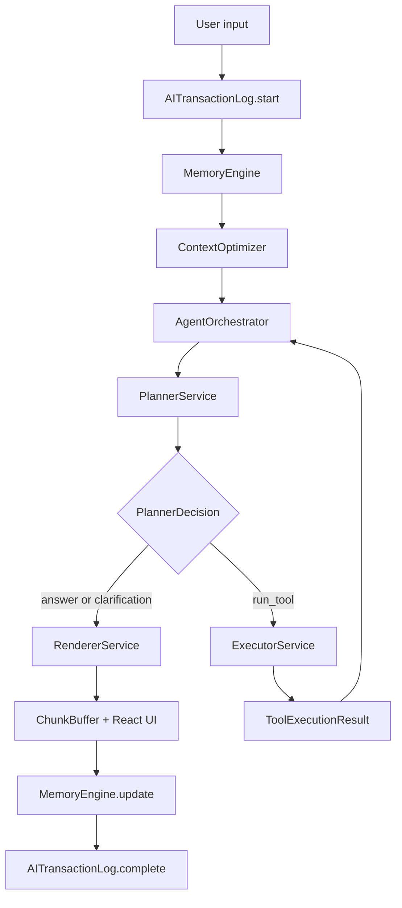

# NowPilot — Product Specification v0.1c (Standalone)

**Document ID:** `PRODUCT_SPEC_v0_1c_FINAL.md`
**Status:** Canonical, standalone implementation reference
**Date:** 2026-07-01
**Scope:** NowPilot v0.1 — Chrome MV3 Side Panel AI Assistant with add-on architecture

**Purpose:** This document is the single, self-contained product specification for NowPilot v0.1. It does not reference any prior document. Any AI coding agent implementing this spec must treat this file as authoritative and complete.

**Target implementation agents:** Anthropic Claude Haiku, Google Gemini Flash, DeepSeek Flash, or equivalent cost-effective coding models.
**Target runtime providers:** Claude Haiku, Gemini Flash, DeepSeek Flash, Ollama, LM Studio, OpenAI-compatible endpoints, OpenAI, Anthropic, Gemini.
**Primary application:** Chrome MV3 Side Panel AI Assistant using WXT + React + TypeScript + Tailwind CSS v4 + shadcn/ui + Tweakcn tokens.

---

## How to Read This Specification

Read in this exact order:

1. §0 — Hard Rules
2. §1 — Cost-Effective Runtime AI Architecture
3. §2 — Context-Adaptive Execution
4. §3 — Persistent Memory Architecture
5. §4 — AI/MCP Transaction Logging
6. §5 — WXT / MV3 / Styling / Isolation
7. §6 — Executive Summary & Scope
8. §7 — Technology Stack
9. §8 — Architecture Design
10. §9 — Feature Specification
11. §10 — AI & MCP Integration
12. §11 — Critical User Flows
13. §12 — Component State Matrix
14. §13 — Concurrency Rules
15. §14 — Skills & Tooling Framework
16. §15 — Storage Architecture
17. §16 — Security
18. §17 — UI/UX Requirements
19. §18 — Master Implementation Phases
20. §19 — Runtime Edge Cases and Mitigations
21. §20 — Runtime State Models & Cross-Context Coordination
22. §21 — Data Models
23. §22 — Performance Targets & Algorithms
24. §23 — Key Technology Decisions (ADRs)
25. §24 — Verification Commands
26. Appendices A–L — canonical constants, type registry, and reference implementations

Appendices C through L are **mandatory** reading for any AI coding agent. They contain the exact type schemas and reference implementations that eliminate hallucinated shapes.

---
# §0 — Hard Rules (Non-Negotiable)

These rules apply to every phase, every module, and every AI coding agent.

## §0.1 Read Order and Scope

- Read §§0–5 fully before writing any code.
- Read §§6–17 as background for the feature being implemented.
- Read §§18–24 and the relevant appendix for the current phase.
- Do not implement more than one phase per response unless explicitly requested.

## §0.2 DO NOT Rules

**Codegen safety:**
- **DO NOT** invent file paths. Use only paths in §8 and §18.
- **DO NOT** invent type names. Use Appendix C for every shape.
- **DO NOT** invent tool names. Planner may only select tools from the enum passed by ExecutorService.
- **DO NOT** invent provider IDs. The five valid IDs are `'openai' | 'anthropic' | 'gemini' | 'ollama' | 'openai-compatible'`.
- **DO NOT** invent runtime model names. Resolve `tier: 'haiku' | 'flash'` through Appendix D.

**MV3 / Chrome:**
- **DO NOT** call AI providers, MCP servers, or `EventSource` from the background service worker.
- **DO NOT** open IndexedDB from the background service worker.
- **DO NOT** use `setInterval` in the background service worker. Use `chrome.alarms`.
- **DO NOT** set a custom `User-Agent` header in any `fetch()`.
- **DO NOT** use remote code execution or `eval()`.

**Storage / secrets:**
- **DO NOT** store ServiceNow session tokens or API keys in `chrome.storage.local`. Use `chrome.storage.session` for tokens and AES-GCM-encrypted `chrome.storage.local` for API keys.
- **DO NOT** store conversation message bodies in `chrome.storage.local`. Bodies live in IndexedDB `MemoryDB`.
- **DO NOT** log raw prompt bodies, raw tool inputs/outputs, cookies, clipboard text, ServiceNow raw case body, or API keys by default. All logging goes through `TraceRedactor`.

**UI / DOM:**
- **DO NOT** use `innerHTML`, `dangerouslySetInnerHTML`, or `document.write`.
- **DO NOT** inject CSS into host page globals. All page-injected UI mounts inside a Shadow DOM using `adoptedStyleSheets`.
- **DO NOT** use `setTimeout`/`setInterval` for DOM polling in content scripts. Use `MutationObserver`.
- **DO NOT** manipulate host page DOM from core modules. Only add-ons may render injected UI, and only inside Shadow DOM.

**AI orchestration:**
- **DO NOT** let the LLM execute tools directly. `PlannerService` may request tools; `ExecutorService` validates and runs them.
- **DO NOT** use large-model agent loops (`maxSteps=15`) for Haiku/Gemini Flash/DeepSeek Flash. Use the tier caps in §1.4.
- **DO NOT** use raw full history in prompts. All prompts pass through `ContextOptimizer`.

**Package hygiene:**
- **DO NOT** install `@anthropic-ai/sdk`, `openai`, or `@google/generative-ai` directly. Use `@ai-sdk/*` adapters only.
- **DO NOT** install `framer-motion`. The correct package is `motion` (Framer Motion v12); import from `motion/react`.
- **DO NOT** use `ulid` or `uuid`. Use native `crypto.randomUUID()`.

**Layering:**
- **DO NOT** import from `src/addons/**` inside `src/core/**`.
- **DO NOT** put ServiceNow-specific token names (`JSESSIONID`, `sysparmCK`, `g_ck`) or DOM selectors in core. They live only in `src/addons/servicenow/**`.

**Cross-context messaging:**
- **DO NOT** send a cross-context message without a `RuntimeEnvelope<T>` (Appendix C, Appendix E).
- **DO NOT** paraphrase canonical strings or prompts. Use `STR` (Appendix B) and `PROMPTS` (Appendix A) verbatim.

## §0.3 Implementation Constraints for Low-Cost Coding Agents

- Every public module boundary must have a Zod schema and at least one fixture test.
- Every phase must define a real npm script under `verify:phase-N`.
- Every module marked `@implementation-tier: sonnet-class` must be stubbed by Haiku/Flash implementers, not written.
- Every catch block must call `debugLog(code, message, context)`. Empty catches are forbidden.

## §0.4 Canonical Runtime Concepts

| Concept | File | Purpose |
|---|---|---|
| `PlannerService` | `src/core/ai/PlannerService.ts` | Cheap JSON-only action planner |
| `ExecutorService` | `src/core/ai/ExecutorService.ts` | Deterministic MCP/skill/built-in tool executor |
| `RendererService` | `src/core/ai/RendererService.ts` | Final concise response renderer |
| `AgentOrchestrator` | `src/core/ai/AgentOrchestrator.ts` | Planner → Executor loop with tier caps (Appendix I) |
| `ProviderRouter` | `src/core/ai/ProviderRouter.ts` | Provider selection, retry, fallback, circuit breaker |
| `TierResolver` | `src/core/ai/TierResolver.ts` | Maps `haiku`/`flash` tier → concrete `(providerId, model)` (Appendix D) |
| `PromptCacheManager` | `src/core/ai/PromptCacheManager.ts` | Prompt cache segmentation and provider hints |
| `PromptCacheAdapter` | `src/core/ai/PromptCacheAdapter.ts` | Per-provider cache-hint transformation (Appendix K) |
| `StructuredOutput` | `src/core/ai/StructuredOutput.ts` | JSON mode + schema validation + one-shot repair (Appendix L) |
| `ChunkBuffer` | `src/core/ai/ChunkBuffer.ts` | rAF-batched streaming UI buffer (Appendix J) |
| `ModelContextTier` | `src/core/context/ModelContextTier.ts` | tiny/small/medium/large classification |
| `ContextOptimizer` | `src/core/context/ContextOptimizer.ts` | Dynamic token budget, compression, degradation |
| `ContextCompressor` | `src/core/context/ContextCompressor.ts` | Structured text/page/case/history compression |
| `MemoryEngine` | `src/core/memory/MemoryEngine.ts` | System-owned memory orchestration |
| `ConversationMemoryStore` | `src/core/memory/ConversationMemoryStore.ts` | Per-conversation summary + recent turns |
| `UserMemoryStore` | `src/core/memory/UserMemoryStore.ts` | Cross-session fact/preference/pattern memory |
| `PreferenceMemoryStore` | `src/core/memory/PreferenceMemoryStore.ts` | User behavioural preferences |
| `AITransactionLog` | `src/core/telemetry/AITransactionLog.ts` | AI/MCP/tool/provider operation trace |
| `AITransactionLogDB` | `src/core/telemetry/AITransactionLogDB.ts` | IndexedDB trace persistence |
| `TraceRedactor` | `src/core/telemetry/TraceRedactor.ts` | Redaction before logs/UI/export |
| `WriteJournal` | `src/core/storage/WriteJournal.ts` | Multi-store consistency (metadata + IndexedDB body) |
| `IndexedDBMigrator` | `src/core/storage/IndexedDBMigrator.ts` | Versioned migrations |
| `DiagnosticsPanel` | `src/components/tools/DiagnosticsPanel.tsx` | Tools → Diagnostics UI |

---
# §1 — Cost-Effective Runtime AI Architecture

## §1.1 Runtime Design Principle

NowPilot must assume the active runtime model may be cheap, fast, weaker at reasoning, small-context, local, or configured as the user's only provider. The system must not rely on the model to remember, decide tool safety, or preserve state.

Runtime AI uses:

```text
PlannerService → ExecutorService → RendererService
```

with a bounded loop between Planner and Executor as defined in §1.4 and Appendix I.

## §1.2 Planner → Executor → Renderer Flow



### PlannerService

Planner returns exactly one of the following, validated by Zod:

```ts
export const PlannerDecisionSchema = z.discriminatedUnion('action', [
  z.object({ action: z.literal('answer'), reasonCode: z.string().max(64) }),
  z.object({
    action: z.literal('run_tool'),
    toolName: z.string().max(64),   // ExecutorService supplies a closed z.enum at request time
    input: z.unknown(),
  }),
  z.object({ action: z.literal('ask_clarification'), question: z.string().max(200) }),
]);
```

Rules:
- Use `haiku` tier where available (Appendix D).
- Return JSON only. Do not explain reasoning.
- Timeout: 3 seconds.
- One malformed-JSON repair retry only (Appendix L).
- If planner fails twice: fallback to `{ action: 'answer', reasonCode: 'planner_failed' }`.
- ExecutorService **must** narrow `toolName` to a closed `z.enum` derived from the currently registered tools before passing the schema to the model.

### ExecutorService

Deterministic. It must:
- reject unknown tool names,
- validate input against the tool's Zod schema,
- check permission policy,
- check model/context-tier capability,
- run the tool with timeout,
- validate output against the tool's Zod output schema,
- return `ToolExecutionResult<T>`.

The LLM never executes tools directly.

### RendererService

Renderer converts validated context and tool output into a concise answer.

Rules:
- Use `flash` tier where available (Appendix D).
- Do not invent missing tool results.
- Use structured output for cards/tables/checklists.
- Timeout: 5 seconds for normal answers.
- Max normal output: 512 tokens unless the feature overrides.

## §1.3 Prompt Shape and Prompt Caching

Every AI call uses this canonical section order:

```text
[SYSTEM: cached, canonical]
[TOOL SCHEMAS: cached, canonical]
[USER PREFERENCES: compact]
[MEMORY: compact top-k]
[CONTEXT: optimized]
[TASK: small]
[USER INPUT: current turn]
```

Rules:
- Stable sections must be byte-identical across repeated calls where possible.
- Tool schemas must be sorted by stable tool name.
- Whitespace in cached sections must be stable.
- Current user input and in-flight assistant output are never cached.
- Prompt cache hits/misses are logged in `AITransactionLog`.

Provider-specific cache behaviour is implemented in `PromptCacheAdapter` — see Appendix K.

## §1.4 Agent Step Limits

| Context tier | Max planner calls | Max tool calls | MCP chaining | Agent mode |
|---|---:|---:|---|---|
| `tiny` ≤4K | 1 | 1 | Disabled | Minimal mode only |
| `small` 8K–16K | 2 | 1 | Disabled by default | Single-tool task |
| `medium` 32K–128K | 3 | 2 | Enabled | Limited agent |
| `large` ≥200K | 5 | 3 | Enabled | Full agent |

The `AgentOrchestrator` (Appendix I) is the only module allowed to enforce these caps.

## §1.5 Provider Routing and Fallback

`ProviderRouter` selects providers using cost, latency, reliability, privacy mode, configured priority, and provider availability.

Fallback rules:
- If only one provider exists, retry once only for retryable pre-first-token failures.
- Do not silently switch from local to cloud when `allowCloudFallbackFromLocal=false`.
- Never switch provider after `hasStreamedFirstToken === true`.
- Record every attempt in `AITransactionLog`.

State that `ProviderRouter` must track per operation:
```ts
interface RouterAttemptState {
  operationId: string;
  attempts: ProviderAttempt[];
  hasStreamedFirstToken: boolean;
  circuitBreakerOpen: Record<ProviderId, number>; // reopen after cool-down ms
}
```

Retry / circuit breaker policy:
- Retryable pre-first-token errors: `TIMEOUT`, `PROVIDER_5XX`, `NETWORK`, `RATE_LIMITED`.
- Non-retryable: `AUTH`, `MODEL_UNKNOWN`, `SCHEMA_INVALID`, `HOST_NOT_PERMITTED`.
- Circuit breaker: after 3 consecutive failures for a provider within 60 s, mark provider open for 5 minutes.

---
# §2 — Context-Adaptive Execution

## §2.1 Model Context Tiers

```ts
export type ModelContextTier = 'tiny' | 'small' | 'medium' | 'large';

export function classifyModelContext(contextWindow: number): ModelContextTier {
  if (contextWindow <= 4096)   return 'tiny';
  if (contextWindow <= 16384)  return 'small';
  if (contextWindow <= 131072) return 'medium';
  return 'large';
}
```

| Tier | Context window | Typical provider | Runtime strategy |
|---|---:|---|---|
| `tiny` | ≤4K | default local model | Minimal mode, one tool max |
| `small` | 8K–16K | tuned local model | Summary + last few turns |
| `medium` | 32K–128K | strong local/cloud model | Balanced context |
| `large` | ≥200K | large cloud Flash/Haiku class | Full context with caching |

## §2.2 Token Budget Formula

```ts
inputBudget  = floor(modelContextWindow * 0.70)
outputBudget = floor(modelContextWindow * 0.20)
safetyMargin = floor(modelContextWindow * 0.10)
```

Dynamic distribution:

| Tier | System | Tools | Memory | Context | History | User |
|---|---:|---:|---:|---:|---:|---:|
| `tiny`   | 15% | 20% | 10% | 20% | 15% | 20% |
| `small`  | 10% | 15% | 10% | 25% | 20% | 20% |
| `medium` |  8% | 12% | 10% | 30% | 25% | 15% |
| `large`  |  5% | 10% | 10% | 35% | 25% | 15% |

Token counting rule: use the provider-native counter when the SDK exposes it; else fall back to `Math.ceil(text.length / 4)` for English and `Math.ceil(text.length / 3)` for CJK.

## §2.3 ContextOptimizer Contract

```ts
export interface ContextOptimizerInput {
  operationId: string;
  model: string;
  modelContextWindow: number;
  userInput: string;
  conversationId: string;
  pageContext?: PageContext;               // Appendix C
  selectedToolSchemas: ToolSchemaRef[];    // Appendix C
  memoryHints: RetrievedMemory[];          // Appendix C
  preferences: UserPreferences;
}

export interface OptimizedContext {
  tier: ModelContextTier;
  inputBudget: number;
  outputBudget: number;
  sections: PromptSection[];               // Appendix C
  provenance: ContextProvenanceManifest;
  minimalMode: boolean;
}
```

Direct prompt assembly in React components is forbidden. All AI calls must consume an `OptimizedContext`.

## §2.4 Degradation Pipeline

When estimated tokens exceed budget:
1. Drop debug-only context.
2. Drop secondary notes and optional metadata.
3. Summarise older history.
4. Compress page/case context into structured fields.
5. Trim tool schemas to the tools currently in scope.
6. Reduce memory injection top-k.
7. Enter minimal mode.
8. If still too large, return a typed `CONTEXT_TOO_LARGE` error with a user-facing explanation.

## §2.5 Minimal Mode

Mandatory for `tiny` models.

Allowed:
- compact system prompt,
- compact preference profile,
- top 3 user memories,
- conversation summary ≤ 200 tokens,
- last 1–2 turns,
- at most one safe tool schema.

Blocked:
- multi-step agent,
- MCP chaining,
- CodeSearchSkill,
- full note-graph injection,
- large research synthesis.

## §2.6 Context Provenance Manifest

Every `OptimizedContext` carries a manifest recording where each section came from so `PromptInspector` can display provenance without the raw body.

```ts
export interface ContextProvenanceManifest {
  sections: Array<{
    kind: 'system' | 'tool_schemas' | 'preferences' | 'memory' | 'context' | 'task' | 'user_input';
    sourceId: string;    // e.g. 'note:abc123', 'tab:42', 'summary:convo-9'
    tokens: number;
    truncated: boolean;
    compressionApplied?: 'summarise' | 'structural' | 'topk';
  }>;
  totalTokens: number;
  minimalMode: boolean;
}
```

---
# §3 — Persistent Memory Architecture

## §3.1 Memory Principle

Memory is system-owned. The LLM does not own persistent memory. Three layers:

```text
Conversation memory  → continuity inside one conversation
User memory          → durable cross-session facts / preferences / patterns
Preference memory    → behavioural settings and response style
```

## §3.2 Recommended Framework Choice

```text
Zustand       → runtime/UI state
IndexedDB/idb → persistent large memory bodies
MiniSearch    → local full-text retrieval
MemoryEngine  → orchestration, scoring, summarisation, injection
```

Do **not** use LangChain, LlamaIndex, MemGPT, remote vector DBs, or embedding downloads in v0.1c.

## §3.3 Conversation Memory

```ts
export interface ConversationMemory {
  conversationId: string;
  summary: string;
  summaryTokens: number;
  lastMessages: Array<{
    role: 'user' | 'assistant' | 'tool';
    content: string;
    tokens: number;
    timestamp: number;
  }>;
  updatedAt: number;
}
```

Rules:
- Keep last 2 turns for `tiny`.
- Keep last 4 turns for `small`.
- Keep last 6 turns for `medium`/`large`.
- Summarise older messages after every 12 messages.
- Store message bodies in IndexedDB only.

## §3.4 User Memory

```ts
export interface UserMemoryFact {
  id: string;
  content: string;
  type: 'fact' | 'preference' | 'pattern';
  tags: string[];
  confidence: number;         // 0..1
  source: 'explicit' | 'inferred' | 'system';
  createdAt: number;
  updatedAt: number;
  lastUsedAt?: number;
  useCount: number;
}
```

Retrieval scoring — every sub-score must be normalised to `[0, 1]`:

```text
keywordScore   = matchedQueryTerms / totalQueryTerms
tagScore       = matchedTags / max(1, memoryTags.length)
recencyScore   = clamp(1 - (now - updatedAt) / (30 * DAY), 0, 1)
useCountScore  = min(1, useCount / 20)
confidenceScore = confidence

score = keywordScore   * 0.45
      + tagScore       * 0.25
      + recencyScore   * 0.15
      + useCountScore  * 0.10
      + confidenceScore* 0.05
```

Injection rules:
- top 5 memories maximum,
- top 3 memories maximum in tiny mode,
- total memory injection ≤ 1000 tokens,
- never inject secrets or raw customer data.

## §3.5 Preference Memory

```ts
export interface UserPreferences {
  responseStyle: 'concise' | 'balanced' | 'detailed';
  preferredLanguage: string;
  preferStructuredOutput: boolean;
  allowCloudFallbackFromLocal: boolean;
  defaultProviderId?: ProviderId;
  toolAutonomy: 'ask_every_time' | 'allow_safe_tools' | 'manual_only';
}
```

Preferences are injected as compact JSON, not verbose prose.

---
# §4 — AI/MCP Transaction Logging and Diagnostics

## §4.1 Purpose

Every AI, MCP, skill, tool, context, cache, fallback, and provider operation must be traceable for troubleshooting.

`AITransactionLog` tracks:
- operation ID,
- provider/model,
- prompt token breakdown,
- context tier,
- truncation/compression decisions,
- prompt-cache hit/miss/write,
- MCP/tool calls,
- permission decisions,
- retries/fallbacks,
- errors,
- first-token timing,
- total duration.

## §4.2 Storage and Retention

| Mode | Enabled | Raw prompt/body | Retention |
|---|---|---|---|
| Lightweight metadata | Always | No | Last 200 transactions or 14 days |
| Debug deep trace | User opt-in | Redacted previews only | Last 50 traces or 72 hours |

## §4.3 Core Trace Types

```ts
export interface AITransaction {
  id: string;
  sessionId?: string;
  conversationId?: string;
  userTurnId?: string;
  type: 'chat' | 'planner' | 'renderer' | 'structured_output'
      | 'mcp_tool' | 'builtin_tool' | 'skill' | 'proxy_fetch';
  status: 'started' | 'streaming' | 'waiting_for_permission'
        | 'completed' | 'failed' | 'aborted' | 'retried' | 'fallback_used';
  providerId?: ProviderId;
  model?: string;
  startedAt: number;
  endedAt?: number;
  durationMs?: number;
  errorCode?: string;
}

export interface PromptTrace {
  operationId: string;
  promptTemplateId: string;
  promptHash: string;
  systemTokens: number;
  toolSchemaTokens: number;
  contextTokens: number;
  memoryTokens: number;
  historyTokens: number;
  userInputTokens: number;
  totalInputTokens: number;
  maxContextWindow: number;
  contextTier: ModelContextTier;
  truncated: boolean;
  truncatedSources: string[];
  minimalMode: boolean;
  promptCache: {
    enabled: boolean;
    cacheKey?: string;
    hit: boolean;
    write: boolean;
    providerCacheId?: string;
    estimatedSavedTokens?: number;
  };
}

export interface ToolTrace {
  operationId: string;
  parentOperationId?: string;
  toolName: string;
  source: 'mcp' | 'builtin' | 'skill' | 'servicenow';
  dangerous: boolean;
  permission: {
    required: boolean;
    decision: 'allowed_once' | 'allowed_always' | 'denied' | 'not_required';
    decidedAt?: number;
  };
  inputSchemaHash: string;
  inputSizeBytes: number;
  outputSchemaHash?: string;
  outputSizeBytes?: number;
  outputTokens?: number;
  status: 'started' | 'completed' | 'failed' | 'timeout' | 'aborted';
  startedAt: number;
  endedAt?: number;
  durationMs?: number;
  error?: { code: string; message: string; retryable: boolean };
}

export interface ProviderTrace {
  operationId: string;
  attempts: Array<{
    providerId: ProviderId;
    model: string;
    startedAt: number;
    endedAt?: number;
    firstTokenAt?: number;
    outcome: 'success' | 'retry' | 'fallback' | 'failed';
    errorCode?: string;
  }>;
  circuitBreakerTriggered: boolean;
}
```

## §4.4 Redaction Rules

`TraceRedactor` must redact before persistence, UI display, console logging, or export:

```text
API keys
Bearer tokens
JSESSIONID
sysparm_ck
g_ck
ServiceNow raw case body
clipboard text unless explicitly user-provided
MCP auth headers
raw prompt body by default
raw tool input/output by default
```

Required patterns:

```ts
const REDACTION_PATTERNS = [
  /sk-[A-Za-z0-9_-]+/g,
  /key-[A-Za-z0-9_-]+/g,
  /Bearer\s+[A-Za-z0-9._-]+/gi,
  /JSESSIONID=[^;\s]+/gi,
  /sysparm_ck[=:]\s*[^&\s]+/gi,
  /g_ck[=:]\s*[^&\s]+/gi,
];
```

## §4.5 Diagnostics UI

`Tools → Diagnostics` (`src/components/tools/DiagnosticsPanel.tsx`) surfaces:

- Recent AI Transactions
- Provider Attempts
- MCP Tool Calls
- Prompt Cache Stats
- Context Budget Viewer
- Memory Retrieval Viewer
- Failed Operations
- Export Debug Bundle
- Copy Operation ID
- Copy Redacted Trace

---
# §5 — WXT, MV3, Styling, and Isolation

## §5.1 Canonical WXT Entry Points

```text
src/entrypoints/background.ts
src/entrypoints/sidepanel/index.html
src/entrypoints/sidepanel/main.tsx
src/entrypoints/content/core.content.ts
src/entrypoints/popup/App.tsx
```

Background owns: `chrome.sidePanel.setPanelBehavior`, context menus, `PROXY_FETCH`, cookies, alarms, router startup.

Side Panel owns: AI streaming, MCP runtime, ProviderRouter, PromptCacheManager, ContextOptimizer, MemoryEngine, AITransactionLog, IndexedDB.

Canonical WXT background entrypoint (mandatory shape):
```ts
// src/entrypoints/background.ts
export default defineBackground({
  type: 'module',
  persistent: false,
  main() {
    BackgroundRouter.register();
    LifecycleManager.register();
    KeepAliveManager.register();
    ContextMenuHost.recreateAll();
  },
});
```

Canonical content-script entrypoint:
```ts
// src/entrypoints/content/core.content.ts
export default defineContentScript({
  matches: ['<all_urls>'],
  runAt: 'document_idle',
  cssInjectionMode: 'ui',   // required for Shadow DOM + adoptedStyleSheets
  world: 'ISOLATED',
  async main(ctx) {
    ctx.addEventListener(window, 'wxt:locationchange', onSpaNav);
    await ContentScriptHost.mount(ctx);
  },
});
```

Complete `wxt.config.ts` — see **Appendix G**.

## §5.2 Background Service Worker Rules

- Register listeners synchronously at module load.
- Recreate alarms and context menus on every startup.
- Never run LLM or MCP streams in the SW.
- Use `Promise.race` plus `AbortController` for every async fetch.
- `PROXY_FETCH` timeout is 25 seconds unless a feature-specific timeout is lower.
- Side-panel LLM stream continues independent of SW restart.

## §5.3 Side Panel Opening

- Use `chrome.sidePanel.setPanelBehavior({ openPanelOnActionClick: true })` in `LifecycleManager.onInstalled` and `onStartup`.
- Use `chrome.sidePanel.open({ tabId })` **only inside a user gesture** — action click or `contextMenus.onClicked`.
- The Side Panel is global per browser window; URL-specific navigation is filtered by `SidePanelPageRegistry`.

## §5.4 Styling Isolation

Two CSS entry points are mandatory:

- **Side panel** (`src/entrypoints/sidepanel/main.css`) — full Tailwind including preflight, `@theme` mapping to `--np-*` tokens.
- **Shadow DOM injected UI** (`src/entrypoints/content/shadow.css`) — Tailwind theme + utilities layers only, **preflight OFF**, tokens defined on `:host`.

```css
/* src/entrypoints/sidepanel/main.css */
@import 'tailwindcss';
@import './theme-tweakcn.css';

/* src/entrypoints/content/shadow.css */
@layer theme, base, components, utilities;
@import 'tailwindcss/theme.css' layer(theme);
@import 'tailwindcss/utilities.css' layer(utilities);
@import './theme-tweakcn.css';
@custom-variant dark (&:where(:host(.dark), :host(.dark) *));
```

Injected UI rules:
- Must mount inside Shadow DOM using `mountShadow()` — see **Appendix H**.
- Must use `adoptedStyleSheets` (not `<style>` tags in the host page).
- Must bridge Tweakcn variables onto `:host` via `buildTokenSheet()` — see **Appendix H**.
- Must pass Radix portal `container={portalHost}` via `PortalHostContext` — see **Appendix H**.
- Must not inject CSS into host page globals.

Radix / shadcn portals: every wrapped shadcn primitive lives under `src/components/ui-shadow/` and reads `PortalHostContext`. Never import shadcn primitives directly into content-script UI.

Tweakcn HSL variables map 1:1 onto shadcn tokens under the `--np-` prefix — see **Appendix F**.

---
# §6 — Executive Summary & Scope

## §6.1 What NowPilot Is

NowPilot is a privacy-first, extensible Chrome Side Panel AI assistant. It provides:
- AI chat with streaming and abort,
- atomic note-taking with wikilinks and a note graph,
- agent workflows with tool-calling,
- prompt templates and slash commands,
- a personal knowledge layer.

Everything runs locally against user-configured AI providers. No data leaves the user's machine unless they explicitly configure a cloud provider.

## §6.2 Architecture Separation

- **Core layer** — AI providers, storage, messaging, context pipeline, agent orchestration, MCP client, memory, transaction logging.
- **Add-on layer** — site-specific page injection, extraction, skills. The ServiceNow add-on ships as the first-party add-on.

Core never knows about specific websites. Add-ons never bypass core APIs.

## §6.3 Design Principles

- Privacy by default: local providers (Ollama, LM Studio) are first-class.
- Extensible via add-ons: core is domain-agnostic.
- Cost-effective by design: every prompt goes through `ContextOptimizer` and the Planner→Executor→Renderer pipeline.
- Offline-capable: the extension works with local models only.

## §6.4 Scope Fences

In scope for v0.1c:
- Side panel shell, chat, notes, agent, tools, first-run onboarding.
- 5 provider adapters.
- Persistent memory (conversation + user + preference).
- 12 built-in MCP tools + external MCP client.
- ServiceNow add-on.
- Data export/import.
- Prompt inspector and diagnostics.

Out of scope for v0.1c (deferred to v0.5):
- PDF chat.
- Global internet-search page (replaced by ResearchSkill global add-on).
- Embedding-based search (bag-of-words + MiniSearch is sufficient).
- Snippet/template productivity suite.

---
# §7 — Technology Stack

### §7.1 Extension Framework

| Package | Version | Purpose |
|---|---|---|
| `wxt` | ^0.19 | MV3 scaffold, HMR, manifest generation |
| `@wxt-dev/module-react` | ^0.3 | React integration |

### §7.2 UI

| Package | Version | Purpose |
|---|---|---|
| `react` / `react-dom` | ^19 | UI framework |
| `tailwindcss` | ^4 | CSS with `@theme` config, no `tailwind.config.ts` |
| `@tailwindcss/vite` | ^4 | Vite integration required for Tailwind v4 + WXT |
| `shadcn/ui` | CLI only | Copy-paste primitives |
| `@radix-ui/react-*` | varies | Accessible primitives |
| `lucide-react` | ^0.400 | Icons |
| `motion` | ^12 | Framer Motion v12; import from `motion/react`. **Do not install `framer-motion`.** |
| `class-variance-authority` | ^0.7 | shadcn variant helper |
| `clsx`, `tailwind-merge` | ^2 | Class utilities |

### §7.3 State

| Package | Version | Purpose |
|---|---|---|
| `zustand` | ^5 | Global side-panel store |
| `immer` | ^10 | Immutable state updates |

### §7.4 AI & Workflow

| Package | Version | Purpose |
|---|---|---|
| `ai` | ^4 | Vercel AI SDK: `streamText`, tool calling, abort |
| `@ai-sdk/openai` | ^1 | OpenAI + Ollama + OpenAI-compatible endpoints |
| `@ai-sdk/anthropic` | ^1 | Anthropic Claude |
| `@ai-sdk/google` | ^1 | Google Gemini |
| `@modelcontextprotocol/sdk` | ^1 | MCP client — StreamableHTTP transport |
| `zod` | ^3 | Boundary validation |
| `zod-to-json-schema` | ^3 | Zod → JSON Schema for tool definitions |

### §7.5 Storage

| Package | Version | Purpose |
|---|---|---|
| `idb` | ^8 | Typed IndexedDB wrapper |

### §7.6 Extraction & Text

| Package | Version | Purpose |
|---|---|---|
| `@mozilla/readability` | ^0.5 | Article extraction |
| `turndown` | ^7 | HTML → Markdown |
| `dompurify` | ^3 | XSS sanitisation |

### §7.7 Markdown

| Package | Version | Purpose |
|---|---|---|
| `react-markdown` | ^9 | Safe markdown renderer |
| `remark-gfm` | ^4 | GitHub-flavoured markdown |
| `rehype-highlight` | ^7 | Code block highlighting |
| `highlight.js` | ^11 | Highlighter |
| `katex` | ^0.16 | Math rendering |

### §7.8 Search & Data

| Package | Version | Purpose |
|---|---|---|
| `minisearch` | ^7 | Local full-text search |
| `d3-force` | ^3 | Note graph layout |
| `fflate` | ^0.8 | ZIP export |
| `papaparse` | ^5 | CSV parsing |

### §7.9 Security & Testing & DX

| Item | Purpose |
|---|---|
| `crypto.subtle` (native) | AES-GCM encryption |
| `crypto.randomUUID()` (native) | ID generation |
| `vitest`, `@testing-library/react`, `jsdom`, `msw` | Testing |
| `typescript` ≥5.5, `strict: true` | Type safety |
| `eslint`, `prettier` | Linting / formatting |

---
# §8 — Architecture Design

## §8.1 Extension Contexts

```
Chrome Browser
├── Background Service Worker (background.ts)                 [ephemeral]
│   ├── BackgroundRouter          typed chrome.runtime.onMessage dispatcher
│   ├── LifecycleManager          onInstalled, onStartup
│   ├── KeepAliveManager          chrome.alarms + panel ping
│   ├── ContextMenuHost           chrome.contextMenus registration
│   ├── CookieSessionStore        generic chrome.cookies + storage.session
│   └── CORSProxy                 PROXY_FETCH (§10.6)
│
├── Side Panel (sidepanel/main.tsx)                           [persistent while open]
│   ├── ProviderRegistry / ProviderRouter / TierResolver
│   ├── AgentOrchestrator + PlannerService + ExecutorService + RendererService
│   ├── MCPClient + MCPRegistry + NowPilotMainServer (12 tools)
│   ├── ContextOptimizer + ContextCompressor + ContextPack
│   ├── MemoryEngine + Conversation/User/PreferenceMemoryStore
│   ├── AITransactionLog + AITransactionLogDB + TraceRedactor
│   ├── StorageLayer (ChatHistoryDB, NotesDB, MemoryDB, ErrorStore, WriteJournal)
│   ├── MessageBus (cross-context), EventBus (in-panel), BroadcastBus (windows)
│   └── UI shell: Chat / Note / Agent / Tools
│
├── Content Scripts (per add-on)
│   ├── ContentScriptHost         mounts Shadow DOM
│   ├── SPANavigationWatcher      MutationObserver
│   ├── PageContextBridge         extracted context → side panel
│   ├── ISOLATED world by default
│   └── MAIN world only for domain-specific globals (e.g. window.g_ck)
│
└── Add-ons
    ├── Site-specific  (urlPatterns match)
    └── Global         (all pages)
```

## §8.2 Core vs Add-on Boundary

Core owns:
- AI runtime, MCP, messaging, context, storage, migrations, WriteJournal,
- Chrome API hosts (CORSProxy, ContextMenuHost, TabManager),
- generic session infrastructure (`CookieSessionStore`),
- shared UI (ErrorBoundary, Toast, PortableMarkdown),
- prompt/template/slash engines,
- telemetry, redaction,
- registries (AddonRegistry, EndpointRegistry, KeymapRegistry),
- injection framework (`ContentScriptHost`, `SPANavigationWatcher`, `PageContextBridge`).

Add-ons own:
- site-specific context extraction,
- injected page UI (rendered via Shadow DOM),
- injection rules,
- site-specific skills, prompts, endpoints, session semantics,
- add-on settings, pages, keymaps.

Rules:
- Core MUST NOT import from `src/addons/**`.
- Add-ons MUST NOT bypass `ContentScriptHost`.
- Add-ons MUST NOT manipulate DOM outside their Shadow DOM.

## §8.3 File Structure

```
nowpilot/
├── wxt.config.ts                            # Appendix G
├── src/
│   ├── entrypoints/
│   │   ├── background.ts
│   │   ├── sidepanel/{index.html, main.tsx, main.css}
│   │   ├── content/{core.content.ts, shadow.css}
│   │   └── popup/App.tsx
│   │
│   ├── core/
│   │   ├── ai/
│   │   │   ├── types.ts, PlannerService.ts, ExecutorService.ts, RendererService.ts
│   │   │   ├── AgentOrchestrator.ts, ProviderRouter.ts, TierResolver.ts
│   │   │   ├── PromptCacheManager.ts, PromptCacheAdapter.ts
│   │   │   ├── StructuredOutput.ts, ChunkBuffer.ts, StreamAdapter.ts, toolSchemas.ts
│   │   │   ├── ILLMProvider.ts, ProviderRegistry.ts
│   │   │   └── providers/{OpenAI,Anthropic,Gemini,Ollama,OpenAICompat}Provider.ts
│   │   ├── mcp/{MCPClient.ts, MCPRegistry.ts, mcpToVercelAI.ts, NowPilotMainServer.ts}
│   │   ├── context/
│   │   │   ├── ModelContextTier.ts, TokenBudget.ts, ContextOptimizer.ts
│   │   │   ├── ContextCompressor.ts, ContextPack.ts, ContextProvenanceManifest.ts
│   │   ├── memory/
│   │   │   ├── MemoryEngine.ts, ConversationMemoryStore.ts, UserMemoryStore.ts
│   │   │   ├── PreferenceMemoryStore.ts, MemoryScorer.ts, MemoryExtractor.ts
│   │   ├── telemetry/
│   │   │   ├── AITransactionLog.ts, AITransactionLogDB.ts, TraceRedactor.ts
│   │   │   └── PromptInspector.ts, TokenLedger.ts
│   │   ├── storage/
│   │   │   ├── Setting.ts, EncryptedStorage.ts, WriteJournal.ts, IndexedDBMigrator.ts
│   │   │   ├── ChatHistoryDB.ts, NotesDB.ts, MemoryDB.ts, ErrorStore.ts
│   │   ├── security/{KeyVault.ts, redactSensitive.ts}
│   │   ├── runtime/{RuntimeEnvelope.ts, OperationId.ts, BroadcastBus.ts, PortReader.ts, workerState.ts}
│   │   ├── messaging/{MessageBus.ts}
│   │   ├── events/{EventBus.ts}
│   │   ├── content/{ContentScriptHost.ts, SPANavigationWatcher.ts, PageContextBridge.ts, mountShadow.ts, buildTokenSheet.ts, loadSharedSheet.ts}
│   │   ├── chrome/{CookieSessionStore.ts, CORSProxy.ts, ContextMenuHost.ts, TabManager.ts, NotificationsManager.ts, OmniboxHandler.ts, ClipboardHelper.ts, Scheduler.ts}
│   │   ├── prompts/{PromptManager.ts, TemplateEngine.ts, builtinTemplates.ts, index.ts}
│   │   ├── slash/SlashCommandRegistry.ts
│   │   ├── search/MiniSearchIndex.ts
│   │   ├── notes/{NoteGraph.ts, LinkParser.ts, noteExpander.ts}
│   │   ├── extraction/{IContentStrategy.ts, ContentExtractor.ts, DefaultWebPageStrategy.ts}
│   │   ├── output/{StructuredOutputRenderer.ts, OutputFormatter.ts}
│   │   ├── webhooks/WebhookManager.ts
│   │   ├── data/DataPortability.ts
│   │   ├── insights/InsightEngine.ts
│   │   ├── http/Requester.ts
│   │   ├── registry/{AddonRegistry.ts, Registry.ts, AddonSettingsStore.ts, SidePanelPageRegistry.ts}
│   │   ├── input/KeymapRegistry.ts
│   │   ├── speech/SpeechSynthesisService.ts
│   │   ├── utils/RateLimiter.ts
│   │   ├── config/{endpoints.ts, EndpointRegistry.ts, FeatureFlags.ts, localModelCapabilities.ts}
│   │   ├── log/debugLog.ts
│   │   ├── i18n/strings.ts
│   │   └── components/{ErrorBoundary.tsx, Toast.tsx, PortableMarkdown.tsx}
│   │
│   ├── addons/
│   │   ├── global/{SelectionContextMenu.ts, ResearchSkill.ts}
│   │   └── servicenow/
│   │       ├── index.ts
│   │       ├── auth/ServiceNowSessionAdapter.ts
│   │       ├── config/serviceNowEndpoints.ts
│   │       ├── content/{tokenBridge.ts, pageExtractor.ts, serviceNowInjection.ts}
│   │       ├── lib/SNowTableClient.ts
│   │       ├── skills/{CaseAnalyzerSkill,CatchUpSkill,SentimentSkill,CodeSearchSkill}.ts
│   │       └── components/CaseInsightBox.tsx
│   │
│   ├── components/
│   │   ├── layout/SidepanelShell.tsx
│   │   ├── pages/{ChatPage,NotePage,AgentPage,ToolsPage}.tsx
│   │   ├── tools/{DiagnosticsPanel.tsx, TransactionTraceView.tsx}
│   │   ├── notes/{BacklinksPanel,WikilinkAutocomplete,NoteGraphView}.tsx
│   │   ├── patterns/{ChatMessage,HistoryListItem,ToolCard,SkillMessageRenderer,SourceCard}.tsx
│   │   ├── ui/               # raw shadcn primitives (side panel only)
│   │   └── ui-shadow/        # portal-aware shadcn wrappers (Shadow DOM only)
│   │
│   ├── hooks/{useChat.ts, useStreamingLLM.ts, useProviderRouter.ts, useMemory.ts, useDiagnostics.ts, useConversations.ts, useAddonContext.ts}
│   └── types/{messages.ts, storage.ts, errors.ts, addon.ts}
│
└── tests/  (see §24)
```

---
# §9 — Feature Specification

## §9.1 Core Features

| Feature | Priority | Notes |
|---|---|---|
| Side panel shell + nav rail | P0 | Chat / Note / Agent / Tools; add-on tabs via `SidePanelPageRegistry` |
| Theme system | P0 | light / dark / auto |
| Feature flags | P0 | `chrome.storage.local.np_flags` |
| First-run onboarding | P0 | Flow 9 |
| Settings page | P0 | Providers, prompts, skills/MCP, data, diagnostics |
| AI chat streaming with abort | P0 | Via `useStreamingLLM` (Appendix J) |
| 5 AI providers | P0 | See §10 |
| Model selector | P0 | Per-provider |
| Chat history | P0 | Sessions, search, star, restore, delete |
| Prompt templates + slash | P1 | `{{variable}}` interpolation |
| `/write` preset | P1 | Slash command; no dedicated page |
| `/ask` preset | P1 | Slash command over pinned-tab/page context |
| Notes with wikilinks | P0 | CRUD, tags, backlinks, graph |
| Note + chat-history search | P1 | Via Cmd+K; MiniSearch backed |
| LLM Wiki | P1 | Suggest links / expand / concepts (user-triggered) |
| Agent mode | P1 | AgentOrchestrator + permission prompts |
| Tab pinning | P1 | Max 10 |
| Selection context menu | P1 | Right-click → Ask AI |
| Research (global tool) | P1 | See §9.3 |
| Structured output renderers | P1 | JSON / table / checklist / report |
| Data export/import | P1 | JSON / ZIP; sanitised (no API keys) |
| Webhook manager | P2 | Outbound POST with retry queue |
| Prompt inspector | P1 | Traces + token usage + cost |
| Insight engine | P2 | Nightly, read-only |
| Personal Knowledge RAG | P1 | MiniSearch + bag-of-words cosine |
| Text-to-speech | P2 | Reads AI responses aloud |
| Keyboard shortcuts | P1 | `KeymapRegistry` + Cmd+K palette |
| Add-on nav tabs | P1 | `SidePanelPageRegistry` |

## §9.2 Add-on Contract

```ts
export interface Addon {
  id: string;
  name: string;
  scope: 'site' | 'global';
  urlPatterns?: string[];               // required when scope === 'site'
  contentScript?: IContentAddon;
  contextExtractor?: IContextExtractor; // Appendix C
  skills?: ISkill[];
  prompts?: PromptTemplate[];
  styles?: string;
  addonSettings?: z.ZodSchema<unknown>;
  pages?: SidePanelPageRegistration[];
  keymap?: KeymapRegistration[];
}

export interface IContentAddon {
  id: string;
  matches: string[];
  mountMode: 'shadow-dom';
  shadowMode?: 'open' | 'closed';       // default: 'closed'
  zIndex?: number;
  shouldInject(ctx: PageContext): boolean;
  render(ctx: PageContext): React.ReactNode;
  onNavigate?(ctx: PageContext): void;
  cleanup?(): void;
}
```

Every add-on module that uses a concept from an external inspiration source **must include a self-contained description in-line**; there are no external `references/` folders in this project.

## §9.3 Research Global Tool

- Lives at `src/addons/global/ResearchSkill.ts`.
- `inputSchema`: `{ query: string; maxSources?: number }`.
- Uses in priority order:
  1. user-connected MCP web-search server via `MCPClient`,
  2. a built-in web-search MCP tool if configured,
  3. graceful failure otherwise — never silently fall back to model-only answers.
- `outputSchema`: `{ answer: string; sources: Array<{ title: string; url: string; snippet: string }> }`.
- Subject to `PermissionGate` and `RateLimiter`.

## §9.4 ServiceNow Add-on Features

| Feature | Priority | Notes |
|---|---|---|
| JSESSIONID extraction | P0 | Via `CookieSessionStore` + `ServiceNowSessionAdapter` |
| sysparmCK extraction | P0 | MAIN-world content script → adapter → CookieSessionStore |
| Case context extraction | P0 | `IContextExtractor` implementation |
| Table API client | P0 | `SNowTableClient` uses `PROXY_FETCH` + `RateLimiter` |
| CaseAnalyzerSkill | P0 | AI analysis of case details |
| CatchUpSkill | P0 | 24h activity digest |
| SentimentSkill | P1 | Case communication sentiment |
| CodeSearchSkill | P1 | Map-reduce over scripts; needs ≥16K context (§14.4) |
| CaseInsightBox | P1 | Shadow DOM panel on case pages |
| Scoped CSS enhancements | P1 | Inside Shadow DOM only |

---
# §10 — AI & MCP Integration

## §10.1 Provider Interface

```ts
// src/core/ai/ILLMProvider.ts
import type { LanguageModel } from 'ai';

export type ProviderId = 'openai' | 'anthropic' | 'gemini' | 'ollama' | 'openai-compatible';

export interface ILLMProvider {
  id: ProviderId;
  name: string;
  chat(messages: LLMMessage[], options: LLMOptions): AsyncIterable<LLMStreamChunk>;
  getModels(): Promise<ModelInfo[]>;
  validateConfig(config: ProviderConfig): Promise<boolean>;
  getAISDKModel(model: string): LanguageModel;
}
```

Types `LLMMessage`, `LLMOptions`, `LLMStreamChunk`, `ModelInfo`, `ProviderConfig` are defined in Appendix C.

## §10.2 Five Provider Implementations

| Provider ID | Adapter | Default baseURL | Supports tools |
|---|---|---|---|
| `openai` | `@ai-sdk/openai` `createOpenAI` | `https://api.openai.com/v1` | Yes |
| `anthropic` | `@ai-sdk/anthropic` `createAnthropic` | `https://api.anthropic.com` | Yes |
| `gemini` | `@ai-sdk/google` `createGoogleGenerativeAI` | Google Cloud | Yes |
| `ollama` | `@ai-sdk/openai` `createOpenAI` | `http://localhost:11434/v1` | Model-dependent |
| `openai-compatible` | `@ai-sdk/openai` `createOpenAI` | user-supplied | Model-dependent |

Ollama: pass `apiKey: 'ollama'`. Default context is 2048 tokens — warn the user (Flow 5).

`ProviderRegistry` computes `resolvedBaseURL = customBaseURL ?? baseURL` once at construction. Providers only read `resolvedBaseURL`.

## §10.3 Provider Config Schema

```ts
export const ProviderConfigSchema = z.object({
  id: z.enum(['openai','anthropic','gemini','ollama','openai-compatible']),
  label: z.string().trim().min(1).max(50),
  apiKey: z.string().optional(),
  baseURL: z.string().url(),
  customBaseURL: z.string().url().optional(),
  models: z.array(z.string().min(1)).min(1).max(10)
           .refine(a => new Set(a).size === a.length, 'models must be unique'),
  contextWindow: z.number().int().min(1024).max(2_000_000),
  supportsTools: z.boolean(),
  enabled: z.boolean(),
  priority: z.number().int().min(0),
  lastValidated: z.number().int().optional(),
});
```

## §10.4 MCP Client

- Lives in the side panel only. Never in the SW.
- Uses `@modelcontextprotocol/sdk` `Client` + `StreamableHTTPClientTransport`.
- Never hand-roll SSE parsing.
- First-time tool call triggers a permission dialog (Flow 2). Allow/deny persisted in `np_mcp_permissions`.
- Dangerous tools always prompt regardless of allow list.

## §10.5 NowPilotMainServer — 12 Built-in Tools

Registered by `MCPRegistry` at startup. Each has a Zod `inputSchema` and a `dangerous` flag.

| # | Tool name | Input | dangerous | Effect |
|---|---|---|---|---|
| 1 | `get-page-content` | `{ tabId?: number }` | no | Active/pinned tab context |
| 2 | `search-notes` | `{ query: string; limit?: number }` | no | MiniSearch over notes |
| 3 | `create-note` | `{ title: string; content: string; tags?: string[] }` | yes | Writes to NotesDB |
| 4 | `get-chat-history` | `{ sessionId?: string; limit?: number }` | no | Recent messages |
| 5 | `pin-tab` | `{ tabId: number }` | no | Pins as context (max 10) |
| 6 | `read-clipboard` | `{}` | no | Reads clipboard |
| 7 | `write-clipboard` | `{ text: string }` | yes | Writes clipboard |
| 8 | `get-provider-info` | `{}` | no | Active provider + model + limits |
| 9 | `run-skill` | `{ skillId: string; input: unknown }` | yes | Runs a registered skill |
| 10 | `list-skills` | `{}` | no | Lists registered skills |
| 11 | `export-data` | `{ scopes: string[] }` | yes | Export bundle (no API keys) |
| 12 | `execute-webhook` | `{ event: string; payload: unknown }` | yes | Fires a webhook |

## §10.6 `endpoints.ts`

```ts
// src/core/config/endpoints.ts — the ONLY place external URLs may appear.
export const ENDPOINTS = {
  openai:    'https://api.openai.com/v1',
  anthropic: 'https://api.anthropic.com',
  gemini:    'https://generativelanguage.googleapis.com',
  ollama:    'http://localhost:11434/v1',
} as const;
```

User overrides live in `chrome.storage.local.np_endpoint_overrides` and are merged at load.

Domain add-ons register their endpoints through `EndpointRegistry`. ServiceNow endpoints live in `src/addons/servicenow/config/serviceNowEndpoints.ts`.

## §10.7 CORSProxy — Generic Cross-Origin Fetch

Runs in the background SW. Message name is generic: `PROXY_FETCH`.

```ts
// src/types/messages.ts
export interface ProxyFetchRequest {
  type: 'PROXY_FETCH';
  addonId: string;
  url: string;
  method: 'GET'|'POST'|'PUT'|'PATCH'|'DELETE';
  headers?: Record<string,string>;   // User-Agent stripped
  body?: string;
  credentials?: 'include' | 'omit';   // default 'include'
}
export interface ProxyFetchResponse {
  ok: boolean; status: number; body: string; error?: string;
}
```

Rules:
1. `BackgroundRouter` validates `sender.id === chrome.runtime.id`.
2. The SW checks `url` host against declared `host_permissions`; unknown host → `{ ok:false, status:0, error:'HOST_NOT_PERMITTED' }`.
3. Wrapped in a 25 s `Promise.race` timeout.
4. Per-add-on `RateLimiter` keyed by `addonId`.
5. Never logs request or response bodies.

---
# §11 — Critical User Flows

These flows are authoritative. When phase tasks conflict with flows, flows win.

## Flow 1 — Send a Chat Message
WHEN: user presses Enter / clicks Send.
IF no provider configured → modal: "Configure an AI provider in Settings first."
ELSE:
1. `useChat` runs slash-check: `input.match(/^\/([a-z-]+)\b\s*(.*)$/s)`. If match and command found → route to handler.
2. Assemble context via `ContextOptimizer` (pinned tabs, current page, notes, history).
3. Call `AgentOrchestrator.runTurn(input, ctx)`.
4. Stream `LLMStreamChunk` through `ChunkBuffer` → render via `PortableMarkdown`.
5. On stream end: append message to `ChatHistoryDB`. On first message of a session, generate a title (Flow 1a). Fire `EventBus.emit('chat:message-saved', { sessionId })`.
6. On provider error: toast `[Retry] [Switch Provider] [Open Settings]`.

## Flow 1a — Title Generation
WHEN: first assistant message of a session completes.
DO:
1. One LLM call using `PROMPTS.titleGen`, `temperature: 0`, `maxTokens: 16`.
2. User content = first user message truncated to 500 chars.
3. On success: `session.title = result.trim().slice(0, 60)`.
4. On error / empty / timeout (3s): `session.title = firstUserMessage.slice(0, 40) + '…'`. Never block save on titling.

## Flow 2 — Tool Call Permission
WHEN: agent requests a tool not in allow list OR any tool with `dangerous: true`.
DO:
1. Pause the stream.
2. Dialog: "NowPilot wants to call `<toolName>`: `<description>`" with `[Allow once]` `[Allow always]`.
3. Allow once → call tool; do not persist.
4. Allow always → persist `{ toolName, allow: true, grantedAt }` in `np_mcp_permissions`; then call. Dangerous tools persist allow but STILL prompt next time.
5. Dismiss → inject `tool_result: { error: 'PERMISSION_DENIED' }`; LLM informs user.
6. Resume stream after result injected.

## Flow 3 — Save a Note with Wikilinks
WHEN: user saves a note containing `[[Some Other Note]]`.
DO:
1. `LinkParser.parseLinks(content)` → `[{ targetTitle, raw }]`.
2. `LinkParser.resolveLinks(targets, allNotes)` matches case-insensitive title → `noteId` or unresolved.
3. Tie-break: multiple notes with same title → link the most recently `updated`; show disambiguation chip.
4. `NotesDB.put(note)` writes `note.links = [resolvedNoteId...]`. Always recomputed.
5. Backlinks never stored — computed at query time via `by-link` index.
6. Fire `EventBus.emit('note:saved', { noteId })`; search index updates async.

## Flow 4 — Tab Pinning
WHEN: user clicks "Pin this tab".
IF `tab.url` starts with `chrome://` / `chrome-extension://` → toast "Cannot pin this page."
DO:
1. `chrome.tabs.query({ active: true, currentWindow: true })`.
2. `chrome.scripting.executeScript({ target:{tabId}, files:['content-script-bundle.js'] })`. 5 s timeout.
3. Send `EXTRACT_PAGE_CONTENT` via `RuntimeEnvelope`.
4. Content script extracts via `DefaultWebPageStrategy` → `TabContext`.
5. `ContextManager.pin(tabId, tabContext)`.
6. Toolbar shows chip. Max 10 → toast "Maximum 10 pinned tabs. Remove one first."

## Flow 5 — Local Model Context Warning
WHEN: user selects an Ollama model.
DO:
1. `validateConfig()` sends a short test request.
2. If reported context window ≤ 4096 tokens → settings warning:
   "Ollama is using a 2048-token context. For 128K, create a Modelfile with `PARAMETER num_ctx 131072`."
3. Provide "Copy Modelfile" button:
   ```
   FROM <model>
   PARAMETER num_ctx 131072
   ```

## Flow 6 — Data Export
WHEN: user clicks "Export data".
DO:
1. Dialog with checkboxes: Notes, Chat history, Memory, Prompts, Settings.
2. Collect from IndexedDB + `chrome.storage.local`.
3. Sanitise: deep-clone settings; `delete` `apiKey` from every `ProviderConfig`. Assert no bundle string matches `/sk-|key-/`.
4. Serialise JSON; if > 1 MB, ZIP with `fflate`.
5. Download via `showSaveFilePicker()` or anchor click.

## Flow 7 — Webhook Fire
WHEN: a registered webhook event occurs.
DO:
1. `WebhookManager.fire(event, payload)`.
2. `POST url` JSON, 5 s timeout.
3. 2xx → done. Fail → retry queue (max 3, backoff 30 s / 5 min / 30 min).
4. Log every attempt in `AITransactionLog` with `type: 'proxy_fetch'`.

## Flow 8 — Keyboard Shortcut
WHEN: user presses a registered combo.
DO:
1. `KeymapRegistry` global `keydown` listener matches.
2. Match → call handler, `preventDefault()`.
3. No match + `Cmd+K` → open command palette (Flow 10).

## Flow 9 — First-Run Onboarding
WHEN: `LifecycleManager.onInstalled` fires OR side panel opens with zero configured providers.
DO:
1. Render `OnboardingModal` over a disabled ChatPage. Step 1: welcome + privacy.
2. Step 2: pick a provider (radio: OpenAI / Anthropic / Gemini / Ollama / OpenAI-compatible).
3. Step 3: enter API key or baseURL. Key is AES-GCM encrypted on save.
4. Step 4: `validateConfig()` → "Testing connection…" → "Connected" or "Connection failed: [error]".
5. On success: persist `ProviderConfig`, `enabled: true`, `priority: 0`; close modal; focus composer.
6. "Skip for now" allowed → ChatPage shows the no-provider modal until configured.

## Flow 10 — Command Palette (Cmd+K)
WHEN: user presses `Cmd+K` (mac) / `Ctrl+K` (win) with no higher-priority match.
DO: open overlay with commands, filter as user types. v0.1 command set:

| Command | Action |
|---|---|
| New chat | Start fresh session |
| Search history | Chat-history search |
| Switch provider | Provider/model selector |
| Open settings | Settings page |
| Toggle theme | light → dark → auto |
| Pin current tab | Runs Flow 4 |
| New note | NotePage in create mode |
| Search notes | Note search |
| Open diagnostics | Tools → Diagnostics |

Plus any add-on shortcuts. Enter runs; Esc closes.

---
# §12 — Component State Matrix

Every page must render these states with these exact strings (from `STR` in Appendix B).

| Component | Loading | Empty | Error | Success |
|---|---|---|---|---|
| ChatPage | "Connecting to provider..." | "Start a conversation" | "Provider error. [Retry] [Switch Provider]" | Message stream visible |
| NotePage | "Loading notes..." | "No notes yet. Press + to create one." | "Failed to load notes. [Retry]" | Note list |
| AgentPage | "Preparing agent..." | "Describe a task and the agent will plan steps" | "Agent error: [message]. [Retry]" | Step progress visible |
| Research (Tools) | "Researching..." | "Enter a research question" | "Research failed: no web-search tool connected. [Open Settings]" | Answer + SourceCards |
| ChatHistoryDB load | Skeleton shimmer | "No conversations yet" | "Failed to load history" | Conversation list |
| MCP tool call | "Calling [toolName]..." | — | "Tool failed: [error]. [Retry tool]" | Tool result card |
| Tab pin | "Extracting page content..." | — | "Cannot pin this page. Try a regular web page." | Page title + remove |
| Provider validation | "Testing connection..." | — | "Connection failed: [error]" | "Connected" |
| Onboarding | "Testing connection..." | — | "Connection failed: [error]" | "Connected" → focus composer |
| DiagnosticsPanel | "Loading diagnostics..." | "No AI transactions yet." | "Failed to load traces" | Transaction list |

---
# §13 — Concurrency and Race-Condition Rules

1. **One stream per session.** `useStreamingLLM` aborts the active stream before starting a new one.
2. **IndexedDB writes are transactions.** Use a single `idb` transaction for stores that must stay consistent.
3. **Background SW fetch wrapped in 25 s `Promise.race`**, returning `{ error: 'TIMEOUT' }`.
4. **Tab context timeout 5 s.** `executeScript` + round-trip must finish in 5 s or cancel.
5. **Abort propagation.** One `AbortController` signal threaded through `AgentOrchestrator`, `PlannerService`, `ExecutorService`, `RendererService`, and every `fetch()`.
6. **Settings writes serialized.** Never write two `Setting<T>` keys concurrently; `await` sequentially.
7. **Memory writes single-writer.** `MemoryEngine` writes only from the primary side panel. Cross-window coordination via `BroadcastBus` primary election with `version` check.
8. **EventBus handlers are synchronous.** Handlers may spawn internal Promises but must never let errors escape.
9. **RateLimiter is per-instance.** Each add-on owns its limiter; never shared.
10. **`hasStreamedFirstToken` per operation.** Once true, `ProviderRouter` must never switch provider.

---
# §14 — Skills & Tooling Framework

## §14.1 Skill Interface

```ts
export interface ISkill {
  id: string;
  name: string;
  description: string;
  requiredContext: (keyof SkillContext)[];
  inputSchema: z.ZodSchema<unknown>;
  outputSchema: z.ZodSchema<unknown>;
  execute(context: SkillContext): AsyncIterable<SkillResult>;
  abort(): void;
}

export interface SkillContext {
  provider: ILLMProvider;
  model: string;
  abortSignal: AbortSignal;
  pageData?: TabContext;
  caseData?: SNowCaseData;
  uploadedFiles?: FileContext[];
  chatHistory?: LLMMessage[];
  noteContext?: NoteContext[];
}

export interface SkillResult {
  type: 'text' | 'structured' | 'card-grid' | 'list' | 'error' | 'action';
  content: string;
  data?: unknown;
  cards?: SkillCard[];
  actions?: SkillAction[];
}
```

## §14.2 Slash Command Parsing

```ts
const m = input.match(/^\/([a-z-]+)\b\s*(.*)$/s);
if (m) {
  const handler = SlashCommandRegistry.get(m[1]);
  if (handler) { handler.execute(m[2]); return; }
}
// No match → LLM verbatim
```

Palette sections: Skills, Templates, Macros, Commands. Triggered by `/` in composer.

## §14.3 Macros (data, not code; no `eval`)

Each step is one of:
- `{ type: 'skill', skillId, input }`
- `{ type: 'mcp', toolName, input }`
- `{ type: 'save-note', titleTemplate }`

`WorkflowRunner` executes sequentially. Step N output is available as `{{step_N_output}}` in step N+1.

## §14.4 CodeSearchSkill Chunking Contract

Marked `@implementation-tier: sonnet-class` — Haiku/Flash implementers must stub with `{ type:'error', content:'CODESEARCH_NEEDS_LARGE_MODEL' }`.

Full implementation shape (for Sonnet-class agents):
1. **Input schema:** `{ query: string; scriptScope?: string; maxResults?: number }`.
2. Fetch candidate scripts via `SNowTableClient`, rate-limited.
3. **Map:** split each script into ≤ 8K-token windows by line boundaries. For each window, one LLM call: "Does this code match `<query>`? Return JSON `{match:boolean, lines:[start,end], reason}`."
4. **Reduce:** collect matches, sort by relevance, cap at `maxResults` (default 20).
5. **Output schema:** `{ matches: Array<{ scriptName: string; lines:[number,number]; snippet: string; reason: string }> }`.
6. Abort: each window call receives `ctx.abortSignal`; reduce halts on abort.
7. **Model gate:** if active model context < 16K → `SkillResult{ type:'error', content:'CODESEARCH_NEEDS_16K_CONTEXT' }`.

---
# §15 — Storage Architecture

## §15.1 Storage Backends

```
chrome.storage.local  (10MB limit)
  np_providers          ProviderConfig[]                     (encrypted apiKey fields)
  np_flags              FeatureFlags
  np_mcp_servers        MCPServerConfig[]
  np_mcp_permissions    Record<toolName,{allow,grantedAt}>
  np_conversation_meta  ConversationMeta[]                   (LRU 10 active + 100 archived)
  np_facts              Fact[]                                (max 500, LRU)
  np_templates          PromptTemplate[]
  np_macros             Macro[]
  np_install_secret     string                               (32 random bytes)
  np_debug_mode         boolean
  np_endpoint_overrides Record<string,string>
  np_keymap             KeymapRegistration[]
  np_addon_<addonId>    unknown                              (AddonSettingsStore)

chrome.storage.session  (cleared on browser close)
  np_jsessionid         string
  np_sysparm_ck         string
  np_token_ttl          number
  np_active_stream      { conversationId, operationId, startedAt }   (SW-restart recovery)

chrome.storage.sync  (≤8KB per key)
  np_theme              'light'|'dark'|'auto'
  np_language           string

IndexedDB  (side panel only)
  ChatHistoryDB
    sessions  { id, title, created, updated, starred, preview }
    messages  { sessionId, role, content, timestamp, metadata }
  NotesDB
    notes     { id, title, content, created, updated, tags[], links[], source, aiMeta, version }
    concepts  { slug, label, summary, noteIds[], aliases[], updatedAt }
  MemoryDB
    messages  { conversationId, seq, role, content, timestamp }   keyPath [conversationId, seq]
    userFacts UserMemoryFact[]
    conversationSummaries { conversationId, summary, updatedAt }
  ErrorStore (debug only, FIFO max 100)
  WriteJournalDB
    entries   WriteJournalEntry[]
  AITransactionLogDB
    transactions AITransaction[]
    promptTraces  PromptTrace[]
    toolTraces    ToolTrace[]
    providerTraces ProviderTrace[]
```

Message bodies never live in `chrome.storage.local`. Splitting metadata (local) from bodies (IndexedDB) is required so the 10 MB ceiling is never breached.

## §15.2 API Key Encryption

```ts
// src/core/storage/EncryptedStorage.ts
// installSecret: 32 random bytes, generated once → np_install_secret
// per-key: random 16-byte salt + 12-byte IV
// derivedKey: PBKDF2(installSecret + extensionId, salt, 100000, SHA-256) → AES-GCM-256
// NEVER use navigator.userAgent or any value that changes on browser update.
```

## §15.3 LRU Eviction (MemoryEngine)

- Max 10 conversations with `status: 'active'`. > 10 → archive oldest.
- Max 100 conversations with `status: 'archived'`. > 100 → evict oldest (meta + MemoryDB range) via `WriteJournal.operation = 'evict-conversation'`.
- Compactor runs when `messageCount % 12 === 0` (a "turn" = user+assistant pair, so 6 turns = 12 messages): keep head (system + first 2) + LLM summary of middle + tail (last 4).
- Archive after 30 minutes idle.

---
# §16 — Security

## §16.1 XSS Prevention

| Attack vector | Mitigation |
|---|---|
| AI response in chat | `PortableMarkdown` (`react-markdown`) — never `dangerouslySetInnerHTML` |
| Content-script DOM writes | `DOMPurify.sanitize()` with `SAFE_CONTENT_CONFIG` |
| MCP tool results | Rendered as data strings through React JSX |
| User prompt text | React-managed input state; no eval |

```ts
const SAFE_CONTENT_CONFIG = {
  ALLOWED_TAGS: ['p','br','b','i','em','strong','code','pre','ul','ol','li','a','span','div'],
  ALLOWED_ATTR: ['href','class','target','rel'],
  FORCE_BODY: true,
};
```

## §16.2 Message Security (enforced by BackgroundRouter)

```ts
if (sender.id !== chrome.runtime.id) return false;
if (!MessageTypeValues.includes(message.type)) return false;   // Appendix E
```

## §16.3 Content Security Policy

```json
"content_security_policy": {
  "extension_pages": "script-src 'self'; object-src 'self'; connect-src *"
}
```

No `unsafe-eval`. `connect-src *` is required for user-configured MCP servers and local LLM endpoints.

## §16.4 Manifest Permissions

```ts
permissions: [
  'sidePanel','storage','cookies','alarms','tabs',
  'scripting','contextMenus','notifications','declarativeNetRequest'
],
host_permissions: [
  '*://*.service-now.com/*',
  '*://support.servicenow.com/*'
]
```

Add-ons declare extra host permissions via `urlPatterns`.

## §16.5 Secret Redaction

`TraceRedactor.redact(value)` MUST run before:
- writing to `AITransactionLogDB`,
- writing to `ErrorStore`,
- writing to `debugLog`,
- rendering in `DiagnosticsPanel`,
- exporting a debug bundle.

See §4.4 for the mandatory patterns.

---
# §17 — UI/UX Requirements

## §17.1 Side Panel Layout

Side panel is 400 px wide (Chrome default). All UI must work at this width.

- **Nav rail** — 48 px, icon-only, tooltips.
- **Core tabs** — `Chat | Note | Agent | Tools`.
- Add-on tabs (from `SidePanelPageRegistry`) are appended and hidden when URL does not match.
- **Global overlays** — model selector, prompt template picker, chat-history BottomSheet, Cmd+K palette, Toasts, permission dialogs.

Container queries below 380 px collapse to a single column. Use `overflow-anchor: none` for the streaming tail. CLS target ≤ 0.05.

## §17.2 Design Tokens

Side panel `main.css`:
```css
@import 'tailwindcss';
@theme {
  --color-np-background:            hsl(var(--tweakcn-background));
  --color-np-foreground:            hsl(var(--tweakcn-foreground));
  --color-np-primary:               hsl(var(--tweakcn-primary));
  --color-np-primary-foreground:    hsl(var(--tweakcn-primary-foreground));
  /* full mapping in Appendix F */
}
```

Shadow DOM `shadow.css` does **not** load preflight. Tokens live on `:host`. See Appendix H.

## §17.3 Component Requirements

- Every page wrapped in `<ErrorBoundary>` → "Something went wrong [Reload]".
- All interactive elements have accessible labels.
- Keyboard navigation for major flows (Tab / Enter / Escape / Cmd+K).
- Loading uses skeleton shimmer, not spinners, for content areas.
- Toasts: max 3 visible; auto-dismiss 5 s (errors persist until dismissed).
- All AI text rendered through `<PortableMarkdown>`.
- English only in v0.1; `t('key')` abstraction in `src/core/i18n/strings.ts` for future i18n.

## §17.4 Shadow DOM for Add-on Injection

Canonical mount is `mountShadow()` (Appendix H). z-index budget for injected UI: 2147483600–2147483647.

Add-on injected components MUST be imported from `src/components/ui-shadow/`, not `src/components/ui/`, so Radix portals attach to the Shadow DOM host, not the page body.

---
# §18 — Master Implementation Phases

This is the single canonical phase plan. Do not implement more than one phase per response unless explicitly requested.

## Phase 1 — MV3/WXT Runtime Foundation

**Create:**
```text
wxt.config.ts                                       # Appendix G
src/entrypoints/background.ts
src/entrypoints/sidepanel/index.html
src/entrypoints/sidepanel/main.tsx
src/entrypoints/sidepanel/main.css
src/entrypoints/content/core.content.ts
src/entrypoints/content/shadow.css
src/core/runtime/RuntimeEnvelope.ts                 # Appendix C + E
src/core/runtime/OperationId.ts
src/core/runtime/BroadcastBus.ts
src/core/runtime/PortReader.ts
src/core/runtime/workerState.ts
src/core/messaging/MessageBus.ts
src/core/events/EventBus.ts
src/core/log/debugLog.ts
src/core/i18n/strings.ts                            # Appendix B
src/core/prompts/index.ts                           # Appendix A
src/core/registry/{AddonRegistry, Registry, AddonSettingsStore, SidePanelPageRegistry}.ts
src/core/input/KeymapRegistry.ts
src/core/components/{ErrorBoundary, Toast, PortableMarkdown}.tsx
src/components/layout/SidepanelShell.tsx
src/components/OnboardingModal.tsx                  # Flow 9
src/components/pages/ChatPage.tsx                   # skeleton only
```

**Required tests:**
```text
tests/core/runtime/RuntimeEnvelope.test.ts
tests/core/runtime/OperationId.test.ts
tests/core/events/EventBus.test.ts
```

**DONE when:**
- Side panel opens; onboarding appears on fresh install.
- Background router registers listeners synchronously.
- `RuntimeEnvelope` fixtures parse.
- Cmd+K palette opens with the Flow 10 command set.
- `grep -r 'innerHTML\|dangerouslySetInnerHTML' src/` → zero.
- `grep 'framer-motion' package.json` → zero.
- `pnpm run verify:phase-1` passes.

## Phase 2 — Storage, Security, WriteJournal

**Create:**
```text
src/core/storage/Setting.ts
src/core/storage/EncryptedStorage.ts
src/core/storage/WriteJournal.ts
src/core/storage/IndexedDBMigrator.ts
src/core/security/KeyVault.ts
src/core/security/redactSensitive.ts
src/core/storage/ChatHistoryDB.ts
src/core/storage/MemoryDB.ts
src/core/storage/NotesDB.ts
src/core/storage/ErrorStore.ts
src/core/utils/RateLimiter.ts
src/core/http/Requester.ts
```

**Required tests:**
```text
tests/core/storage/WriteJournal.test.ts
tests/core/storage/EncryptedStorage.test.ts
tests/core/storage/IndexedDBMigrator.test.ts
tests/core/utils/RateLimiter.test.ts
```

**DONE when:**
- WriteJournal recovery test passes.
- API key encryption round-trip passes.
- No message body appears in `chrome.storage.local`.
- Migration from v1 → v2 fixture passes.

## Phase 3 — Cost-Effective AI Runtime

**Create:**
```text
src/core/ai/types.ts
src/core/ai/ILLMProvider.ts
src/core/ai/ProviderRegistry.ts
src/core/ai/providers/{OpenAI,Anthropic,Gemini,Ollama,OpenAICompat}Provider.ts
src/core/ai/ProviderRouter.ts
src/core/ai/TierResolver.ts                         # Appendix D
src/core/ai/PromptCacheManager.ts
src/core/ai/PromptCacheAdapter.ts                   # Appendix K
src/core/ai/PlannerService.ts
src/core/ai/ExecutorService.ts
src/core/ai/RendererService.ts
src/core/ai/AgentOrchestrator.ts                    # Appendix I
src/core/ai/StructuredOutput.ts                     # Appendix L
src/core/ai/toolSchemas.ts
src/core/ai/StreamAdapter.ts
src/core/ai/ChunkBuffer.ts                          # Appendix J
```

**Required tests:**
```text
tests/core/ai/PlannerService.test.ts
tests/core/ai/ExecutorService.test.ts
tests/core/ai/RendererService.test.ts
tests/core/ai/AgentOrchestrator.test.ts
tests/core/ai/ProviderRouter.test.ts
tests/core/ai/StructuredOutput.test.ts
```

**DONE when:**
- Planner returns valid JSON decisions with closed toolName enum.
- Executor rejects unknown tools.
- Renderer respects output caps.
- Provider fallback + circuit breaker tests pass.
- Structured output one-shot repair works.

## Phase 4 — Context-Adaptive Execution

**Create:**
```text
src/core/context/ModelContextTier.ts
src/core/context/TokenBudget.ts
src/core/context/ContextOptimizer.ts
src/core/context/ContextCompressor.ts
src/core/context/ContextPack.ts
src/core/context/ContextProvenanceManifest.ts
```

**Required tests:**
```text
tests/core/context/ContextOptimizer.test.ts
tests/core/context/ContextCompressor.test.ts
tests/core/context/TokenBudget.test.ts
```

**DONE when:**
- Tiny/small/medium/large tier tests pass.
- Context overflow degrades instead of failing.
- Minimal mode blocks MCP chaining.
- `ContextProvenanceManifest` is attached to every `OptimizedContext`.

## Phase 5 — Persistent Memory Architecture

**Create:**
```text
src/core/memory/MemoryEngine.ts
src/core/memory/ConversationMemoryStore.ts
src/core/memory/UserMemoryStore.ts
src/core/memory/PreferenceMemoryStore.ts
src/core/memory/MemoryScorer.ts
src/core/memory/MemoryExtractor.ts
src/core/search/MiniSearchIndex.ts
```

**Required tests:**
```text
tests/core/memory/MemoryEngine.test.ts
tests/core/memory/MemoryScorer.test.ts
tests/core/memory/UserMemoryStore.test.ts
```

**DONE when:**
- Conversation summary + recent turns retrieved.
- User memory returns top 5 only (top 3 in tiny mode).
- Preference profile injects compact JSON.
- Memory retrieval scores are all in `[0, 1]`.

## Phase 6 — Transaction Logging and Diagnostics

**Create:**
```text
src/core/telemetry/AITransactionLog.ts
src/core/telemetry/AITransactionLogDB.ts
src/core/telemetry/TraceRedactor.ts
src/core/telemetry/PromptInspector.ts
src/core/telemetry/TokenLedger.ts
src/components/tools/DiagnosticsPanel.tsx
src/components/tools/TransactionTraceView.tsx
```

**Required tests:**
```text
tests/core/telemetry/AITransactionLog.test.ts
tests/core/telemetry/TraceRedactor.test.ts
tests/components/DiagnosticsPanel.test.tsx
```

**DONE when:**
- Every provider call creates transaction / prompt / provider traces.
- Every tool call creates a tool trace.
- Redaction test proves secrets are not persisted.
- Diagnostics panel can copy operation ID.

## Phase 7 — UI Shell, Chat, Notes, Tools

**Create:**
```text
src/components/pages/ChatPage.tsx                   # full
src/components/pages/NotePage.tsx
src/components/pages/AgentPage.tsx
src/components/pages/ToolsPage.tsx
src/components/notes/{BacklinksPanel,WikilinkAutocomplete,NoteGraphView}.tsx
src/components/patterns/{ChatMessage,HistoryListItem,ToolCard,SkillMessageRenderer,SourceCard}.tsx
src/components/ui/                                  # shadcn primitives
src/components/ui-shadow/                           # portal-aware wrappers
src/hooks/useChat.ts
src/hooks/useStreamingLLM.ts                        # Appendix J
src/hooks/useProviderRouter.ts
src/hooks/useMemory.ts
src/hooks/useDiagnostics.ts
src/core/prompts/{PromptManager, TemplateEngine, builtinTemplates}.ts
src/core/slash/SlashCommandRegistry.ts
src/core/notes/{LinkParser, NoteGraph}.ts
```

**Required tests:**
```text
tests/hooks/useStreamingLLM.test.ts
tests/components/ChatPage.test.tsx
tests/core/notes/LinkParser.test.ts
```

**DONE when:**
- Chat flow uses Planner → Executor → Renderer.
- Streaming UI uses `ChunkBuffer`.
- `/write` and `/ask` presets work.
- Note wikilinks resolve with tie-break rule.
- Tools page shows Diagnostics.

## Phase 8 — Add-on and Content Script Runtime

**Create/complete:**
```text
src/core/content/ContentScriptHost.ts
src/core/content/SPANavigationWatcher.ts
src/core/content/PageContextBridge.ts
src/core/content/mountShadow.ts                     # Appendix H
src/core/content/buildTokenSheet.ts                 # Appendix H
src/core/content/loadSharedSheet.ts                 # Appendix H
src/core/extraction/{IContentStrategy, ContentExtractor, DefaultWebPageStrategy}.ts
src/core/chrome/{CookieSessionStore, CORSProxy, ContextMenuHost, TabManager, NotificationsManager, ClipboardHelper, Scheduler}.ts
src/core/output/{StructuredOutputRenderer, OutputFormatter}.ts
src/core/data/DataPortability.ts
src/core/webhooks/WebhookManager.ts
src/addons/global/{SelectionContextMenu, ResearchSkill}.ts
src/addons/servicenow/**                            # full add-on tree per §8.3
```

**Required tests:**
```text
tests/core/content/ContentScriptHost.test.ts
tests/core/content/mountShadow.test.ts
tests/addons/servicenow/ServiceNowSessionAdapter.test.ts
tests/isolation/no-style-bleed.test.ts
```

**DONE when:**
- Injected UI runs inside Shadow DOM.
- ServiceNow add-on uses `ServiceNowSessionAdapter`.
- ServiceNow API calls use `PROXY_FETCH` only.
- Right-click selection → "Ask AI" flow works.
- `/research` runs via `ResearchSkill`.

## Phase 9 — Hardening and Release

**Required test suites:**
```text
tests/core/ai/**
tests/core/context/**
tests/core/memory/**
tests/core/telemetry/**
tests/core/storage/**
tests/isolation/no-style-bleed.test.ts
tests/perf/*
```

**DONE when:**
- `pnpm run verify:all` passes.
- `pnpm run test:perf` passes.
- `pnpm run test:isolation` passes.
- Content script bundle < 100 KB.
- Side panel initial paint < 300 ms.
- First token < 2 s local / < 3 s cloud.

---
# §19 — Runtime Edge Cases and Mitigations

## §19.1 User Has Only One AI Provider
- `ProviderRouter` must not assume fallback exists.
- Retry once only for retryable failures before first token.
- On persistent failure: show retry / configure-provider UI.
- Memory, notes, and local search remain available offline.

## §19.2 Local Model Small Context
- Classify as `tiny` or `small` via `ModelContextTier`.
- Enable minimal mode automatically.
- Disable MCP chaining.
- Cap memory injection.
- Compress page/case context.

## §19.3 Context Overflow
- Degrade stepwise via `ContextOptimizer`.
- Never send an oversized prompt.
- Record truncation in `PromptTrace.truncatedSources`.
- Show non-blocking notice only when quality may be affected.

## §19.4 JSON Truncation
- Detect malformed/incomplete JSON.
- Retry once with smaller output cap and `PROMPTS.repairJson`.
- If still broken, return typed schema error.

## §19.5 Hallucinated Tool Call
- Executor rejects unknown / invalid tools with `TOOL_REJECTED`.
- Renderer explains limitation briefly.

## §19.6 Background SW Termination
- LLM stream continues in side panel.
- `PROXY_FETCH` calls fail / retry only if marked safe by caller.
- Startup recreates alarms, context menus, router.
- Diagnostics records background restart.
- `useStreamingLLM` persists `np_active_stream` to `chrome.storage.session`; a re-opened panel calls `AITransactionLog.markAborted(operationId)` on recovery.

## §19.7 Side Panel Resizing
- Container queries; single-column fallback below 380 px.
- `overflow-anchor: none` for streaming tail.
- CLS target ≤ 0.05.

## §19.8 Multi-Window Side Panels
- `BroadcastBus` primary election.
- Only the primary panel writes memory stores.
- Secondary panels mirror read-only.
- `WriteJournal` maintains idempotency.

## §19.9 Provider Deleted While Active
- Fall back to lowest-`priority` enabled provider.
- If none: show Flow 1 no-provider modal.

## §19.10 IndexedDB Blocked
- Catch open error → `IDB_BLOCKED` toast.
- Degrade to in-memory session (no persistence).

## §19.11 Abort During Permission Prompt
- Dismiss → inject `PERMISSION_DENIED` tool result → end stream cleanly.

## §19.12 Two Side Panels (Two Windows)
- Enforce single-writer rule via `BroadcastBus`.
- Last-write-wins with `version` check on all memory writes.

## §19.13 Prompt Cache Miss Cascade
- If provider reports zero cache hit for 5 consecutive requests, `PromptCacheManager` disables cache hints for 60 s to avoid overhead.

---
# §20 — Runtime State Models & Cross-Context Coordination

## §20.1 RuntimeEnvelope

All cross-context messages carry a `RuntimeEnvelope<T>` (Appendix C). All responses use `ResponseEnvelope<T>` (Appendix E).

## §20.2 Idempotency Keys

| Operation | Idempotency key |
|---|---|
| Save chat message | `sessionId + seq` |
| Save memory body | `conversationId + seq` |
| Evict conversation | `conversationId + evictionVersion` |
| Save note | `note.id + note.version` |
| Webhook retry | `eventId` |
| PROXY_FETCH | Never retried unless caller marks request retry-safe. |

## §20.3 WriteJournal Operations

Closed set of operation names:

```ts
type WriteJournalOperation =
  | 'append-memory-message'
  | 'evict-conversation'
  | 'archive-conversation'
  | 'compact-conversation'
  | 'save-note-with-links'
  | 'update-user-memory'
  | 'export-data';
```

`append-memory-message` order:
```text
1. Create WriteJournalEntry(status='pending')
2. Write MemoryDB.messages[conversationId, seq]
3. Update np_conversation_meta.messageCount and lastAccessed
4. Mark WriteJournalEntry(status='completed')
```

`evict-conversation` order:
```text
1. Create WriteJournalEntry(status='pending')
2. Mark conversation meta as 'evicting'
3. Delete MemoryDB range for conversationId
4. Remove meta record
5. Mark WriteJournalEntry(status='completed')
```

On side-panel startup, load incomplete journal entries, resume safe operations or reconcile from source-of-truth stores, log recovery result, warn user only if user-visible data may be affected.

## §20.4 IndexedDB Migration Policy

```ts
export interface IndexedDBMigration {
  fromVersion: number;
  toVersion: number;
  description: string;
  migrate(db: IDBPDatabase, tx: IDBPTransaction): Promise<void>;
}
```

Rules:
- Every IndexedDB database declares a numeric `DB_VERSION`.
- Every version bump includes a migration function.
- Migrations are deterministic and idempotent where practical.
- Migration failures record `IDB_MIGRATION_FAILED` in `ErrorStore` and enter degraded mode.

## §20.5 Background Worker State

```ts
export type BackgroundWorkerState =
  | { state: 'cold-starting'; startedAt: number }
  | { state: 'ready'; startedAt: number; alarmsReady: boolean; routerReady: boolean }
  | { state: 'degraded'; reason: 'ALARMS_MISSING' | 'ROUTER_ERROR' | 'SESSION_UNAVAILABLE'; message: string }
  | { state: 'shutting-down'; reason: 'IDLE' | 'RELOAD' | 'UNKNOWN' };
```

New error codes:
```text
BACKGROUND_START_FAILED
BACKGROUND_ROUTER_REGISTER_FAILED
BACKGROUND_ALARM_RECREATE_FAILED
BACKGROUND_CONTEXT_MENU_RECREATE_FAILED
BACKGROUND_PROXY_TIMEOUT
BACKGROUND_STATE_DEGRADED
```

## §20.6 Active Stream State

```ts
export type ActiveStreamState =
  | { state: 'idle' }
  | { state: 'preparing'; sessionId: string; operationId: string }
  | { state: 'streaming'; sessionId: string; operationId: string; startedAt: number }
  | { state: 'waiting-for-permission'; sessionId: string; operationId: string; toolName: string }
  | { state: 'aborting'; sessionId: string; operationId: string }
  | { state: 'completed'; sessionId: string; operationId: string }
  | { state: 'failed'; sessionId: string; operationId: string; code: string; message: string };
```

## §20.7 Tab Extraction State

```ts
export type TabExtractionState =
  | { state: 'idle'; tabId?: number }
  | { state: 'injecting'; tabId: number; operationId: string }
  | { state: 'extracting'; tabId: number; operationId: string }
  | { state: 'pinned'; tabId: number; title: string; extractedAt: number }
  | { state: 'failed'; tabId?: number; code: 'UNSUPPORTED_URL' | 'TIMEOUT' | 'CONTENT_EXTRACT_FAILED'; message: string };
```

## §20.8 Tool Permission State

```ts
export type ToolPermissionState =
  | { state: 'not-required'; toolName: string }
  | { state: 'prompting'; toolName: string; dangerous: boolean; operationId: string }
  | { state: 'allowed-once'; toolName: string; operationId: string }
  | { state: 'allowed-always'; toolName: string; grantedAt: number }
  | { state: 'denied'; toolName: string; operationId: string; reason: 'USER_DENIED' | 'PANEL_CLOSED' | 'TIMEOUT' };
```

## §20.9 ServiceNow Session State

```ts
export type ServiceNowSessionState =
  | { state: 'unknown' }
  | { state: 'missing'; missing: Array<'JSESSIONID' | 'sysparmCK'> }
  | { state: 'partial'; available: Array<'JSESSIONID' | 'sysparmCK'>; missing: Array<'JSESSIONID' | 'sysparmCK'> }
  | { state: 'ready'; instanceHost: string; tokenTtl: number }
  | { state: 'expired'; instanceHost: string; expiredAt: number }
  | { state: 'error'; code: string; message: string };
```

## §20.10 Provider Retry / Circuit Breaker

| Error code | Retryable pre-first-token | Circuit-breaker vote |
|---|---|---|
| `TIMEOUT` | Yes | 1 |
| `PROVIDER_5XX` | Yes | 1 |
| `NETWORK` | Yes | 1 |
| `RATE_LIMITED` | Yes (with jitter) | 0 |
| `AUTH` | No | 3 (open immediately) |
| `MODEL_UNKNOWN` | No | 0 |
| `SCHEMA_INVALID` | No | 0 |
| `HOST_NOT_PERMITTED` | No | 0 |

After 3 votes within 60 s, provider marked open for 5 minutes.

## §20.11 Add-on Certification Checklist

Every add-on PR must confirm:
- No import from `src/core/**` breaks the "core does not import from add-ons" rule.
- All page injection goes through `ContentScriptHost`.
- All Radix / shadcn primitives are imported from `src/components/ui-shadow/`.
- All storage keys are prefixed `np_addon_<addonId>`.
- All API calls use `PROXY_FETCH` (never bare `fetch()` to a cross-origin host).
- All secrets pass through `TraceRedactor` before any log.
- Add-on declares a Zod `addonSettings` schema.
- Add-on registers at least one fixture test under `tests/addons/<id>/`.

---
# §21 — Data Models

## §21.1 Chat

```ts
export interface ChatSession {
  id: string;                    // crypto.randomUUID()
  title: string;                 // Flow 1a
  created: number;
  updated: number;
  starred: boolean;
  preview: string;               // first 200 chars of last message
}

export interface ChatMessage {
  id: string;
  sessionId: string;
  role: 'system'|'user'|'assistant'|'tool';
  content: string;
  timestamp: number;
  metadata?: {
    model?: string;
    promptTokens?: number;
    completionTokens?: number;
    skillId?: string;
    toolName?: string;
  };
}
```

## §21.2 Note

```ts
export interface Note {
  id: string;
  title: string;
  content: string;               // Markdown
  created: number;
  updated: number;
  tags: string[];
  links: string[];               // resolved noteId[]; recomputed every save
  source: {
    kind: 'manual'|'voice'|'chat-export'|'template';
    conversationId?: string;
    templateId?: string;
  };
  aiMeta: {
    suggestedLinks: Array<{ targetId: string; confidence: number; reason: string }>;
    concepts: string[];
    lastWikiRunAt?: number;
  };
  version: number;
}
```

## §21.3 Conversation Metadata + Memory Bodies

```ts
export type ConversationStatus = 'active' | 'archived';

// chrome.storage.local.np_conversation_meta
export interface ConversationMeta {
  id: string;
  title: string;
  status: ConversationStatus;
  topic?: string;                // LLM-classified
  created: number;
  lastAccessed: number;
  messageCount: number;          // drives compaction (% 12 === 0)
}

// MemoryDB.messages
export interface MemoryMessage {
  conversationId: string;
  seq: number;
  role: LLMMessage['role'];
  content: string;
  timestamp: number;
}
```

## §21.4 Fact

```ts
export interface Fact {
  id: string;
  content: string;
  confidence: number;            // 0..1
  source: 'extracted'|'explicit';
  created: number;
}
```

## §21.5 Insight

```ts
export interface Insight {
  id: string;
  kind: 'tag-trend' | 'activity' | 'skill-usage';
  label: string;                 // e.g. "Most-used tag (30d): #incident"
  value: number | string;
  computedAt: number;
}
```

## §21.6 Built-in Tool Descriptor

```ts
export interface BuiltinTool {
  name: string;
  description: string;
  inputSchema: z.ZodSchema<unknown>;
  outputSchema: z.ZodSchema<unknown>;
  dangerous: boolean;
}
```

## §21.7 NowPilot Error

```ts
export interface NowPilotError {
  code: string;
  message: string;
  context?: Record<string, unknown>;
  timestamp: number;
}
```

Canonical error codes (closed set — do not invent new ones without adding here first):

```
SESSION_TOKEN_MISSING
PROVIDER_FETCH_FAILED
PROVIDER_AUTH
PROVIDER_5XX
PROVIDER_RATE_LIMITED
PROVIDER_MODEL_UNKNOWN
MCP_TOOL_ERROR
STORAGE_READ_FAILED
CONTENT_EXTRACT_FAILED
CONTEXT_PACK_TRUNCATED
CONTEXT_TOO_LARGE
PERMISSION_DENIED
TIMEOUT
RATE_LIMITED
KEYMAP_CONFLICT
TOOL_UNAVAILABLE
TOOL_REJECTED
IDB_BLOCKED
IDB_MIGRATION_FAILED
RESEARCH_NO_TOOL
HOST_NOT_PERMITTED
STRUCTURED_OUTPUT_FAILED
SCHEMA_INVALID
NETWORK
PLANNER_FAILED
CODESEARCH_NEEDS_16K_CONTEXT
CODESEARCH_NEEDS_LARGE_MODEL
BACKGROUND_START_FAILED
BACKGROUND_ROUTER_REGISTER_FAILED
BACKGROUND_ALARM_RECREATE_FAILED
BACKGROUND_CONTEXT_MENU_RECREATE_FAILED
BACKGROUND_PROXY_TIMEOUT
BACKGROUND_STATE_DEGRADED
```

---
# §22 — Performance Targets & Algorithms

## §22.1 Performance Targets

| Metric | Target |
|---|---|
| Side panel initial paint | < 300 ms |
| First AI token (local Ollama) | < 2 s |
| First AI token (cloud) | < 3 s |
| MiniSearch over 1,000 notes | < 50 ms |
| Wikilink autocomplete | < 50 ms p95 (≤ 5,000 notes) |
| `resolveLinks()` | < 20 ms |
| IndexedDB write batch | ≤ 5 s or 10 messages, whichever first |
| Content script bundle | < 100 KB |
| Background SW fetch timeout | 25 s (hard) |
| Tab context extraction | 5 s (hard) |
| EventBus dispatch | < 1 ms (synchronous) |
| ChunkBuffer flush rate | max every 16 ms (upgrade to 33 ms if enqueue > 8 kB/s) |

## §22.2 Context Overflow Rules

When `ContextPack` exceeds budget:
1. Drop longest block.
2. Drop last 20 %.
3. Keep only first paragraph + first heading.
4. Return empty with `truncated: true`; toast: `"Content was too large to include in AI context."`

Per-source budgets (tokens): Webpage 2,000 · Note 500 · Current page (SN) 300 · JSON 1,000.

## §22.3 NoteGraph Cosine Similarity

`topKSimilar(note, k = 5)` — bag-of-words cosine, no library:

1. Tokenise: `content.toLowerCase().match(/[a-z0-9]{3,}/g)` (drop < 3 chars).
2. Remove the fixed 50-word English stop-word list shipped inline in `NoteGraph.ts`.
3. Per-note term-frequency map; cosine = `dot(a,b) / (||a|| * ||b||)`.
4. Rank descending; ties broken by `updated` descending, then `id` ascending.
5. Notes with < 3 tokens return last. Default `k = 5`.

## §22.4 InsightEngine Analyses

Runs nightly via `Scheduler` (read-only; never on user interaction). v0.1c produces exactly three `Insight` values:

- `tag-trend` — top tag by note count over the last 30 days.
- `activity` — busiest chat day-of-week over the last 30 days.
- `skill-usage` — most-invoked skill over the last 30 days (from `PromptInspector` logs).

Results cached in `chrome.storage.local`. Anything richer is deferred.

---
# §23 — Key Technology Decisions (ADRs)

| Decision | Choice | Rationale |
|---|---|---|
| Extension framework | WXT | Type-safe, HMR, cross-browser, no cloud dependency |
| UI framework | React 19 | Streaming renders via concurrent mode; shadcn ecosystem |
| CSS | Tailwind v4 + `np-` tokens via `@theme` | Prefix prevents host CSS conflicts |
| Components | shadcn/ui | Copy-paste, no runtime dependency |
| State | Zustand | 1 KB, no boilerplate, works outside React |
| AI SDK | Vercel AI SDK + custom orchestrator | Streaming/abort/tools; lighter than LangChain |
| AI providers | `@ai-sdk/*` only | Single codepath for 5 providers |
| Runtime orchestration | `PlannerService → ExecutorService → RendererService` | Cheap models can't drive `maxSteps=15` loops safely |
| Tier resolution | `TierResolver` (Appendix D) | Prevents hallucinated model names |
| Animation | `motion` | Do not install `framer-motion` — v12 is published under `motion` |
| MCP transport | StreamableHTTP from side panel | EventSource unavailable in SW |
| Built-in tools | NowPilotMainServer (12) in side panel | Available without external server |
| AI calls location | Side panel only | SW ~30 s timeout kills streaming |
| Chat storage | IndexedDB via `idb` | 10 MB `chrome.storage.local` insufficient |
| Memory storage | Metadata in `chrome.storage.local`; bodies in `MemoryDB` | Split prevents 10 MB overflow |
| API key storage | `chrome.storage.local` + AES-GCM | Encrypted at rest |
| Session tokens | `chrome.storage.session` | Cleared on browser close |
| Token estimation | Provider-native counters; fallback 4 chars ≈ 1 token | Accurate; zero dependency |
| Note search | MiniSearch + bag-of-words cosine | No server, no model download |
| Embedding search | Deferred | 40 MB model download not justified |
| XSS protection | `PortableMarkdown` + DOMPurify | Eliminates `innerHTML` |
| Generic proxy | `PROXY_FETCH` in SW | Reusable across add-ons |
| Scheduler | `chrome.alarms` | Persists across SW restarts |
| Shadow DOM | All injected UI via `ContentScriptHost` | Prevents CSS conflicts both directions |
| In-panel messaging | `EventBus` | Avoids `chrome.runtime` overhead |
| Cross-context messaging | `MessageBus` + `BroadcastBus` + `RuntimeEnvelope` | Typed and sender-validated |
| Add-on settings isolation | `AddonSettingsStore` namespaced | Prevents key collisions |
| Keyboard shortcuts | `KeymapRegistry` | Conflict detection |
| Split preflight CSS | Two CSS entrypoints | Side panel needs preflight; Shadow DOM must not have it |
| Portal isolation | `PortalHostContext` + `ui-shadow/` wrappers | Prevents Radix portals from leaking into host DOM |
| Dark mode in Shadow DOM | Class strategy on `:host` | `prefers-color-scheme` cannot be forced per host |

---
# §24 — Verification Commands

Each phase must define a real script. Minimum expected commands in `package.json`:

```json
{
  "scripts": {
    "verify:phase-1": "tsc --noEmit && vitest run tests/core/runtime tests/core/events",
    "verify:phase-2": "tsc --noEmit && vitest run tests/core/storage tests/core/security tests/core/utils",
    "verify:phase-3": "tsc --noEmit && vitest run tests/core/ai",
    "verify:phase-4": "tsc --noEmit && vitest run tests/core/context",
    "verify:phase-5": "tsc --noEmit && vitest run tests/core/memory",
    "verify:phase-6": "tsc --noEmit && vitest run tests/core/telemetry tests/components/DiagnosticsPanel.test.tsx",
    "verify:phase-7": "tsc --noEmit && vitest run tests/hooks tests/components/ChatPage.test.tsx tests/core/notes",
    "verify:phase-8": "tsc --noEmit && vitest run tests/core/content tests/addons tests/isolation",
    "verify:phase-9": "tsc --noEmit && vitest run && pnpm run lint",
    "verify:all":     "tsc --noEmit && vitest run && pnpm run lint",
    "test:perf":      "vitest run tests/perf",
    "test:isolation": "vitest run tests/isolation"
  }
}
```

---
# Appendix A — Canonical Prompt Constants

```ts
// src/core/prompts/index.ts
export const PROMPTS = {
  planner: {
    system: 'Select exactly one action: answer, run_tool, or ask_clarification. Return JSON only. Do not explain.',
    cacheable: true,
    tier: 'haiku',
  },
  renderer: {
    system: 'Answer using only the provided context and tool result. Be concise. If data is missing, say what is missing. Do not invent facts.',
    cacheable: true,
    tier: 'flash',
  },
  memoryExtractor: {
    system: 'Extract durable user memory. Store only stable facts, preferences, or repeated patterns. Do not store secrets or raw customer data. Return JSON only.',
    cacheable: true,
    tier: 'haiku',
  },
  conversationSummarizer: {
    system: 'Summarise prior conversation into compact durable context. Preserve decisions, preferences, open tasks, and unresolved questions. Return plain text summary only.',
    cacheable: true,
    tier: 'haiku',
  },
  repairJson: {
    system: 'Repair the previous output into valid JSON matching the provided schema. Return JSON only.',
    cacheable: true,
    tier: 'haiku',
  },
  titleGen: {
    system: 'Summarize this message as a 3-6 word title. Reply with the title only, no quotes.',
    cacheable: false,
    tier: 'haiku',
  },
} as const;
```

---
# Appendix B — Canonical User Strings

```ts
// src/core/i18n/strings.ts
export const STR = {
  chat: {
    loading: 'Connecting to provider...',
    empty: 'Start a conversation',
    errorRetry: 'Provider error. [Retry] [Switch Provider]',
    offline: 'No network. Retrying when back online.',
    contextReduced: 'Some context was compressed to fit the selected model.',
    minimalMode: 'Minimal mode enabled for this model context size.',
    noProvider: 'Configure an AI provider in Settings first.',
    maxPinnedTabs: 'Maximum 10 pinned tabs. Remove one first.',
    cannotPin: 'Cannot pin this page. Try a regular web page.',
  },
  diagnostics: {
    title: 'Diagnostics',
    copyOperationId: 'Copy operation ID',
    exportDebugBundle: 'Export debug bundle',
    noTransactions: 'No AI transactions yet.',
    loading: 'Loading diagnostics...',
  },
  tools: {
    rejected: 'Tool is not available or input schema is invalid.',
    permissionDenied: 'Tool permission denied.',
    researchNoTool: 'Research failed: no web-search tool connected. [Open Settings]',
  },
  memory: {
    updated: 'Memory updated.',
    disabled: 'Memory is disabled in Settings.',
  },
  onboarding: {
    testing: 'Testing connection...',
    connected: 'Connected',
    failed: 'Connection failed: [error]',
  },
  notes: {
    loading: 'Loading notes...',
    empty: 'No notes yet. Press + to create one.',
    loadFailed: 'Failed to load notes. [Retry]',
  },
  agent: {
    loading: 'Preparing agent...',
    empty: 'Describe a task and the agent will plan steps',
    error: 'Agent error: [message]. [Retry]',
  },
} as const;
```

---
# Appendix C — Canonical Type Registry (MANDATORY)

Every type declared here is the single source of truth. If a module needs a shape that is not in this appendix, it must be added here before implementation.

```ts
// src/core/runtime/RuntimeEnvelope.ts
export interface RuntimeEnvelope<T = unknown> {
  id: string;                     // crypto.randomUUID()
  type: MessageTypeValue;         // Appendix E
  createdAt: number;
  source: 'sidepanel' | 'background' | 'content' | 'addon';
  target?: 'sidepanel' | 'background' | 'content' | 'addon';
  payload: T;
}

export type ResponseEnvelope<T = unknown> =
  | { id: string; ok: true;  data: T }
  | { id: string; ok: false; error: { code: string; message: string; retryable: boolean } };

// src/core/ai/types.ts
export type ProviderId =
  | 'openai' | 'anthropic' | 'gemini' | 'ollama' | 'openai-compatible';

export interface ContentBlock {
  type: 'text' | 'image' | 'tool_use' | 'tool_result';
  text?: string;
  imageUrl?: string;
  toolName?: string;
  toolInput?: unknown;
  toolResult?: unknown;
}

export interface LLMMessage {
  role: 'system' | 'user' | 'assistant' | 'tool';
  content: string | ContentBlock[];
}

export interface LLMOptions {
  model: string;
  maxTokens?: number;
  temperature?: number;
  stream?: boolean;
  tools?: BuiltinTool[];
  abortSignal?: AbortSignal;
}

export interface LLMStreamChunk {
  type: 'text' | 'tool_use' | 'tool_result' | 'done' | 'error';
  content: string;
  toolName?: string;
  toolInput?: unknown;
}

export interface ModelInfo {
  id: string;
  label: string;
  contextWindow: number;
  supportsTools: boolean;
  group: 'local' | 'cloud';
}

export interface ProviderConfig {
  id: ProviderId;
  label: string;
  apiKey?: string;               // AES-GCM encrypted at rest
  baseURL: string;
  customBaseURL?: string;
  models: string[];
  contextWindow: number;
  supportsTools: boolean;
  enabled: boolean;
  priority: number;
  lastValidated?: number;
}

// src/core/content/PageContext.ts
export interface PageContext {
  url: string;
  origin: string;
  hostname: string;
  title: string;
  html?: string;                  // sanitized, optional
  markdown?: string;              // derived by Turndown
  meta: Record<string, string>;
  extractedAt: number;
  addonId?: string;               // when an add-on produced enriched fields
  addonFields?: Record<string, unknown>;
}

export interface TabContext {
  tabId: number;
  windowId: number;
  page: PageContext;
  pinnedAt?: number;
}

export interface SNowCaseData {
  caseId: string;
  number: string;
  shortDescription: string;
  description: string;
  state: string;
  priority: string;
  assignedTo?: string;
  openedAt: number;
  updatedAt: number;
  latestComments: Array<{ author: string; body: string; at: number }>;
  workNotes: Array<{ author: string; body: string; at: number }>;
}

export interface FileContext {
  id: string;
  name: string;
  mime: string;
  sizeBytes: number;
  textPreview?: string;           // sanitized
}

export interface NoteContext {
  id: string;
  title: string;
  snippet: string;                // ≤ 500 chars
  tags: string[];
  score: number;                  // 0..1 relevance
}

// src/core/prompts/types.ts
export interface PromptTemplate {
  id: string;
  name: string;
  description: string;
  slash?: string;                 // e.g. '/write'
  variables: Array<{
    name: string;
    kind: 'string' | 'number' | 'enum';
    values?: string[];
    default?: string | number;
    required: boolean;
  }>;
  systemTemplate: string;         // {{variable}} interpolation
  userTemplate: string;
}

export interface Macro {
  id: string;
  name: string;
  description: string;
  steps: Array<
    | { type: 'skill';    skillId: string;    input: Record<string, unknown> }
    | { type: 'mcp';      toolName: string;   input: Record<string, unknown> }
    | { type: 'save-note';titleTemplate: string }
  >;
}

// src/core/input/KeymapRegistry.ts
export interface KeymapRegistration {
  id: string;
  when?: 'always' | 'in-composer' | 'in-note';
  combo: string;                  // e.g. 'Cmd+K', 'Ctrl+Enter'
  description: string;
  handlerId: string;              // resolved through KeymapRegistry
}

// src/core/registry/SidePanelPageRegistry.ts
export interface SidePanelPageRegistration {
  id: string;
  label: string;
  icon: string;                   // lucide icon name
  urlPatterns?: string[];         // undefined = always visible
  component: React.ComponentType;
  order: number;
}

// src/core/config/FeatureFlags.ts
export interface FeatureFlags {
  research: boolean;
  webhooks: boolean;
  insights: boolean;
  tts: boolean;
  serviceNowAddon: boolean;
}

// src/core/mcp/MCPRegistry.ts
export interface MCPServerConfig {
  id: string;
  label: string;
  url: string;
  authHeader?: string;            // stored in EncryptedStorage
  enabled: boolean;
  autoConnect: boolean;
  lastConnectedAt?: number;
}

// src/core/memory/types.ts
export interface RetrievedMemory {
  id: string;
  content: string;
  type: 'fact' | 'preference' | 'pattern';
  tags: string[];
  score: number;                  // 0..1
}

// src/core/ai/toolSchemas.ts
export interface ToolSchemaRef {
  name: string;
  description: string;
  jsonSchema: unknown;            // pre-computed from Zod
  dangerous: boolean;
  source: 'builtin' | 'mcp' | 'skill' | 'servicenow';
}

// src/core/context/ContextOptimizer.ts
export interface PromptSection {
  kind: 'system' | 'tool_schemas' | 'preferences' | 'memory' | 'context' | 'task' | 'user_input';
  text: string;
  tokens: number;
  stable: boolean;                // eligible for provider prompt cache
  sourceId: string;
}

// src/core/storage/WriteJournal.ts
export interface WriteJournalEntry {
  id: string;
  operation: WriteJournalOperation;
  status: 'pending' | 'applying' | 'completed' | 'failed' | 'rolled-back';
  createdAt: number;
  updatedAt: number;
  attempts: number;
  targetIds: Record<string, string>;
  steps: Array<{
    name: string;
    status: 'pending' | 'completed' | 'failed';
    error?: string;
  }>;
}

// src/types/messages.ts
export interface ProxyFetchRequest {
  type: 'PROXY_FETCH';
  addonId: string;
  url: string;
  method: 'GET' | 'POST' | 'PUT' | 'PATCH' | 'DELETE';
  headers?: Record<string, string>;
  body?: string;
  credentials?: 'include' | 'omit';
}

export interface ProxyFetchResponse {
  ok: boolean;
  status: number;
  body: string;
  error?: string;
}

// src/core/extraction/IContentStrategy.ts
export interface IContextExtractor {
  id: string;
  supports(url: string): boolean;
  extract(document: Document): Promise<PageContext>;
}
```

Every module must import types from these files. Locally-defined shapes that duplicate any of the above are a review-blocker.

---
# Appendix D — Tier → Model Resolver Table

```ts
// src/core/ai/TierResolver.ts
import type { ProviderId } from './types';

export type ModelTier = 'haiku' | 'flash';

export interface TierCandidate {
  providerId: ProviderId;
  model: string;
}

export const TIER_TO_MODEL_CANDIDATES: Record<ModelTier, TierCandidate[]> = {
  haiku: [
    { providerId: 'anthropic',         model: 'claude-haiku-4-latest' },
    { providerId: 'openai-compatible', model: 'deepseek-chat' },
    { providerId: 'ollama',            model: 'llama3.2:3b' },
  ],
  flash: [
    { providerId: 'gemini',            model: 'gemini-2.5-flash' },
    { providerId: 'anthropic',         model: 'claude-haiku-4-latest' },
    { providerId: 'openai-compatible', model: 'deepseek-chat' },
    { providerId: 'ollama',            model: 'qwen2.5:7b' },
  ],
} as const;

export interface TierResolveInput {
  tier: ModelTier;
  configuredProviders: Array<{ id: ProviderId; models: string[]; enabled: boolean; priority: number }>;
  privacyMode: 'local-only' | 'prefer-local' | 'cloud-ok';
}

export interface TierResolveResult {
  providerId: ProviderId;
  model: string;
  fallbackChain: TierCandidate[];  // in order the router will try
}

export function resolveTier(input: TierResolveInput): TierResolveResult | null {
  const candidates = TIER_TO_MODEL_CANDIDATES[input.tier].filter(c => {
    if (input.privacyMode === 'local-only') return c.providerId === 'ollama' || c.providerId === 'openai-compatible';
    return true;
  });
  const enabled = input.configuredProviders.filter(p => p.enabled).sort((a, b) => a.priority - b.priority);
  const chosen: TierCandidate[] = [];
  for (const c of candidates) {
    const cfg = enabled.find(p => p.id === c.providerId);
    if (cfg && cfg.models.includes(c.model)) chosen.push(c);
  }
  if (chosen.length === 0) return null;
  return { providerId: chosen[0].providerId, model: chosen[0].model, fallbackChain: chosen.slice(1) };
}
```

Rules:
- The resolver never invents a model name.
- If no candidate matches, callers must handle `null` (typically by using the user's `defaultProviderId` and default model).
- Planner/Renderer must call `resolveTier` at request time, not at module load.

---
# Appendix E — MessageType Registry and Port Protocol

```ts
// src/core/runtime/MessageType.ts
export const MessageType = {
  PROXY_FETCH:          'PROXY_FETCH',
  EXTRACT_PAGE_CONTENT: 'EXTRACT_PAGE_CONTENT',
  OPEN_SIDE_PANEL:      'OPEN_SIDE_PANEL',
  SESSION_TOKEN_UPDATE: 'SESSION_TOKEN_UPDATE',
  BACKGROUND_STATE:     'BACKGROUND_STATE',
  KEEPALIVE_PING:       'KEEPALIVE_PING',
  PORT_STREAM_START:    'PORT_STREAM_START',
  PORT_STREAM_CHUNK:    'PORT_STREAM_CHUNK',
  PORT_STREAM_END:      'PORT_STREAM_END',
  PORT_STREAM_ABORT:    'PORT_STREAM_ABORT',
  ADDON_EVENT:          'ADDON_EVENT',
} as const;

export type MessageTypeValue = typeof MessageType[keyof typeof MessageType];
export const MessageTypeValues = Object.values(MessageType) as MessageTypeValue[];
```

## Response Envelope

Every request-response call over `chrome.runtime.sendMessage` MUST use `ResponseEnvelope<T>` (Appendix C).

`BackgroundRouter` skeleton:

```ts
export const BackgroundRouter = {
  register() {
    chrome.runtime.onMessage.addListener((msg: RuntimeEnvelope<unknown>, sender, sendResponse) => {
      if (sender.id !== chrome.runtime.id) return false;
      if (!MessageTypeValues.includes(msg.type)) return false;
      dispatch(msg).then(resp => sendResponse(resp));
      return true; // async
    });
  },
};
```

## Long-Lived Port Streaming Protocol

Used when the SW must stream data to the side panel (rare in NowPilot; the panel does its own streaming, but SW-originated events like session-token updates use this).

```ts
// Message flow, all wrapped in RuntimeEnvelope:
// 1. PORT_STREAM_START  { operationId, kind: 'session-tokens' }
// 2. PORT_STREAM_CHUNK  { operationId, data: unknown }         // 0..N times
// 3. PORT_STREAM_END    { operationId, ok: boolean, error? }
```

`PortReader` presents this as an `AsyncIterable<T>`:

```ts
// src/core/runtime/PortReader.ts
export function readPort<T>(port: chrome.runtime.Port): AsyncIterable<T> {
  const queue: T[] = [];
  let done = false;
  let err: unknown = null;
  let notify: (() => void) | null = null;

  port.onMessage.addListener((env: RuntimeEnvelope<any>) => {
    if (env.type === MessageType.PORT_STREAM_CHUNK) queue.push(env.payload.data as T);
    else if (env.type === MessageType.PORT_STREAM_END) { done = true; if (!env.payload.ok) err = env.payload.error; }
    notify?.();
  });
  port.onDisconnect.addListener(() => { done = true; err = err ?? new Error('PORT_DISCONNECTED'); notify?.(); });

  return {
    [Symbol.asyncIterator]() {
      return {
        async next(): Promise<IteratorResult<T>> {
          while (queue.length === 0 && !done) await new Promise<void>(res => { notify = res; });
          if (queue.length > 0) return { value: queue.shift()!, done: false };
          if (err) throw err;
          return { value: undefined as any, done: true };
        },
      };
    },
  };
}
```

---
# Appendix F — Tweakcn → `np-*` Token Mapping

Tweakcn ships HSL variables under standard shadcn names. NowPilot re-exports them as `--np-*` to prevent collisions with host-page CSS variables.

| shadcn variable | NowPilot token |
|---|---|
| `--background` | `--np-background` |
| `--foreground` | `--np-foreground` |
| `--card` | `--np-card` |
| `--card-foreground` | `--np-card-foreground` |
| `--popover` | `--np-popover` |
| `--popover-foreground` | `--np-popover-foreground` |
| `--primary` | `--np-primary` |
| `--primary-foreground` | `--np-primary-foreground` |
| `--secondary` | `--np-secondary` |
| `--secondary-foreground` | `--np-secondary-foreground` |
| `--muted` | `--np-muted` |
| `--muted-foreground` | `--np-muted-foreground` |
| `--accent` | `--np-accent` |
| `--accent-foreground` | `--np-accent-foreground` |
| `--destructive` | `--np-destructive` |
| `--destructive-foreground` | `--np-destructive-foreground` |
| `--border` | `--np-border` |
| `--input` | `--np-input` |
| `--ring` | `--np-ring` |
| `--radius` | `--np-radius` |

Side panel `theme-tweakcn.css`:

```css
:root {
  --np-background:          210 20% 98%;
  --np-foreground:           222 15% 12%;
  --np-primary:              221 83% 53%;
  --np-primary-foreground:   0   0%  100%;
  /* … remaining 16 tokens with Tweakcn HSL triples … */
  --np-radius:               0.5rem;
}
.dark {
  --np-background:           222 20% 10%;
  --np-foreground:           210 20% 96%;
  /* … dark palette … */
}
```

Shadow DOM host mapping (see Appendix H) applies the same tokens on `:host` and `:host(.dark)`.

---
# Appendix G — Complete `wxt.config.ts`

```ts
// wxt.config.ts
import { defineConfig } from 'wxt';
import tailwindcss from '@tailwindcss/vite';

export default defineConfig({
  srcDir: 'src',
  modules: ['@wxt-dev/module-react'],
  manifest: {
    name: 'NowPilot',
    description: 'AI-native Chrome Side Panel assistant',
    permissions: [
      'sidePanel','storage','cookies','alarms','tabs',
      'scripting','contextMenus','notifications','declarativeNetRequest',
    ],
    host_permissions: [
      '*://*.service-now.com/*',
      '*://support.servicenow.com/*',
    ],
    side_panel: { default_path: 'sidepanel.html' },
    action:     { default_title: 'Open NowPilot' },
    content_security_policy: {
      extension_pages: "script-src 'self'; object-src 'self'; connect-src *",
    },
    web_accessible_resources: [
      { resources: ['assets/*'], matches: ['<all_urls>'] },
    ],
  },
  vite: () => ({
    plugins: [tailwindcss()],
    build: {
      cssCodeSplit: true,   // side panel CSS must NOT ship to content script
      target: 'chrome120',
      sourcemap: 'inline',
    },
  }),
});
```

Rules:
- `cssCodeSplit: true` is **mandatory** — the side panel bundle (with preflight) must never leak into the content script bundle.
- `target: 'chrome120'` matches the minimum supported Chrome for `chrome.sidePanel.open`.
- Do not add `web_accessible_resources` for anything except `assets/*`.

---
# Appendix H — Shadow DOM Isolation Kit

## H.1 `mountShadow`

```ts
// src/core/content/mountShadow.ts
import { getSharedSheet } from './loadSharedSheet';
import { buildTokenSheet } from './buildTokenSheet';

export interface MountShadowOptions { dark: boolean; }
export interface MountedShadow { shadow: ShadowRoot; portalHost: HTMLElement; }

export async function mountShadow(host: HTMLElement, opts: MountShadowOptions): Promise<MountedShadow> {
  host.classList.toggle('dark', opts.dark);
  const shadow = host.attachShadow({ mode: 'closed' });
  const shared = await getSharedSheet();
  const tokens = buildTokenSheet(opts.dark);
  shadow.adoptedStyleSheets = [shared, tokens];

  const portalHost = document.createElement('div');
  portalHost.className = 'np-shadow-container';
  portalHost.style.cssText = 'all: initial; display: contents;';
  shadow.appendChild(portalHost);
  return { shadow, portalHost };
}
```

## H.2 `getSharedSheet`

```ts
// src/core/content/loadSharedSheet.ts
let cached: CSSStyleSheet | null = null;

export async function getSharedSheet(): Promise<CSSStyleSheet> {
  if (cached) return cached;
  const [tailwind, katex, hljs] = await Promise.all([
    fetch(chrome.runtime.getURL('assets/shadow.css')).then(r => r.text()),
    fetch(chrome.runtime.getURL('assets/katex.min.css')).then(r => r.text()),
    fetch(chrome.runtime.getURL('assets/highlight.min.css')).then(r => r.text()),
  ]);
  const s = new CSSStyleSheet();
  await s.replace([tailwind, katex, hljs].join('\n'));
  cached = s;
  return s;
}
```

## H.3 `buildTokenSheet`

```ts
// src/core/content/buildTokenSheet.ts
export function buildTokenSheet(_dark: boolean): CSSStyleSheet {
  const s = new CSSStyleSheet();
  const light = `
    :host {
      --np-background:         210 20% 98%;
      --np-foreground:         222 15% 12%;
      --np-primary:            221 83% 53%;
      --np-primary-foreground: 0   0%  100%;
      /* remaining 16 tokens per Appendix F */
      --np-radius: 0.5rem;
    }`;
  const darkRule = `
    :host(.dark) {
      --np-background:         222 20% 10%;
      --np-foreground:         210 20% 96%;
      /* dark palette per Appendix F */
    }`;
  s.replaceSync(light + darkRule);
  return s;
}
```

## H.4 Portal-aware shadcn wrappers

```tsx
// src/components/ui-shadow/PortalContext.tsx
import { createContext, useContext } from 'react';

export const PortalHostContext = createContext<HTMLElement | null>(null);
export const usePortalHost = () => useContext(PortalHostContext);
```

```tsx
// src/components/ui-shadow/Dialog.tsx
// Representative wrapper — repeat for Popover, Tooltip, Select, DropdownMenu, HoverCard, Toast.
import * as DialogPrimitive from '@radix-ui/react-dialog';
import { usePortalHost } from './PortalContext';

export function Dialog({ children, ...props }: React.ComponentProps<typeof DialogPrimitive.Root>) {
  return <DialogPrimitive.Root {...props}>{children}</DialogPrimitive.Root>;
}
export function DialogContent({ children, ...props }: React.ComponentProps<typeof DialogPrimitive.Content>) {
  const host = usePortalHost();
  return (
    <DialogPrimitive.Portal container={host ?? undefined}>
      <DialogPrimitive.Overlay className="np-overlay" />
      <DialogPrimitive.Content {...props}>{children}</DialogPrimitive.Content>
    </DialogPrimitive.Portal>
  );
}
```

## H.5 Mounting the app inside the shadow

```tsx
// src/core/content/ContentScriptHost.ts (excerpt)
const { shadow, portalHost } = await mountShadow(host, { dark: prefersDark() });
const reactRoot = createRoot(portalHost);
reactRoot.render(
  <PortalHostContext.Provider value={portalHost}>
    <AddonUI />
  </PortalHostContext.Provider>,
);
```

Rules:
- Add-on injected UI MUST import primitives from `src/components/ui-shadow/`, never from `src/components/ui/`.
- Do not include `@import 'tailwindcss/preflight'` in `shadow.css`.
- Dark mode is toggled by adding/removing the `dark` class on the shadow host element.

---
# Appendix I — `AgentOrchestrator` Reference Implementation

```ts
// src/core/ai/AgentOrchestrator.ts
import { PlannerService } from './PlannerService';
import { ExecutorService } from './ExecutorService';
import { RendererService } from './RendererService';
import type { OptimizedContext } from '../context/ContextOptimizer';
import type { ToolExecutionResult } from './types';

export interface AgentTurnInput {
  operationId: string;
  userInput: string;
  context: OptimizedContext;
  abortSignal: AbortSignal;
  tier: {
    plannerCap: number;   // §1.4
    toolCap: number;
    mcpChaining: boolean;
  };
}

export interface AgentTurnOutput {
  operationId: string;
  streamedText: string;
  toolResults: ToolExecutionResult<unknown>[];
  reasonCode: string;
}

export async function runAgentTurn(input: AgentTurnInput): Promise<AgentTurnOutput> {
  const toolResults: ToolExecutionResult<unknown>[] = [];
  let plannerCalls = 0;
  let toolCalls = 0;

  while (true) {
    if (input.abortSignal.aborted) throw new DOMException('aborted', 'AbortError');
    if (plannerCalls >= input.tier.plannerCap) {
      return await finish('planner_cap_reached');
    }
    plannerCalls++;
    const decision = await PlannerService.plan({
      operationId: input.operationId,
      context: input.context,
      userInput: input.userInput,
      toolResults,
      abortSignal: input.abortSignal,
    });

    if (decision.action === 'answer' || decision.action === 'ask_clarification') {
      return await finish(
        decision.action === 'answer'
          ? (decision as any).reasonCode
          : 'ask_clarification'
      );
    }
    if (toolCalls >= input.tier.toolCap) {
      return await finish('tool_cap_reached');
    }
    toolCalls++;
    const result = await ExecutorService.execute({
      operationId: input.operationId,
      toolName: (decision as any).toolName,
      input: (decision as any).input,
      abortSignal: input.abortSignal,
    });
    toolResults.push(result);
    // Loop back to Planner with tool result appended.
  }

  async function finish(reasonCode: string): Promise<AgentTurnOutput> {
    const rendered = await RendererService.render({
      operationId: input.operationId,
      context: input.context,
      userInput: input.userInput,
      toolResults,
      abortSignal: input.abortSignal,
    });
    return {
      operationId: input.operationId,
      streamedText: rendered.text,
      toolResults,
      reasonCode,
    };
  }
}
```

Rules:
- `AgentOrchestrator` is the **only** module allowed to enforce the tier caps in §1.4.
- No component or hook may call `PlannerService` directly.
- The `AbortSignal` is passed through unchanged to every downstream service.

---
# Appendix J — Streaming Kit

## J.1 `ChunkBuffer`

```ts
// src/core/ai/ChunkBuffer.ts
export interface ChunkBuffer {
  enqueue(delta: string): void;
  onFlush(cb: (text: string) => void): () => void;   // returns unsubscribe
  flushNow(): void;
  reset(): void;
}

export function createChunkBuffer(): ChunkBuffer {
  let pending = '';
  let full = '';
  let rafId: number | null = null;
  const listeners = new Set<(t: string) => void>();
  let byteRate = 0;
  let lastMeasure = performance.now();

  function schedule() {
    if (rafId !== null) return;
    rafId = requestAnimationFrame(() => {
      rafId = null;
      full += pending;
      pending = '';
      for (const cb of listeners) cb(full);
    });
  }

  return {
    enqueue(delta) {
      pending += delta;
      byteRate += delta.length;
      const now = performance.now();
      if (now - lastMeasure > 1000) { byteRate = delta.length; lastMeasure = now; }
      // Back-pressure: slow flush to 33 ms if rate is high
      if (byteRate > 8_000 && rafId === null) {
        rafId = setTimeout(() => {
          rafId = null; full += pending; pending = '';
          listeners.forEach(cb => cb(full));
        }, 33) as unknown as number;
      } else {
        schedule();
      }
    },
    onFlush(cb) { listeners.add(cb); return () => listeners.delete(cb); },
    flushNow() {
      if (rafId !== null) { cancelAnimationFrame(rafId as number); rafId = null; }
      full += pending; pending = '';
      listeners.forEach(cb => cb(full));
    },
    reset() {
      pending = ''; full = '';
      if (rafId !== null) { cancelAnimationFrame(rafId as number); rafId = null; }
    },
  };
}
```

## J.2 `useStreamingLLM`

```ts
// src/hooks/useStreamingLLM.ts
import { useCallback, useEffect, useRef, useState } from 'react';
import { createChunkBuffer, type ChunkBuffer } from '../core/ai/ChunkBuffer';
import { runAgentTurn } from '../core/ai/AgentOrchestrator';
import type { ActiveStreamState } from '../core/runtime/workerState';

export function useStreamingLLM(conversationId: string) {
  const bufferRef = useRef<ChunkBuffer>(createChunkBuffer());
  const abortRef  = useRef<AbortController | null>(null);
  const [text, setText] = useState('');
  const [state, setState] = useState<ActiveStreamState>({ state: 'idle' });

  useEffect(() => bufferRef.current.onFlush(setText), []);

  const send = useCallback(async (userInput: string, ctxBuilder: () => Promise<any>) => {
    abortRef.current?.abort();
    abortRef.current = new AbortController();
    bufferRef.current.reset();
    const operationId = crypto.randomUUID();

    await chrome.storage.session.set({
      np_active_stream: { conversationId, operationId, startedAt: Date.now() },
    });
    setState({ state: 'streaming', sessionId: conversationId, operationId, startedAt: Date.now() });

    try {
      const context = await ctxBuilder();
      const result = await runAgentTurn({
        operationId, userInput, context,
        abortSignal: abortRef.current.signal,
        tier: pickTierCaps(context),
      });
      for (const ch of chunkStringForEffect(result.streamedText)) {
        bufferRef.current.enqueue(ch);
      }
      bufferRef.current.flushNow();
      setState({ state: 'completed', sessionId: conversationId, operationId });
    } catch (e: any) {
      setState({
        state: 'failed', sessionId: conversationId, operationId,
        code: e?.code ?? 'STREAM_FAILED', message: e?.message ?? 'Unknown error',
      });
    } finally {
      await chrome.storage.session.remove('np_active_stream');
    }
  }, [conversationId]);

  const abort = useCallback(() => { abortRef.current?.abort(); }, []);

  // SW-restart recovery: if a stream was interrupted, mark it aborted on mount.
  useEffect(() => {
    (async () => {
      const v = await chrome.storage.session.get('np_active_stream');
      if (v.np_active_stream && v.np_active_stream.conversationId === conversationId) {
        setState({
          state: 'failed', sessionId: conversationId,
          operationId: v.np_active_stream.operationId,
          code: 'STREAM_INTERRUPTED', message: 'Previous stream was interrupted.',
        });
        await chrome.storage.session.remove('np_active_stream');
      }
    })();
  }, [conversationId]);

  return { text, state, send, abort };
}

function chunkStringForEffect(s: string): Iterable<string> { return s.match(/.{1,32}/g) ?? []; }
function pickTierCaps(_ctx: any) { return { plannerCap: 3, toolCap: 2, mcpChaining: true }; }
```

Rules:
- One `AbortController` per conversation.
- Every stream persists a recovery record so a re-opened panel can reconcile.
- `ChunkBuffer` is the only allowed path from stream chunks to React state.

---
# Appendix K — `PromptCacheAdapter` per Provider

```ts
// src/core/ai/PromptCacheAdapter.ts
import type { ProviderId } from './types';
import type { PromptSection } from '../context/ContextOptimizer';

export interface CacheAdaptedPrompt {
  providerRequestSections: unknown;   // provider-specific shape
  cacheKeyHash: string;               // for AITransactionLog
  strategy: 'anthropic-ephemeral' | 'gemini-cachedContent' | 'prefix-only';
}

const ANTHROPIC_MAX_BREAKPOINTS = 4;
const GEMINI_MIN_CACHED_TOKENS = 32_768;

export function applyCacheHints(
  providerId: ProviderId,
  sections: PromptSection[],
): CacheAdaptedPrompt {
  switch (providerId) {
    case 'anthropic': {
      // Mark up to 4 stable section boundaries with cache_control: ephemeral.
      let marked = 0;
      const out = sections.map((s) => {
        if (s.stable && marked < ANTHROPIC_MAX_BREAKPOINTS) {
          marked++;
          return { ...s, cache_control: { type: 'ephemeral' as const } };
        }
        return s;
      });
      return {
        providerRequestSections: out,
        cacheKeyHash: hashStableSections(sections),
        strategy: 'anthropic-ephemeral',
      };
    }
    case 'gemini': {
      const stable = sections.filter(s => s.stable);
      const stableTokens = stable.reduce((n, s) => n + s.tokens, 0);
      if (stableTokens >= GEMINI_MIN_CACHED_TOKENS) {
        return {
          providerRequestSections: {
            cachedContent: stable,
            inline: sections.filter(s => !s.stable),
          },
          cacheKeyHash: hashStableSections(stable),
          strategy: 'gemini-cachedContent',
        };
      }
      return {
        providerRequestSections: { inline: sections },
        cacheKeyHash: hashStableSections(stable),
        strategy: 'prefix-only',
      };
    }
    case 'openai':
    case 'openai-compatible':
    case 'ollama':
    default: {
      // Server-side prefix caching only. Guarantee deterministic ordering.
      const ordered = [...sections].sort(stableFirst);
      return {
        providerRequestSections: ordered,
        cacheKeyHash: hashStableSections(ordered.filter(s => s.stable)),
        strategy: 'prefix-only',
      };
    }
  }
}

function stableFirst(a: PromptSection, b: PromptSection) {
  if (a.stable !== b.stable) return a.stable ? -1 : 1;
  return a.kind.localeCompare(b.kind);
}

function hashStableSections(sections: Array<Pick<PromptSection, 'text' | 'stable'>>): string {
  const stable = sections.filter(s => s.stable).map(s => s.text).join('\u0000');
  let h = 2166136261;
  for (let i = 0; i < stable.length; i++) {
    h ^= stable.charCodeAt(i);
    h = (h * 16777619) >>> 0;
  }
  return h.toString(16).padStart(8, '0');
}
```

Rules:
- Only stable sections are eligible for cache hints.
- `cacheKeyHash` is recorded in `PromptTrace.promptCache.cacheKey` (§4.3).
- Below the Gemini 32,768-token minimum, fall back to prefix-only.

---
# Appendix L — Structured Output Repair Loop

```ts
// src/core/ai/StructuredOutput.ts
import { z } from 'zod';
import { zodToJsonSchema } from 'zod-to-json-schema';
import type { ProviderId } from './types';
import { PROMPTS } from '../prompts';

export interface StructuredOutputContext {
  operationId: string;
  providerId: ProviderId;
  model: string;
  timeoutMs: number;
  callProviderJsonMode: (prompt: string, jsonSchema: unknown, signal: AbortSignal) => Promise<string>;
  abortSignal: AbortSignal;
}

export async function requestJson<T>(
  schema: z.ZodSchema<T>,
  prompt: string,
  ctx: StructuredOutputContext,
): Promise<T> {
  const jsonSchema = zodToJsonSchema(schema);

  const attempt = async (p: string): Promise<string> => {
    const ac = new AbortController();
    const onAbort = () => ac.abort();
    ctx.abortSignal.addEventListener('abort', onAbort);
    const to = setTimeout(() => ac.abort(), ctx.timeoutMs);
    try {
      return await ctx.callProviderJsonMode(p, jsonSchema, ac.signal);
    } finally {
      clearTimeout(to);
      ctx.abortSignal.removeEventListener('abort', onAbort);
    }
  };

  const first = await attempt(prompt);
  const parsedFirst = safeParse(schema, first);
  if (parsedFirst.ok) return parsedFirst.data;

  // One-shot repair
  const repairPrompt = `${PROMPTS.repairJson.system}
Schema: ${JSON.stringify(jsonSchema)}
Broken: ${first}`;
  const second = await attempt(repairPrompt);
  const parsedSecond = safeParse(schema, second);
  if (parsedSecond.ok) return parsedSecond.data;

  const err: any = new Error('STRUCTURED_OUTPUT_FAILED');
  err.code = 'STRUCTURED_OUTPUT_FAILED';
  err.retryable = false;
  err.raw = { first, second };
  throw err;
}

function safeParse<T>(schema: z.ZodSchema<T>, raw: string):
  | { ok: true; data: T }
  | { ok: false; error: unknown }
{
  try {
    // Strip common wrappers cheap models emit.
    const cleaned = raw.trim()
      .replace(/^```(?:json)?/i, '')
      .replace(/```$/, '')
      .trim();
    const parsed = JSON.parse(cleaned);
    const res = schema.safeParse(parsed);
    return res.success ? { ok: true, data: res.data } : { ok: false, error: res.error };
  } catch (e) {
    return { ok: false, error: e };
  }
}
```

Rules:
- Exactly one repair attempt. Further failures throw `STRUCTURED_OUTPUT_FAILED`.
- `PROMPTS.repairJson.system` (Appendix A) is canonical. Do not paraphrase.
- The provider adapter must set the provider's JSON mode flag natively (`response_format: { type: 'json_schema' }`, `responseSchema`, etc.).

---

End of NowPilot Product Specification v0.1c.